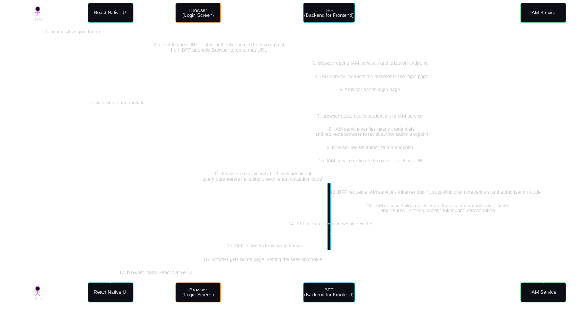
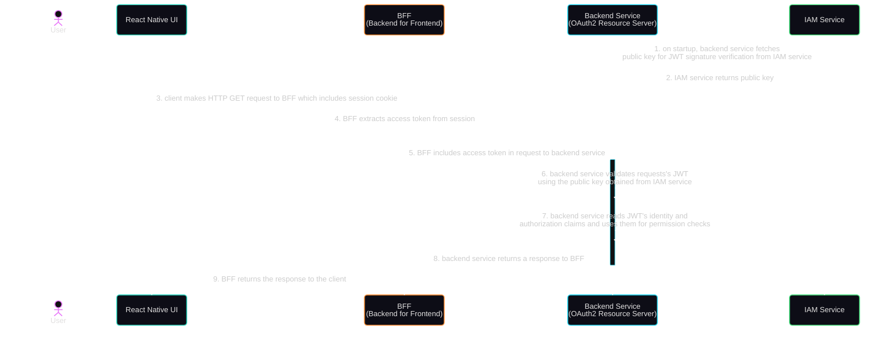

<!--
VERSION HISTORY:
- v1.0.0: Initial Comprehensive Ratification (2026-03-08)
- v1.0.1: Comprehensive Review & Validation (2026-03-29)
- v1.0.2: Comprehensive Review & Validation (2026-04-04)
- v1.0.3: Periodic Review & Defect Correction (2026-05-09)
- v1.0.4: Session Invalidation clarification — IAM SSO layer must be terminated on logout (2026-05-16)
- v1.0.5: Periodic Review — directory tree corrections, typo fixes, doc/git clarifications (2026-05-19)
- v1.0.6: Rust snake_case exception for .rs files; Nx as primary test invocation (2026-05-23)
- v1.1.0: IdP Boundary — Conditional Access & MFA guidance added (2026-05-25) [CURRENT]
-->

# Constitution for Full Stack Development in this Monorepo

This document outlines the core, immutable principles for developing Frontend Apps and Backend Services with an AI Assistant in this software ecosystem in a secure, consistent, extensible, scalable and maintainable way.

## Core Principles

The following Core Principles always apply to Backend Services development, Frontend Apps development, and cross-cutting concerns.

### AI Assistant Constraints (NON-NEGOTIABLE)

- **Adherence:** The AI Assistant must strictly adhere to the principles outlined in this constitution and the project's technical plan.
- **Clarification:** The AI Assistant should request clarification from the developer if a task or specification appears to violate the constitution or is underspecified.
- **Documentation:** Generated code must be self-documenting through clear naming. Code comments must be added only when the rationale is non-obvious (a hidden constraint, a workaround for a specific bug, or a subtle invariant). Comments explaining WHAT the code does are prohibited — well-named identifiers already do that. Relevant documentation (e.g., OpenAPI specs, READMEs) must be updated as part of the implementation process.
- **Technology Agnosticism in Specification:** The spec.md and plan.md files must maintain a strict separation of concerns:
  - spec.md: Focuses on WHAT and WHY (user stories, requirements, domain terms), and must be technology-agnostic.
  - plan.md: Focuses on HOW (tech stack, specific libraries, implementation details).
- **No Vibe Coding:** The AI Assistant must always refer to the current plan.md and spec.md before writing code. Deviations require explicit documentation and approval.
- **Code Quality:** The AI Assistant must always adhere to standard conventions for the chosen language/framework (e.g., Idiomatic Rust, React Native best practices). Code complexity must be justified and documented.

### Security (NON-NEGOTIABLE)

#### Security Classification

- **Secure Based On Classification:** Data and assets should be classified as public, internal, or sensitive.

#### Authentication

- **Authentication Required For Internal & Sensitive:** All internal and sensitive API endpoints must require JWT token authentication via OAuth2/OIDC.
- **User Authentication:** Authentication must use Authorization Code Flow with PKCE, implemented via the Backend for Frontend (BFF) pattern, where the BFF holds the client secret, exchanges codes for tokens server-side, and exposes only a secure `HttpOnly`, `SameSite=Strict` cookie containing an opaque session ID to the client. Implicit Flow is strictly prohibited.
- **Service-to-Service Authentication:** Backend services must authenticate using Client Credentials Flow, with each service holding its own client ID and secret scoped to the minimum required permissions. Service tokens must be short-lived and never exposed to end clients.
- **Token Validation:** Every request must validate the token signature, `iss` (issuer), `aud` (audience), `azp` (authorized party), `exp` (expiration), and `nbf` (not before) claims. Validation must occur on every request, not only at login.

#### Identity Provider (IdP) Boundary — Conditional Access & MFA

Conditional Access (CA) policies — including network location checks, device compliance, risk-based signals, and session lifetime controls — and Multi-Factor Authentication (MFA) are enforced exclusively at the Identity Provider (e.g., Keycloak) layer, before a token is issued. The application must never attempt to replicate or override this logic. The AI Assistant must understand this boundary clearly to generate correct, non-conflicting authentication code.

- **Trust Boundary:** A valid, signed JWT received by the application is proof that the IdP has already evaluated and satisfied all configured CA policies and MFA requirements. The application must treat a validated token as the authoritative result of IdP-level enforcement — it must never re-prompt for MFA or re-evaluate CA conditions the IdP has already assessed. Token validity is proof of authentication and IdP policy compliance only — it does not confer authorization. Authorization decisions remain the application's full responsibility as defined in the Authorization section below.
- **Authentication Responsibility is Token Validation Only:** The application's *authentication* responsibility is limited to cryptographic token validation — verifying the signature, `iss`, `aud`, `azp`, `exp`, and `nbf` claims (as defined in Token Validation above). Token validation is distinct from authentication policy enforcement; the two must never be conflated in generated code. All other security responsibilities — authorization, session management, CSRF protection, input validation, output encoding, and the rest — remain the application's concern as defined throughout this Security section.
- **Step-Up Authentication:** When specific operations require confirmed MFA (e.g., high-privilege actions), the BFF layer must inspect the `amr` (Authentication Methods References) claim in the validated JWT to determine whether MFA was performed. The BFF must never prompt for credentials or implement MFA logic directly — if the `amr` claim does not satisfy the requirement, the BFF must redirect the user to the IdP with an appropriate `acr_values` or `max_age` parameter to force re-authentication at the IdP level. Backend services must not perform redirects; they signal an insufficient authentication context by returning an appropriate error response (e.g., HTTP 401 with a `WWW-Authenticate` challenge header), which the BFF interprets and handles. For web clients, the BFF initiates the IdP redirect directly. For mobile clients, the BFF cannot redirect a native app — instead it returns a step-up indicator response, and the mobile client initiates a new OIDC flow with the appropriate `acr_values` or `max_age` parameter. When the step-up flow completes and the IdP issues fresh tokens, the BFF must replace the session's stored tokens with the new set and explicitly revoke the previous refresh token — step-up is a full re-authentication, not a token refresh, so OAuth2 rotation will not trigger automatically.
- **No Application-Level MFA or CA Implementation:** The AI Assistant must never generate code that implements MFA logic (e.g., TOTP generation, SMS code verification, push notification challenges), CA checks (e.g., device compliance evaluation, network location-based access control), or any form of raw credential checking (e.g., password verification, secret hashing) within the application. These are exclusively IdP concerns. Note: JWT signature and claims validation — as required by Token Validation above — is not credential checking; it is token verification and remains the application's responsibility. Note: application-layer rate limiting applied per IP address — as required by Infrastructure Hardening — is a resource-protection mechanism, not an access control policy; it is distinct from IdP-level CA enforcement and is not prohibited by this principle.
- **No Local Credential Stores:** The application must never store user passwords or any other user credential material. All user identity assertions must originate from IdP-issued tokens. Service-to-service client credentials (client IDs and secrets used for Client Credentials Flow) are not user credentials and are governed by the Secrets Management principle.
- **Application-Managed User Registration:** The application uses application-managed registration, where a registration form collects user credentials and the BFF calls the IdP Admin REST API to create the account. The following rules apply to all generated registration code: registration form inputs must be validated server-side per the Input Validation principle before transmission to the IdP Admin API; credentials collected during registration must be transmitted immediately and exclusively to the IdP Admin API and must never be stored, cached, or logged by the application at any layer; the registration form is an account-creation mechanism only and must never be repurposed as an authentication mechanism; after successful registration, the user must authenticate via the standard IdP redirect flow (Authorization Code Flow with PKCE) — the application must never derive a session or issue a token directly from the registration credentials; the IdP Admin API client credentials used to create accounts must follow the Secrets Management principle (environment variables, never in source code); and both successful and failed registration attempts must be written to the audit log as security-relevant events — for successful attempts, log the Keycloak-assigned `userId`; for failed attempts, no userId exists, so log the correlation ID only and explicitly omit any user-identifying field.
- **Prohibited Patterns:** The following patterns are explicitly prohibited and must never be generated: custom *authentication* login forms that POST credentials directly to the application for the purpose of signing in (registration forms governed by Application-Managed User Registration above are distinct and not prohibited); standalone session mechanisms that substitute for IdP-issued token validation rather than wrapping it (the BFF's required HttpOnly-cookie-backed server-side session is compliant — it wraps token validation rather than replacing it); parallel authentication paths created for convenience or testing; and any in-application re-authentication flow that does not redirect through the IdP.

#### Authorization

- **Deny By Default:** Except for public resources, access must be denied by default.
- **Access Control:** Access Control (RBAC, ABAC, or DAC) must be implemented for accessing internal and sensitive data.
- **Centralized Access Control:** Place all access control logic in a centralized middleware or wrapper function that intercepts every API request, ensuring all requests are evaluated against the same security policies regardless of origin within the application. **A new endpoint must be protected by default without any auth-related code change in its handler** — per-handler opt-in patterns (where each handler must explicitly declare an auth guard or extractor to be protected) violate this principle because a handler added without the opt-in is silently unprotected. The test: remove all auth code from a single handler — if that handler becomes accessible without authentication, the implementation is non-compliant.
- **Principle of Least Privilege:** Every user, service, and system component must be granted only the minimum permissions required to perform its function. Overly broad permissions must be treated as a defect.
- **Declarative Access Controls:** Use well-established toolkits or patterns that provide simple, declarative access controls.

#### Session Management

- **Server-Side Session Storage:** Store all session data server-side (e.g., Redis). Only an opaque session ID must be stored in the client's cookie. Raw tokens must never be sent to the client.
- **Session Invalidation:** Stateful session identifiers must be invalidated on the server immediately after logout. Stateless JWT access tokens must be short-lived to minimize the window of opportunity if compromised. Refresh tokens must use rotation — each use must issue a new refresh token and invalidate the previous one, following OAuth2 standards. Where an external IAM provides SSO sessions (e.g., Keycloak), logout must also terminate the IAM-level user session via the IAM's administrative API, not only the BFF session and OIDC client token — revoking a token or calling the OIDC `end_session` endpoint ends the client/token session only; the IAM SSO user session (persisted in browser cookies) requires explicit administrative termination to prevent silent re-authentication on the next auth redirect.
- **CSRF Protection:** All state-changing requests must be protected against Cross-Site Request Forgery. Cookies must use `SameSite=Strict`. Where additional protection is required (e.g., cross-origin flows), implement CSRF tokens or validate the `Origin` request header.

#### Data Protection

- **Secrets Management:** Never store sensitive values (client secrets, private keys, API keys, cookie signing keys) in source code, config files, or version control systems. Use environment variables or a dedicated secret management tool (e.g., Vault, AWS Secrets Manager). All secrets must be rotated on a defined schedule and immediately upon suspected compromise.
- **Encryption at Rest:** All sensitive data must be encrypted at rest using AES-256 or equivalent. Encryption keys must be managed separately from the data they protect, using a dedicated key management service (KMS). Keys must never be stored alongside the encrypted data.
- **Input Validation:** Treat all user input as untrusted by default. Implement server-side, whitelist-based validation early in the data lifecycle, enforcing strict type, length, and format checks. Use parameterized queries or prepared statements for all database interactions to prevent injection attacks.
- **Output Encoding:** Encode all data before rendering it in a response, applying context-appropriate encoding (HTML, JavaScript, URL, CSS) to prevent Cross-Site Scripting (XSS) and injection attacks on the output side.

#### Transport Security

- **TLS:** Enforce TLS 1.3 for all communication between clients, services, and infrastructure. Older protocol versions (TLS 1.1, 1.2, SSL) must be disabled.
- **HSTS:** All services must include the `Strict-Transport-Security` header to prevent protocol downgrade attacks and ensure browsers only communicate over HTTPS.
- **CORS:** Restrict `Access-Control-Allow-Origin` to explicitly allow listed trusted origins. Wildcard (`*`) origins are prohibited on authenticated endpoints. Preflight requests must be validated server-side.
- **Security Headers:** All HTTP responses must include appropriate security headers, including at minimum: `Content-Security-Policy`, `X-Frame-Options`, `X-Content-Type-Options`, and `Referrer-Policy`.

#### Error Handling

- **Safe Error Responses:** Errors must never expose stack traces, internal file paths, database schemas, framework details, or any system internals to the client. Return generic, user-safe error messages externally. Log full detail internally for debugging and incident response.

#### Infrastructure Hardening

- **Access Control Alerting:** Repeated access control failures must trigger alerts to administrators for investigation. (Logging of access control failures is governed by Core Logging & Monitoring § Audit Logging.)
- **Rate Limiting:** Implement rate limits on all API and controller endpoints, applied per IP address and per authenticated user, to minimize the impact of automated attack tooling and brute force attempts.
- **Web Server Hardening:** Disable directory listing on all web servers. Ensure that metadata files (e.g., `.git`, `.env`), backup files, and configuration files are never present within the web root.
- **Dependency Security:** All third-party dependencies must be kept up to date and regularly scanned for known vulnerabilities using automated tooling (e.g., Dependabot, `npm audit`, Snyk). Critical vulnerabilities must be remediated within a defined SLA. Dependency versions must be pinned to prevent unexpected updates.

### Test-Driven Development (NON-NEGOTIABLE)

TDD is mandatory: Test cases written → User approval → Tests fail → Implementation → Tests pass → Refactor. Unit tests exercise individual functions/methods. Integration tests verify service-to-service and service-to-database contracts. E2E tests cover critical user flows on a real device or simulator. Code changes without corresponding test coverage are not permitted. A test must fail if the feature is broken; do not allow the AI Assistant to "fix" the app inside the test script.

### Logging & Monitoring

- **Structured Format:** All logs must be emitted as structured data (e.g., JSON). Free-text log lines are prohibited in production services. Every log entry must include at minimum: timestamp (UTC, ISO 8601), severity level, service name, correlation/trace ID, and message.
- **Sensitive Data Prohibition:** Logs must never contain passwords, secrets, private keys, raw tokens, session IDs, or full PII (names, emails, government IDs, payment data). Fields that could carry sensitive values must be explicitly redacted or omitted at the point of logging — sanitization must not be deferred to a downstream pipeline.
- **Correlation IDs:** Every request must carry a unique correlation ID from its entry point (e.g., API gateway or BFF) and propagate it through all downstream service calls and log entries. This ID must be included in every log line for the lifetime of that request, enabling end-to-end trace reconstruction.
- **Severity Levels:** Services must use a defined, consistent severity hierarchy (e.g., DEBUG, INFO, WARN, ERROR, FATAL) with documented semantics. ERROR and above must represent actionable conditions. DEBUG output must be disabled in production by default and must never be enabled persistently.
- **Audit Logging:** Security-relevant events — authentication attempts (success and failure), authorization decisions, privilege escalations, configuration changes, and data access to sensitive resources — must be written to a dedicated, append-only audit log with sufficient context — who, what, when, and from where — to support incident response and forensic analysis. Audit logs must be treated as a separate stream from application logs and subject to stricter retention and access controls.
- **Log Integrity:** Audit logs must be written to a destination that application code cannot modify or delete. Application service accounts must have write-only access to their log streams; no service may read or purge its own logs.
- **Log Delivery Guarantee:** Audit logs must be written synchronously before the operation they record is considered complete. Application logs may be written asynchronously, provided the logging framework guarantees at-least-once delivery and buffers to durable storage on failure. A logging subsystem failure must never silently discard audit events.
- **No Business Logic in Logging:** Log statements must be side-effect-free. Logging calls must not trigger external requests, modify state, or influence application behavior. A logging failure must never crash or degrade the application.
- **Third-Party Log Integration:** Application dependencies must not write directly to stdout/stderr or any log sink outside the application's logging framework. Library log output must be routed through the application's structured logger via an appropriate bridge adapter, with severity levels explicitly mapped. Any dependency that cannot be bridged must have its logging silenced. Library log entries are subject to the same sensitive data and format requirements as application logs.
- **Log Volume Limits:** High-frequency loops can produce runaway log output; no single event class may log at INFO or above inside a loop without rate-limiting.
- **Log Retention:** General operational logs (e.g., DEBUG, INFO, WARN, ERROR, FATAL) must be retained for a minimum of 30 days. Audit logs (authentication events, access control failures) must be retained for a minimum of 90 days. Containerized services must configure log rotation (max file size and file count) to prevent unbounded disk growth. Long-term time-based retention requires shipping logs to a persistent store (e.g., Loki, CloudWatch); the Docker json-file driver alone is insufficient for meeting retention minimums in production.
- **Log Access:** Access to logs must be role-controlled and itself logged. Logs must not be publicly accessible.

### Common Technology Stack and Standards

- **Git Management:** Always use a single root-level `.gitignore` for monorepo-wide patterns (e.g., /.gitignore). Project-specific `.gitignore` files may supplement the root for framework-specific artifacts (e.g., Expo build outputs) but must not duplicate or contradict root entries.
- **Package Manager:** pnpm is the required package manager for all JavaScript/TypeScript projects. npm and yarn are prohibited. Each project's `package.json` must declare `"packageManager": "pnpm@<version>"`. A root `pnpm-workspace.yaml` must list all frontend and backend package directories.
- **Monorepo Build Tool:** Nx must be used to manage polyglot builds across the monorepo. All test, lint, build, e2e, and deploy operations must be executed through Nx targets (`pnpm nx run <project>:<target>`), not by invoking package manager scripts directly. pnpm scripts in `package.json` are permitted only as implementation details called by Nx targets, never as the primary invocation path.
- **Environment & Secret Files:**
  - Create a root `.env` and `.env.local` for shared configuration, but use individual `.env` and `.env.local` files in each project (e.g., /backend/{{service-name}}/.env, /frontend/{{app-name}}/.env) for project specific configuration.
  - Each secret required at build time should be in it's own `{{secret_name}}.txt` file located in the root `secrets/` directory (e.g., /secrets/db_password.txt) that can be referenced in the monorepo docker compose file.
  - Always add `*.env` and `*.env.*` and `secrets/` to the root `.gitignore` to prevent committing sensitive secrets.

## Backend Services Development Principles

The software's backend is organized and divided into Backend Service projects that represent the various problem spaces, or Domains, the software is designed to solve. The following Principles always apply to Backend Services development.

- **Bounded Contexts:** Each Backend Service must focus on a single Domain within a clearly defined bounded context.
- **Decoupling:** Backend Services must be loosely coupled, communicating via well-defined APIs or asynchronous messaging, avoiding direct database access across service boundaries.
- **Enforce Isolation:** Never create dependencies between a Backend Service and internal components of a different Backend Service.  Never import code from a different Backend Service, except for shared contracts.
- **Stateless Processes:** Backend Services' processes should be stateless to facilitate scalability and resilience.  Ask before making a Backend Service stateful and document the specific requirement for state along with a strategy to make the stateful part scalable.
- **Independent Deployment:** Always use independent deployment pipelines, API versioning, and contract testing to ensure that changes in one Backend Service do not necessitate a full redeployment of unrelated Backend Services.

### API-First Design

Every feature must expose its functionality in Backend Services through well-defined APIs. Backend Services expose endpoints that clients (web, mobile, CLI) consume.

- **Allowed API Architecture Styles:** Always use REST, GraphQL, gRPC, WebSocket, or Webhook API architecture styles.  Never use SOAP APIs.
- **Specification-First:** All API changes must start by updating the API Specification files in the /api-specs directory.
- **API Contracts:** API contracts must be explicitly defined and treated as a single source of truth.
- **REST Guidelines:**
  - **API Specification:** Always document APIs with OpenAPI 3.0.3 YAML format.
  - **RESTful Design:** APIs must adhere to standard RESTful conventions (e.g., use of HTTP verbs, status codes).
  - **Versioning:** APIs must use URL path versioning (e.g., /api/v1/resource).
  - **Data Format:** All API requests and responses must use JSON as the data interchange format.
  - **Validation:** All endpoints must have defined request/response schemas.
  - **Naming:** Always use kebab-case for URL paths and camelCase for JSON properties.
  - **Standard Responses:** Always use standard HTTP status codes (200, 201, 400, 401, 404, 500).
  - **Error Handling:** Error responses must follow the Problem Details for HTTP APIs standard specified in RFC 9457.

### Docker-Native Operations

All Backend Services MUST run in Docker containers. Backend Services are stateless and horizontally scalable when possible. Configuration via environment variables. Health checks and graceful shutdown always implemented. Compose files always provided for local multi-service development.

### Clean Architecture

Backend Service code is always orgnized into layers that promotes separation of concerns. A Backend Service's core logic and domain models MUST be independent of external agencies such as clients, repositories, other services, and frameworks. Data access layers are always abstracted via traits/interfaces. Tests use in-memory or mock implementations. Database choice (SQL, NoSQL, etc.) is an implementation detail, not a constraint on the core Backend Service logic. Each Backend Service code must be broken down into 4 layers: Domain-Layer, Application-Layer, Adapters-Layer, API-Layer.

- **Domain-Layer:** Must encapsulate the Backend Service's Domain Objects.
  - The Domain-Layer is independent - changes to any other layer or external agencies never affects the Domain-Layer.
  - Domain Objects represent real-world objects or concepts and their attributes and behaviors with data structures, relationships, rules, and methods.
  - Domain Objects include entities, value objects, aggregates, and domain services.
  - The Domain-Layer encapsulates domain-specific validation rules with the Specification Pattern by defining a generic specification interface, a  base class that implements the generic specification interface, and one or more domain-specific validation rule specifications that implements the base class with the domain-specific validation rules.
    - The Specification Pattern should never be used for query logic - only for validation logic.
  - The Domain-Layer defines domain-specific rules and domain-specific errors where rule violations are represented using a Typed Result Pattern to explicitly handle success or failure states.
- **Application-Layer:** Must encapsulate and implement all of the Backend Service's use cases.
  - The Application-Layer is dependent on the Domain-Layer - changes to the Domain-Layer could affect the Application-Layer.
  - The Application-Layer is independent of all other layers - changes to external agencies or any layer other than Domain-Layer never affects the Application-Layer.
  - The Application-Layer achieves the goals of the Backend Service's use cases by performing application-specific logic and validation, interacting with Adapter Interfaces, and orchestrating interactions with Domain Objects including updating their state as needed.
  - The Application-Layer always leverages the CQRS Pattern to implement separate command and query handlers.
  - The Application-Layer operates solely on Domain Objects and Data Transfer Objects (DTOs) and never operates on Data Access Objects (DAOs).
  - The Application-Layer defines use case specific Request DTOs and Response DTOs for communicating with the API-Layer, decoupling the Domain Objects from external systems including API clients and messaging systems.
    - The Application-Layer command and query handlers consume Request DTOs as arguments passed to it from the API-Layer, performs any necessary validation on the inputs, and maps them to Domain Objects, calling Domain Object methods.
    - The Application-Layer maps Domain Objects to Response DTOs to return use case responses to the requesting API-Layer methods.
  - The Application-Layer always leverages Dependency Inversion to interact with External Providers (e.g., a database, a message broker, an external API, or third party libraries) - commands and queries for External Providers are always defined as Adapter Interfaces in the Application-Layer (implemented in the Adapters-Layer) that specify the contract for data operations (e.g., `GetById(id)` , `Save(entity)` ) passing Domain Objects as arguments and return types.
  - The Application-Layer handles a Backend Service's application specific concerns like logging, applying least privilege controls (e.g., authorization, role based access control), and transaction management.
  - The Application-Layer must validate its own command and query objects.
  - The Application-Layer receives the generalized errors from the outer layers (via Adapter Interfaces) and decides the appropriate application response - this can include logic to make decisions based on the error type, for example, logging the error or determining if a different action is needed.
- **Adapters-Layer:** Must encapsulate the Backend Service's adapters to External Providers (e.g., a database, a message broker, an external API, or third party libraries).
  - The Adapters-Layer is dependent on the Domain-Layer and the Application-Layer - changes to the Domain-Layer or the Application-Layer could affect the Adapters-Layer.
  - The Adapters-Layer is independent of the API-Layer - changes to the API-Layer never affects the Adapters-Layer.
  - The Adapters-Layer is dependent on External Providers - changes to External Providers can affect the Adapters-Layer.
  - The Adapters-Layer prevents tight coupling of your Backend Service to your External Providers.
  - The Adapters-Layer always leverages the Repository Pattern for the communication with External Providers - converting data from the format most convenient for the Domain-Layer and Application-Layer, to the format most convenient for External Providers.
    - The Adapters-Layer must define Data Access Objects (DAOs) which are structs specifically mapped to an External Provider data format.
    - The Adapters-Layer always leverages the CQRS Pattern to implement separate command and query Adapter Interfaces (defined in Application-Layer) that accept and return Domain Objects, map Domain Objects to DAOs, and fetch or persist data from the External Provider using a data access library (e.g., SQLx for Rust access to relational databases) or direct driver (e.g., mongodb crate for Rust access to MongoDB).
    - To ensure transparency and performance, the Adapters-Layer never leverages an Object Relational Mapper (ORM) and never leverages the Specification Pattern for command or query logic.
  - The Adapters-Layer always includes configuration management, initialization and logging for External Providers.
  - The Adapters-Layer deals with low-level errors from external systems (databases, APIs, network failures) - it should catch specific, technology-dependent exceptions (e.g., `SqlException` or `IOException`) and translate them into a generic, domain-agnostic error model or custom domain exception (e.g., `StorageUnavailableException` or `NetworkError`).
- **API-Layer:** Must encapsulate the Backend Service's API definition and is the entry point of your Backend Service.
  - The API-Layer is dependent on the Domain-Layer and the Application-Layer - changes to the Domain-Layer or the Application-Layer could affect the API-Layer.
  - The API-Layer is independent of the Adapters-Layer - changes to the Adapters-Layer never affects the API-Layer.
  - The API-Layer allows clients or other Backend Services to communicate with this Backend Service via defined interfaces and protocols (e.g., HTTP, gRPC, message queues).
  - The API-Layer is the entry point of your Backend Service, using a web application framework (e.g. Axum) to receive and parse incoming request data, route requests to handlers (call into the Application-Layer's use cases), and return properly formatted responses over the selected protocol.
  - The API-Layer must encapsulate endpoint definitions, controllers, serialization and deserialization of the data, validation and error handling.
  - The API-Layer is the OAuth2 Resource Server and must obtain and cache the public key from the Central Authentication Service and validate the incoming JWT.
  - The API-Layer always leverages the CQRS Pattern to define separate command and query endpoints.
  - The API-Layer must use Request DTOs and Response DTOs defined in the Application-Layer to communicate with the Application-Layer.
  - The API-Layer API controller receives the raw request via an API endpoint, deserializes it, maps the data to a Request DTO, performs any necessary basic validation, and uses a mediator to dynamically route the command or query to its specific Application-Layer handler passing the Request DTO as an argument.
  - The Application-Layer handler returns a Response DTO to the API-Layer API controller via the mediator, and the API controller formats the appropriate response to return to the requestor.
  - The API-Layer must catch unhandled exceptions, logging them, and returning a consistent, non-sensitive error response to the requestor - it never contains the logic for how to handle the error.
  - The API-Layer must contain a health check endpoint to determine the status of the Backend Service.
- **Error Handling in Clean Architecture:**
  - Errors are produced in the outer layers (API-Layer, Adapters-Layer) and are caught, translated, and handled as they are passed inward to the Application-Layer and finally returned by the API-Layer to the requestor.
  - Typed Result Pattern: Always make the possibility of failure explicit in a method's signature and force the caller to handle both success and failure cases using a `Result<T, E>` enum which represents either success or failure.
  - Exception Propagation: Errors can be thrown and allowed to bubble up to a layer with enough context to handle them appropriately - the key is to wrap low-level exceptions in custom, higher-level exceptions as they cross layer boundaries to prevent dependency leaks.

### Rust Safety First

Leverage Rust's type system, ownership rules, and borrowing semantics to eliminate entire categories of bugs (memory safety, data races). Use idiomatic Rust naming conventions and patterns; avoid unsafe blocks unless absolutely justified with documentation. Dependencies kept minimal and vetted for security and maintenance status.

### Backend Service Technology Stack Requirements

The following technologies MUST be used unless explicitly amended:

- **Language**: Rust
- **Package Manager:** Cargo workspaces
- **Docker Image:** Multi-stage build starting with `rust:alpine3.23 AS build` for first stage and `alpine:3.23 AS runtime` for second stage
- **Monorepo Build Tool Integration:** @monodon/rust plugin for Nx
- **Web Framework**: Axum with Tokio async runtime
- **Networking Library:** Tower
- **Serialize and Deserialize:** Serde
- **API Route Protection:** axum-keycloak-auth
- **Central Authentication Service:** Keycloak provides the public key for verifying JWT signature
- **Mediator Library:** medi-rs must be used for dynamically routing commands, queries, and events from the API-Layer controller to the Application-Layer handler
- **Backend HTTP Client:** reqwest crate must be used as Backend Service HTTP Client when making HTTP API calls to other Backend Services
- **Relational Database Access:** SQLx is the only approved data access library for relational databases
- **Document Database Access:** mongodb crate is the only approved data access library for document databases
- **In-memory Database:** Redis is the standard in-memory database for in-memory data store and cache (Docker image `redis:8.6.2-alpine3.23`)
- **Relational Database:** PostgreSQL is the standard relational database for persistent storage (Docker image `postgres:18.3-alpine3.23`)
- **Document Database:** mongodb is the standard document database for persistent storage (Docker image `mongodb/mongodb-community-server:8.2.6-ubuntu2204-slim`)
- **Configuration:** All configuration (credentials, feature flags, etc.) must be stored in the environment (environment variables), not in the codebase
- **Monitoring Stack:** Prometheus is the required metrics backend; Grafana is the required metrics dashboard. Rust services must expose a `/metrics` endpoint compatible with the Prometheus scrape format. Structured log format and correlation ID propagation are governed by Core Logging & Monitoring.
- **Testing Standards:** All Backend Service test and lint operations must be executed through Nx targets (`pnpm nx test`, `pnpm nx test:integration`, `pnpm nx lint`). The `@monodon/rust` plugin invokes cargo under the hood. Unit tests are mandatory for all new features and bug fixes, aiming for high code coverage, and integration tests must be added to validate API contracts. Cargo arguments may be passed through using the `--` separator.
- **Containerization**: Project specific Dockerfiles and monorepo root Docker Compose file (use new Docker Compose standard of compose.yaml)
- **Build**: Cargo with semantic versioning (MAJOR.MINOR.PATCH)
- **Directory and File Naming:** Use kebab-case for all directory and file names. **Exception**: Rust source files (`.rs`) and module directories must use snake_case — the Rust module system requires this and kebab-case filenames are a compile error. All non-Rust files and all non-module directories must use kebab-case regardless.
- **Monorepo for Multiple Backend Services Approach:** Each Backend Service project in the monorepo must have its own directory located at /backend/{{service-name}}/
  - **Project File:** Each Backend Service in the monorepo must have its own project file located at /backend/{{service-name}}/src/main.rs
  - **Domain-Layer:** All Domain-Layer code for each Backend Service in the monorepo must be placed in the directory /backend/{{service-name}}/src/domain/
  - **Application-Layer:** All Application-Layer code for each Backend Service in the monorepo must be placed in the directory /backend/{{service-name}}/src/application/
  - **Adapters-Layer:** All Adapters-Layer code for each Backend Service in the monorepo must be placed in the directory /backend/{{service-name}}/src/adapters/
  - **API-Layer:** All API-Layer code for each Backend Service in the monorepo must be placed in the directory /backend/{{service-name}}/src/api/
  - **Unit Tests:**  Unit tests must be placed in each file with the code that they’re testing encapsulated within an annotated tests block
  - **Integration Tests:** Each Backend Service in the monorepo must have its own directory for integration tests located at /backend/{{service-name}}/tests/integration/
  - **Dockerfile:** Each Backend Service in the monorepo must have its own dedicated Dockerfile located at /backend/{{service-name}}/Dockerfile
  - **Docker Build:** When building an image for a specific Backend Service, the build command must be run from the repository root with the build context set to the entire repository and specifying the specific Backend Service's Dockerfile using the `-f` flag

Deviations from this stack require constitution amendment with documented justification.

### Backend Service Quality Standards

- **Code Coverage:** Minimum 70% for new features (measured via coverage tools)
- **Linting:** All code must pass `cargo clippy` with no warnings
- **Formatting:** `cargo fmt` enforced in CI/CD
- **Documentation:** README updated for user-facing changes
- **Dependencies:** Regular audits via `cargo audit`; security patches applied promptly

## Frontend App Development Principles

The software's multi-experience frontend is organized and divided into separate Frontend App projects that provide differentiated user experiences for user types with different objectives (e.g., consumer website and mobile app vs administrator website).  The following Principles always apply to Frontend App development.

- **Differentiated Experiences:** When different user types have non-overlapping objectives, each differentiated experience must be developed in separate Frontend App projects with separate codebases.
- **Universal Frontend Apps:** When the same experience is needed in multiple channels (e.g. website and mobile app), this must leverage a shared codebase in a single Frontend App project - allowing the same codebase and routing to work across web, Android, and iOS.
- **No Domain Logic:** Frontend Apps never contain any domain logic. Frontend Apps must accomplish all domain tasks by communicating with Backend Services over their defined APIs.

### Frontend UI & UX

Defines enforced rules for UI/UX consistency, accessibility, usability and performance.

- **Accessibility First:** All interactive elements must meet WCAG 2.2 Level AA compliance. ARIA labels are required for all non-text elements, and focus states must be visible.
- **Performance Budgeting:** No page shall exceed a 2-second time-to-interactive on simulated 3G networks. Images must be automatically optimized to WebP format, and JavaScript bundles must be lazy-loaded.
- **Responsive & Adaptive Design:** Layouts must follow a mobile-first approach, using fluid grids. Components must adapt seamlessly between mobile, tablet, and desktop breakpoints.
- **Consistency & Feedback:** Use consistent spacing (base-8 system) and color palettes. All actions must provide immediate, clear feedback (e.g., loading spinners, success toast messages).
- **User-Centric Naming:** Component and property names must reflect user actions (e.g., `SubmitButton` rather than `GenericButton`) to aid in readability and AI comprehension.

### Frontend Separation of Concerns

Each Frontend App code must be structured into 6 distinct layers: App-Layer, BFF-Layer, Components-Layer, Screens-Layer, Utils-Layer, and Hooks-Layer.

- **App-Layer:** Must encapsulate core Frontend App code that defines the navigation and routes.
  - **File-based Routing:** Frontend App navigation always utilizes file-based routing system.
  - **Routes Return Screen Components:** Routes never define screen components - every route simply returns a screen component from the Screens-Layer.
- **BFF-Layer:** A thin, secure layer that must encapsulate server-side API routes using the Backend for Frontend (BFF) pattern.
  - **Loose Coupling:**  Prevents tight coupling of your Frontend App to your Backend Services.
  - **Data Aggregation and Transformation:** Aggregates data from multiple Backend Services and formats it precisely for the Frontend App requirements, reducing over-fetching and the number of client-side requests.
  - **Server-Side Execution:** Must run server-side and never be included client-side.
  - **Secure Credential Handling:** Must protect and securely store Frontend App sensitive information like API keys and refresh token. Prevents Frontend App sensitive information from being stored client-side.
  - **Authentication Flow Management:** The BFF-Layer is the OAuth2 client.  It must authenticate each client request against the Central Authentication Service before forwarding it to the appropriate Backend Service.  It manages HTTP-only cookies and token translation, which the client-side cannot access.
  - **User Registration:** The BFF-Layer manages user account creation by calling the IdP Admin API on behalf of the registration form. Rules are governed by the Identity Provider (IdP) Boundary — Application-Managed User Registration principle.
  - **Identity Propagation:** Must propagate user identity to Backend Services by including it in the request's `Authorization` header.
  - **Manages Session State:** Must manage login-based authentication session state.
- **Components-Layer:** Must encapsulate reusable UI components (e.g., buttons, sliders, cards).
  - **One Named Export:** Each component will generally have one named export.
  - **File Name:** The filename is always the a kebab-case version of the component name followed by file extension (e.g., `my-component.tsx`, `my-component.android.tsx`).
  - **Platform Specific Code:** Separate components for web and native targets must be placed in separate files with platform-specific file extensions (e.g., `.web`, `.native`, `.ios`, `.android`).  When referencing the component, the code must import without the platform-specific file extension.  The props for the component must be identical for all platform-specific files.  A default version of the component without a platform-specific extension is required - the default must be for web.
  - **Style objects:** Style objects must be placed at the bottom of the component files.
- **Screens-Layer:** Must encapsulate screen components that are composed from UI components in the Components-Layer.  Screen components are leveraged in the App-Layer.
- **Utils-Layer:** Must encapsulate small standalone utilities such as date formatters, currency converters, data transformers, etc.
- **Hooks-Layer:** Must encapsulate code for custom hooks that contain and reuse stateful logic or side effects across multiple components.
  - **Reusable Logic:** When the same logic is needed in more than one component, this logic must be encapsulated in a custom hook and reused across components.
  - **State Management Logic:** Code that manages complex state logic must be placed in custom hooks for use in different parts of the Frontend App.
  - **API Calls/Data Fetching:** Logic for fetching data from an API, managing loading/error states, and handling the results must be placed in custom hooks.
  - **Event Listeners:** Logic for subscribing to events (like keyboard status, network status, or screen orientation) and managing their cleanup must be wrapped in a custom hook.
  - **Utility/Helper Function Wrappers:** While simple utility functions go in a Utils-Layer, if a utility requires access to React state or lifecycle methods, it becomes a custom hook.
  - **Theming/Styling Logic:** Logic that manages the Frontend App's theme or styling preferences and are useful for consistency across the Frontend App must be encapsulated in a custom hook.
  - **Single Responsibility:** Each custom hook should ideally be focused on one specific piece of logic to make it easier to test, reuse, and understand.
  - **No UI:** Custom hooks never return any UI components.

### Frontend App Technology Stack Requirements

The following technologies MUST be used unless explicitly amended:

- **Framework:** React Native + Expo
  - **JavaScript Runtime:** Node.js Latest LTS (v24.14.1)
  - **React Native JS Engine:** Hermes
  - **React Native Architecture:** JavaScript Interface (JSI)
  - **Package Manager:** pnpm
  - **Expo SDK:** Expo SDK 55 (must use `pnpm create expo-app --template default@sdk-55` to create an SDK 55 project)
  - **Dev Expo Build:** `eas build --local`
  - **Prod Expo Build:** `eas build`
- **Monorepo Build Tool Integration:** @nx/expo plugin for Nx
- **Backend-for-Frontend:** Expo Router API Routes implement BFF and deployed server-side (`app.json` web output set to server `"output": "server"`)
  - **BFF API:** Expo Router API Routes deployed in a Node.js Docker container with same version of Node as used by React Native and Expo (`node:24.14.1-alpine3.23`, and install glibc compatibility `RUN apk add --no-cache gcompat`)
  - **BFF Cache:** Session state cached in separate Redis in-memory database Docker container (Docker image `redis:8.6.2-alpine3.23`)
- **Protected Screens:** Expo Router must be used with protected routes to prevent access of screens that require authentication and authorization
- **Authentication Library:** Expo AuthSession (expo-auth-session) must be used for implementing authentication
- **Central Authentication Service:** Keycloak is responsible for authenticating the user and issuing signed, short-lived JWTs to the Frontend App
- **Secure Storage:** Expo SecureStore (expo-secure-store) must be used to encrypt and securely store sensitive key-value pairs on client device
- **JWT as Bearer Token:** The Frontend App must include the JWT Access Token in the `Authorization: Bearer` header for all API requests to Backend Services
- **HTTP Client:** Axios must be used for API calls
- **Logging & Monitoring:** BFF server-side code (`bff-server/`, `bff-api/`) must use the shared structured logger at `@/bff-server/logger` (format, redaction, and audit requirements are governed by Core Logging & Monitoring). Audit context must identify users by `userId` (Keycloak UUID) only — never by email or username. Client-side code (hooks, components, screens) may use `console.*` sparingly for unexpected errors only and must not log sensitive data.
- **Directory and File Naming:** Use kebab-case for all directory and file names (except for specialized file extensions such as `.test.tsx` and `.styles.ts`)
- **Monorepo for Multiple Frontend Apps Approach:** Each Frontend App project in the monorepo must have its own directory located at /frontend/{{app-name}}/
  - **Project File:** Each Frontend App in the monorepo must have its own project file located at /frontend/{{app-name}}/package.json
  - **Config File:** Each Frontend App in the monorepo must have its own config file located at /frontend/{{app-name}}/app.json
  - **Build File:** Each Frontend App in the monorepo must have its own build file located at /frontend/{{app-name}}/eas.json
  - **App-Layer:** All App-Layer code for each Frontend App in the monorepo must be placed in the directory /frontend/{{app-name}}/src/app/
  - **BFF-Layer API Routes:** All BFF-Layer API routes for each Frontend App in the monorepo must be placed in the directory /frontend/{{app-name}}/src/app/bff-api/
  - **BFF-Layer API Utilities:** All BFF-Layer utilities for the BFF-Layer API routes for each Frontend App in the monorepo must be placed in the directory /frontend/{{app-name}}/src/bff-server/
  - **Components-Layer:** All Components-Layer code for each Frontend App in the monorepo must be placed in the directory /frontend/{{app-name}}/src/components/
  - **Screens-Layer:** All Screens-Layer code for each Frontend App in the monorepo must be placed in the directory /frontend/{{app-name}}/src/screens/
  - **Utils-Layer:** All Utils-Layer code for each Frontend App in the monorepo must be placed in the directory /frontend/{{app-name}}/src/utils/
  - **Hooks-Layer:** All Hooks-Layer code for each Frontend App in the monorepo must be placed in the directory /frontend/{{app-name}}/src/hooks/
  - **Unit Tests:**  All unit test code for each Frontend App in the monorepo must be collocated in the same directory and with same file name as the code it is testing with a file extension of `.test.ts` (e.g., `format-date.ts` would be tested by `format-date.test.ts`), except for App-Layer unit tests. All App-Layer unit test code for each Frontend App in the monorepo must be placed in the directory /frontend/{{app-name}}/tests/app/ mirroring the file path from /frontend/{{app-name}}/src/app/ (e.g., `frontend/app1/src/app/bff-api/auth/login+api.ts` would be tested by `frontend/app1/tests/app/bff-api/auth/login+api.test.ts`) - no test files are allowed in /frontend/{{app-name}}/src/app/ because this will create new routes.
  - **Integration Tests:**  All integration test code for each Frontend App in the monorepo must be placed in the directory /frontend/{{app-name}}/tests/integration/
  - **E2E Tests - Mobile:**  All E2E test code for each Frontend App mobile client in the monorepo must be placed in the directory /frontend/{{app-name}}/tests/e2e/mobile/
  - **E2E Tests - Web:**  All E2E test code for each Frontend App web client in the monorepo must be placed in the directory /frontend/{{app-name}}/tests/e2e/web/
  - **Load Tests:**  All load test code for each Frontend App in the monorepo must be placed in the directory /frontend/{{app-name}}/tests/load/

Deviations from this stack require constitution amendment with documented justification.

### Frontend App Quality Standards

- **Test Framework:** Jest and Expo Testing Library
- **Mobile UI Testing:** Use Maestro CLI for all mobile UI testing
- **Web UI Testing:** Use Playwright CLI for all web UI testing
- **Stable Selectors**: Use data-testid or ARIA roles rather than fragile CSS classes to ensure tests remain robust.
- **Independent State**: Ensure each test resets the environment to avoid sharing state between runs.
- **Consistent E2E Tests Across Clients**: E2E test cases should be repeated for web (Playwright CLI) and mobile (Maestro CLI) clients for the same frontend app.
- **Code Coverage:** Minimum 70% for new features (measured via coverage tools)
- **Linting:** All code must pass ESLint with no warnings
- **Formatting:** Prettier enforced in CI/CD
- **Documentation:** README updated for user-facing changes
- **Dependencies:** Regular audits via `npx expo-doctor`; security patches applied promptly

## Shared Packages and Libraries Principles

- **Monorepo for Shared Packages Approach:** Each Shared Package in the monorepo must have its own directory located at /packages/{{package-name}}/

## Monorepo Directory Structure

```tree
/
├── .gitignore
├── .dockerignore
├── .env
├── .env.local
├── compose.yaml  # References Dockerfile from each project
├── package.json  # Used by pnpm to set up workspaces for the monorepo
├── README.md
├── docs/
│   └── ...  # Human-readable documentation, such as user guides, tutorials, and general project information
├── specs/
│   └── ...  # Detailed, structured documentation and artifacts for specific project features or work units - directed by the Human, generated by the AI Assistant, and used as single source of truth for the AI Assistant
├── api-specs/
│   └── ...  # OpenAPI specification (OAS) files, AsyncAPI specification files, and JSON schemas
├── scripts/
│   └── ...  # Script files
├── secrets/
│   └── ...  # Secret files
├── backend/
│   ├── service-1/
│   │   ├── .env
│   │   ├── .env.local
│   │   ├── src/
│   │   │   ├── domain/
│   │   │   │   └── ...  # Domain Objects
│   │   │   ├── application/
│   │   │   │   └── ...  # Use Cases and DTOs
│   │   │   ├── adapters/
│   │   │   │   └── ...  # Adapters, DAOs, and data access libraries for interacting with External Providers
│   │   │   ├── api/
│   │   │   │   └── ...  # Web Application Framework libraries, API Endpoints, and API Controllers
│   │   │   └── main.rs
│   │   ├── tests/
│   │   │   └── integration/ # Integration tests
│   │   └── Dockerfile
│   ├── service-2/
│   │   ├── .env
│   │   ├── .env.local
│   │   ├── src/
│   │   │   ├── domain/
│   │   │   │   └── ...  # Domain Objects
│   │   │   ├── application/
│   │   │   │   └── ...  # Use Cases and DTOs
│   │   │   ├── adapters/
│   │   │   │   └── ...  # Adapters, DAOs, and data access libraries for interacting with External Providers
│   │   │   ├── api/
│   │   │   │   └── ...  # Web Application Framework libraries, API Endpoints, and API Controllers
│   │   │   └── main.rs
│   │   ├── tests/
│   │   │   └── integration/ # Integration tests
│   │   └── Dockerfile
├── frontend/
│   ├── app-1/
│   │   ├── .env
│   │   ├── .env.local
│   │   ├── src/
│   │   │   ├── app/
│   │   │   │   ├── bff-api/
│   │   │   │   │   └── ...  # BFF API routes to be run on server
│   │   │   │   └── ...      # Expo app code and defines navigation and routes
│   │   │   ├── bff-server/
│   │   │   │   ├── unit-tests/
│   │   │   │   │   └── ...  # Unit tests for each BFF utility
│   │   │   │   └── ...      # Utilities for the BFF API routes to be run on server
│   │   │   ├── components/
│   │   │   │   └── ...      # Contains reusable UI components (e.g., buttons, sliders, cards)
│   │   │   ├── screens/
│   │   │   │   └── ...      # Definition of app screens
│   │   │   ├── utils/
│   │   │   │   ├── unit-tests/
│   │   │   │   │   └── ...  # Unit tests for each util
│   │   │   │   └── ...      # Small standalone utilities such as date formatters, currency converters, data transformers, etc.
│   │   │   └── hooks/
│   │   │       ├── unit-tests/
│   │   │       │   └── ...  # Unit tests for each hook
│   │   │       └── ...      # Definition of custom hooks that encapsulate and reuse stateful logic or side effects across multiple components
│   │   ├── tests/
│   │   │   ├── app/         # Unit tests for Expo app and BFF API routes - all other unit test co-located with code
│   │   │   ├── integration/ # Integration tests
│   │   │   ├── e2e/
│   │   │   │   ├── mobile/  # Maestro CLI mobile E2E tests
│   │   │   │   └── web/     # Playwright CLI web E2E tests
│   │   │   └── load/
│   │   ├── app.json
│   │   ├── eas.json  # EAS config file defines how target platform apps are built
│   │   └── package.json
│   ├── app-2
│   │   ├── .env
│   │   ├── .env.local
│   │   ├── src/
│   │   │   ├── app/
│   │   │   │   ├── bff-api/
│   │   │   │   │   └── ...  # BFF API routes to be run on server
│   │   │   │   └── ...      # Expo app code and defines navigation and routes
│   │   │   ├── bff-server/
│   │   │   │   ├── unit-tests/
│   │   │   │   │   └── ...  # Unit tests for each BFF utility
│   │   │   │   └── ...      # Utilities for the BFF API routes to be run on server
│   │   │   ├── components/
│   │   │   │   └── ...      # Contains reusable UI components (e.g., buttons, sliders, cards)
│   │   │   ├── screens/
│   │   │   │   └── ...      # Definition of app screens
│   │   │   ├── utils/
│   │   │   │   ├── unit-tests/
│   │   │   │   │   └── ...  # Unit tests for each util
│   │   │   │   └── ...      # Small standalone utilities such as date formatters, currency converters, data transformers, etc.
│   │   │   └── hooks/
│   │   │       ├── unit-tests/
│   │   │       │   └── ...  # Unit tests for each hook
│   │   │       └── ...      # Definition of custom hooks that encapsulate and reuse stateful logic or side effects across multiple components
│   │   ├── tests/
│   │   │   ├── app/         # Unit tests for Expo app and BFF API routes - all other unit test co-located with code
│   │   │   ├── integration/
│   │   │   ├── e2e/
│   │   │   │   ├── mobile/  # Maestro CLI mobile E2E tests
│   │   │   │   └── web/     # Playwright CLI web E2E tests
│   │   │   └── load/
│   │   ├── app.json
│   │   ├── eas.json  # EAS config file defines how target platform apps are built
│   │   └── package.json
├── packages/
├── infrastructure-as-code/
│   │   ├── docker/
│   │   └── terraform/
└── migrations/
```

## Architecture Diagrams

Important architecture diagrams to guide an AI Assistant when developing Frontend Apps and Backend Services in this software ecosystem.

### C4 Container Diagram

```mermaid
---
config:
  layout: elk
  theme: base
  themeVariables:
    primaryColor: '#cfe2f3'
    primaryTextColor: '#000'
    primaryBorderColor: '#4a6a88'
    lineColor: '#0000ff'
    secondaryColor: '#85e2e2'
  look: neo
  htmlLabels: false
---
graph LR
  classDef style_background fill:#ECEFF1,stroke:#28282B,stroke-width:4px;
  classDef style_sub1 fill:#C9F1F2,stroke:#28282B,stroke-width:4px;
  classDef style_sub2 fill:#64B5C1,stroke:#28282B,stroke-width:4px;
  classDef style_sub3 fill:#F29F5A,stroke:#28282B,stroke-width:4px;
  classDef style_sub4 fill:#E2D7B0,stroke:#28282B,stroke-width:4px;

  subgraph c4_container_diagram["**Container Diagram**"]
    app1_user["**App 1 User**<br/>Accesses App 1 via web browser and mobile device"]
    app2_user["**App 2 User**<br/>Accesses App 2 via web browser"]
    
    subgraph software_ecosystem["**Software Ecosystem**"]
        subgraph frontend["**Frontend Apps**"]
            subgraph app1["**App 1**"]
                subgraph app1_client["**App 1 Client**"]
                    app1_web["**Web App**<br/>*React Native Expo Client - Web*<br/>Handles web-based UI rendering and interactions"]
                    app1_mobile["**Mobile App**<br/>*React Native Expo Client - Mobile*<br/>Handles mobile UI rendering and interactions"]
                end
                subgraph app1_bff["**App 1 BFF**"]
                    app1_bff_api["**App 1 BFF API**<br/>*React Native Expo Router API Routes in Node.js Docker Container*<br/>A thin, secure layer that must encapsulate server-side API routes using the Backend for Frontend pattern"]
                    app1_bff_cache[("**App 1 BFF Cache**<br/>*Redis in-memory database in Docker Container*<br/>Caches session state for App 1 BFF")]
                end
            end
            subgraph app2["**App 2**"]
                subgraph app2_client["**App 2 Client**"]
                    app2_web["**Web App**<br/>*React Native Expo Client - Web*<br/>Handles web-based UI rendering and interactions"]
                end
                subgraph app2_bff["**App 2 BFF**"]
                    app2_bff_api["**App 2 BFF API**<br/>*React Native Expo Router API Routes in Node.js Docker Container*<br/>A thin, secure layer that must encapsulate server-side API routes using the Backend for Frontend pattern"]
                    app2_bff_cache[("**App 2 BFF Cache**<br/>*Redis in-memory database in Docker Container*<br/>Caches session state for App 2 BFF")]
                end
            end
        end
        
        subgraph backend["**Backend Services**"]
            subgraph service1["**Service 1**"]
                service1_api["**Service 1 API**<br/>*Rust + Axum Microservice in Docker Container*<br/>Handles Service 1 use cases and logic"]
                service1_db[("**Service 1 Database**<br/>*PostgreSQL Database in Docker Container*<br/>Stores Service 1 data")]
            end
            subgraph service2["**Service 2**"]
                service2_api["**Service 2 API**<br/>*Rust + Axum Microservice in Docker Container*<br/>Handles Service 2 use cases and logic"]
                service2_db[("**Service 2 Database**<br/>*MongoDB Database in Docker Container*<br/>Stores Service 2 data")]
            end
        end
    end
    
    keycloak["**Identity and Access Management (IAM)**<br/>*Keycloak*<br/>Manages user identities, authentication, SSO, and permissions"]
    
    app1_user -->|Uses| app1_web
    app1_user -->|Uses| app1_mobile
    app2_user -->|Uses| app2_web
    
    app1_web -->|Calls REST| app1_bff_api
    app1_mobile -->|Calls REST| app1_bff_api
    app2_web -->|Calls REST| app2_bff_api
    
    app1_bff_api -->|Reads/Writes NoSQL| app1_bff_cache
    app2_bff_api -->|Reads/Writes NoSQL| app2_bff_cache
    
    app1_bff_api -->|Routes to REST/GraphQL| service1_api
    app1_bff_api -->|Routes to REST/GraphQL| service2_api
    app2_bff_api -->|Routes to REST/GraphQL| service1_api
    app2_bff_api -->|Routes to REST/GraphQL| service2_api
    
    service1_api -->|Reads/Writes SQL| service1_db
    service2_api -->|Reads/Writes NoSQL| service2_db
    
    app1_bff_api -->|Authenticates REST| keycloak
    app2_bff_api -->|Authenticates REST| keycloak
    service1_api -->|Validates token REST| keycloak
    service2_api -->|Validates token REST| keycloak
  end

  class c4_container_diagram style_background;
  class software_ecosystem style_sub1;
  class frontend,backend style_sub2;
  class app1,app2,service1,service2 style_sub3;
  class app1_client,app2_client,app1_bff,app2_bff style_sub4;
```



### Diagram for Auth Flow - Login



### Diagram for Auth Flow - Access Backend Service Resources



## Governance

This constitution supersedes all other practices and conventions. Amendments require:

1. **Proposal**: Document rationale, impact on existing code, and migration plan
2. **Review**: Community discussion and formal approval
3. **Version Bump**: MAJOR for principle changes, MINOR for guidance additions, PATCH for clarifications
4. **Migration**: Existing code aligned with new principles within one release cycle

All pull requests and code reviews MUST verify compliance with active principles. Violations flagged in review require justification or code modification before merge. Complexity decisions justified in code comments when they challenge constitutional principles.

Development guidance and implementation examples are maintained in [docs/development.md](docs/development.md) (separate from constitution).

**Version**: 1.1.0 | **Ratified**: 2026-03-08 | **Last Amended**: 2026-05-25
