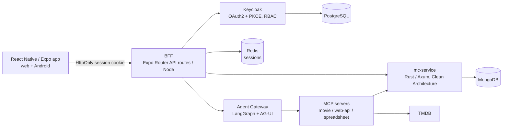

# MovieCollectionManager (MCM)

> Browse and manage your movie collections from the web or your phone — with an AI assistant that can add, organize, import, and export movies for you.

MCM is a multi-user, full-stack application for cataloging physical and digital movie collections. Each user owns one or more collections and can record media formats, movie metadata, and links to IMDB/TMDB; search and filter their library; and maintain a wishlist of titles to buy or upgrade. A built-in conversational assistant (LangGraph multi-agent) handles natural-language tasks like adding movies, retrieving TMDB metadata, and spreadsheet import/export.

The repository is also a working example of **spec-driven, AI-assisted development**: every feature flows through GitHub Spec Kit artifacts (spec → plan → tasks) governed by a repository [constitution](.specify/memory/constitution.md), with mandatory TDD and a fully self-hosted CI/CD pipeline.

## Features

- **Collections & movies** — create and manage multiple collections per user; add movies with media formats, metadata, and external database links; case-insensitive duplicate protection
- **Search & filter** — full-text movie search, filterable browsing, cursor-paginated lists, per-user column visibility
- **Wishlist** — track movies you want to add or upgrade
- **AI assistant** — chat-driven add/organize/query/navigate, TMDB metadata retrieval, spreadsheet import/export, per-user model configuration (bring-your-own-Ollama or Claude)
- **Multi-user security** — Keycloak OAuth 2.0 + PKCE via a BFF (clients never see tokens), RBAC, collection-level ACLs, audit logging
- **Universal client** — one React Native/Expo codebase for web and Android

## Architecture



- **BFF pattern** — the client authenticates only with an opaque, `HttpOnly SameSite=Strict` session cookie; the BFF holds and refreshes all tokens and proxies every backend call.
- **mc-service** — Rust/Axum microservice in strict 4-layer Clean Architecture (Domain / Application / Adapters / API) with CQRS via `medi-rs` and MongoDB persistence.
- **Agent layer** — a LangGraph supervisor served over AG-UI (reachable only through the BFF) drives three scoped MCP tool servers; models are environment-scoped (Ollama for dev/test, Claude for production).

See [docs/MCM-Architecture.md](docs/MCM-Architecture.md) for the full description and C4 diagrams.

## Tech Stack

| Area | Technology |
|---|---|
| Frontend | React Native 0.85, Expo SDK 56, Expo Router, Tamagui (`@mcm/design-system`), TypeScript |
| BFF | Expo Router API routes (Node 24 container), Redis sessions, Axios |
| Backend | Rust, Axum, Tokio, `medi-rs` (CQRS), MongoDB |
| AI agents | Python 3.13, LangGraph, FastAPI + AG-UI, MCP, Langfuse/OpenTelemetry |
| Identity & secrets | Keycloak, HashiCorp Vault |
| Monorepo & build | pnpm workspaces + Nx (JS/TS, Rust, and Python orchestrated through one task runner) |
| Testing | Jest, Playwright (web E2E), Maestro (mobile E2E), cargo test, pytest |
| CI/CD & security | Forgejo Actions (self-hosted), Renovate, Semgrep (SAST), OWASP ZAP (DAST), Trivy (image CVEs), secret-scanning gates |

## Repository Structure

```text
├── frontend/mcm-app/          # Universal Expo app + BFF (src/app, src/bff-server)
├── backend/mc-service/        # Rust movie-collection service (Clean Architecture)
├── agents/movie-assistant/    # LangGraph supervisor + AG-UI gateway
├── mcp-servers/               # movie-mcp, web-api-mcp, spreadsheet-mcp
├── packages/design-system/    # Shared Tamagui component library and tokens
├── api-specs/                 # OpenAPI 3.0.3 contracts (API-first)
├── infrastructure-as-code/    # Docker Compose stacks, Keycloak, Vault, observability, Komodo
├── specs/                     # Spec Kit feature folders (spec/plan/tasks per feature)
├── docs/                      # Architecture, PRDs, runbooks, decisions, templates
├── scripts/                   # CI gates and dev utilities
├── security/                  # SAST, DAST, and image-scan configuration
└── .forgejo/workflows/        # CI/CD pipelines
```

## Getting Started

### Prerequisites

- Node.js 24 (LTS), pnpm (via Corepack), Nx
- Rust (stable toolchain)
- Python 3.13 + uv (agent layer)
- Docker Desktop
- Android Studio + JDK 17 (mobile development only)

### Setup

```bash
git clone <repo-url> && cd MovieCollectionManager
pnpm install

# One-time per machine: shared Docker networks, named volumes, and dev secrets.
# (Full list — including the agents/audit/observability profiles — in the local-dev runbook.)
docker network create backend-network
docker network create keycloak-network
docker network create movie-assistant-mcp-network

docker volume create keycloak-store-postgres-data
docker volume create mc-service-store-mongo-data
docker volume create mcm-bff-cache-redis-data
docker volume create mcm-bff-store-mongo-data

node scripts/gen-dev-secrets.mjs
```

### Run locally

```bash
# 1. Bring up auth (Keycloak + Postgres) — required first
pnpm nx up-auth infrastructure-as-code

# 2. Optionally bring up the backend stack (mc-service + MongoDB + Redis)
pnpm nx up-mcm infrastructure-as-code

# 3. Start the app (press w for web, a for Android)
cd frontend/mcm-app && pnpm start
```

Full environment details, profiles, and endpoints: [docs/runbooks/local-dev.md](docs/runbooks/local-dev.md).

## Run in Dev Containers

The repo ships a [Dev Containers](https://containers.dev/) definition (`.devcontainer/`, features 037/038) that runs the entire workshop — including the AI coding assistant — inside a disposable, isolated Linux container:

- **Isolation first** — the assistant runs as a non-root user with no path to the host filesystem, SSH keys, or credential stores; source lives on a named Linux volume, and containers/test stacks build against an in-container Docker-in-Docker engine behind a default-deny egress firewall.
- **Full toolchain, pre-provisioned** — Rust + cargo tooling, Python via `uv`, Specify CLI, Node 24/pnpm/Nx, and `gh` are baked into a prebuilt `mcm-devcontainer` image (pulled from the forge registry by digest, or built locally via `node scripts/build-devcontainer-image.mjs`), so nothing is reinstalled per session.
- **Fast** — budgets: cold first build < 5 min, warm recreate < 90 s, stop→start < 15 s; `cargo`/`pnpm`/`uv` caches persist across recreates on named volumes.
- **Personal AI layer (optional)** — point the Dev Containers `dotfiles.repository` setting at your personal dotfiles repo to restore your Claude Code plugins/skills, RTK (built once from source in-container), and service logins; these persist on a personal-config volume, and the container is fully team-capable without them.

**Interactive (daily driver):** VS Code → Command Palette → *Dev Containers: Clone Repository in Named Container Volume* → this repo's URL.

**Headless:**

```bash
npm install -g @devcontainers/cli
devcontainer up --workspace-folder .
devcontainer exec --workspace-folder . bash .devcontainer/verify/verify-toolchain-present.sh
```

### Expo/Metro limitation — native mobile stays on the host

The dev container is a headless Linux environment, so it **cannot run the Android emulator or iOS Simulator**. Native mobile build, emulator, and device-debug work (including Maestro mobile E2E) remains a host-side activity — the container covers everything else: backend/API development, compose-based test stacks, the **web target**, and the **Metro bundler** (watchman-backed, hot-reload at native speed).

How to develop the Expo app from inside the container:

- **Web** — run `pnpm start` in-container and open the forwarded `localhost:8081` in a host browser (ports `8081` Metro/web/dev-BFF, `8082` containerized BFF, and `8099` Keycloak are forwarded; the legacy Expo `19000/19001/19006` ports are unused by SDK 56).
- **Physical device** — point Expo Go / a dev build at the in-container Metro server over LAN; if LAN routing to the container isn't available, use the documented **Expo tunnel fallback** (`pnpm start --tunnel`).
- **Emulator / native builds** — switch to the host for `expo run:android`, APK builds, and `pnpm nx e2e:mobile`; mobile agent E2E flows run in CI regardless (see [docs/runbooks/android-emulator.md](docs/runbooks/android-emulator.md)).

Verification scripts under `.devcontainer/verify/` prove host isolation, engine isolation, cache persistence, and toolchain completeness. Full procedure: [docs/runbooks/devcontainer.md](docs/runbooks/devcontainer.md).

## Development

All tasks run through Nx from the repo root — never npm/yarn, and never the underlying tools directly:

```bash
pnpm nx test mcm-app                   # frontend unit tests
pnpm nx test mc-service                # Rust unit tests
pnpm nx lint mcm-app                   # ESLint
pnpm nx lint mc-service                # clippy
pnpm nx e2e mcm-app                    # web E2E (Playwright)
pnpm nx e2e:mobile mcm-app             # mobile E2E (Maestro, emulator required)
pnpm nx run-many --targets=test,lint   # everything cacheable
```

Contributions follow spec-driven development: a feature starts as a `specs/NNN-name/` spec and plan, tests are written and verified failing before implementation (TDD is non-negotiable), and all work must comply with the [constitution](.specify/memory/constitution.md).

## Developer Tools

The AI-assisted workflow relies on a standard set of tooling (all pre-provisioned in the dev container; install natively per the steps below if working on the host). Full step-by-step host setup: [docs/runbooks/dev-environment-setup.md](docs/runbooks/dev-environment-setup.md).

### Core

- **Claude Code** + the [Claude Code for VS Code](https://marketplace.visualstudio.com/items?itemName=anthropic.claude-code) extension — the AI coding assistant this project is built with
- **Specify CLI** (GitHub Spec Kit) — drives the spec → plan → tasks workflow: `uv tool install specify-cli --from git+https://github.com/github/spec-kit.git`
- **RTK (Rust Token Killer)** — mandatory transparent CLI proxy that compresses command output before it reaches the assistant's context (~89% token savings): `cargo install --git https://github.com/rtk-ai/rtk && rtk init -g`; verify with `rtk gain` (> 80% required)
- **gh** (GitHub CLI) and **EAS CLI** (`pnpm add -g eas-cli`) for forge/mirror and Expo builds

### VS Code extensions

- [rust-analyzer](https://code.visualstudio.com/docs/languages/rust) — Rust language support
- [Nx Console](https://marketplace.visualstudio.com/items?itemName=nrwl.angular-console) — Nx target discovery and running
- [Dev Containers](https://marketplace.visualstudio.com/items?itemName=ms-vscode-remote.remote-containers) — containerized development (see above)

### Claude Code plugins & skills

| Area | Plugin / skill |
|---|---|
| Rust | `rust-analyzer-lsp` (claude-plugins-official), `rust-skills` (actionbook/rust-skills) |
| React Native / Expo | `react-native-best-practices`, `upgrading-react-native` (callstackincubator/agent-skills), `expo/skills` |
| Nx | `nx-ai-agents-config` skill (`pnpm dlx skills add nrwl/nx-ai-agents-config`) |
| Python / AI | `pyright-lsp`, `ai` (Pydantic AI, claude-plugins-official), `langsmith-tracing` (langchain-ai), `langchain-community` (Codeblockz) |
| General dev | Frontend Design, Superpowers, Context7, Code Review, Security Guidance |

### Cargo utilities

Supply-chain and code-quality helpers used across the workflow: `cargo-audit`, `cargo-deny`, `cargo-outdated`, `cargo-machete`, `cargo-semver-checks`, `cargo-geiger`, `cargo-expand`, `cargo-bloat`, `cargo-mutants` (plus `cargo-tarpaulin` as a dev dependency for coverage).

## Testing & Quality

- ≥70% line coverage enforced on new code (Jest / tarpaulin)
- Unit, integration (real dependencies — no mocks), and E2E suites repeated across web and mobile clients
- CI gates on every push/PR: secret scan, naming conventions, SAST + dependency SCA, DAST, and weekly third-party image CVE scans

## Security

Highlights: BFF token custody (no tokens in the client), deny-by-default centralized authorization, structured logging with PII redaction and append-only audit streams, externalized secrets (no credentials in git — CI-enforced), and RFC 9457 error responses. See the constitution's Security section for the complete policy.

## Roadmap

- Web search for where to buy wishlist movies
- NFO file creation and updates
- Media-format scraping from digital movie files (ffprobe/ffmpeg)

## License

See [LICENSE](LICENSE).
