# MovieCollectionManager (MCM)

Browse and manage your movie collection from a web browser or mobile app

## Purpose

- Manage information about your movie collection
- Add movies to your collection and specify details about the movie such as media formats, movie metadata, personal rating, and links to movie databases such as IMDB and TMDB for additional information
- View and search your collection
- Maintain a wishlist of movies you would like to upgrade or add to your collection

## Future Roadmap

- Web search for where to buy movies on wish list
- Update NFO files
- Scrape media format metadata from digital movie files (via ffprobe or ffmpeg)
- Scrape movie metadata from TMDB to create NFO files

## Architecture Description

### Core Components

- `mcm-app` is the core Frontend App where users manage their movie collection
- `mc-service` is the core Backend Service that implements all movie collection domain models and executes core movie collection logic
- `mc-service` stores movie collection data in a single mongodb database with a shared collection across all users
- This software is dependent on Keycloak, an external IAM service
  - This software expects Keycloak to be set up with a client named `movie-collection-manager` in a realm named `jumbleknot`
  - This software expects Keycloak to have the following client roles: `mc-owner`, `mc-contributor`, and `mc-viewer`

### Data Classification

The data in this application is classified as internal.

### RBAC

MCM is a multi-user application where each user can own multiple movie collections.  A user who owns a movie collection can share access to their movie collection with other users.  The following roles are e

- `mc-owner`: descr
- `mc-contributor`: descr
- `mc-viewer`: descr

### Architecture Diagram

```mermaid
---
config:
  layout: elk
  theme: base
  themeVariables:
    primaryColor: '#cfe2f3'
    primaryTextColor: '#000'
    primaryBorderColor: '#4a6a88'
    lineColor: '#0000ff'
    secondaryColor: '#85e2e2'
  look: neo
  htmlLabels: false
---
graph LR
  classDef style_background fill:#ECEFF1,stroke:#28282B,stroke-width:4px;
  classDef style_sub1 fill:#C9F1F2,stroke:#28282B,stroke-width:4px;
  classDef style_sub2 fill:#64B5C1,stroke:#28282B,stroke-width:4px;
  classDef style_sub3 fill:#F29F5A,stroke:#28282B,stroke-width:4px;
  classDef style_sub4 fill:#E2D7B0,stroke:#28282B,stroke-width:4px;

  subgraph c4_container_diagram["**Container Diagram**"]
    mcm_user["**MCM User**<br/>Accesses MCM via web browser and mobile device"]
    
    subgraph software_ecosystem["**Software Ecosystem**"]
        subgraph frontend["**Frontend Apps**"]
            subgraph mcm_app["**MCM App**"]
                subgraph mcm_client["**MCM Client**"]
                    mcm_web["**Web App**<br/>*React Native Expo Client - Web*<br/>Handles web-based UI rendering and interactions"]
                    mcm_mobile["**Mobile App**<br/>*React Native Expo Client - Mobile*<br/>Handles mobile UI rendering and interactions"]
                end
                subgraph mcm_bff["**MCM BFF**"]
                    mcm_bff_api["**MCM BFF API**<br/>*React Native Expo Router API Routes in Node.js Docker Container*<br/>A thin, secure layer that must encapsulate server-side API routes using the Backend for Frontend pattern"]
                    mcm_bff_cache[("**MCM BFF Cache**<br/>*Redis in-memory database in Docker Container*<br/>Caches session state for MCM BFF")]
                end
            end
        end
        
        subgraph backend["**Backend Services**"]
            subgraph mc_service["**Movie Collection Service**"]
                mc_service_api["**Movie Collection Service API**<br/>*Rust + Axum Microservice in Docker Container*<br/>Handles Movie Collection Service use cases and logic"]
                mc_service_db[("**Movie Collection Service Database**<br/>*MongoDB Database in Docker Container*<br/>Stores Movie Collection Service data")]
            end
        end
    end
    
    keycloak["**Identity and Access Management (IAM)**<br/>*Keycloak*<br/>Manages user identities, authentication, SSO, and permissions"]
    
    mcm_user -->|Uses| mcm_web
    mcm_user -->|Uses| mcm_mobile
    
    mcm_web -->|Calls REST| mcm_bff_api
    mcm_mobile -->|Calls REST| mcm_bff_api
    
    mcm_bff_api -->|Reads/Writes NoSQL| mcm_bff_cache
    
    mcm_bff_api -->|Routes to REST| mc_service_api
    
    mc_service_api -->|Reads/Writes NoSQL| mc_service_db
    
    mcm_bff_api -->|Authenticates REST| keycloak
    mc_service_api -->|Validates token REST| keycloak
  end

  class c4_container_diagram style_background;
  class software_ecosystem style_sub1;
  class frontend,backend style_sub2;
  class mcm_app,mc_service style_sub3;
  class mcm_client,mcm_bff style_sub4;
```

