# MovieCollectionManager (MCM)

Browse and manage your movie collection from a web browser or mobile app

## Purpose

- MCM is a multi-user application where each user can own multiple movie collections
- Manage information about your movie collections
- Add movies to a collection and specify details about the movie such as media formats, movie metadata, personal rating, and links to movie databases such as IMDB and TMDB for additional information
- View and search your collections
- Maintain a wishlist of movies you would like to upgrade or add to a collection

## Future Roadmap

- Web search for where to buy movies on wish list
- Update NFO files
- Scrape media format metadata from digital movie files (via ffprobe or ffmpeg)
- Scrape movie metadata from TMDB to create NFO files

## Architecture Description

### Core Components

- `mcm-app` is the core Frontend App where users view and manage movie collections they have access to
- `mc-service` is the core Backend Service that implements all movie collection domain models and executes core movie collection logic
- `mc-service` stores movie collection data on a mongodb server named `mc-db` in a single mongodb database named `mc_db` with shared collections across all users
  - The `movie_collections` shared collection stores identifiers along with Access Control Lists (ACLs) for all movie collections
  - The `movies` shared collection stores data about the movies in the collections
- This software is dependent on Keycloak, an external IAM service
  - This software expects Keycloak to be set up with a client named `movie-collection-manager` in a realm named `jumbleknot`
  - This software expects Keycloak to have the following client roles: `mc-admin`, `mc-user`
  - Users are able to register themselves with Keycloak and are defaulted to `mc-user` client role in Keycloak

### Data Classification

The data in this application is classified as internal.

### Access Control

#### Role-Based Access Control (RBAC)

- The `mcm-app` protected screens must require JWT token authentication and validate membership in one of the following client roles: `mc-admin`, `mc-user`
The `mc-service` API endpoints must require JWT token authentication and validate membership in one of the following client roles: `mc-admin`, `mc-user`
- `mc-admin` allows full administrator access to all capabilities in `mcm-app` and `mc-service`
- `mc-user` allows normal user access to `mcm-app` and `mc-service` including: create movie collection, view owned movie collection, update owned movie collection, delete owned movie collection

#### Discretionary Access Control (DAC)

Each movie collection has an owner (defaulted to the user who created the movie collection) and can have 0 or more contributors, and 0 or more viewers.  The owner of a movie collection decides who can access it and what permissions they have by granting or revoking either contributor or viewer rights.  The security logic must be implemented in `mc-service` based on the ACLs in the `movie_collections` mongodb shared collection.

- `mc-owner`: the movie collection owner has full rights to the owned movie collection including view, update, delete, grant permissions to another user, and revoke permissions from another user
- `mc-contributor`: a movie collection contributor has been granted rights by the owner and is able to view and update the movie collection
- `mc-viewer`: a movie collection viewer has been granted rights by the owner and is able to view the movie collection

### Architecture Diagram

```mermaid
---
config:
  layout: elk
  theme: base
  themeVariables:
    primaryColor: '#cfe2f3'
    primaryTextColor: '#000'
    primaryBorderColor: '#4a6a88'
    lineColor: '#0000ff'
    secondaryColor: '#85e2e2'
  look: neo
  htmlLabels: false
---
graph LR
  classDef style_background fill:#ECEFF1,stroke:#28282B,stroke-width:4px;
  classDef style_sub1 fill:#C9F1F2,stroke:#28282B,stroke-width:4px;
  classDef style_sub2 fill:#64B5C1,stroke:#28282B,stroke-width:4px;
  classDef style_sub3 fill:#F29F5A,stroke:#28282B,stroke-width:4px;
  classDef style_sub4 fill:#E2D7B0,stroke:#28282B,stroke-width:4px;

  subgraph c4_container_diagram["**Container Diagram**"]
    mcm_user["**MCM User**<br/>Accesses MCM via web browser and mobile device"]
    
    subgraph software_ecosystem["**Software Ecosystem**"]
        subgraph frontend["**Frontend Apps**"]
            subgraph mcm_app["**MCM App**"]
                subgraph mcm_client["**MCM Client**"]
                    mcm_web["**Web App**<br/>*React Native Expo Client - Web*<br/>Handles web-based UI rendering and interactions"]
                    mcm_mobile["**Mobile App**<br/>*React Native Expo Client - Mobile*<br/>Handles mobile UI rendering and interactions"]
                end
                subgraph mcm_bff["**MCM BFF**"]
                    mcm_bff_api["**MCM BFF API**<br/>*React Native Expo Router API Routes in Node.js Docker Container*<br/>A thin, secure layer that must encapsulate server-side API routes using the Backend for Frontend pattern"]
                    mcm_bff_cache[("**MCM BFF Cache**<br/>*Redis in-memory database in Docker Container*<br/>Caches session state for MCM BFF")]
                end
            end
        end
        
        subgraph backend["**Backend Services**"]
            subgraph mc_service["**Movie Collection Service**"]
                mc_service_api["**Movie Collection Service API**<br/>*Rust + Axum Microservice in Docker Container*<br/>Handles Movie Collection Service use cases and logic"]
                mc_service_db[("**Movie Collection Service Database**<br/>*MongoDB Database in Docker Container*<br/>Stores Movie Collection Service data")]
            end
        end
    end
    
    keycloak["**Identity and Access Management (IAM)**<br/>*Keycloak*<br/>Manages user identities, authentication, SSO, and permissions"]
    
    mcm_user -->|Uses| mcm_web
    mcm_user -->|Uses| mcm_mobile
    
    mcm_web -->|Calls REST| mcm_bff_api
    mcm_mobile -->|Calls REST| mcm_bff_api
    
    mcm_bff_api -->|Reads/Writes NoSQL| mcm_bff_cache
    
    mcm_bff_api -->|Routes to REST| mc_service_api
    
    mc_service_api -->|Reads/Writes NoSQL| mc_service_db
    
    mcm_bff_api -->|Authenticates REST| keycloak
    mc_service_api -->|Validates token REST| keycloak
  end

  class c4_container_diagram style_background;
  class software_ecosystem style_sub1;
  class frontend,backend style_sub2;
  class mcm_app,mc_service style_sub3;
  class mcm_client,mcm_bff style_sub4;
```

