# MovieCollectionManager (MCM)

Browse and manage your movie collection from a web browser or mobile app

## Purpose

- MCM is a multi-user application where each user can own multiple movie collections
- Manage information about your movie collections
- Add movies to a collection and specify details about the movie such as media formats, movie metadata, personal rating, and links to movie databases such as IMDB and TMDB for additional information
- View and search your collections
- Maintain a wishlist of movies you would like to upgrade or add to a collection

## Future Roadmap

- Web search for where to buy movies on wish list
- Update NFO files
- Scrape media format metadata from digital movie files (via ffprobe or ffmpeg)
- Scrape movie metadata from TMDB to create NFO files

## Architecture Description

### Core Components

- `mcm-app` is the core Frontend App where users view and manage movie collections they have access to
- `mc-service` is the core Backend Service that implements all movie collection domain models and executes core movie collection logic
- `mc-service` stores movie collection data on a mongodb server named `mc-db` in a single mongodb database named `mc_db` with shared collections across all users
  - The `movie_collections` shared collection stores identifiers along with Access Control Lists (ACLs) for all movie collections
  - The `movies` shared collection stores data about the movies in the collections
- This software is dependent on Keycloak, an external IAM service
  - This software expects Keycloak to be set up with a client named `movie-collection-manager` in a realm named `jumbleknot`
  - This software expects Keycloak to have the following client roles: `mc-admin`, `mc-user`
  - Users are able to register themselves with Keycloak and are defaulted to `mc-user` client role in Keycloak

### Data Classification

The data in this application is classified as internal.

### Access Control

#### Role-Based Access Control (RBAC)

- The `mcm-app` protected screens must require JWT token authentication and validate membership in one of the following client roles: `mc-admin`, `mc-user`
The `mc-service` API endpoints must require JWT token authentication and validate membership in one of the following client roles: `mc-admin`, `mc-user`
- `mc-admin` allows full administrator access to all capabilities in `mcm-app` and `mc-service`
- `mc-user` allows normal user access to `mcm-app` and `mc-service` including: create movie collection, view owned movie collection, update owned movie collection, delete owned movie collection

#### Discretionary Access Control (DAC)

Each movie collection has an owner (defaulted to the user who created the movie collection) and can have 0 or more contributors, and 0 or more viewers.  The owner of a movie collection decides who can access it and what permissions they have by granting or revoking either contributor or viewer rights.  The security logic must be implemented in `mc-service` based on the ACLs in the `movie_collections` mongodb shared collection.

- `mc-owner`: the movie collection owner has full rights to the owned movie collection including view, update, delete, grant permissions to another user, and revoke permissions from another user
- `mc-contributor`: a movie collection contributor has been granted rights by the owner and is able to view and update the movie collection
- `mc-viewer`: a movie collection viewer has been granted rights by the owner and is able to view the movie collection

### Architecture Diagram

```mermaid
---
config:
  layout: elk
  theme: base
  themeVariables:
    primaryColor: '#cfe2f3'
    primaryTextColor: '#000'
    primaryBorderColor: '#4a6a88'
    lineColor: '#0000ff'
    secondaryColor: '#85e2e2'
  look: neo
  htmlLabels: false
---
graph LR
  classDef style_background fill:#ECEFF1,stroke:#28282B,stroke-width:4px;
  classDef style_sub1 fill:#C9F1F2,stroke:#28282B,stroke-width:4px;
  classDef style_sub2 fill:#64B5C1,stroke:#28282B,stroke-width:4px;
  classDef style_sub3 fill:#F29F5A,stroke:#28282B,stroke-width:4px;
  classDef style_sub4 fill:#E2D7B0,stroke:#28282B,stroke-width:4px;

  subgraph c4_container_diagram["**Container Diagram**"]
    mcm_user["**MCM User**<br/>Accesses MCM via web browser and mobile device"]
    
    subgraph software_ecosystem["**Software Ecosystem**"]
        subgraph frontend["**Frontend Apps**"]
            subgraph mcm_app["**MCM App**"]
                subgraph mcm_client["**MCM Client**"]
                    mcm_web["**Web App**<br/>*React Native Expo Client - Web*<br/>Handles web-based UI rendering and interactions"]
                    mcm_mobile["**Mobile App**<br/>*React Native Expo Client - Mobile*<br/>Handles mobile UI rendering and interactions"]
                end
                subgraph mcm_bff["**MCM BFF**"]
                    mcm_bff_api["**MCM BFF API**<br/>*React Native Expo Router API Routes in Node.js Docker Container*<br/>A thin, secure layer that must encapsulate server-side API routes using the Backend for Frontend pattern"]
                    mcm_bff_cache[("**MCM BFF Cache**<br/>*Redis in-memory database in Docker Container*<br/>Caches session state for MCM BFF")]
                end
            end
        end
        
        subgraph backend["**Backend Services**"]
            subgraph mc_service["**Movie Collection Service**"]
                mc_service_api["**Movie Collection Service API**<br/>*Rust + Axum Microservice in Docker Container*<br/>Handles Movie Collection Service use cases and logic"]
                mc_service_db[("**Movie Collection Service Database**<br/>*MongoDB Database in Docker Container*<br/>Stores Movie Collection Service data")]
            end
        end
    end
    
    keycloak["**Identity and Access Management (IAM)**<br/>*Keycloak*<br/>Manages user identities, authentication, SSO, and permissions"]
    
    mcm_user -->|Uses| mcm_web
    mcm_user -->|Uses| mcm_mobile
    
    mcm_web -->|Calls REST| mcm_bff_api
    mcm_mobile -->|Calls REST| mcm_bff_api
    
    mcm_bff_api -->|Reads/Writes NoSQL| mcm_bff_cache
    
    mcm_bff_api -->|Routes to REST| mc_service_api
    
    mc_service_api -->|Reads/Writes NoSQL| mc_service_db
    
    mcm_bff_api -->|Authenticates REST| keycloak
    mc_service_api -->|Validates token REST| keycloak
  end

  class c4_container_diagram style_background;
  class software_ecosystem style_sub1;
  class frontend,backend style_sub2;
  class mcm_app,mc_service style_sub3;
  class mcm_client,mcm_bff style_sub4;
```



## mc-service Architecture

`mc-service` is a Rust/Axum microservice that implements all movie collection domain logic. It follows **Clean Architecture** with strict 4-layer separation — outer layers may import from inner layers; inner layers must never import from outer layers.

| Layer | Directory | Responsibility |
|-------|-----------|----------------|
| **Domain** | `backend/mc-service/src/domain/` | Entities (`Collection`, `Movie`), value objects, domain errors, `Specification<T>` pattern for business rule validation |
| **Application** | `backend/mc-service/src/application/` | CQRS commands/queries via `medi-rs`, DTOs, repository trait interfaces (ports) |
| **Adapters** | `backend/mc-service/src/adapters/mongodb/` | MongoDB implementations of repository traits, BSON ↔ domain mapping (DAOs) |
| **API** | `backend/mc-service/src/api/` | Axum handlers, middleware (auth, logging, error), router assembly, `AppState` |

### Key Design Decisions

- **CQRS via `medi-rs`**: State-changing operations are `Command` types dispatched through the mediator; reads are `Query` types. Handlers live in `application/commands/` and `application/queries/`.
- **Repository pattern**: `application/ports/` defines trait interfaces (`CollectionRepository`, `MovieRepository`). `adapters/mongodb/` provides the implementations. Handlers depend only on the trait, never on the concrete adapter — enabling unit testing with `mockall`.
- **Specification pattern**: `domain/specifications/spec.rs` defines a generic `Specification<T>` trait (`is_satisfied_by(&T) -> bool`) with `AndSpec`, `OrSpec`, `NotSpec` combinators. Domain validation uses composed specifications, not ad-hoc `if` chains.
- **Centralized auth via layer**: `KeycloakAuthLayer<Role>` is applied as a tower layer on the `protected` sub-router. All `/api/v1/` routes are automatically protected — individual handlers never perform auth checks.
- **JWT validation**: `axum-keycloak-auth` fetches Keycloak's JWKS once on startup and caches the public key. JWT validation is entirely local — no per-request Keycloak round-trip.
- **Cursor-based pagination**: Movie list uses keyset pagination (`{ _id: { $gt: lastSeenId } }`), not offset/skip. The `cursor` query param is a base64-encoded MongoDB ObjectId. Batch size: 50.
- **RFC 9457 Problem Details**: All error responses use `application/problem+json`. The catch-all error handler in `src/api/middleware/error_handler.rs` maps domain errors to Problem Details.
- **MongoDB collation uniqueness**: Collection name uniqueness (per owner) and movie uniqueness (per collection) are enforced at the index level with `{ locale: "en", strength: 2 }` collation — case-insensitive without a derived lowercase field.
- **ownerId denormalization**: `movie_collections` stores both `ownerId` (fast ownership filter) and `acl: [{ userId, role }]` (future sharing). The ACL is seeded with `{ userId: ownerId, role: "owner" }` on creation. DAC enforcement (contributor/viewer) is not yet implemented — only the `owner` ACL entry is written.
- **Atomic cascade delete**: `collection_repository.rs::delete()` removes a collection and all its movies inside a single MongoDB multi-document transaction. Ownership is verified first (`delete_one` filtered by `{ _id, ownerId }`); a zero match aborts before any movie is touched. This requires a **replica-set-enabled MongoDB** (a single-member replica set suffices).
- **Observability endpoints**: The router exposes unauthenticated `/health` (liveness probe) and `/metrics` (Prometheus scrape endpoint via `metrics-exporter-prometheus`) outside the `protected` sub-router.

### MongoDB Collections

| Collection | Purpose |
|------------|---------|
| `movie_collections` | Stores collection metadata: `ownerId`, `name`, `description`, `isDefault`, `acl`, timestamps |
| `movies` | Stores movie records: `collectionId`, `ownerId` (denormalized), full movie metadata |

Indexes enforce uniqueness via collation (`strength: 2` for case-insensitive matching without extra fields).

mc-db runs as a **single-member replica set** (`mongod --replSet rs0`) so that the cascade-delete transaction works; the `rs-init` service initialises the set automatically on first start. mc-service connects with `directConnection=true` to bypass replica-set member discovery.

### Docker Infrastructure

All local dev/test infrastructure is orchestrated from the repo-root **`compose.yaml`**, which uses Docker Compose `include:` to incorporate each service's individual compose file and `profiles` to select which services start:

| Profile flag | Services started |
| --- | --- |
| *(none — default)* | `mc-db` (MongoDB replica set) + `rs-init` + `mcm-redis` |
| `--profile app` | + `mc-service` |
| `--profile keycloak` | + `keycloak-db` + `keycloak-service` + `keycloak-mailpit` |
| `--profile bff` | + `mcm-bff` (Docker-deployed BFF; local dev normally uses Metro instead) |
| `--profile app --profile keycloak` | full backend stack |

```bash
# Full backend stack — correct ordering (mc-service waits for Keycloak healthy)
docker compose --profile app --profile keycloak up -d
# or via Nx:
pnpm nx up-all infrastructure-as-code

# mc-service:        http://localhost:3001   (/health liveness, /metrics Prometheus)
# MongoDB:           mongodb://localhost:27017/mc_db
# Keycloak Admin UI: http://localhost:8099
# Mailpit:           http://localhost:8025
```

> `--profile` flags must come **before** `up`/`down` with Docker Compose v2.

**mc-service requires Keycloak running** — it fetches the JWKS endpoint on startup to cache the public key for JWT validation, and `depends_on: keycloak-service: condition: service_healthy` enforces the ordering. Starting `--profile app` alone (without `--profile keycloak`) will hang waiting for Keycloak.

---

## Local Development Testing

### First-Time Setup

Run once per machine before the first `docker compose up` (the external networks and volumes are referenced by the included compose files):

```bash
docker network create backend-network
docker network create keycloak-network
docker volume create mc-service_mc-db-data
docker volume create localdev-auth_keycloak-db-data
docker volume create mcm-redis-data
# Copy infrastructure-as-code/docker/keycloak/.env.local.example → .env.local and fill in secrets.
```

### Local IAM Testing

Local testing of IAM leverages the local Keycloak instance and local Mailpit instance running in Docker. The BFF requires a Redis instance for its session store and cache.

#### Start Infrastructure

```bash
# Test infra only (MongoDB replica set + Redis)
docker compose up -d

# Add Keycloak stack (Keycloak + its Postgres + Mailpit)
docker compose --profile keycloak up -d

# Verify Keycloak is healthy
curl -f http://localhost:8099/realms/master || echo "Keycloak not ready yet"
```

#### Access IAM

- Keycloak is accessible from the host on `http://localhost:8099` (admin console / API).
- Containers on the shared docker network (`keycloak-network`) reach Keycloak via `keycloak-service:8080` — port 8099 is the externally-exposed mapping.
- The Mailpit test mail client is accessible from the host on `http://localhost:8025/`.

#### Cleaning Up

```bash
# Stop containers, keep all persistent volumes
docker compose --profile app --profile keycloak down

# Stop + wipe transient volumes only (persistent external volumes are untouched)
docker compose --profile app --profile keycloak down --volumes
```
