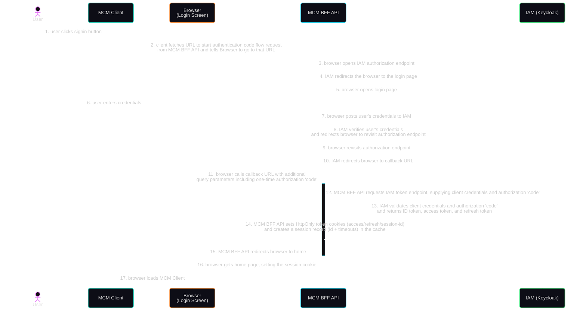
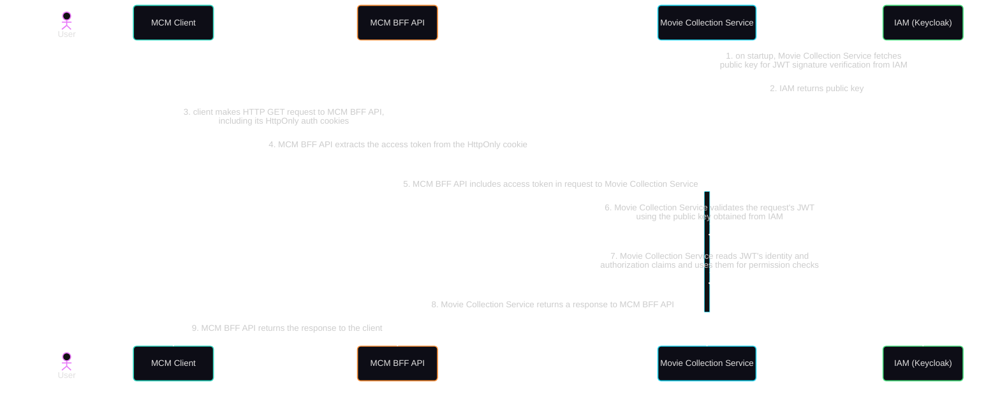
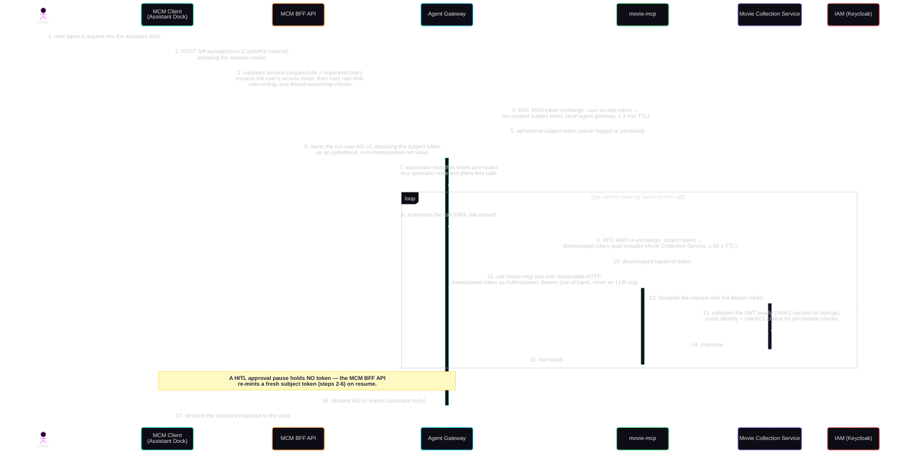

# MovieCollectionManager (MCM)

Browse and manage your movie collection from a web browser or mobile app

## Purpose

- MCM is a multi-user application where each user can own multiple movie collections
- Manage information about your movie collections
- Add movies to a collection and specify details about the movie such as media formats, movie metadata, personal rating, and links to movie databases such as IMDB and TMDB for additional information
- View and search your collections
- Maintain a wishlist of movies you would like to upgrade or add to a collection

## Future Roadmap

- Web search for where to buy movies on wish list
- Update NFO files
- Scrape media format metadata from digital movie files (via ffprobe or ffmpeg)
- Scrape movie metadata from TMDB to create NFO files

## Architecture Description

### Core Components

#### Universal Frontend App and Backend Service

- `mcm-app` is the core Frontend App where users view and manage movie collections they have access to
- `mc-service` is the core Backend Service that implements all movie collection domain models and executes core movie collection logic
- `mc-service` stores movie collection data on a mongodb server named `mc-db` in a single mongodb database named `mc_db` with shared collections across all users
  - The `movie_collections` shared collection stores identifiers along with Access Control Lists (ACLs) for all movie collections
  - The `movies` shared collection stores data about the movies in the collections
- This software is dependent on Keycloak, an external IAM service
  - This software expects Keycloak to be set up with a client named `movie-collection-manager` in a realm named `jumbleknot`
  - This software expects Keycloak to have the following client roles: `mc-admin`, `mc-user`
  - Users are able to register themselves with Keycloak and are defaulted to `mc-user` client role in Keycloak

#### AI Agents Layer Components (AG-UI-Native)

The AI Agents layer is added per the constitution's *AI Agents Development Principles* using the AG-UI-native approach. It is additive — `mc-service` and the existing `mcm-app` screens are unchanged.

- `movie-assistant` is the Python LangGraph orchestration project (supervisor + specialist agents) that helps users manage collections conversationally (e.g., find and add movies, organise collections, build wishlists, enrich metadata).
- `movie-mcp` is an MCP Tool Server that wraps the existing `mc-service` REST API; it carries the user's JWT so `mc-service` applies its existing RBAC and DAC unchanged.
- `web-api-mcp` is an MCP Tool Server for outbound movie-metadata lookups (e.g., TMDB/IMDB); outbound-only, no internal network access.
- `agent-db` is a dedicated PostgreSQL instance holding LangGraph checkpoints (conversation threads), logically isolated from `mc-db`.
- `mcm-bff` is extended to act as a **secure proxy** that hosts the **CopilotKit runtime library bridge** (`CopilotRuntime` + the AG-UI `HttpAgent` from `@ag-ui/client` → the AG-UI-native gateway). The `@copilotkit/react-native` client speaks the CopilotKit-runtime protocol rather than raw AG-UI, so the bridge adapts the two protocols using the framework's standard vendored adapter (`ExperimentalEmptyAdapter` — **no LLM call, no orchestration in the BFF**). (The binding must be the AG-UI `HttpAgent`, **not** `LangGraphHttpAgent` — the latter speaks the LangGraph Platform REST protocol and 404s against an AG-UI-native gateway.) This is not the bespoke, hand-rolled per-event translation the constitution prohibits: the gateway still emits AG-UI natively and the BFF authors no event-shape transformation logic.
- `mcm-app` adds CopilotKit (`@copilotkit/react-native`) so the same universal Expo codebase renders the conversational UI, generative UI, and agent-driven UI actions on both web and mobile.

**Monorepo locations** (per the constitution's directory layout): `movie-assistant` → `/agents/movie-assistant/` (one LangGraph orchestration project); `movie-mcp` → `/mcp-servers/movie-mcp/`; `web-api-mcp` → `/mcp-servers/web-api-mcp/`. `agent-db` and the agent infra services are added to the repo-root `compose.yaml` under a new agents profile (the existing `app`/`keycloak`/`bff` profiles are unchanged).

### Data Classification

The data in this application is classified as internal.

### Access Control

#### Role-Based Access Control (RBAC)

- The `mcm-app` protected screens must require JWT token authentication and validate membership in one of the following client roles: `mc-admin`, `mc-user`
The `mc-service` API endpoints must require JWT token authentication and validate membership in one of the following client roles: `mc-admin`, `mc-user`
- `mc-admin` allows full administrator access to all capabilities in `mcm-app` and `mc-service`
- `mc-user` allows normal user access to `mcm-app` and `mc-service` including: create movie collection, view owned movie collection, update owned movie collection, delete owned movie collection

#### Discretionary Access Control (DAC)

Each movie collection has an owner (defaulted to the user who created the movie collection) and can have 0 or more contributors, and 0 or more viewers.  The owner of a movie collection decides who can access it and what permissions they have by granting or revoking either contributor or viewer rights.  The security logic must be implemented in `mc-service` based on the ACLs in the `movie_collections` mongodb shared collection.

- `mc-owner`: the movie collection owner has full rights to the owned movie collection including view, update, delete, grant permissions to another user, and revoke permissions from another user
- `mc-contributor`: a movie collection contributor has been granted rights by the owner and is able to view and update the movie collection
- `mc-viewer`: a movie collection viewer has been granted rights by the owner and is able to view the movie collection

## mc-service Architecture

`mc-service` is a Rust/Axum microservice that implements all movie collection domain logic. It follows **Clean Architecture** with strict 4-layer separation — outer layers may import from inner layers; inner layers must never import from outer layers.

| Layer | Directory | Responsibility |
|-------|-----------|----------------|
| **Domain** | `backend/mc-service/src/domain/` | Entities (`Collection`, `Movie`), value objects, domain errors, `Specification<T>` pattern for business rule validation |
| **Application** | `backend/mc-service/src/application/` | CQRS commands/queries via `medi-rs`, DTOs, repository trait interfaces (ports) |
| **Adapters** | `backend/mc-service/src/adapters/mongodb/` | MongoDB implementations of repository traits, BSON ↔ domain mapping (DAOs) |
| **API** | `backend/mc-service/src/api/` | Axum handlers, middleware (auth, logging, error), router assembly, `AppState` |

### Key Design Decisions

- **CQRS via `medi-rs`**: State-changing operations are `Command` types dispatched through the mediator; reads are `Query` types. Handlers live in `application/commands/` and `application/queries/`.
- **Repository pattern**: `application/ports/` defines trait interfaces (`CollectionRepository`, `MovieRepository`). `adapters/mongodb/` provides the implementations. Handlers depend only on the trait, never on the concrete adapter — enabling unit testing with `mockall`.
- **Specification pattern**: `domain/specifications/spec.rs` defines a generic `Specification<T>` trait (`is_satisfied_by(&T) -> bool`) with `AndSpec`, `OrSpec`, `NotSpec` combinators. Domain validation uses composed specifications, not ad-hoc `if` chains.
- **Centralized auth via layer**: `KeycloakAuthLayer<Role>` is applied as a tower layer on the `protected` sub-router. All `/api/v1/` routes are automatically protected — individual handlers never perform auth checks.
- **JWT validation**: `axum-keycloak-auth` fetches Keycloak's JWKS once on startup and caches the public key. JWT validation is entirely local — no per-request Keycloak round-trip.
- **Cursor-based pagination**: Movie list uses keyset pagination (`{ _id: { $gt: lastSeenId } }`), not offset/skip. The `cursor` query param is a base64-encoded MongoDB ObjectId. Batch size: 50.
- **RFC 9457 Problem Details**: All error responses use `application/problem+json`. The catch-all error handler in `src/api/middleware/error_handler.rs` maps domain errors to Problem Details.
- **MongoDB collation uniqueness**: Collection name uniqueness (per owner) and movie uniqueness (per collection) are enforced at the index level with `{ locale: "en", strength: 2 }` collation — case-insensitive without a derived lowercase field.
- **ownerId denormalization + DAC enforcement**: `movie_collections` stores both `ownerId` (fast ownership filter) and `acl: [{ userId, role }]`. **Per-collection DAC is enforced** (feature 011): every movie operation authorizes against the parent collection's ACL via a shared `authorize_collection_access` check in the Application-Layer handlers, using the role hierarchy `owner ⊇ contributor ⊇ viewer` (writes require contributor, reads require viewer); an unauthorized or missing collection returns `404` (no existence leak), and `movie.ownerId` is always stamped as the collection owner. What remains future is **granting/revoking** contributor/viewer entries (UI + endpoints): today the ACL is seeded only with `{ userId: ownerId, role: "owner" }`, so the seam is exercised but non-owner roles are added only in tests until the grant/revoke feature lands.
- **Atomic cascade delete**: `collection_repository.rs::delete()` removes a collection and all its movies inside a single MongoDB multi-document transaction. Ownership is verified first (`delete_one` filtered by `{ _id, ownerId }`); a zero match aborts before any movie is touched. This requires a **replica-set-enabled MongoDB** (a single-member replica set suffices).
- **Observability endpoints**: The router exposes unauthenticated `/health` (liveness probe) and `/metrics` (Prometheus scrape endpoint via `metrics-exporter-prometheus`) outside the `protected` sub-router.

### MongoDB Collections

mc-service owns its own MongoDB instance, `mc-db` (the BFF has a **separate** instance, `mcm-bff-db` — see [Per-User Agent Config Store](#per-user-agent-config-store-mcm-bff-db-bff-owned); no cross-boundary DB access, per constitution §Decoupling).

| Collection | Purpose |
|------------|---------|
| `movie_collections` | Stores collection metadata: `ownerId`, `name`, `description`, `isDefault`, `acl`, timestamps |
| `movies` | Stores movie records: `collectionId`, `ownerId` (denormalized), full movie metadata |

Indexes enforce uniqueness via collation (`strength: 2` for case-insensitive matching without extra fields).

mc-db runs as a **single-member replica set** (`mongod --replSet rs0`) so that the cascade-delete transaction works; the `rs-init` service initialises the set automatically on first start. mc-service connects with `directConnection=true` to bypass replica-set member discovery.

```mermaid
---
config:
  layout: elk
  theme: base
  themeVariables:
    primaryColor: '#cfe2f3'
    primaryTextColor: '#000000'
    primaryBorderColor: '#4a6a88'
    lineColor: '#0000ff'
    secondaryColor: '#85e2e2'
    edgeLabelBackground: '#ffffff'
    tertiaryTextColor: '#000000'
  look: neo
  htmlLabels: false
---
graph LR
  classDef style_background fill:#ECEFF1,stroke:#28282B,stroke-width:4px,color:#000000;
  classDef style_sub1 fill:#C9F1F2,stroke:#28282B,stroke-width:4px,color:#000000;
  classDef style_sub2 fill:#64B5C1,stroke:#28282B,stroke-width:4px,color:#000000;
  classDef style_sub3 fill:#F29F5A,stroke:#28282B,stroke-width:4px,color:#000000;
  classDef style_sub4 fill:#E2D7B0,stroke:#28282B,stroke-width:4px,color:#000000;
  classDef style_node fill:#cfe2f3,stroke:#4a6a88,stroke-width:2px,color:#000000;

  subgraph c4_container_diagram["`**MCM Container Diagram - No Agentic Layer**`"]
    mcm_user["`**MCM User**<br/>Accesses MCM via web browser and mobile device`"]
    
    subgraph software_ecosystem["`**Software Ecosystem**`"]
        subgraph frontend["`**Frontend Apps**`"]
            subgraph mcm_app["`**MCM App**`"]
                subgraph mcm_client["`**MCM Client**`"]
                    mcm_web["`**Web App**<br/>*React Native Expo Client - Web*<br/>Handles web-based UI rendering and interactions`"]
                    mcm_mobile["`**Mobile App**<br/>*React Native Expo Client - Mobile*<br/>Handles mobile UI rendering and interactions`"]
                end
                subgraph mcm_bff["`**MCM BFF**`"]
                    mcm_bff_api["`**MCM BFF API**<br/>*React Native Expo Router API Routes in Node.js Docker Container*<br/>A thin, secure layer that must encapsulate server-side API routes using the Backend for Frontend pattern`"]
                    mcm_bff_cache[("`**MCM BFF Cache**<br/>*Redis in-memory database in Docker Container*<br/>Caches session state for MCM BFF`")]
                end
            end
        end
        
        subgraph backend["`**Backend Services**`"]
            subgraph mc_service["`**Movie Collection Service**`"]
                mc_service_api["`**Movie Collection Service API**<br/>*Rust + Axum Microservice in Docker Container*<br/>Handles Movie Collection Service use cases and logic`"]
                mc_service_db[("`**Movie Collection Service Database**<br/>*MongoDB Database in Docker Container*<br/>Stores Movie Collection Service data`")]
            end
        end
    end
    
    keycloak["`**Identity and Access Management (IAM)**<br/>*Keycloak*<br/>Manages user identities, authentication, SSO, and permissions`"]
    
    mcm_user -->|Uses| mcm_web
    mcm_user -->|Uses| mcm_mobile
    
    mcm_web -->|Calls REST| mcm_bff_api
    mcm_mobile -->|Calls REST| mcm_bff_api
    
    mcm_bff_api -->|Reads/Writes NoSQL| mcm_bff_cache
    
    mcm_bff_api -->|Routes to REST| mc_service_api
    
    mc_service_api -->|Reads/Writes NoSQL| mc_service_db
    
    mcm_bff_api -->|Authenticates REST| keycloak
    mc_service_api -->|Validates token REST| keycloak
  end

  class c4_container_diagram style_background;
  class software_ecosystem style_sub1;
  class frontend,backend style_sub2;
  class mcm_app,mc_service style_sub3;
  class mcm_client,mcm_bff style_sub4;
  class mcm_user,mcm_web,mcm_mobile,mcm_bff_api,mcm_bff_cache,mc_service_api,mc_service_db,keycloak style_node;

  linkStyle default stroke:blue,color:black;
```

## AI Agents Layer (AG-UI-Native)

The agent layer follows the constitution's *AI Agents Development Principles*. The defining choice is **AG-UI-native interaction**: the LangGraph orchestration runtime emits AG-UI events natively, and `mcm-bff` is a thin **secure proxy** rather than a hand-rolled event-translation chokepoint. The `@copilotkit/react-native` client speaks the CopilotKit-runtime protocol, so the BFF hosts the **CopilotKit runtime library bridge** (`CopilotRuntime` + the AG-UI `HttpAgent` from `@ag-ui/client`, `ExperimentalEmptyAdapter`) that adapts the CopilotKit-runtime protocol to the gateway's native AG-UI stream — a vendored standard adapter, with no LLM inference or orchestration in the BFF. (Use the AG-UI `HttpAgent`, not `LangGraphHttpAgent`, which speaks the LangGraph Platform protocol and 404s against an AG-UI-native gateway.) Python is the language for `movie-assistant` and the MCP servers; `mc-service` remains Rust.

### Call Chain and Security Boundary

The user's identity flows end to end and the BFF stays the only OAuth2 client:

```
mcm-app (CopilotKit) → mcm-bff (secure proxy; supplies an ephemeral subject token per run/resume)
  → agent-gateway → supervisor → specialist agent (curator/organizer) → shared MCP client
  → [RFC 8693 token exchange → downscoped, aud=mc-service, short-TTL JWT]
  → movie-mcp → mc-service (validates JWT, applies RBAC + DAC) → mc-db
```

- The **specialist agents decide *what*; code decides *how*.** Domain tool calls are **code-orchestrated, not free-form LLM tool-calling**: a node's LLM only *extracts / plans* (typed, schema-validated) and *phrases* replies — deterministic code then drives the MCP tools, attaching idempotency keys and routing every write through the HITL `approval_gate`. This keeps the domain flows deterministic (and golden-gateable) and prevents the model from selecting or forging tool calls. The agents run as in-process nodes inside the Agent Gateway (a FastAPI app hosting the LangGraph graph over AG-UI) and reach MCP tools through the gateway's single **shared, in-process MCP client** (with per-agent allowlists). There is no network call *back* to the gateway, and agents do not each open their own MCP transports; the shared client owns the connections to the MCP server containers. The `supervisor` only routes (it calls no domain tools). (Generative-UI `render_*` / `request_import_file` and UI-action `navigate_*` / `prefill_*` / `download_export` calls are client-rendered — LLM-emitted for the conversational nodes and code-emitted by the deterministic import/export workflows; only domain/`mc-service` tools are code-orchestrated.)
- Agents never call `mc-service` directly — only through MCP tools carrying a **downscoped, audience-bound user token obtained by OAuth2 Token Exchange** (see *Token Custody & Propagation* below), so the existing `mc-owner`/`mc-contributor`/`mc-viewer` DAC and `mc-admin`/`mc-user` RBAC are enforced unchanged.
- The Agent Gateway and `agent-db` are private-network only; the client never reaches them.
- `mcm-bff` keeps token custody (opaque `HttpOnly` cookie), supplies the per-run subject token, sanitises readable UI state, authorises agent-driven UI actions against the user's roles, and maps `userId → threadId`. For feature 014 it also bridges an uploaded import file into the run (multipart `agent/import-upload` → transient single-use store → `X-Import-File` header) and streams the ownership-scoped, single-use export download (`agent/export-download`).
- **The Control Tower (LangFuse + OpenTelemetry/Grafana observability, OpenSearch audit, OPA + Unleash) is config-gated and additive (SC-005).** Every piece is **no-op when unconfigured** and falls back to a safe in-code default: OPA token-exchange/UI-action authz falls back to the in-code allowlist when `OPA_URL` is unset; Unleash flags fall back to env flags (kill-switch, frontier-escalation, degrade); the observability + policy services are opt-in (`--profile observability`); and the OpenSearch append-only audit sink is **config-deployable on its own `--profile audit`** (the audit always logs, and additionally writes to OpenSearch only when `OPENSEARCH_URL` is set). So the agent layer runs in dev without the Control Tower, and each control is enabled by configuration in the environments that need it.
- **Vault is the production operator-secret store** — a foundational platform service (peer to Keycloak), not a Control Tower component. It holds ONLY shared *infrastructure* secrets: the gateway's Keycloak OAuth client secret (RFC 8693 token exchange) and the BFF master encryption key (`AGENT_CONFIG_ENC_KEY`). It deliberately holds **no** user, model-provider, or TMDB credentials, which are per-user and never shared (see [PRD-Vault.md](PRD-Vault.md)). Production runs a real Vault; in dev/test `VAULT_ADDR`/`VAULT_TOKEN` are typically unset and secret resolution falls back to the environment (the dev-mode Vault container ships under `--profile observability` for local testing only).

### Token Custody & Propagation for Agent Runs

Identity is propagated by **OAuth2 Token Exchange (RFC 8693)** — the agent never receives or forwards the user's full session token to a backend. This preserves least-privilege and **decouples token lifetime from how long a run (or HITL pause) lasts**.

- **The BFF stays the sole token custodian.** On each run **invocation and each HITL resume** — both of which originate from an authenticated BFF request — the BFF supplies the Agent Gateway a **short-lived subject token** representing the user, passed as an **ephemeral, non-checkpointed run value**. Raw tokens (subject *or* exchanged) are **never** written to checkpointed agent state (`agent-db`), traces, or logs.
- **Exchange happens at tool-call time.** When a specialist agent calls a tool, the gateway's shared MCP client exchanges the subject token at Keycloak for a **downscoped, audience-bound (`aud=mc-service`), short-TTL** access token, attached as `Authorization: Bearer` to the MCP server, which forwards it unchanged to the backend. OPA authorises the exchange ("may this agent act for this user against this audience?").
- **Robust across long HITL pauses (the reason for this design).** A paused run holds **no token** — only the checkpointed graph state plus the non-sensitive `userId`/`threadId`. A token need only remain valid for an **active run segment** (the initial turn, or a single resume), never the pause. Because every resume is an authenticated BFF request, the BFF always supplies a fresh subject token on resume — so pause length is irrelevant. If the user's session has lapsed by approval time, they re-authenticate at the BFF first.
- **Keycloak / gateway configuration.** The Agent Gateway is a confidential OAuth2 client permitted to perform token exchange in the `jumbleknot` realm; exchanged tokens are short-TTL and audience-scoped; no token is persisted to disk, and any in-memory cache is keyed by `(user, audience)` and bounded by the token's TTL.
- **Subject token = a dedicated run-scoped delegation token, not the user's session token.** At handoff the BFF performs its own token exchange to mint a **run-scoped, audience-narrowed** delegation token (short TTL, carrying an agent-origin marker) and hands *that* to the gateway — never the user's full session access token. This keeps the most-exposed component (the model-driven gateway) holding only a minimized credential, decouples the handoff token's lifetime from the user's session, and gives `mc-service`/OPA a distinct "agent-originated" signal for the HITL-write policy. The gateway still re-exchanges per tool call to bind each token to a single backend audience (`aud=mc-service`). *(Rationale: Keycloak 26.5 standard token exchange downscopes via the `audience` filter, requires confidential requester clients, and has no impersonation — which is why downscoping, not impersonation, is the mechanism.)*
- **TTL guidance.** A "run segment" (handoff → completion or HITL pause) is bounded by model + tool latency, **not** by the run's wall-clock. Size the **subject-token TTL** to the p99 *active segment* with a hard ceiling (≈2–5 min) — a segment exceeding it fails closed and the BFF re-supplies a fresh token on resume; never lengthen it to span a pause. Keep the **exchanged-token TTL** as short as practical (≤60 s), set on the `mc-service` audience client (Keycloak governs exchanged-token lifespan via client/realm settings, not a per-request parameter); the in-memory `(user, audience)` cache may reuse it within a single segment's burst of calls, bounded by that TTL. Exact second-values are deployment config, finalized in the agent feature's plan.

### Per-User Agent Config Store (`mcm-bff-db`, BFF-owned)

The assistant is **opt-in, bring-your-own-credentials**: each user supplies their own model provider (Ollama base URL **or** Anthropic key) and TMDB key, which the BFF stores **AES-256-GCM-encrypted at rest** (per-blob AAD-bound to `userId:field`) and decrypts only transiently, per run, in memory. These never appear in reads, logs, traces, checkpoints, or the gateway beyond the single run that uses them.

Custody of these credentials is a **BFF responsibility** (the BFF-Layer principle: "securely store sensitive information like API keys"), so the store is **BFF-owned and physically separate** from mc-service's `mc-db` — the BFF never opens a connection to a backend service's database (constitution §Decoupling). It mirrors the BFF's already-separate Redis cache.

| Instance | Owner | Collection | Purpose |
|---|---|---|---|
| `mcm-bff-db` | BFF | `user_agent_config` | Per-user assistant config (`_id = userId`): enabled flag, provider, Ollama base URL, **encrypted** Anthropic/TMDB credentials (`*Enc`), personal cost limit, `updatedAt` |

`mcm-bff-db` is a **plain standalone `mongod`** (no replica set, no `directConnection`) — the BFF store does single-document upserts only, so it needs neither (unlike `mc-db`, whose replica set exists for mc-service's cascade-delete transaction). The BFF connects via `MONGO_URL` (`mcm-bff-db:27017` in-container / `localhost:27018` from host), never mc-service's `MC_DB_URL`. The AES-256-GCM master key (`AGENT_CONFIG_ENC_KEY`) is held separately (Vault/env), never alongside the data.

### Three Agent-UI Capabilities (MCM examples)

| Capability | Mechanism (AG-UI) | MCM example |
|---|---|---|
| Agent controls UI | Frontend action (allowlisted) | "Open the add-movie form for *Dune*" → pre-fills the add-movie form on the current collection |
| Agent reads/shares UI state | Sanitised structural snapshot | Knows the user is viewing collection `X` so "add this to my wishlist" resolves the target without asking |
| Agent renders generative UI | `useRenderTool` → RN component | `render_movie_card`, `render_collection_summary`, `render_wishlist` rendered inline in chat |

Generative-UI components are ordinary `mcm-app` Components-Layer components reused inline in the conversation. No React Server Components or `streamUI` are used, so rendering is identical on web and mobile.

### Orchestration (LangGraph Supervisor)

| Node | Role |
|------|------|
| `supervisor` | Classifies intent (the single model-driven routing decision) and routes to a specialist node or a degrade/decline responder |
| `curator` | Finds + enriches movie metadata via `web-api-mcp`; emits a preview card (enrich) or proposes an addition (add) |
| `organizer` | Changes existing collections/wishlists via `movie-mcp` — move/remove/update/tag (writes are HITL-gated, chunked into batches); resolves an op's title exact→substring and disambiguates several partial matches with buttons |
| `navigator` | Resolves an in-app navigation target and dispatches a UI-action (open a collection/movie, or the add form) |
| `query` | Read-only **count / list** questions about the user's own collections |
| `search` | Unified **find / look-up / open** workflow for a movie — incl. existence checks ("do I have X") — owned search + web fallback + disambiguation |
| `import_collection` | Imports movies from an uploaded spreadsheet (CSV/`.xlsx`) — parses the file via `spreadsheet-mcp`, resolves tab→collection / column-mapping / article-insensitive dedup in pure code, disambiguates ambiguous tabs with buttons, and routes batched additions through `approval_gate` (idempotent; never blanks an existing field) |
| `export_collection` | Builds a multi-tab `.xlsx` of the user's selected collections (all if unspecified) via `spreadsheet-mcp` and emits a `download_export` UI-action (read-only — no write gate) |
| `approval_gate` | HITL checkpoint for any write/delete to a collection; applies on approved resume |
| `decline` / `degrade` / `disabled` | Out-of-domain decline, graceful-degradation, and kill-switch responders |

Tools fall into three categories with fixed naming so the BFF routes results without inspecting orchestration internals: MCP tools (`get_collection`, `add_movie`, `parse_spreadsheet`, `build_workbook`, …), generative-UI tools (`render_*`, `request_import_file`), and UI-action tools (`navigate_*`, `prefill_*`, `download_export`). Any write to `mc-service` (add/update/delete movie or collection) routes through `approval_gate` and is recorded in the audit log; write tool calls carry an idempotency key.

### Intent Routing & Deterministic Workflows

**Design principle — one LLM decision routes; the workflows are deterministic.** The `supervisor`'s `classify_intent` (the model) picks an intent label; everything downstream is **code-orchestrated** — the LLM is used only for narrow, golden-gated extraction/phrasing where unavoidable, never to select tools or forge write payloads. This is why the golden-replay regression gate only needs to pin a handful of LLM touchpoints.

**Intent → node** (`supervisor._INTENT_TO_NODE`):

| Intent | Node | Triggered by (examples) |
|--------|------|-------------------------|
| `add` | `curator` → `organizer` → `approval_gate` | "add Coherence (2013) to my Sci-Fi collection" |
| `enrich` | `curator` | "tell me about Inception", "who directed Dune" |
| `organize` | `organizer` → `approval_gate` | "mark X as owned", "move/remove X", "add the tag classic to X" |
| `navigate` | `navigator` | "open my Favorites collection", "open the add-movie form" |
| `query` | `query` | "how many movies do I have", "what's in my Sci-Fi", "list my movies" (aggregate count/list) |
| `search` | `search` | "find/show/look up/open X", "do I have X", "is X in my collection" (locate one film) |
| `import` | `import_collection` → `approval_gate` | "import movies", "import my collection from this spreadsheet" |
| `export` | `export_collection` | "export my collections", "download my movies as a spreadsheet" |
| `out_of_domain` | `decline` | anything not about movies/collections |
| `degraded` / `disabled` | `degrade` / `disabled` | provider failure / kill-switch (set at the supervisor, not classified) |

**The deterministic workflows** (pure-code state machines / orchestration; the LLM touchpoint, if any, is noted):

| Workflow | Node(s) + state | Determinism boundary |
|----------|-----------------|----------------------|
| **Search** | `search` (`search_stage`: `""→awaiting_scope→awaiting_collection→awaiting_pick`) | LLM = only the `search` intent label; collection resolution, disambiguation, web fallback, and picks are all pure code |
| **Add disambiguation** | `curator` (`add_stage`: `awaiting_pick` / `awaiting_collection`) | LLM = entity extraction + phrasing; the pick (`resolve_option`: year/title/ordinal/index) and target resolution are pure code |
| **Organize batch-approval** | `organizer` + `approval_gate` (`pending_batches`) | LLM = a typed `plan` (`plan_operations`); code resolves titles→movies (exact `(title,year)` → article-insensitive substring; a partial title matching several owned movies on a single-op request disambiguates with buttons via `organize_stage`/`resolve_option`, pure code), chunks into ≤50-item batches, drives a sequential HITL approval loop, and re-validates against drift on apply (missing → skipped, never guessed) |
| **Query resolution** | `query` | LLM = one extraction (`{collection_ref, filter}`); the count/list decision + filter mapping are pure code; read-only (never reaches the gate). Locating a specific film ("do I have X") is the **search** node's job |
| **Import** | `import_collection` + `approval_gate` (`import_stage`: `"" → awaiting_import_choice`; `pending_proposal`/`pending_batches`) | **No LLM** — `spreadsheet-mcp` parses the file; tab→collection match, column mapping, article-insensitive dedup, and disambiguation picks (`resolve_import_pick`) are all pure code; additions are chunked into HITL-approved batches, applied idempotently, and never blank an existing field |
| **Export** | `export_collection` | **No LLM** — pure-code collection selection (explicit ids → those, else all), reads every movie page, shapes pure `build_workbook` tabs, and emits the `download_export` UI-action; read-only (never reaches the gate) |
| **Navigate resolution** | `navigator` | **No LLM** — pure-code target resolution (named → current-screen → cross-collection movie), then dispatches the allowlisted `navigate_*` / `prefill_*` UI-actions; ambiguous/unfound → clarify |
| **HITL approval** | `approval_gate` | Deterministic interrupt → approve/reject → apply-on-resume, with a fresh run-scoped subject token minted per resume |
| **Supervisor continuation/escape** | `supervisor` (reads `add_stage` / `search_stage` / `organize_stage`) | Pure-code: keeps an in-progress add/search/organize flow alive across button-tap turns; escapes to a new action only when a reply is a genuine new command (e.g. a reply that `resolve_option`-matches an offered result stays in the workflow rather than re-routing) |

**LLM touchpoints (everything else is pure code, all golden-gated):** `classify_intent` (supervisor), curator entity-extraction + reply phrasing, `plan_operations` (organize), and `extract_query` (query). *(Import and export add no LLM touchpoint — they are fully code-orchestrated once the supervisor assigns the `import`/`export` intent.)*

### MCP Servers

| MCP Server | Wraps / Purpose | Identity |
|------------|-----------------|----------|
| `movie-mcp` | Thin wrapper over `mc-service` REST API (`/api/v1/...`) | Propagates the user's JWT |
| `web-api-mcp` | Outbound movie-metadata lookups (TMDB/IMDB), HTTP fetch | Outbound only; no internal network access |
| `spreadsheet-mcp` | File processing only — parses an uploaded CSV/`.xlsx` (`parse_spreadsheet`) and builds an export `.xlsx` (`build_workbook`) over a transient, single-use Redis handle | Token-free; no backend or internal-network access |

## Architecture Diagrams

### Container Diagram (no AI Agents Layer)



### Container Diagram (with AI Agents Layer)

The Agent Gateway is a **single container/process**: the supervisor graph (supervisor + specialist agents + HITL gate) and the shared MCP client are components **inside** it. The specialist agents decide and call tools; the boundary-crossing MCP calls to the `movie-mcp` / `web-api-mcp` / `spreadsheet-mcp` containers are carried by the gateway's shared MCP client (writes pass through the HITL gate first). Showing *which* agent calls *which* tool is strictly a C4 component-level detail, included here for clarity within the gateway boundary.

```mermaid
---
config:
  layout: elk
  theme: base
  themeVariables:
    primaryColor: '#cfe2f3'
    primaryTextColor: '#000000'
    primaryBorderColor: '#4a6a88'
    lineColor: '#0000ff'
    secondaryColor: '#85e2e2'
    edgeLabelBackground: '#ffffff'
    tertiaryTextColor: '#000000'
  look: neo
  htmlLabels: false
---
graph LR
  classDef style_background fill:#ECEFF1,stroke:#28282B,stroke-width:4px,color:#000000;
  classDef style_sub1 fill:#C9F1F2,stroke:#28282B,stroke-width:4px,color:#000000;
  classDef style_sub2 fill:#64B5C1,stroke:#28282B,stroke-width:4px,color:#000000;
  classDef style_sub3 fill:#F29F5A,stroke:#28282B,stroke-width:4px,color:#000000;
  classDef style_sub4 fill:#E2D7B0,stroke:#28282B,stroke-width:4px,color:#000000;
  classDef style_node fill:#cfe2f3,stroke:#4a6a88,stroke-width:2px,color:#000000;

  subgraph c4_container_diagram["`**MCM Container Diagram - With Agentic Layer**`"]
    mcm_user["`**MCM User**<br/>Accesses MCM via web browser and mobile device`"]
    
    subgraph software_ecosystem["`**Software Ecosystem**`"]
        subgraph frontend["`**Frontend Apps**`"]
            subgraph mcm_app["`**MCM App**`"]
                subgraph mcm_client["`**MCM Client**`"]
                    mcm_web["`**Web App**<br/>*React Native Expo Client - Web*<br/>CopilotKit (@copilotkit/react-native):<br/>AG-UI client, generative UI,<br/>frontend actions, readable UI state`"]
                    mcm_mobile["`**Mobile App**<br/>*React Native Expo Client - Mobile*<br/>CopilotKit (@copilotkit/react-native):<br/>AG-UI client, generative UI,<br/>frontend actions, readable UI state`"]
                end
                subgraph mcm_bff["`**MCM BFF**`"]
                    mcm_bff_api["`**MCM BFF API**<br/>*React Native Expo Router API Routes in Node.js Docker Container*<br/>Sole OAuth2 client; proxies AG-UI;<br/>JWT propagation; UI-state sanitisation;<br/>UI-action authz; thread mapping;<br/>import-upload + export-download bridge`"]
                    mcm_bff_cache[("`**MCM BFF Cache**<br/>*Redis in-memory database in Docker Container*<br/>Session + userId→threadId`")]
                    mcm_bff_db[("`**MCM BFF Database**<br/>*MongoDB in Docker Container (mcm-bff-db)*<br/>Per-user agent config:<br/>AES-256-GCM-encrypted credentials`")]
                end
            end
        end

      subgraph agents["`**AI Agents Layer** *(Python)*`"]
        subgraph gateway["`**Agent Gateway** *(FastAPI + uvicorn — Python Docker)*<br/>One container/process hosting the graph`"]
          gw_runtime["`**Runtime / API**<br/>Runs the graph; emits AG-UI natively;<br/>NeMo Guardrails; OPA; checkpointer`"]
          subgraph lg_graph["`**LangGraph Supervisor Graph**`"]
            supervisor["`**Supervisor**<br/>routes only`"]
            curator["`**Curator Agent**`"]
            organizer["`**Organizer Agent**`"]
            import_agent["`**Import Agent**<br/>spreadsheet → collections`"]
            export_agent["`**Export Agent**<br/>collections → .xlsx`"]
            hitl["`**HITL Approval Gate**`"]
          end
          mcp_client["`**Shared MCP client**<br/>per-agent tool allowlists`"]
        end
        agent_db[("`**Agent State DB**<br/>*PostgreSQL*<br/>Checkpoints`")]
        subgraph mcp["`**MCP Tool Servers** *(separate Python Docker containers)*`"]
          movie_mcp["`**movie-mcp**<br/>Wraps mc-service API`"]
          web_mcp["`**web-api-mcp**<br/>TMDB/IMDB lookups`"]
          sheet_mcp["`**spreadsheet-mcp**<br/>Parse/build CSV & .xlsx<br/>(token-free, by handle)`"]
        end
      end

      subgraph backend["`**Backend Services**`"]
            subgraph mc_service["`**Movie Collection Service**`"]
                mc_service_api["`**Movie Collection Service API**<br/>*Rust + Axum Microservice in Docker Container*<br/>Handles Movie Collection Service use cases and logic`"]
                mc_service_db[("`**Movie Collection Service Database**<br/>*MongoDB Database in Docker Container*<br/>Stores Movie Collection Service data`")]
            end
        end

      subgraph control_tower["`**Control Tower** *(optional — profile-gated)*`"]
        observ["`**LangFuse + OpenTelemetry → Grafana**<br/>*per-turn cost/latency + OTel traces/metrics/logs<br/>(otel-lgtm: Tempo/Prometheus/Loki)*`"]
        audit["`**OpenSearch**<br/>Immutable audit log`"]
        policy["`**OPA + Unleash**`"]
      end
    end

    vault["`**Vault** *(production)*<br/>*Operator secrets ONLY:<br/>gateway OAuth client secret,<br/>BFF master encryption key.<br/>NO user / model / TMDB keys.*`"]
    keycloak["`**Identity and Access Management (IAM)**<br/>*Keycloak*<br/>Manages user identities, authentication, SSO, and permissions`"]
    llm["`**LLM Provider**<br/>*External model API*<br/>chat + tool-calling inference<br/>(per-user credentials — no shared key)*`"]

    mcm_user -->|Uses| mcm_web
    mcm_user -->|Uses| mcm_mobile
    mcm_web -->|"WebSocket/SSE (CopilotKit-runtime protocol)"| mcm_bff_api
    mcm_mobile -->|"WebSocket/SSE (CopilotKit-runtime protocol)"| mcm_bff_api

    mcm_bff_api -->|Reads/Writes| mcm_bff_cache
    mcm_bff_api -->|"Reads/Writes encrypted per-user agent config<br/>(user_agent_config) — BFF-owned store"| mcm_bff_db
    mcm_bff_api -->|"REST + AG-UI stream (server-side only)"| gw_runtime
    mcm_bff_api -->|Routes to REST| mc_service_api

    gw_runtime -->|Runs graph| supervisor
    supervisor --> curator
    supervisor --> organizer
    supervisor --> import_agent
    supervisor --> export_agent
    curator -->|"Reads / metadata"| mcp_client
    organizer -->|"Write proposal"| hitl
    import_agent -->|"Reads + parse"| mcp_client
    import_agent -->|"Batched add proposals"| hitl
    export_agent -->|"Reads + build workbook"| mcp_client
    hitl -->|"Approved write"| mcp_client
    mcp_client -->|"RFC 8693 token exchange (subject → downscoped JWT)"| keycloak
    mcp_client -->|"MCP: movie tools (downscoped JWT)"| movie_mcp
    mcp_client -->|"MCP: web lookups"| web_mcp
    mcp_client -->|"MCP: spreadsheet parse/build (token-free)"| sheet_mcp
    gw_runtime -->|Checkpoints| agent_db
    gw_runtime -->|"LLM inference (chat + tool-calling)"| llm
    movie_mcp -->|JWT REST| mc_service_api
    mc_service_api -->|Reads/Writes NoSQL| mc_service_db

    mcm_bff -->|Authenticates| keycloak
    mc_service_api -->|Validates token| keycloak
    gw_runtime -->|Traces| observ
    gw_runtime -->|Audit events| audit
    gw_runtime -->|Policy + kill switch| policy
    gw_runtime -->|"Gateway OAuth client secret<br/>(RFC 8693 token exchange)"| vault
    mcm_bff -.->|"Master encryption key<br/>(deploy-time injection)"| vault
  end

  class c4_container_diagram style_background;
  class software_ecosystem style_sub1;
  class frontend,backend,agents,control_tower style_sub2;
  class mcm_app,mc_service,mcp,gateway style_sub3;
  class mcm_client,mcm_bff,lg_graph style_sub4;
  class mcm_user,mcm_web,mcm_mobile,mcm_bff_api,mcm_bff_cache,mcm_bff_db,mc_service_api,mc_service_db,gw_runtime,supervisor,curator,organizer,import_agent,export_agent,mcp_client,agent_db,movie_mcp,web_mcp,sheet_mcp,observ,audit,policy,vault,llm,hitl,keycloak style_node;

  linkStyle default stroke:blue,color:black;
```



### Diagram for Auth Flow - Login



### Diagram for Auth Flow - Access Backend Service Resources



### Diagram for Auth Flow - Agent Auth Flow

The agent layer never holds the user's session token and never persists any token. On each
run (and each HITL resume) the MCM BFF API mints a short-lived, run-scoped **subject token**
via OAuth 2.0 Token Exchange (RFC 8693) and hands it to the Agent Gateway as an ephemeral,
non-checkpointed run value. At each backend tool call the gateway re-exchanges that subject
token for a further-downscoped, audience-bound token that `movie-mcp` forwards to the Movie
Collection Service — so the service validates the *user's* downscoped identity locally,
exactly as in the non-agent flow.



## Docker Infrastructure

All local dev/test infrastructure is orchestrated from the repo-root **`compose.yaml`**, which uses Docker Compose `include:` to incorporate each service's individual compose file and `profiles` to select which services start:

| Profile flag | Services started |
| --- | --- |
| *(none — default)* | `mc-db` (MongoDB replica set) + `rs-init` + `mcm-redis` |
| `--profile app` | + `mc-service` |
| `--profile keycloak` | + `keycloak-db` + `keycloak-service` + `keycloak-mailpit` |
| `--profile bff` | + `mcm-bff` (legacy prod BFF without the TLS proxy; local dev normally uses Metro instead) |
| `--profile bff-dev` | + `mcm-bff-dev` (dev container, HTTP `:8082` — the standard final-E2E path; see CLAUDE.md) |
| `--profile bff-prod` | + `mcm-bff` + `caddy` (prod container, HTTPS `:8443` — future CI/CD) |
| `--profile app --profile keycloak` | full backend stack |

```bash
# Full backend stack — correct ordering (mc-service waits for Keycloak healthy)
docker compose --profile app --profile keycloak up -d
# or via Nx:
pnpm nx up-all infrastructure-as-code

# mc-service:        http://localhost:3001   (/health liveness, /metrics Prometheus)
# MongoDB:           mongodb://localhost:27017/mc_db
# Keycloak Admin UI: http://localhost:8099
# Mailpit:           http://localhost:8025
```

> `--profile` flags must come **before** `up`/`down` with Docker Compose v2.

**all components require Keycloak running** — services fetch the JWKS endpoint on startup to cache the public key for JWT validation, and `depends_on: keycloak-service: condition: service_healthy` enforces the ordering. Starting `--profile app` alone (without `--profile keycloak`) will hang waiting for Keycloak.

### Agent Layer Infrastructure

| Component | Image / Runtime | Purpose |
|-----------|-----------------|---------|
| `agent-gateway` | Custom Python image (`agents/movie-assistant/Dockerfile` — `python:3.13-slim` + uvicorn) | FastAPI app that mounts the compiled LangGraph supervisor graph over AG-UI via `ag_ui_langgraph`; emits AG-UI natively (NOT the stock LangGraph Platform server) |
| `agent-db` | `postgres:18.3-alpine3.23` | LangGraph checkpoints (isolated from `mc-db`) |
| `movie-mcp` | Custom Python Docker image | MCP wrapper over `mc-service` REST API |
| `web-api-mcp` | Custom Python Docker image | TMDB/IMDB lookups + HTTP fetch |
| `langfuse` + `otel-lgtm` (OpenTelemetry → Grafana/Tempo/Prometheus/Loki) | Official images | LLM per-turn cost/latency traces (LangFuse) + OTel traces/metrics/logs |
| `opensearch` | `opensearchproject/opensearch` | Immutable audit log |
| `opa` + `unleash` | Official images | Policy enforcement + kill switch |
| `vault` | `hashicorp/vault` | **Production operator-secret store** (foundational service, peer to Keycloak): the gateway's Keycloak OAuth client secret (RFC 8693 token exchange) and the BFF master encryption key (`AGENT_CONFIG_ENC_KEY`). **No** user/model/TMDB keys — those are per-user (see [PRD-Vault.md](PRD-Vault.md)). The dev-mode container ships under `--profile observability` for local testing; env-fallback when absent. |

The Agent Gateway also requires Keycloak indirectly: `movie-mcp` calls `mc-service` with the user's JWT, so the full chain (Keycloak → mc-service → movie-mcp → agent-gateway → mcm-bff) must be running for end-to-end agent flows.

---

## Local Development Testing

### First-Time Setup

Run once per machine before the first `docker compose up` (the external networks and volumes are referenced by the included compose files):

```bash
docker network create backend-network
docker network create keycloak-network
docker volume create mc-service_mc-db-data
docker volume create localdev-auth_keycloak-db-data
docker volume create mcm-redis-data
# Copy infrastructure-as-code/docker/keycloak/.env.local.example → .env.local and fill in secrets.
```

### Local IAM Testing

Local testing of IAM leverages the local Keycloak instance and local Mailpit instance running in Docker. The BFF requires a Redis instance for its session store and cache.

#### Start Infrastructure

```bash
# Test infra only (MongoDB replica set + Redis)
docker compose up -d

# Add Keycloak stack (Keycloak + its Postgres + Mailpit)
docker compose --profile keycloak up -d

# Verify Keycloak is healthy
curl -f http://localhost:8099/realms/master || echo "Keycloak not ready yet"
```

#### Access IAM

- Keycloak is accessible from the host on `http://localhost:8099` (admin console / API).
- Containers on the shared docker network (`keycloak-network`) reach Keycloak via `keycloak-service:8080` — port 8099 is the externally-exposed mapping.
- The Mailpit test mail client is accessible from the host on `http://localhost:8025/`.

#### Cleaning Up

```bash
# Stop containers, keep all persistent volumes
docker compose --profile app --profile keycloak down

# Stop + wipe transient volumes only (persistent external volumes are untouched)
docker compose --profile app --profile keycloak down --volumes
```
