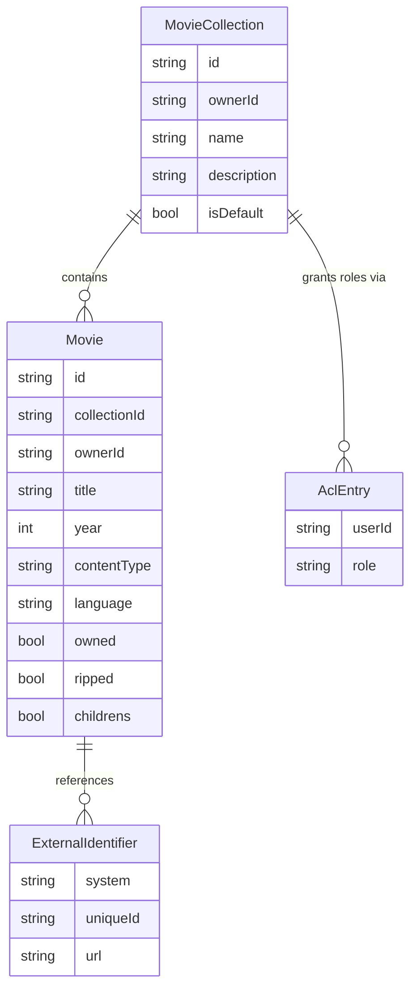

# mc-service domain data model

`backend/mc-service/src/domain/` is the innermost Clean Architecture layer of
[mc-service](/openwiki/projects/mc-service.md) — plain Rust structs/enums with no dependency on
MongoDB, Axum, or any outer layer. It defines two entities (`MovieCollection`, `Movie`), one value
object (`ExternalIdentifier`), the domain error enum, and the `Specification<T>` rule set that
validates data before a command handler touches the repository.

*Domain entities and their relationships, as modeled in `backend/mc-service/src/domain/`.*

## Entities

- **`MovieCollection`** (`collection.rs`) — owner (`owner_id`), `name` (≤50 chars, non-empty,
  enforced by `CollectionNameLengthSpec`), optional `description`, an `is_default` flag, and an
  `acl: Vec<AclEntry>`. `MovieCollection::new` seeds the ACL with a single owner entry; there is no
  constructor path that creates a collection without one.
- **`AclEntry` / `AclRole`** — links a `user_id` to `Owner`/`Contributor`/`Viewer`. The role
  hierarchy (`Owner ⊇ Contributor ⊇ Viewer`, via `AclRole::rank()`) backs
  `MovieCollection::authorizes(user_id, required)`, which grants access if *any* of a user's ACL
  entries meets or exceeds the required rank — this is the DAC primitive described in
  [System overview](/openwiki/architecture/system-overview.md).
- **`Movie`** (`movie.rs`) — required fields (`title`, `year`, `content_type`, `owned`, `ripped`,
  `childrens`; `language` is `Option<String>`, deliberately optional per feature 014 — see gotchas),
  plus a long tail of optional descriptive fields (`directors`, `actors`, `genres`, `tags`,
  `movie_set`, …) and two cross-field-constrained lists: `owned_media` and `rip_quality`.
- **`ExternalIdentifier`** (`external_id.rs`) — links a movie to an external database (`system`,
  e.g. `IMDB`/`TMDB`; `unique_id`; optional `url`). Serializes as camelCase (`uniqueId`) to match the
  API contract. `ExternalIdentifier::new` rejects empty `system`/`unique_id`, and
  `has_duplicate_external_ids` flags repeated `(system, unique_id)` pairs.
- **`DomainError`** (`errors.rs`) — the typed error enum (`DuplicateCollectionName`,
  `DuplicateMovie`, `CollectionNotFound`, `ValidationError(String)`, `AccessDenied`, …) that the API
  layer's catch-all handler maps to RFC 9457 Problem Details responses.

## Specification pattern (`domain/specifications/`)

A generic `Specification<T>` trait (`is_satisfied_by(&self, candidate: &T) -> bool`) with
`AndSpec`/`OrSpec`/`NotSpec` combinators. Concrete rules compose it instead of ad-hoc `if` chains:

| Spec | File | Rule |
|---|---|---|
| `CollectionNameLengthSpec` | `collection_name.rs` | Name non-empty and ≤50 chars |
| `OwnedMediaWhenOwnedSpec` | `owned_media.rs` | `owned_media` must be empty when `owned` is false |
| `RipQualityWhenRippedSpec` | `rip_quality.rs` | `rip_quality` must be empty when `ripped` is false |
| `HttpUrlSpec` | `http_url.rs` | External-identifier URLs must be `http`/`https` only |
| `MovieUniqueInCollectionSpec` | `movie_unique.rs` | Documents (does not enforce) per-collection movie uniqueness |

## Gotchas

- **`Movie::set_owned_media`/`set_rip_quality` silently clear the list rather than rejecting it.**
  Calling `set_owned_media(vec![Dvd])` on a movie with `owned == false` does not error — it clears
  the vec to empty. `OwnedMediaWhenOwnedSpec`/`RipQualityWhenRippedSpec` exist as a *second*,
  explicit check for paths that bypass the setters (e.g. `serde` deserialization, which constructs
  the struct directly and does not call the setter). Do not assume one mechanism makes the other
  redundant.
- **`HttpUrlSpec` exists specifically to block `javascript:`/`data:`/`file:` URLs from being
  persisted as a tappable external-identifier link** (documented in-source as finding #1 from a past
  review, feature 009) — treat any change that loosens this scheme check as a client-side
  code-execution risk, not just a validation nicety.
- **`ExternalIdentifier`'s own validation (non-empty fields, scheme, duplicates) is bypassed by
  `serde::Deserialize`.** The constructor `ExternalIdentifier::new` enforces these rules, but
  deserializing a request body builds the struct directly. That's why `http_url.rs` re-implements
  `validate_external_ids` as a free function explicitly invoked from the command-handler
  (application) layer — removing that call reopens the same hole `ExternalIdentifier::new` was
  built to close.
- **`MovieUniqueInCollectionSpec` is a documentation placeholder, not a real check.** Movie
  uniqueness (`collectionId`+`title`+`year`+`contentType`) is actually enforced by a MongoDB
  collation index in the Adapters layer (E11000 → `DuplicateMovie`), not by this spec's
  `is_satisfied_by` — there isn't one; the type carries no implementation. Do not assume calling
  it does anything.
- **`language: Option<String>` absence must never be defaulted.** Feature 014 made "unknown
  language" a modeled absence rather than an empty string; import/update code paths that see no
  language must pass `None` through unchanged rather than substituting a default value, or they
  silently reintroduce the distinction the option type was added to remove.
- **Domain code has zero MongoDB/Axum dependencies by construction** (Clean Architecture's
  outer-to-inner import rule — see [mc-service](/openwiki/projects/mc-service.md)). If a domain file
  starts needing a `bson`/`axum` import, that is a layering violation, not a shortcut.

See `docs/MCM-Architecture.md`'s "mc-service Architecture" section for how these entities map to the
`movie_collections`/`movies` MongoDB collections, and
[mc-service](/openwiki/projects/mc-service.md) for the CQRS command/query layer that calls into this
domain code.
