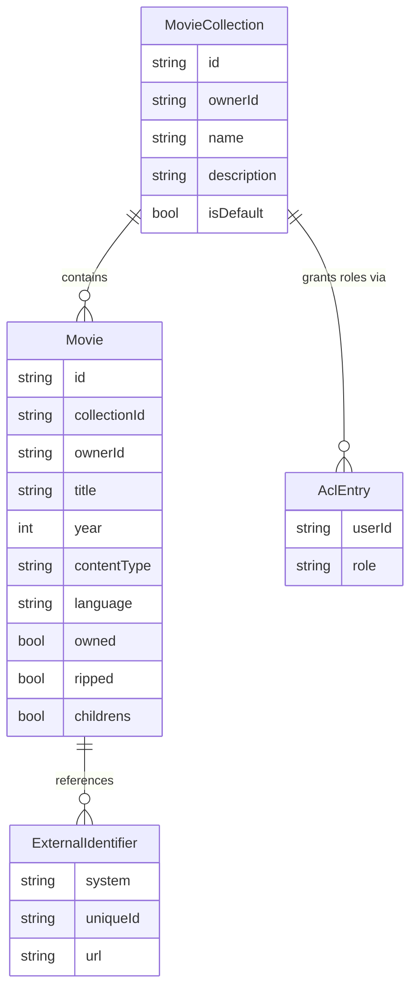

# mc-service domain data model

`backend/mc-service/src/domain/` is the innermost Clean Architecture layer of
[mc-service](../projects/mc-service.md) — plain Rust structs/enums with no dependency on
MongoDB, Axum, or any outer layer. It defines two entities (`MovieCollection`, `Movie`), one value
object (`ExternalIdentifier`), the domain error enum, and the `Specification<T>` rule set that
validates data before a command handler touches the repository.

```mermaid
erDiagram
    MovieCollection ||--o{ Movie : contains
    MovieCollection ||--o{ AclEntry : "grants roles via"
    Movie ||--o{ ExternalIdentifier : references
    MovieCollection {
        string id
        string ownerId
        string name
        string description
        bool isDefault
    }
    AclEntry {
        string userId
        string role
    }
    Movie {
        string id
        string collectionId
        string ownerId
        string title
        int year
        string contentType
        string language
        bool owned
        bool ripped
        bool childrens
    }
    ExternalIdentifier {
        string system
        string uniqueId
        string url
    }
```
*Domain entities and their relationships, as modeled in `backend/mc-service/src/domain/`.*

## Entities

- **`MovieCollection`** (`collection.rs`) — owner (`owner_id`), `name` (≤50 chars, non-empty,
  enforced by `CollectionNameLengthSpec`), optional `description`, an `is_default` flag, and an
  `acl: Vec<AclEntry>`. `MovieCollection::new` seeds the ACL with a single owner entry; there is no
  constructor path that creates a collection without one.
- **`AclEntry` / `AclRole`** — links a `user_id` to `Owner`/`Contributor`/`Viewer`. The role
  hierarchy (`Owner ⊇ Contributor ⊇ Viewer`, via `AclRole::rank()`) backs
  `MovieCollection::authorizes(user_id, required)`, which grants access if *any* of a user's ACL
  entries meets or exceeds the required rank — this is the DAC primitive described in
  [System overview](./system-overview.md) and consumed by the application layer's
  `authorize_collection_access` helper.
- **`Movie`** (`movie.rs`) — required fields (`title`, `year`, `content_type`, `owned`, `ripped`,
  `childrens`; `language` is `Option<String>`, deliberately optional per feature 014 — see gotchas),
  plus a long tail of optional descriptive fields (`directors`, `actors`, `genres`, `tags`,
  `movie_set`, …) and two cross-field-constrained lists: `owned_media` and `rip_quality`.
- **`ContentType` / `MediaFormat` / `UsaRating`** — closed enums used as movie fields. `MediaFormat`
  additionally publishes its own value set: `MediaFormat::all()` derives the accepted formats from an
  exhaustive `match` (adding a variant fails to compile until it is listed), and
  `wire_value()` reads the serde wire spelling (`"Blu-Ray"`, not `"BluRay"`) from the same `Serialize`
  impl the request body is parsed with. `MovieMetadataDto::from_domain()` builds
  `GET /api/v1/movie-metadata` from these two methods, so the assistant is offered exactly the values
  `ownedMedia`/`ripQuality` accept. Full endpoint context lives in
  [mc-service](../projects/mc-service.md); the DTO is in `application/dtos/movie_dto.rs`.
- **`ExternalIdentifier`** (`external_id.rs`) — links a movie to an external database (`system`,
  e.g. `IMDB`/`TMDB`; `unique_id`; optional `url`). Serializes as camelCase (`uniqueId`) to match the
  API contract. `ExternalIdentifier::new` rejects empty `system`/`unique_id`, and
  `has_duplicate_external_ids` flags repeated `(system, unique_id)` pairs.
- **`DomainError`** (`errors.rs`) — the typed error enum (`DuplicateCollectionName`,
  `DuplicateMovie`, `CollectionNotFound`, `MovieNotFound`, `OwnedMediaWhenNotOwned`,
  `RipQualityWhenNotRipped`, `ValidationError(String)`, `AccessDenied`, `Internal(String)`) that the
  API layer's catch-all handler maps to RFC 9457 Problem Details responses.

## Specification pattern (`domain/specifications/`)

A generic `Specification<T>` trait (`is_satisfied_by(&self, candidate: &T) -> bool`, with `T: ?Sized`
so it can be implemented over `str`) and `AndSpec`/`OrSpec`/`NotSpec` combinators. Concrete rules
compose it instead of ad-hoc `if` chains. The trait only *reports* satisfaction — every rule below is
a predicate that the calling application-layer handler turns into a `DomainError`.

| Spec | File | Rule | Called from |
|---|---|---|---|
| `CollectionNameLengthSpec` | `collection_name.rs` | Name non-empty and ≤50 chars | `create_collection` / `update_collection` |
| `RequiredStringSpec` | `required_string.rs` | String is non-empty after `trim()` | `create_movie` / `update_movie` (title) |
| `OwnedMediaWhenOwnedSpec` | `owned_media.rs` | `owned_media` must be empty when `owned` is false | `create_movie` / `update_movie` |
| `RipQualityWhenRippedSpec` | `rip_quality.rs` | `rip_quality` must be empty when `ripped` is false | `create_movie` / `update_movie` |
| `HttpUrlSpec` | `http_url.rs` | External-identifier URLs must be `http`/`https` only | `validate_external_ids`, invoked by `create_movie` / `update_movie` |
| `ContentTypeValidSpec` | `content_type.rs` | Tautology — always `true` for a `ContentType` (kept for application-layer composition) | nowhere |
| `MediaFormatValidSpec` | `media_format.rs` | Tautology — always `true` for a `MediaFormat` (kept for application-layer composition) | nowhere |
| `MovieUniqueInCollectionSpec` | `movie_unique.rs` | Documents (does not enforce) per-collection movie uniqueness | nowhere |

## Gotchas

- **`Movie::set_owned_media`/`set_rip_quality` silently clear the list rather than rejecting it.**
  Calling `set_owned_media(vec![Dvd])` on a movie with `owned == false` does not error — it clears
  the vec to empty. `OwnedMediaWhenOwnedSpec`/`RipQualityWhenRippedSpec` exist as a *second*,
  explicit check for paths that bypass the setters. The application handlers demonstrate exactly why
  both are needed: they build a `Movie` with `Movie::new(...)` and then assign
  `movie.owned_media = cmd.dto.owned_media.clone()` directly, so the setters never run on the create
  and update paths at all. Do not assume one mechanism makes the other redundant.
- **Serde deserialization bypasses every `ExternalIdentifier` constructor check.**
  `ExternalIdentifier::new` enforces non-empty fields, but deserializing a request body builds the
  struct directly — and the DTOs (`CreateMovieDto`/`UpdateMovieDto`) hold
  `external_ids: Vec<ExternalIdentifier>`, so a body goes straight into the struct. That's why
  `http_url.rs` re-implements the checks as the free function `validate_external_ids` (non-empty
  `system`/`uniqueId`, URL scheme, duplicate pairs) which `create_movie` and `update_movie` call
  explicitly — removing that call reopens the same hole `ExternalIdentifier::new` was built to close.
- **`HttpUrlSpec` exists specifically to block `javascript:`/`data:`/`file:` URLs from being
  persisted as a tappable external-identifier link** (documented in-source as finding #1 from a past
  review, feature 009) — treat any change that loosens this scheme check as a client-side
  code-execution risk, not just a validation nicety. The client-side half of that defense is
  [External ID links open via a scheme-guarded openUrl helper](../gotchas/external-id-url-opening.md).
- **`MovieUniqueInCollectionSpec` is a documentation placeholder, not a real check.** The type has no
  fields and no `Specification` impl — not even a tautological one like `ContentTypeValidSpec` or
  `MediaFormatValidSpec` — so there is nothing to call. Movie uniqueness
  (`collectionId`+`title`+`year`+`contentType`) is actually enforced by a MongoDB collation index in
  the Adapters layer (E11000 → `DuplicateMovie`), per
  [MongoDB indexes and uniqueness](../gotchas/mongodb-indexes-and-uniqueness.md).
- **`language: Option<String>` absence must never be defaulted.** Feature 014 made "unknown
  language" a modeled absence rather than an empty string, so the domain and the DTOs use
  `Option<String>` with `#[serde(default)]`. The create/update handlers go further and normalize a
  supplied empty/whitespace-only language to `None` (`cmd.dto.language.filter(|s| !s.trim().is_empty())`)
  so storage, the language facet, and sorting stay consistent. Import/update code paths that see no
  language must pass `None` through unchanged rather than substituting a default value, or they
  silently reintroduce the distinction the option type was added to remove.
- **Domain code has zero MongoDB/Axum dependencies by construction** (Clean Architecture's
  outer-to-inner import rule — see [mc-service](../projects/mc-service.md)). Note that `MediaFormat`
  does reach for `serde_json` in `wire_value()`; that is serialization, not an outer-layer
  dependency. If a domain file starts needing a `bson`/`axum` import, that is a layering violation,
  not a shortcut.

See [MCM-Architecture.md](../../docs/MCM-Architecture.md)'s "mc-service Architecture" section for how these entities map to the
`movie_collections`/`movies` MongoDB collections, and
[mc-service](../projects/mc-service.md) for the CQRS command/query layer that calls into this
domain code.
