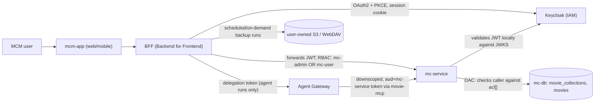

# System overview (MCM)

MovieCollectionManager is a multi-user movie-collection tracker: a universal Expo/React Native app
(`mcm-app`) backed by a Rust/Axum domain service ([mc-service](../projects/mc-service.md)),
with Keycloak as the external IAM provider. An additive AI Agents layer
([Agent Gateway](./agent-layer.md)) was layered on later without changing
`mc-service` or any existing `mcm-app` screen.

Core components, per `docs/MCM-Architecture.md`:

- **`mcm-app`** — the universal frontend where users view/manage the collections they have access
  to. Fronted by the [BFF](../projects/bff.md), documented separately.
- **`mc-service`** — owns all movie-collection domain models and business logic; the sole writer to
  `mc-db` (MongoDB). See [mc-service](../projects/mc-service.md) for its Clean Architecture
  layering, CQRS, and specification pattern — the [data model](./data-model.md)
  page covers its domain entities in detail.
- **`mc-db`** — a single shared MongoDB database (`mc_db`) with two shared collections:
  `movie_collections` (collection metadata + ACLs) and `movies` (movie records, denormalized owner).
- **Keycloak** — external IAM. Expects a client named `movie-collection-manager` in a realm, and two
  client roles: `mc-admin`, `mc-user`. New self-registrations default to `mc-user`. See
  [Auth chain](../invariants/auth-chain.md) for how a token flows end to end.
- **Per-user scheduled backups (feature 073)** — the BFF runs an in-process scheduler that copies a
  user's own collections to an S3-compatible or WebDAV destination *the user owns and supplies*,
  keeping the last N versions and offering a restore that only ever creates new collections (never
  overwrites live data). An unattended run authenticates as the user via a Keycloak offline token
  they explicitly consented to, and destination secrets are sealed under their own encryption key,
  separate from the agent-config key. This is a BFF-owned capability, not a `mc-service` or
  `mc-db` concern — see the [backups runbook](../runbooks/backups.md) for the operating detail.

## Access control: two layers, not one

RBAC and DAC are separate mechanisms enforced at different layers — mixing them up is the most
common source of confusion when reasoning about "why can't this user do X":

- **RBAC** (coarse, Keycloak-issued client roles): `mc-admin` (full access to everything) vs.
  `mc-user` (normal use — create/view/update/delete *owned* collections). Enforced by JWT role
  validation before a request reaches domain logic.
- **DAC** (fine-grained, per-collection): each collection has an owner plus zero or more
  contributors/viewers, recorded in that collection's own ACL entry in `movie_collections`. The
  owner grants/revokes contributor or viewer rights. This is enforced *inside* `mc-service`, not by
  Keycloak — Keycloac has no notion of individual collections.

*RBAC gates at the BFF and mc-service tiers by Keycloak role; DAC gates inside mc-service against
each collection's own ACL; the Agent Gateway and the backup scheduler both reach mc-service through
the same RBAC/DAC path, never around it.*

## Gotchas

- **RBAC and DAC solve different problems and neither substitutes for the other.** A `mc-user` role
  says "you may use the app"; it says nothing about *which* collections you may touch. All
  per-collection authorization is DAC, driven off the `acl` array — see the
  [data model](./data-model.md) for how the ACL and role hierarchy are shaped.
- **Grant/revoke of contributor/viewer rights is not yet built.** Per `docs/MCM-Architecture.md`, the
  ACL seam is exercised (mc-service authorizes against it, tests populate it), but the
  UI/endpoints to actually grant or revoke a non-owner role do not exist yet — every real collection
  today only has its owner entry. Do not assume a contributor/viewer workflow exists in the product
  just because the domain model supports it.
- **The AI Agents layer is additive by design, not a rewrite.** `mc-service` and existing `mcm-app`
  screens are unchanged; the agent stack talks to `mc-service` only through the same RBAC/DAC path a
  human request would use (via [movie-mcp](./agent-layer.md), never a bypass).
  If a change to the agent layer appears to require touching `mc-service` auth code, that is a sign
  the design principle is being violated — check the [Auth chain](../invariants/auth-chain.md)
  first.
- **`mc-db` runs as a single-member replica set, not a plain standalone `mongod`.** This is a
  correctness requirement (the cascade-delete transaction needs it), not an optional production
  hardening step — see [mc-service](../projects/mc-service.md) gotchas for what breaks if you
  substitute a bare `mongo` container. The dev compose stack also caps WiredTiger's cache at 1 GB
  and restores its sweeper defaults (`closeIdleTime=30 s`, `closeMinimum=250`); without these,
  parallel `cargo test` runs OOM-kill the container on memory-constrained dev boxes, producing
  "unexpected end of file" / "Connection refused" errors that are indistinguishable from a MongoDB
  consistency bug — see [mc-service](../projects/mc-service.md) for the full measured
  diagnosis (item #468).

See `docs/MCM-Architecture.md` for the full purpose/roadmap statement, the complete component list,
and the diagrammed mc-service layer table.
