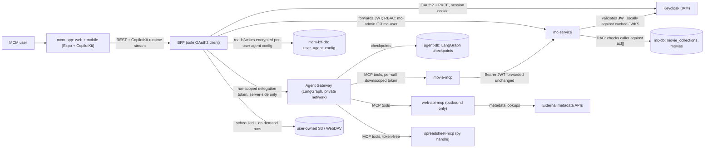

# System overview (MCM)

MovieCollectionManager is a multi-user movie-collection tracker: a universal Expo/React Native app
(`mcm-app`) whose server-side BFF ([BFF](../projects/bff.md)) is the only component the client talks
to, a Rust/Axum domain service ([mc-service](../projects/mc-service.md)) that owns all
collection/movie logic, and Keycloak as the external IAM provider. An additive AI Agents layer
([Agent Gateway](../projects/agent-gateway.md), [MCP servers](../projects/mcp-servers.md), and the
[agent-layer architecture](./agent-layer.md)) sits alongside these without changing `mc-service` or
any existing `mcm-app` screen.

Component shape, distilled ([MCM-Architecture.md](../../docs/MCM-Architecture.md) owns the full
component list and the container diagrams — this page does not restate them):

- **`mcm-app`** — the universal frontend where users view/manage the collections they have access
  to, fronted by the BFF. It also mounts CopilotKit (`@copilotkit/react-native`) for the
  conversational UI.
- **BFF** — server-side code inside the same Expo Router process; the sole OAuth2 client, session
  custodian, and the only component that reaches `mc-service`, the Agent Gateway, and the backup
  destinations. It owns its own Redis cache and its own MongoDB, `mcm-bff-db` — physically separate
  from `mc-db` (see the gotcha below).
- **`mc-service`** — owns all movie-collection domain models and business logic; the sole writer to
  `mc-db`. See [mc-service](../projects/mc-service.md) for its Clean Architecture layering, CQRS,
  and specification pattern — the [data model](./data-model.md) page covers its domain entities.
- **`mc-db`** — a single shared MongoDB database (`mc_db`) with two shared collections:
  `movie_collections` (collection metadata + ACLs) and `movies` (movie records, denormalized owner).
- **Keycloak** — external IAM. Expects a client named `movie-collection-manager` in a realm, and two
  client roles: `mc-admin`, `mc-user`. New self-registrations default to `mc-user`. See
  [Auth chain](../invariants/auth-chain.md) for how a token flows end to end.
- **AI Agents layer** — additive by design: `movie-assistant` (the Python LangGraph supervisor +
  specialist graph), `movie-mcp` (MCP wrapper over the `mc-service` REST API), `web-api-mcp`
  (outbound TMDB/IMDB lookups), `spreadsheet-mcp` (token-free CSV/`.xlsx` parse and build over a
  transient handle), and `agent-db` (a dedicated PostgreSQL holding LangGraph checkpoints, logically
  isolated from `mc-db`). The gateway and `agent-db` are private-network only: the client never
  reaches them, and only the BFF starts a run. See [agent-layer](./agent-layer.md) and
  [mcp-servers](../projects/mcp-servers.md) for detail.
- **Per-user scheduled backups (feature 073)** — the BFF runs an in-process scheduler that copies a
  user's own collections to an S3-compatible or WebDAV destination *the user owns and supplies*,
  keeping the last N versions and offering a restore that only ever creates new collections (never
  overwrites live data). An unattended run authenticates as the user via a Keycloak offline token
  they explicitly consented to, and destination secrets are sealed under their own encryption key,
  separate from the agent-config key. This is a BFF-owned capability, not a `mc-service` or
  `mc-db` concern — see the [backups runbook](../runbooks/backups.md) for the operating detail.

*Where identity is enforced and where data lands: RBAC gates at the BFF and mc-service tiers by
Keycloak role, DAC gates inside mc-service against each collection's own ACL, and both the Agent
Gateway and the backup scheduler reach mc-service through that same RBAC/DAC path, never around it.*

## Access control: two layers, not one

RBAC and DAC are separate mechanisms enforced at different layers — mixing them up is the most
common source of confusion when reasoning about "why can't this user do X":

- **RBAC** (coarse, Keycloak-issued client roles): `mc-admin` (full access to everything) vs.
  `mc-user` (normal use — create/view/update/delete *owned* collections). Enforced by JWT role
  validation before a request reaches domain logic.
- **DAC** (fine-grained, per-collection): each collection has an owner plus zero or more
  contributors/viewers, recorded in that collection's own ACL entry in `movie_collections`. The
  owner grants/revokes contributor or viewer rights. This is enforced *inside* `mc-service`, not by
  Keycloak — Keycloak has no notion of individual collections.

## Gotchas

- **RBAC and DAC solve different problems and neither substitutes for the other.** A `mc-user` role
  says "you may use the app"; it says nothing about *which* collections you may touch. All
  per-collection authorization is DAC, driven off the `acl` array — see the
  [data model](./data-model.md) for how the ACL and role hierarchy are shaped.
- **Grant/revoke of contributor/viewer rights is not yet built.** Per `docs/MCM-Architecture.md`, the
  ACL seam is exercised (mc-service authorizes against it, tests populate it), but the
  UI/endpoints to actually grant or revoke a non-owner role do not exist yet — every real collection
  today only has its owner entry. Do not assume a contributor/viewer workflow exists in the product
  just because the domain model supports it.
- **The AI Agents layer is additive by design, not a rewrite.** `mc-service` and existing `mcm-app`
  screens are unchanged; the agent stack talks to `mc-service` only through the same RBAC/DAC path a
  human request would use (via [movie-mcp](./agent-layer.md), never a bypass), carrying a downscoped,
  audience-bound token rather than the user's session token. If a change to the agent layer appears
  to require touching `mc-service` auth code, that is a sign the design principle is being violated —
  check the [Auth chain](../invariants/auth-chain.md) first.
- **`mc-db` runs as a single-member replica set, not a plain standalone `mongod`.** This is a
  correctness requirement (the cascade-delete transaction needs it), not an optional production
  hardening step — see [mc-service](../projects/mc-service.md) gotchas for what breaks if you
  substitute a bare `mongo` container. The dev compose stack also caps WiredTiger's cache at 1 GB
  and restores its sweeper defaults (`closeIdleTime=30 s`, `closeMinimum=250`); without these,
  parallel `cargo test` runs OOM-kill the container on memory-constrained dev boxes, producing
  "unexpected end of file" / "Connection refused" errors that are indistinguishable from a MongoDB
  consistency bug — see [mc-service](../projects/mc-service.md) for the full measured
  diagnosis (item #468). **The BFF's own store is the opposite case:** `mcm-bff-db` is a plain
  standalone `mongod` with no replica set, because the BFF does single-document upserts only — do not
  "fix" it to match `mc-db`, and never point one service at the other's database.
- **mc-service does not wait for Keycloak, so a Keycloak outage looks like an auth bug, not a
  startup failure.** OIDC discovery and the JWKS fetch run in a background task, so the service binds
  and serves immediately; with Keycloak unreachable it still answers `/health` but rejects *every*
  protected request with 401. The symptom is a working-looking backend that refuses every login —
  pinned by `unauthenticated_401_is_returned_even_when_keycloak_is_unreachable` in
  `backend/mc-service/tests/integration/health_test.rs`. Note also that a *failed* discovery still
  marks the auth instance ready, so tests must gate on discovery actually succeeding.
- **The backup destinations are not in the `mcm` stack.** Feature 073's destination containers
  (the S3-compatible and WebDAV servers the integration tier tests against) live in their own compose
  file, brought up explicitly. This is not a style preference: Compose interpolates every service of
  an included file at *parse* time regardless of which profiles are selected, so a `${REGISTRY_HOST:?}`
  inside a profile-gated service aborted `up` for the entire `mcm` stack — including CI's `app-e2e`
  bring-up, which sets no registry host and wants none of those services. **A profile is not isolation
  from interpolation.**
- **The backup scheduler is silent when nothing is due, and does not run under Metro.** In dev,
  `pnpm start` runs the app through Metro and `server.js` never executes, so **no tick fires** — call
  the tick route directly. The scheduler is also disabled outright when `BACKUP_TICK_SECRET` is unset
  (announced once at boot, because a silent never-ran scheduler is the worst way for the feature to
  fail). See the [backups runbook](../runbooks/backups.md) for how to confirm it is actually ticking.

See `docs/MCM-Architecture.md` for the full purpose/roadmap statement, the complete component list,
the container diagrams, and the diagrammed mc-service layer table.
