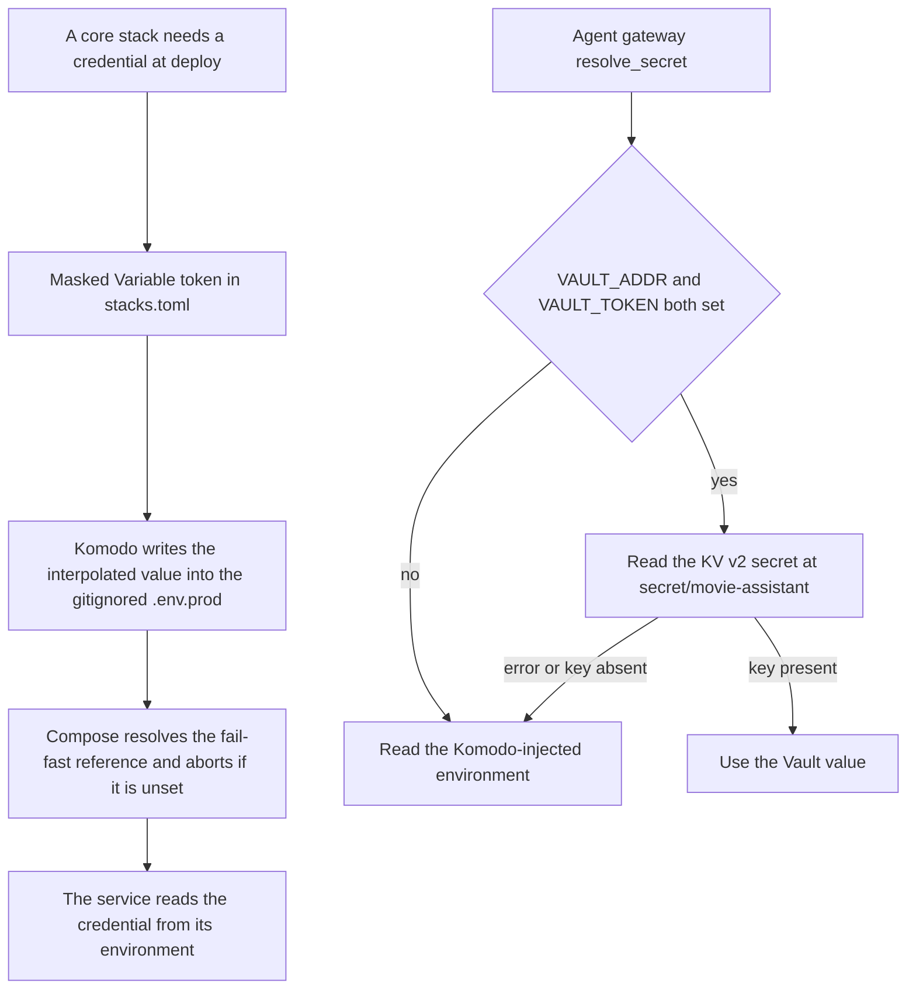

# ADR-0001: Production secrets-management standard

Accepted decision record (feature 026, Workstream B / US2, dated 2026-07-04) ratifying **Komodo
Variables** as the one sanctioned production secrets mechanism for every core stack, rather than
adopting HashiCorp Vault as the backbone. It is a "ratify what already runs" decision, not a
greenfield choice: all seven production stacks already ran on Komodo Variables before this ADR, while
Vault was deployed but never operationalized. There is exactly one sanctioned mechanism, plus one
narrowly-scoped, optional, fail-open reader in the agent layer — never a second source of truth for a
core stack.

## The decision, distilled

- **The mechanism.** Masked Komodo Variables (`[[NAME]]`) are interpolated into each stack's
  gitignored `.env.prod` at deploy time and consumed behind fail-fast `${VAR:?}` compose references.
  The committed TOML carries only the token; the value lives in Komodo's masked store and in the
  generated `.env.prod`.
- **The scope.** Every production secret category the ADR enumerates is mapped to that one mechanism,
  including the feature-026 datastore credentials. The per-category coverage table is in the ADR.
- **Vault's place.** Deployed **dormant** and reconciled as a narrow, optional, fail-open reader
  inside the [Agent Gateway](../projects/agent-gateway.md) only — never a core-stack backbone.
- **The nature of the decision.** It is a *ratification of the compliant status quo*, not an
  enhancement: it satisfies the "environment variables" leg of the constitution's Secrets Management
  principle ("use environment variables **or** a dedicated secret management tool"), with secrets
  never in source, config files, or version control. Adopting Vault would be the enhancement.
- **Rotation.** Manual by design (see the gotchas); the datastore-credential steps are the
  [prod data-tier auth runbook](../runbooks/prod-data-tier-auth.md)'s job, not this page's.

## Where the decision lives in the repo

The seven core prod stacks are `[[stack]]` blocks in
[`infrastructure-as-code/komodo/stacks.toml`](../../infrastructure-as-code/komodo/stacks.toml):
`prod-auth`, `prod-mc-service`, `prod-mcm-bff`, `prod-movie-assistant`, `prod-audit`,
`prod-observability` and `prod-vault`. Each declares `env_file_path = ".env.prod"` plus an
`environment = """…"""` block whose values are `[[Variable]]` tokens, so the committed file holds no
value and the deploy-time interpolation *is* the mechanism. Non-secret operational values — bare
image digests in the committed `.env.deploy`, and topology values, which are also `[[Variable]]`
tokens rather than inline literals — travel by their own channels and sit outside the ADR's coverage
map.

The coupling that makes this safe to change: Komodo writes a stack's `environment` block into that
stack's `env_file_path`, so a variable absent from the block is absent at `docker compose config`
time and the compose's `${VAR:?}` reference aborts the deploy. Adding a required `${VAR:?}` to a prod
compose is therefore a change to that stack's declared inputs in `stacks.toml` — a break that is
invisible in CI (the compose files are valid and the dev stack supplies the value from its own
generated env file) and only surfaces on a real Komodo deploy. The guard test
`scripts/__tests__/komodo-stack-env.guard.test.mjs` makes that coupling mechanical; the full gate set
is on the [Secrets management posture](../invariants/secrets-management.md) page.

`prod-vault` is the exception that proves the rule: it declares no secret at all. It runs a real,
non-dev Vault on raft storage, **uninitialized and sealed**, with no root token anywhere in env, and a
healthcheck override that reports the dormant state as healthy so Komodo keeps it up. Do not run the
init/unseal sequence as a side effect of an unrelated change.

## The one optional reader

The single sanctioned path, plus the dormant Vault reader's fail-open fallback.

`resolve_secret(name, env)` in `agents/movie-assistant/src/secrets.py` reads the KV v2 secret at
`secret/movie-assistant` **iff** `VAULT_ADDR` and `VAULT_TOKEN` are both set, and otherwise falls
straight through to the Komodo-injected environment. It is env-gated, per-run, never logs a value, and
never raises on a Vault error. Its only live caller is the gateway's RFC 8693 token re-exchange, which
needs `AGENT_GATEWAY_CLIENT_SECRET` and fails closed — it raises rather than defaulting — when neither
source supplies it. In production today those two env vars are unset, so the reader is inert.

## Gotchas

- **Vault was evaluated and explicitly rejected, not just deferred by inertia.** The rationale table in
  the ADR weighs rotation, dynamic DB credentials, audit granularity, and availability coupling — on a
  single-host, single-operator homelab, Vault's real advantages aren't pressing, while its real cost is
  concrete: every host reboot brings Vault up **sealed**, silently blocking every deploy until a manual
  unseal. Don't reintroduce Vault as a core-stack dependency without revisiting this reasoning.
- **A half-adopted Vault (some secrets in Vault, some in Komodo) is explicitly called out as worse than
  either pure option.** If a change moves one secret into Vault while the rest stay in Komodo, that is
  the exact dual-mechanism ambiguity this ADR forbids — not a reasonable incremental step.
- **The agent-layer Vault reader must always fail open to the Komodo-injected environment.** It reads
  at most one or two secrets *iff* the Vault address and token env vars are set, and otherwise silently
  falls back — it must never crash on a Vault error or become an independent source of truth. In
  production today those env vars are unset, so the reader is inert.
- **Per-user bring-your-own credentials are explicitly out of scope for this ADR.** User-supplied
  provider credentials are encrypted at rest per-user and never centralized into Komodo or Vault — a
  request with no per-user credential fails closed, it does not fall back to a shared secret.
- **Rotation is manual by design under this decision**, not an oversight: rotating a secret means
  editing the Komodo Variable and redeploying the affected stack. Automated rotation, lease/TTL, and
  fine-grained secret-access audit are named, explicit non-goals until the ADR's §7 revisit trigger
  fires (dynamic short-lived DB credentials wanted, mandated rotation/audit, or a move to multiple
  hosts/operators) — do not treat their absence as a gap to silently fix.

Because B-opt-1 was selected, feature 026's US3 migration plan was never executed and no migration
artifact exists; it would become the first deliverable of a follow-up Vault-adoption feature if the
§7 trigger fires. Workstream A meanwhile shipped static SCRAM datastore credentials rather than
waiting on Vault-issued ones.

This is the decision behind the day-to-day rules on the
[Secrets management posture](../invariants/secrets-management.md) page and governs credentials
consumed by the [Agent Gateway](../projects/agent-gateway.md)'s optional Vault reader and by
[mc-service](../projects/mc-service.md)'s and the [BFF](../projects/bff.md)'s datastore
credentials. Full rationale table, secret-category coverage map and revisit trigger:
[`docs/decisions/ADR-0001-prod-secrets-management.md`](../../docs/decisions/ADR-0001-prod-secrets-management.md).
