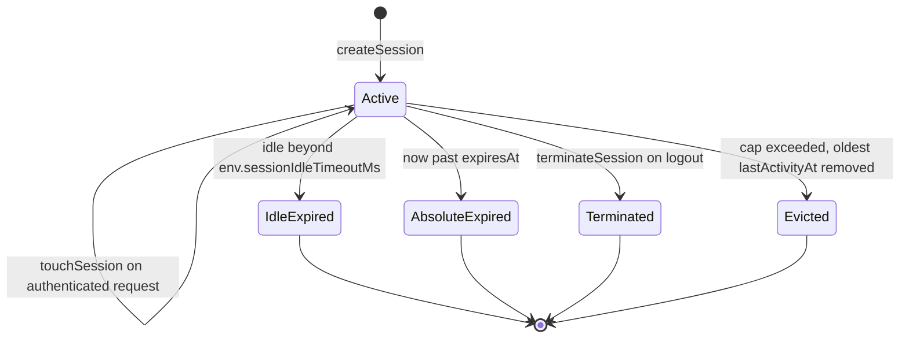

# Session ID vs JWT — Redis session lifecycle and concurrent-session eviction

The BFF's Redis session (`session-manager.ts`) and the underlying Keycloak JWT are two separate
lifecycles. The session tracks its own idle timeout and absolute timeout independently of however
long the JWT itself is valid for, and it additionally enforces a per-user cap on concurrent sessions
(`MAX_CONCURRENT_SESSIONS`) that has nothing to do with token expiry. See
[the auth chain](../invariants/auth-chain.md) for where this session sits in the full
login-to-request sequence.

## Gotchas

- **Session ID vs JWT**: Redis session tracks timeout and concurrent session limits independently of
  the JWT lifetime.
- **Concurrent session eviction**: when a user exceeds `MAX_CONCURRENT_SESSIONS`, `session-manager.ts`
  evicts the oldest session automatically.
- **The client stores only the session ID, not tokens.** The React Native client never touches raw
  JWTs — the BFF owns all token handling server-side, and only the opaque Redis session ID is
  persisted client-side (in a cookie).
- **Eviction has a documented TOCTOU race under simultaneous logins.** `createSession()` checks the
  session count before adding the new session, then re-checks and trims after adding — this two-step
  pre/post-check exists specifically because the pre-add check alone is racy under concurrent logins
  (feature 009 FR-018). The post-add trim loop breaks out on "no progress" to avoid spinning forever
  against stale set members whose session objects are already gone.

## The session object and its keys

A `Session` (`frontend/mcm-app/src/types/auth.ts`) is five fields: `sessionId` (a `randomUUID()`),
`userId`, `createdAt`, `lastActivityAt`, and `expiresAt` — no token material, no roles, no profile.
`createSession()` sets `lastActivityAt = createdAt = now` and `expiresAt = now +
env.sessionAbsoluteTimeoutMs`.

`cache-service.ts` stores it under two Redis keys:

- `session:<sessionId>` — the JSON session, written with `SET ... EX <ttl>`.
- `user-sessions:<userId>` — a set of that user's session IDs, maintained with `SADD`/`SREM`, refreshed
  with the same TTL. The per-user count (`SCARD`) and the enumeration used by eviction and by
  `terminateAllSessions()` both read this set.

The Redis TTL is **a backstop, not the policy**: `sessionTtlSeconds()` derives it from the session's
remaining absolute lifetime (floored at 1s for an already-expired session), so it can never be shorter
than the configured idle/absolute windows. A fixed shorter TTL here silently caps the real timeout —
the previous hard-coded 600s truncated a 30-min idle / 24-h absolute policy to 10 minutes (feature 009
finding #3). Timeout enforcement itself lives in `getValidSession()` reading the timestamps, and the
integration tier asserts the TTL exceeds the idle window
(`tests/integration/session-manager.integration.test.ts`).

A corrupt/truncated stored value is treated as *no session*: `getSession()` and `updateSessionActivity()`
drop the bad key rather than throwing (feature 009 FR-021), so a malformed Redis value fails closed
instead of producing an unhandled `SyntaxError`.

## Lifecycle

Session lifecycle in `session-manager.ts` — expiry is detected lazily on the next request, not by a background reaper.

- `getValidSession(sessionId)` is the authority. It loads the session, then deletes and returns `null`
  if either the absolute timeout (`now > expiresAt`) or the idle timeout (`now - lastActivityAt >
  env.sessionIdleTimeoutMs`) has passed. A missing session also returns `null`.
- `touchSession(sessionId)` rewrites `lastActivityAt` to now, sliding the idle window.
- `terminateSession(sessionId, userId)` deletes one session (logout); `terminateAllSessions(userId)`
  deletes every session in the user's set (account deletion, via `account-deletion.ts`).

There is no sweeper process: an expired session sits in Redis until its TTL removes it or the next
`getValidSession()` call deletes it. `frontend/mcm-app/src/bff-server/session-timeout.ts` wraps
`getValidSession()` + `touchSession()` for route use and maps the failure to `SESSION_IDLE_TIMEOUT`
(its default) or `SESSION_ABSOLUTE_TIMEOUT`.

## Concurrent-session cap and the TOCTOU race

`createSession()` closes the race in two steps: a pre-add count check (`if (sessionCount >=
MAX_SESSIONS) evictOldestSession(userId)`), then — after `cacheSession()` has added the new session —
a trim loop that re-reads the count and keeps evicting while `count > MAX_SESSIONS`. The loop's
no-progress guard (`if (next >= count) break`) exists because the set can retain members whose
`session:` object is already gone; `evictOldestSession()` returns early when it finds no valid session
to delete, so without the break the loop could spin forever without the count ever falling.

That pre-add check alone is genuinely racy: N simultaneous logins for one user all observe a count
below the cap and all add, leaving the set above `MAX_SESSIONS`. The post-add trim is what makes the
invariant hold (feature 009 FR-018), asserted against real Redis by
`tests/integration/concurrent-session-cap.integration.test.ts`, which fires `max + 5` concurrent
`createSession()` calls and requires the resulting count to be at or below the cap.

Eviction selects the valid session with the **smallest `lastActivityAt`** (sort ascending, take the
first), so it is the least-recently-active session that goes — not necessarily the oldest by
`createdAt`. `MAX_SESSIONS` is bound once at module load from `env.maxConcurrentSessions`
(`MAX_CONCURRENT_SESSIONS`, default 10 in `src/config/env.ts`), so changing the environment variable
after the module is imported has no effect.

Eviction is audited: `evictOldestSession()` emits `logger.audit('session_evicted', { userId,
activeSessions, maxSessions })`. The evicted session ID is deliberately **not** logged in any form —
under a key named `sessionId` the logger redacts it to a constant while still tripping the
`mcm-no-token-logging` SAST rule (which matches the key name), and any other key name would leak it
(feature 052 FR-004; the integration test asserts no created session ID appears in the serialized
event). This event was added because a cap that fires in complete silence is indistinguishable from
one that never fires.

## Who the session belongs to

Nothing in `session-manager.ts` verifies that a session ID belongs to the caller — it is a keyed
lookup module. Ownership is enforced at the route boundary: `auth/user+api.ts` and
`auth/logout+api.ts` extract the session ID, load it, and act only when `session.userId ===
payload.sub` (the JWT subject). Both are explicit about the reason — an unauthenticated request
carrying someone else's `X-Session-Id` must not be able to slide, expire, or terminate that victim's
session (feature 009 finding #9). Any new route that calls `getValidSession()`, `touchSession()`, or
`terminateSession()` must reproduce that ownership check itself.

## The client only ever holds the opaque session ID

`frontend/mcm-app/src/utils/session-storage.ts` documents the model: auth lives entirely in the BFF's
`HttpOnly` cookies. On web nothing is stored client-side — the cookies are the source of truth. On
native, the only persisted value is the opaque session ID (SecureStore key `mcm_session_id`), used
purely as a startup "do I appear to be signed in?" hint for `hasStoredSession()`, because JS cannot
read `HttpOnly` cookies. `hasStoredSession()` is a hint only, never an authorization decision: the
`AuthProvider` in `src/hooks/use-auth.tsx` follows it with a `/bff-api/auth/user` call and stays
unauthenticated if that fails.

The ID reaches the client by two channels on login: the `mcm_session_id` `HttpOnly; SameSite=Strict`
cookie built by `buildAuthCookies()` and the `X-Session-Id` response header, which `use-login.ts`
reads and passes to `storeSession()` (the native callback does the same). Subsequent requests are
authenticated by the access-token cookie; `extractSessionId()` reads the session cookie only. The
historical raw-token storage and `Authorization: Bearer` path were removed — the client holds no
access or refresh token at all.

## Focused tests

- `unit-tests/session-manager.test.ts` mocks `cache-service` and covers the cap at N-1 (allowed), at
  N (oldest evicted, tie broken by array order), absolute/idle expiry, `touchSession`, and Redis
  errors propagating rather than being swallowed. Its `createSession concurrent-cap trim` block drives
  the post-add trim by returning an over-cap count after the add.
- `tests/integration/session-manager.integration.test.ts` and
  `tests/integration/concurrent-session-cap.integration.test.ts` run against real Redis (db 1) — the
  mocked tier cannot prove that a race has one winner, only that the code agrees with its own model.
