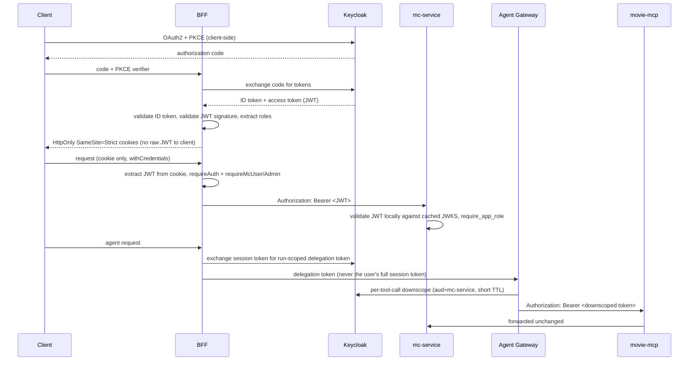

# Authentication and authorization chain

Keycloak is the identity provider for the whole system (realm `grumpyrobot`, roles `mc-user` /
`mc-admin`). The chain has four distinct enforcement points, and each one is deliberately
independent rather than trusting the layer before it blindly.

1. **Client → Keycloak (PKCE).** The [Expo app](/openwiki/projects/expo-app.md) performs the OAuth2
   authorization-code-with-PKCE exchange directly against Keycloak; the client only ever sees an
   authorization code, never a token.
2. **BFF exchanges the code, owns the session.** The [BFF](/openwiki/projects/bff.md) trades the code
   for tokens, validates the ID token and the access-token JWT, extracts roles, and creates a
   Redis-backed session. It then hands the *client* only opaque `HttpOnly`, `SameSite=Strict` cookies
   — the raw JWT never reaches client-side JS on web or native. Subsequent requests carry only that
   cookie; the BFF re-extracts the JWT server-side on every request via `requireAuth()`.
3. **mc-service re-validates independently.** [mc-service](/openwiki/projects/mc-service.md) does not
   trust that the BFF already checked auth — it runs its own `KeycloakAuthLayer` (a tower layer, so a
   new route is protected by default) plus a separate `require_app_role` middleware for the
   `mc-user` OR `mc-admin` check, validating the same JWT locally against a JWKS cached once at
   startup.
4. **Agent Gateway gets a narrower, run-scoped token, not the user's session token.** When a request
   goes to the [Agent Gateway](/openwiki/projects/agent-gateway.md), the BFF performs its own token
   exchange to mint a run-scoped, audience-narrowed delegation token and hands *that* to the gateway.
   The gateway then re-exchanges per tool call to bind a short-TTL, `aud=mc-service` token to each
   individual MCP call. This means the most model-exposed component in the system (the LLM-driven
   gateway) never holds a long-lived, broad-scope credential.

## Gotchas

- **Docker-internal DNS, not `localhost`, for service-to-service auth calls.** Inside containers the
  BFF reaches Keycloak by its internal service name, not a public hostname or `localhost` — mixing
  this up produces DNS/connection errors, not an auth error, which is confusing to debug.
- **The OIDC discovery document must come from the internal Keycloak origin**, never a public URL
  baked into a client bundle at build time — that URL isn't reachable from inside the container
  network.
- **A session ID is not a JWT lifetime proxy.** Redis session tracking (timeout, concurrent-session
  limit) is deliberately independent of the JWT's own expiry — don't assume killing a session
  invalidates an already-issued JWT, or vice versa.
- **`axum-keycloak-auth` alone does not enforce application roles.** Without an explicit
  `require_app_role` middleware, `KeycloakAuthLayer` only checks JWT signature and audience — a route
  behind just the base layer is authenticated but not authorized.
- **The agent chain's delegation token is intentionally not the user's session token** — it exists
  so a compromised or misbehaving gateway can't act with the user's full session privileges, only a
  narrow, short-lived, audience-bound one.

See [Secrets management](/openwiki/invariants/secrets-management.md) for how the credentials this
chain depends on (Keycloak client secrets, cookie signing/encryption keys) are sourced and rotated,
and `CLAUDE.md`'s Architecture and Non-Obvious Design Decisions sections for the full narrative.
