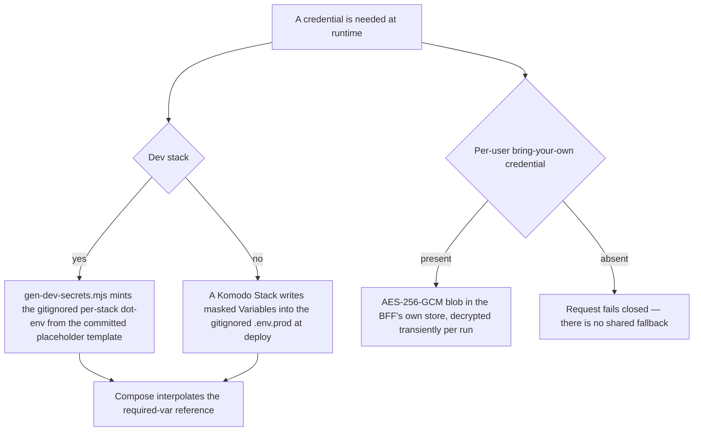

# Secrets management posture

No clear-text secret in git, ever — the constitution's Secrets Management principle, repeated wherever
it applies. Every credential reaches its consumer through an environment variable or a per-user
encrypted store, and every mechanism is enforced by a CI gate rather than by developer discipline
alone. The *decision* (why Komodo Variables and not HashiCorp Vault) is
[ADR-0001](../decisions/adr-0001-prod-secrets-management.md); this page is the day-to-day posture and
the gates.

Four channels carry every credential, and each credential belongs to exactly one: dev-generated
per-stack env files, the Komodo-injected prod `.env.prod`, CI env files projected from Forgejo
secrets, and the per-user AES-256-GCM store. Absence is fail-closed in all four.

Where a credential comes from, per environment.

## Dev: generator-minted, gitignored, fail-fast

`node scripts/gen-dev-secrets.mjs` reads each committed
`infrastructure-as-code/docker/stacks/<stack>.env.example` and writes the gitignored `<stack>.env` for
the four named stacks (`auth`, `mcm`, `audit`, `observability`). A `<generate:KIND>` placeholder is
replaced by a freshly minted value of that kind (`b62-32`, `b62-48`, `hex-64`, `complex-16`,
`unleash-admin`, `unleash-client`, `mongo-keyfile`); a literal in the template is a deterministic
fixture and is copied verbatim.

`node scripts/gen-dev-env.mjs` then projects the *realm* client secrets out of `stacks/auth.env` into
the BFF's gitignored env files (`frontend/mcm-app/.env.docker`, `.env.local`, `.env.e2e.local`, the
web-api-mcp TMDB file, and `backend/mc-service/.env.local`), so the imported dev realm's client
secrets and the BFF's client secrets agree **by construction** rather than by hand. It verifies the
projected credentials against the *running* realm before writing anything (exit 2 = refusing to
write), because writing a file proves a value reached disk and nothing about whether it still
authenticates.

Compose files reference every secret as `${VAR:?set in stacks/<stack>.env …}` — never an inline
literal, and never a `${VAR:-literal}` default, since a default *is* a leaked value.

## Production: masked Komodo Variables

Komodo Variables are the one sanctioned production mechanism (ADR-0001). The seven prod stacks are
config-as-code in [stacks.toml](../../infrastructure-as-code/komodo/stacks.toml): each `[[stack]]`
declares `env_file_path = ".env.prod"` (gitignored, `chmod 600`) and an `environment = """…"""`
block whose values are masked Variable tokens `[[NAME]]`. Komodo interpolates that block into
`.env.prod` at deploy, and the committed TOML carries only the token — never a value. Committed
`additional_env_files = [".env.deploy"]` carry host-free bare image digests; those are *not* secrets,
which is exactly why `.env.deploy` is tracked while `.env.prod` is not. Every prod compose reference
is the fail-fast `${VAR:?…}` form.

Two details worth knowing: the Mongo replica-set keyfile (`MONGO_MC_KEYFILE`) is carried as an
ordinary Variable and materialized in-container by `mongo-entrypoint.sh`, preserving the
no-host-file-secret model; and CI secrets live in Forgejo Actions secrets, projected by
`scripts/gen-ci-env.mjs` into the gitignored CI env files (it aborts with exit 2 rather than writing a
fallback literal). The committed CI realm carries only `${VAR}` placeholders that Keycloak resolves
from the container environment at `--import-realm` — no throwaway credential is committed even though
it is disposable.

## Vault: deployed, deliberately dormant, one fail-open reader

HashiCorp Vault is deployed **dormant** (`prod-vault`: real Vault, uninitialized and sealed, on raft
storage, with no root token anywhere in env, and a healthcheck override so Komodo reads an
intentionally sealed server as healthy). It is not a secret source for any core stack. A dev-mode
Vault ships in the `auth` stack behind the `vault` profile, only for exercising the reader below.

The single consumer is the [Agent Gateway](../projects/agent-gateway.md)'s optional reader,
`resolve_secret(name, env)` in `agents/movie-assistant/src/secrets.py`: it reads the KV v2 secret at
`secret/movie-assistant` **iff** both `VAULT_ADDR` and `VAULT_TOKEN` are set, and otherwise falls
straight through to the environment. It is env-gated, per-run, never logs a value, and never raises
on a Vault error — any failure degrades to env config. Its only live caller is the gateway's RFC 8693
token re-exchange, which needs `AGENT_GATEWAY_CLIENT_SECRET`. In production today those two env vars
are unset, so the reader is inert and every agent secret resolves from the Komodo-injected
environment. There is no BFF-side Vault client: the BFF reads `AGENT_CONFIG_ENC_KEY` from env.

## Per-user bring-your-own credentials

A user's own model-provider key, TMDB key, or Ollama base URL is a separate, orthogonal case —
**operator/shared infrastructure secrets only** are governed by ADR-0001. Per-user credentials are
encrypted at rest in the BFF's own Mongo store (`mcm-bff-db`, deliberately not mc-service's
datastore) with AES-256-GCM, stored as base64 `iv ‖ authTag ‖ ciphertext`, and decrypted only
transiently in the BFF — never centralized into Komodo or Vault, never returned to the client, never
logged. Blobs are bound by GCM additional authenticated data equal to `${userId}:${field}`, so a
store-layer mixup (user A's blob landing in user B's document, or a TMDB blob read as a model key)
fails authentication loudly instead of decrypting silently. The master key is
`AGENT_CONFIG_ENC_KEY` (32 bytes base64); feature 073's backup destination secrets reuse the same
primitives under a **separate** `BACKUP_CREDENTIAL_ENC_KEY`, so that key's blast radius stays
confined to the user's assistant credentials.

The failure semantics are fail-closed, not fail-shared: a run with no per-user credential never falls
back to a shared operator credential. On the gateway side `runtime_env` actively *removes* an ambient
`ANTHROPIC_API_KEY` when the run carries no per-user key, so an Ollama-only user can never reach the
always-Claude escalation tier on an org key — the escalation tier degrades to the base specialist
instead. A request with no credential fails with a configuration error.

## The gates

Enforced in `.forgejo/workflows/guardrails.yml`, on every push to `main` and every PR:

| Gate | What it asserts |
|---|---|
| `scripts/check-no-inline-secrets.mjs` | Structural, compose-only: every secret-shaped env key, password-bearing URL, `--requirepass`, `redis-cli -a` and `curl -u` value in a tracked compose file is a pure `${VAR}` / `${VAR:?…}` reference. A `${VAR:-default}` **fails** (it re-leaks plaintext). |
| `scripts/secret-scan.mjs` | Whole tree (`git ls-files`): credential-shaped *strings* — provider key shapes, the externalized dev-credential shapes from features 021/022, E2E-credential literals and non-empty literal fallbacks — plus auth fields inside recorded golden cassettes. |
| `scripts/check-topology-scrub.mjs` | No real tailnet host re-enters the tree; documented placeholders pass, a random tailnet id does not. |
| `scripts/check-komodo-sync.mjs` | No infra-topology literal (tailnet host, Tailscale admin IP, hardcoded URL host) in the committed `komodo/*.toml` — sensitive values must be `[[Variable]]` tokens. |
| `scripts/check-no-argv-secrets.mjs` | No credential-named `--env`/`-e` argument is ever passed to the Maestro runner, where `ps`/`/proc` on a shared CI host would expose it. |

Two properties of that list matter more than the list itself. First, each gate runs **`--selftest`
before the real scan**, proving the detector still fires on a planted literal — a gate that silently
stopped detecting would otherwise report green for months. Second, the node-test guards beside them
extend the rule where a pattern-match cannot: `komodo-stack-env.guard` proves every `${VAR:?}` in a
prod compose is actually supplied by its Komodo stack; `no-secret-echo.guard` fails any provisioning
shell script that echoes a secret-named variable to stdout (that is how two live audit credentials
reached `docker logs` and Komodo's log view); `leak-gate-coverage` asserts that the `openwiki/` bundle
itself is inside both whole-tree gates, so generated documentation cannot leak past them.

## Gotchas

- **Vault was rejected as the core-stack backbone, not merely deferred by inertia.** On a
  single-host, single-operator homelab, Vault's real advantages (dynamic short-lived DB credentials,
  fine-grained access audit, central rotation) aren't pressing, while its real cost is concrete —
  every host reboot brings Vault up *sealed*, silently blocking every deploy until a manual unseal.
  A **half-adopted** Vault (some secrets in Vault, some in Komodo) is explicitly called out as worse
  than either pure option. Moving one core-stack secret into Vault is the trigger to revisit
  ADR-0001, not to quietly diverge from it.
- **The rule is not compose-file-only.** Shell scripts, integration tests and docs must also read
  secrets from env and fail/skip cleanly when unset — no literal, no `?? 'literal'` fallback. This is
  exactly how a past literal slipped past a compose-only gate for months, and it is why
  `secret-scan.mjs` carries a tree-wide dev-credential rule and a curated E2E-fallback rule
  alongside the compose gate's structural check.
- **Adding a `${VAR:?}` to a prod compose is a change to that stack's required inputs** — and the only
  place those inputs are declared is `stacks.toml`. The break is invisible in CI (the compose files
  are valid, the image exists, and the dev stack works because its `<stack>.env` supplies the value);
  it only surfaces on a real Komodo deploy, which is how the observability stack once failed to
  deploy over a `REGISTRY_HOST` it never declared.
- **One password, two consumers.** `KC_DB_PASSWORD` is a single variable interpolated by *both* the
  Postgres service and Keycloak itself — there is no separate Postgres-side password to keep in sync.
  Because the stacks it feeds are password-on-first-init images, they bake that value into their data
  volume and ignore later env changes: rotating it means regenerating the env *and* recreating the
  service with a fresh volume, or the container keeps the volume's original password and auth fails.
- **The dev generator is idempotent by design, and `--force` is not a safe default.** A second run
  adds only the keys the template has gained and touches nothing already present (so a running box
  keeps its values); `--force` rotates *every* value, which is why the ungated alternative — telling
  people to re-run with `--force` to pick up one new variable — would take working stacks down.
- **`AGENT_CONFIG_ENC_KEY` must be base64 of 32 bytes.** Minting it as hex gives 64 characters that
  decode to 48 bytes and fails at first use, breaking assistant config rendering. The same value must
  reach both the dev container and the host-side BFF, or encrypt/decrypt across restarts breaks — the
  key is held deliberately apart from the data it protects.
- **`AGENT_GATEWAY_CLIENT_SECRET` is the one credential-shaped key the inline-secret gate does not
  check** — it is explicitly allowlisted because the dev compose injects it with the *optional*
  `${…:-}` form. It is mandatory in production, and an empty value is fail-closed: the token
  re-exchange is skipped and every MCP tool call fails, rather than resolving to a shared default.
- **Never print a secret's value.** Print *where* a credential lives (the env var name, the Komodo
  Variable), never what it is; the never-log list is in
  [Logging and audit](./logging-and-audit.md). Maestro E2E credentials reach the runner through the
  `MAESTRO_`-prefixed environment channel via `scripts/maestro-run.sh`, never as argv.
- **The whole tree is scanned, generated documentation included.** A wiki page is a tracked file: never
  reproduce the forge hostname, the production domain, the tailnet host, a host+port pair identifying
  a real deployment, or any credential-shaped string — refer to them abstractly (see
  [INSTRUCTIONS.md](../INSTRUCTIONS.md) §3).
- **Rotation is manual, by design, under this ADR.** Rotating a secret means editing the Komodo
  Variable and redeploying the affected stack; the datastore-credential steps are in the
  [prod data-tier auth runbook](../runbooks/prod-data-tier-auth.md). There is no automated rotation
  until ADR-0001's §7 revisit trigger fires (dynamic DB credentials wanted, mandated rotation/audit,
  or a move to multiple hosts/operators).

This governs the credentials the [auth chain](./auth-chain.md) depends on (Keycloak client secrets,
BFF cookie/encryption keys) as well as datastore credentials for [mc-service](../projects/mc-service.md)
and the [BFF](../projects/bff.md), and the operator secrets consumed by the
[Agent Gateway](../projects/agent-gateway.md). The per-run local bootstrap is in the
[local-dev runbook](../runbooks/local-dev.md); category-by-category coverage map, rationale table and
revisit trigger are in `docs/decisions/ADR-0001-prod-secrets-management.md`, and the day-to-day
configuration rules in `CLAUDE.md`.
