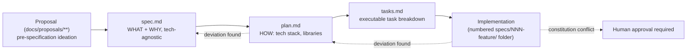

# Proposal → spec → plan → tasks → implementation lifecycle

This repository practices Spec-Driven Development (SDD) using the Specify CLI (GitHub Spec Kit).
Every feature moves through the same four-stage pipeline before code is considered legitimate:

1. **Proposal** (`docs/proposals/**`) — an unstructured PRD or research document capturing an idea
   before it has a feature number or formal spec. Proposals are explicitly **pre-specification**:
   the moment a numbered `specs/NNN-feature-name/` folder exists, the proposal is superseded.
2. **`spec.md`** — WHAT and WHY only: user stories, functional requirements, domain terms. Must stay
   technology-agnostic; this is a hard separation of concerns from `plan.md`, not a style preference.
3. **`plan.md`** — HOW: the concrete tech stack, libraries, and implementation approach for that
   spec.
4. **`tasks.md`** — the executable task breakdown implementers work through.
5. **Implementation** — the actual code change. If implementation deviates from `plan.md`/`tasks.md`,
   those artifacts must be updated to stay aligned; a deviation from the **constitution**
   specifically requires human approval and a documented rationale, not just an updated plan.

## Gotchas

- **A proposal is not a source of truth once a spec exists — treat any surviving detail in the
  proposal as history, not a live requirement.** This is why `docs/proposals/**` is deliberately
  excluded from this wiki bundle: documenting proposal content would fill retrieval with dead ideas
  that contradict whatever the current spec actually says. If you need the *history* of how an idea
  evolved before it had a spec, read the proposal folder directly; this wiki only tracks
  post-specification concepts.
- **`docs/runbooks/` was relocated out of the proposal tree precisely so this exclusion stays clean.**
  Runbooks are live operator documents, not superseded ideation, and every runbook is in scope for
  this wiki (see the runbook concept pages).
- **Constitution deviations are the one case that isn't self-service.** A plan or implementation may
  diverge from `spec.md`/`plan.md` and simply update those files — but diverging from
  `.specify/memory/constitution.md` requires explicit human approval and a documented rationale. See
  [Constitution](/openwiki/process/constitution.md).
- **Feature numbers are sequential and load-bearing for cross-references** — many CLAUDE.md gotchas
  and runbooks cite a specific feature number (e.g., "feature 029", "feature 041") as the origin of a
  rule. When tracing why a convention exists, the numbered `specs/NNN-.../` folder is usually the
  fastest path to the original rationale.
- **This wiki itself was built through this exact pipeline** — see
  `docs/proposals/openwiki-okf-adoption-plan.md` (the pre-spec research/proposal) →
  `specs/043-openwiki-okf/` (the spec, plan, and tasks that actually govern this bundle). See
  [Wiki maintenance](/openwiki/process/wiki-maintenance.md) for what that feature produced.

- **When the behavior under test already exists, a compile error is not an acceptable RED.** A
  test-only feature (like feature 046, which added authenticated HTTP authorization tests against
  already-correct production code) presents a unique trap: a newly written assertion goes green on
  its first run because the production behavior is already right. The prescribed mechanism is
  **mutation RED** — apply a named source edit, observe the test fail, revert the edit — not
  compile failure, and never "trust it works" without observing a real failure. A test that has
  never run red has not been verified. See [Test authoring conventions](/openwiki/process/test-authoring-conventions.md)
  for the general RED/GREEN checkpoint format; this gotcha is specific to test-only features.
- **PowerShell is not installed in the devcontainer — Spec Kit setup scripts will not run there.**
  Every Specify CLI script under `.specify/scripts/powershell/` is a `.ps1` file; there is no bash
  equivalent. If you are inside the devcontainer when a `/speckit-plan` or `/speckit-tasks` step
  would normally run a setup script, resolve the feature directory from `.specify/feature.json`
  directly instead of trying to execute the script. (Measured on feature 047.)
- **RTK filters bash output.** Ad-hoc `python -c "print(...)"` output was silently rewritten to
  `ok` mid-session. For anything whose exact output matters, **write to the scratchpad and `Read`
  the file**. (Measured on feature 048.)
- **An empty search result is not proof of absence.** A `find … -name store.py` returned nothing,
  then found the file on a second attempt with a different invocation. Confirm with a second method.
  (Measured on feature 048.)
- **Never `rg -rn` / `rg -ril`** — `-r` is `--replace` and silently eats the pattern.
- **`cd` persists between Bash calls.** A `cd` into a subdirectory broke several later relative
  paths and made real files look missing. Prefer absolute paths.
- **Spec Kit git hooks auto-commit, even when the hook prompt looks optional.** `.specify/extensions.yml`
  sets `auto_execute_hooks: true`, so `after_*` hooks commit automatically. Expect commits you did
  not explicitly make whenever a speckit command completes. Do not rely on "I haven't committed
  anything yet" as evidence that a step was skipped.
- **Task IDs are not always three digits — a `T[0-9]{3}` scan silently misses suffixed tasks.**
  Remediation and split tasks use letter suffixes (e.g., T044a–T044e, T052a, T058a, T075a on
  feature 047). When searching a `tasks.md` for a task by ID, use a pattern that allows for a
  trailing letter, or read the header comment that states the total task count.

For the current state of any feature, start with its `specs/NNN-feature-name/` folder; `HANDOFF*.md`
files (where present) capture in-flight state. A HANDOFF may be superseded by a later version in the
same folder — the earlier one covers a prior milestone (e.g., "plan approved, run /speckit-implement
next") and the later one covers the implemented state; the later version is authoritative. A feature
folder may also hold multiple named HANDOFFs. Two patterns have been observed:

- **Parallel threads** (`specs/044-openwiki-automation-migration/`): `HANDOFF.md` (implementation)
  and `HANDOFF-generator-reliability.md` (a research thread that is now resolved — see
  `HANDOFF-generator-reliability-ANSWER.md` in the same folder for the root cause and fix). Both
  carry live measured knowledge; a resolved handoff is still worth reading for the reasoning that led
  to the answer.
- **PR-scoped handoffs** (`specs/047-movie-assistant-enhancements/`): `HANDOFF.md` covers the
  feature before any code was written ("spec → plan → tasks complete, no implementation yet");
  `HANDOFF-PR-B.md` was written after PR A merged and covers the remaining PR B work, including
  what PR A changed under the implementer, newly-answered research questions, and test-scope traps
  that cost the PR A session real time. When a feature ships in multiple PRs, expect a PR-scoped
  HANDOFF to carry the most current state.

Humans wanting the pre-spec history for a given idea should read the corresponding file under
`docs/proposals/`.
