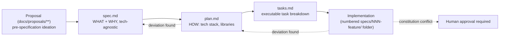

# Proposal → spec → plan → tasks → implementation lifecycle

This repository practices Spec-Driven Development (SDD) using the Specify CLI (GitHub Spec Kit).
Every feature moves through the same four-stage pipeline before code is considered legitimate:

1. **Proposal** (`docs/proposals/**`) — an unstructured PRD or research document capturing an idea
   before it has a feature number or formal spec. Proposals are explicitly **pre-specification**:
   the moment a numbered `specs/NNN-feature-name/` folder exists, the proposal is superseded.
2. **`spec.md`** — WHAT and WHY only: user stories, functional requirements, domain terms. Must stay
   technology-agnostic; this is a hard separation of concerns from `plan.md`, not a style preference.
3. **`plan.md`** — HOW: the concrete tech stack, libraries, and implementation approach for that
   spec.
4. **`tasks.md`** — the executable task breakdown implementers work through.
5. **Implementation** — the actual code change. If implementation deviates from `plan.md`/`tasks.md`,
   those artifacts must be updated to stay aligned; a deviation from the **constitution**
   specifically requires human approval and a documented rationale, not just an updated plan.

## Gotchas

- **A proposal is not a source of truth once a spec exists — treat any surviving detail in the
  proposal as history, not a live requirement.** This is why `docs/proposals/**` is deliberately
  excluded from this wiki bundle: documenting proposal content would fill retrieval with dead ideas
  that contradict whatever the current spec actually says. If you need the *history* of how an idea
  evolved before it had a spec, read the proposal folder directly; this wiki only tracks
  post-specification concepts.
- **`docs/runbooks/` was relocated out of the proposal tree precisely so this exclusion stays clean.**
  Runbooks are live operator documents, not superseded ideation, and every runbook is in scope for
  this wiki (see the runbook concept pages).
- **Constitution deviations are the one case that isn't self-service.** A plan or implementation may
  diverge from `spec.md`/`plan.md` and simply update those files — but diverging from
  `.specify/memory/constitution.md` requires explicit human approval and a documented rationale. See
  [Constitution](/openwiki/process/constitution.md).
- **Feature numbers are sequential and load-bearing for cross-references** — many CLAUDE.md gotchas
  and runbooks cite a specific feature number (e.g., "feature 029", "feature 041") as the origin of a
  rule. When tracing why a convention exists, the numbered `specs/NNN-.../` folder is usually the
  fastest path to the original rationale.
- **This wiki itself was built through this exact pipeline** — see
  `docs/proposals/openwiki-okf-adoption-plan.md` (the pre-spec research/proposal) →
  `specs/043-openwiki-okf/` (the spec, plan, and tasks that actually govern this bundle). See
  [Wiki maintenance](/openwiki/process/wiki-maintenance.md) for what that feature produced.

For the current state of any feature, start with its `specs/NNN-feature-name/` folder; `HANDOFF.md`
files (where present) capture in-flight state. Humans wanting the pre-spec history for a given idea
should read the corresponding file under `docs/proposals/`.
