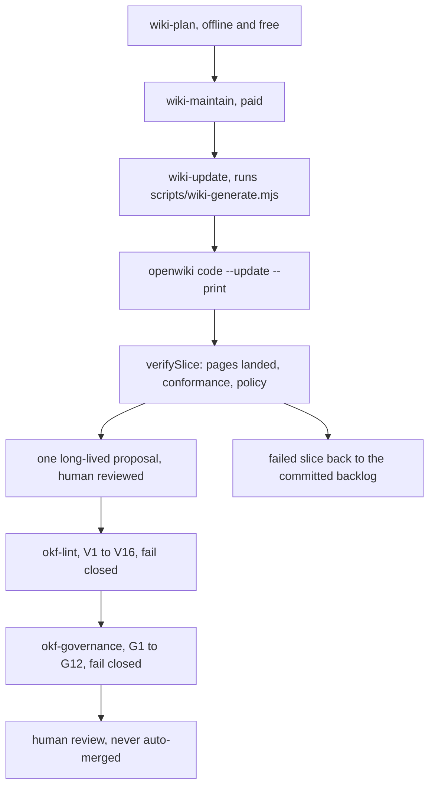

# OpenWiki bundle generation and maintenance

This wiki (feature `043-openwiki-okf`) is generated and refreshed by
`pnpm nx wiki-update infrastructure-as-code`, whose command is `node scripts/wiki-generate.mjs` — a
launcher that resolves the provider, maps its credential at the point of use, and then spawns
`openwiki code --update --print` with a required telemetry opt-out and a raised Node heap size baked
into the Nx target's environment; the bare CLI omits both and reliably OOMs on this repo.
`pnpm nx okf-lint infrastructure-as-code` then runs the repository conformance gate
(`scripts/check-openwiki-okf.mjs`) over the bundle.

Around that pair sit three more targets on the same project. `pnpm nx wiki-plan infrastructure-as-code`
is offline, keyless and free: it decomposes the documentation changes since the last recorded run into
bounded slices (at most 8 pages, one bundle area each) and prints them, so a paid run is reviewable
before it happens. `pnpm nx wiki-maintain infrastructure-as-code` is the paid execution path. `pnpm nx
okf-governance infrastructure-as-code` runs the second, newer gate
(`scripts/check-openwiki-governance.mjs`, rules G1–G12) over the regeneration policy, the protection
fingerprints and the index. The operator runbook for all of it is `docs/runbooks/wiki-maintenance.md`;
this page is the summary of what the machinery guarantees and where it is easy to be misled. The
exhaustive machinery detail — the provider and credential table, the budgets, the exit codes, the four
slice-verification causes and the Claims sidecars — belongs to the runbook, not here; for the
distilled version of that half see [OpenWiki knowledge-bundle maintenance](../runbooks/wiki-maintenance.md).

Scope and redaction rules for generation are hand-authored in `openwiki/INSTRUCTIONS.md`, which the
tool reads on every run but never rewrites. Two sibling files beside it are in the same position —
`openwiki/policy.yaml` (the per-path regeneration policy) and `openwiki/protected.yaml` (the protection
manifest) — and all three are declared `never-written`, because a process must not be able to rewrite
the file that constrains it.

The paid path runs from the free planner through the generator to slice verification and one reviewed
proposal, and the always-on gates sit after it rather than inside it.

## Gotchas

- **There is no scheduled maintenance job — freshness is event-driven, not periodic.** On a feature
  branch it comes from folding `pnpm nx wiki-update infrastructure-as-code` into the existing
  feature-completion checklist — every feature is expected to refresh the wiki (a no-op refresh is
  valid) and then pass `okf-lint` before being considered complete; see the
  [feature validation checklist](../invariants/feature-validation-checklist.md). On `main` it comes
  from `.forgejo/workflows/wiki-maintain.yml` (feature 044), which is **merge-triggered**: a push to
  `main` starts a run once `main` has been quiet for about fifteen minutes. Neither path has a
  `schedule:` trigger — no scheduled job, by design. (Feature 043's original scope also added no CI
  credential; that no longer holds: the workflow carries its own keys, `ANTHROPIC_API_WIKI_MAINTAIN`
  and `FIREWORKS_API_WIKI_MAINTAIN`.) The workflow is also **never a required context**, so a paid
  and occasionally slow documentation job cannot gate an unrelated merge.
- **Always invoke through the Nx target, never the bare `openwiki` CLI.** See
  [Nx as the task runner](../invariants/nx-task-runner.md) — the target sets
  `OPENWIKI_TELEMETRY_DISABLED=1` (the tool reports usage telemetry to a third-party host by default,
  which the dev container's egress allowlist would block but the Windows host would not) and raises
  `NODE_OPTIONS` heap size to avoid the OOM. `DO_NOT_TRACK=1` is set beside it, and one further
  variable is load-bearing rather than cosmetic: `OPENWIKI_MAX_OUTPUT_TOKENS=16384`. A per-turn output
  cap that is unset or too small truncates a turn *before* it opens a tool call, which is exactly the
  model loop's stop condition — the run then exits 0 having written nothing
  (`scripts/__tests__/wiki-maintain.guard.test.mjs` fails an unset or too-small cap, a model id the
  generator's own resolver does not match, and any id that would land on the old 4096 fallback).
  `scripts/wiki-generate.mjs` refuses to start without that cap, so a direct script invocation is not a
  way around it either, and a run message must travel in `WIKI_RUN_MESSAGE` rather than `nx --args`,
  which strips its quoting and leaves the run unscoped. For the same reason the target runs
  `--update`, never `--init`.
- **The conformance gate is fail-closed with no opt-out.** An absent, empty, or partially-written
  bundle is a violation, not a vacuous pass — there is no skip flag. This mirrors the same
  fail-closed posture other repository gates use (see
  [Secrets management](../invariants/secrets-management.md)) and was a deliberate choice: a
  gate that passes when its subject is missing is exactly the failure mode that let an entire test
  tier rot silently for a month before a different feature caught it.
- **The gate is offline and keyless by design.** Repository-relative `resource` links are resolved
  against the working tree and fail the gate when the target is missing; external links are only
  checked for well-formedness, never fetched — so the always-on guardrails job cannot fail because a
  third-party host happens to be down. `okf-governance` has the identical posture, and both run as
  steps of the same always-on `okf` CI job, each preceded by its own `--selftest` so a rule that
  silently stopped detecting its case turns the build red.
- **Drift detection is report-only, never blocking.** If a concept's cited source changed after the
  concept's stamp — the newest of `generated.at`, `verified.at` and `timestamp`
  (`scripts/openwiki-stamp.mjs`) — the gate lists it as a warning but does not fail the build — regenerating
  a concept is a manual, model-cost step, so a blocking drift check would gate every unrelated
  documentation edit on a paid run. Two consequences worth knowing: drift is not an input to the
  planner, so nothing re-plans a concept once the run-record marker has passed its source change; and
  a concept that cites a source but carries no usable stamp is counted and printed rather than
  silently dropped, because drift coverage that shrinks quietly still prints as conformant.
- **`docs/proposals/**` is deliberately excluded from the bundle** — see
  [Spec-driven development](./spec-driven-development.md) for why, and where the one
  process concept documenting that lifecycle lives instead.
- **This page and its siblings are themselves generated content** — do not hand-edit generated
  concept pages outside an OpenWiki run unless explicitly asked; prefer updating the source
  documentation or code and letting the next `wiki-update` regenerate the affected pages. Hand-editing
  a derived summary is how a concept starts becoming a drifting copy of its source.
- **A page openwiki has covered is byte-certified, and hand-editing it bricks every later run.** Every
  page with an entry in `openwiki/.page-manifest.json` must still hash to the `pageVersion` its
  verified Claims sidecar certifies — conformance rule V16, defined once in
  `scripts/openwiki-claims.mjs` and enforced by openwiki itself before it will start. Measured on
  2026-09-29: four hand-corrected pages on one proposal stopped maintenance until a follow-up
  recovered it. To correct a covered page by hand, **uncover** it in the same commit — drop its
  manifest entry, its sidecar and its front-matter `verified:` event. The sidecar's own lifecycle is
  the runbook's subject, not this page's.
- **The pinned generator's managed block must already be committed.** OpenWiki rewrites its
  `<!-- OPENWIKI:START -->…<!-- OPENWIKI:END -->` block in `AGENTS.md` and `CLAUDE.md` on **every**
  run, and `openwiki/policy.yaml` lets only an `actor: agent` write `AGENTS.md`. If the committed block
  is not byte-identical to what the pinned generator writes, every slice fails verification
  ("AGENTS.md — the run may not write here"), is retried, and returns to the backlog with the marker
  never advancing. A guard test rebuilds the block from the installed generator's own source and
  compares, so a version bump that changes the text fails offline instead of failing every paid run in
  CI.
- **A durable learning goes to the canonical home of its subject.** Find the concept covering the
  subject, then read its front matter: **carrying a `resource`** means it is a derived summary, and the
  learning belongs in the cited source (runbook, decision record, architecture document); **no
  `resource`** means it is authoritative — listed under `authoritative:` in `openwiki/protected.yaml` —
  and the learning belongs **in the concept itself**. `openwiki/INSTRUCTIONS.md` §7 is the full rule,
  and `okf-governance` enforces the classification in both directions: a concept that is neither a
  resolving derived summary nor a listed authoritative one fails the gate. Nothing here changes
  `CLAUDE.md`, which is an index into the bundle and is gated against re-growth.
- **The generator's own account of a run is never trusted.** `wiki-maintain` verifies each slice by the
  pages that actually landed in the working tree, by bundle conformance and by whether policy permitted
  every written path — never by the generator's exit status, which was measured at exit 0 after twelve
  minutes of paid work that wrote a single `index.md`. Its own exit codes follow from that: `1` is a
  slice that failed verification, `2` is bad usage or a missing credential, and **`3` means the run
  stopped at its page or wall-clock budget with work carried forward — it is not a failure.** The
  numbers behind those budgets live as constants in `scripts/wiki-maintain.mjs`, not in prose: change
  one and a guard test fails offline because it derives the CI job's timeout from the same constants.
- **Neither budget is a monetary bound.** OpenWiki reports no token or cost figure of its own; a run's
  usage is captured by a tap and recorded, but nothing enforces a spend ceiling, and the wall-clock
  budget exists to bound occupancy of the shared CI runner. Do not describe these as cost controls.
- **Mermaid diagrams degrade silently without their parser.** From OpenWiki 0.5.0 diagrams are embedded
  by default and every fence is validated after a run; the real `mermaid` parser and `jsdom` are
  optional peer dependencies, and without them a diagram that fails the strict check is rewritten in
  place into a plain `text` fence while the run still exits 0 and every gate still passes. Both are
  installed beside the generator in `.devcontainer/toolchain.Dockerfile` and in
  `.forgejo/workflows/wiki-maintain.yml`, at the same pinned generator version (`openwiki@0.7.1`), and
  guard tests in `scripts/__tests__/wiki-maintain.guard.test.mjs` assert that both the version and the
  parser list match — an environment that is missing the parser, or running a different generator,
  disagrees about what a valid diagram is, and the one that writes the bundle wins. The downgrade is
  not invisible after the fact: the rewritten fence keeps an `openwiki: mermaid parse failed` comment
  naming the parser error, so a diagram that never rendered can be found and repaired by hand.
- **Rejected content is fixed in the brief, never allowlisted.** If a page trips the conformance gate,
  the governance gate or a leak scan, the surface that changes is `openwiki/INSTRUCTIONS.md`, followed
  by a regeneration. The gates deliberately have no skip flag and no allowlist, because an allowlisted
  leak stays leaked. Legitimately changing a fingerprinted passage means updating the text **and** its
  fingerprint in the same change: `node scripts/check-openwiki-governance.mjs --fingerprint
  openwiki/<area>/<page>.md "<heading>"`.

Full CLI contract and the conformance gate's rule set: `specs/043-openwiki-okf/contracts/` and
`specs/043-openwiki-okf/data-model.md` (rules V1–V15, the last two added for item #491 after `resource`
verification alone proved insufficient; V16 followed for item #611 to hold a covered page's bytes to
its verified Claims sidecar); the maintenance machinery's contract is
`specs/044-openwiki-automation-migration/contracts/`. Day-to-day invocation notes live in
`docs/runbooks/devcontainer.md`, the operator runbook is
`docs/runbooks/wiki-maintenance.md`, and the corrections note is in `CLAUDE.md`'s OpenWiki section.
