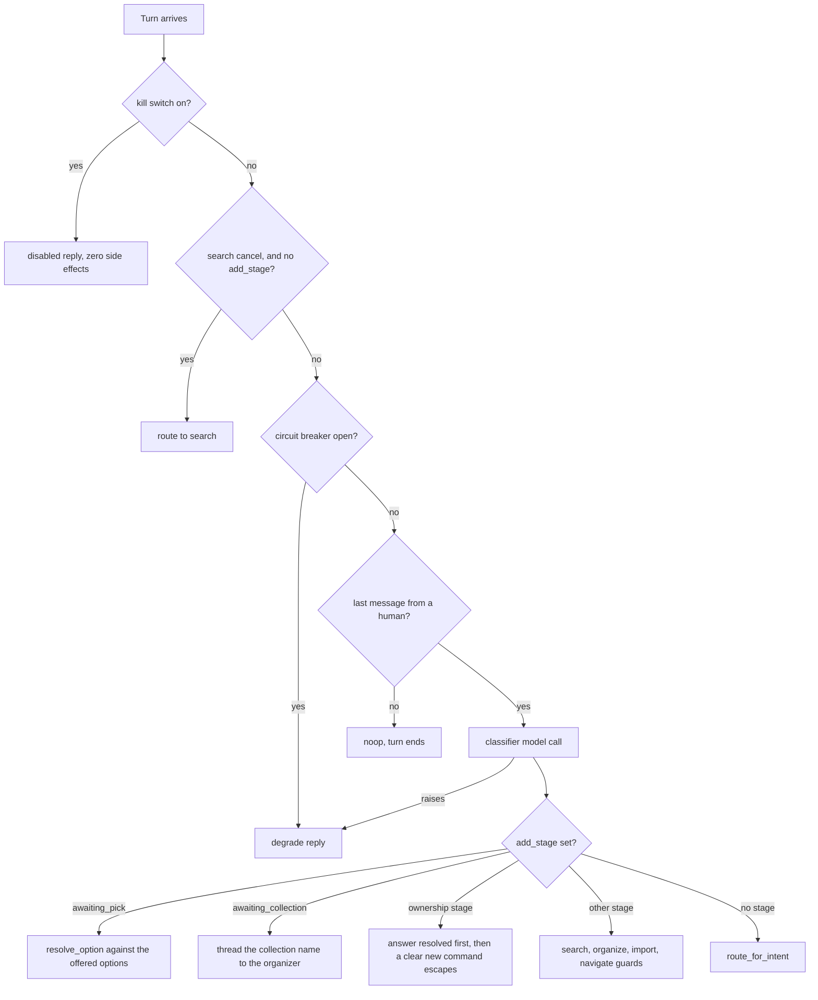

# Agent Gateway (LangGraph)

`agents/movie-assistant` is a LangGraph supervisor graph (compiled entrypoint `src/graph.py:graph`,
also named in `langgraph.json`) served over AG-UI by a small FastAPI app (`src/gateway.py`). It is
reachable only from the [BFF](./bff.md)'s `bff-api/agent/*` routes — the gateway itself performs no
end-user authentication, so the BFF is the security boundary in front of it. It owns no movie data;
it orchestrates calls to the three scoped MCP servers on the user's behalf. The LLM is deliberately
kept narrow: it only classifies intent, extracts entities/plans, and phrases replies — all MCP tool
selection and argument construction is code-orchestrated, never left to the model.

The [three scoped MCP servers](./mcp-servers.md) are reached over the MCP streamable-HTTP transport:
**movie-mcp** (fronts [mc-service](./mc-service.md) for domain reads/writes; every call needs a
per-call, per-user downscoped token), **web-api-mcp** (outbound-only TMDB enrichment; carries a
per-run API key out-of-band via a header set from a context variable, never an LLM-visible
argument), and **spreadsheet-mcp** (token-free file processing; files referenced by an opaque
transient-store handle). Their identity/network scoping is not repeated here — see that page and
[Auth chain](../invariants/auth-chain.md).

Both `MOVIE_MCP_URL` and `WEB_API_MCP_URL` must be set for the gateway to compile the real,
tool-backed graph (`production_nodes_enabled`); `SPREADSHEET_MCP_URL` is optional and import/export
degrade gracefully without it. Every tool call funnels through one choke point
(`tools/mcp_tools.invoke_tool`): per-agent allowlist (deny-by-default) → rate limiting →
identity/token acquisition → the MCP call (retried with backoff on transient failures, then
dead-lettered) → output guardrail validation.

## Request path

`build_app(graph)` is the seam — given any compiled graph it returns the AG-UI app, which is how the
transport spike and the real run share one code path. `create_app()` is the uvicorn factory: it configures
the root logger (`AGENT_LOG_LEVEL`, default INFO — never lower `httpx`/`uvicorn.access` to DEBUG in
production, that would log `Authorization` headers), arms the stack-dump signal, configures OTel
metrics/tracing (no-op unless their env vars are set), and mounts
`build_runtime_graph(os.environ)` at `/agent/movie-assistant` via
`ag_ui_langgraph.add_langgraph_fastapi_endpoint` + `copilotkit.LangGraphAGUIAgent`. The BFF reaches
it on the private network; `AGENT_GATEWAY_URL` is the BFF's only pointer to it.

Four ASGI middlewares capture the BFF-supplied per-request values into request-local ContextVars:
`X-Agent-Config` (per-run provider/credentials), `X-Import-File` (`{handle, filename}`),
`X-UI-Snapshot` (sanitized readable UI state), and `Authorization: Bearer` (the run-scoped subject
token). `IdentityAwareAGUIAgent.prepare_stream` — which runs in the request task, where the
ContextVars *are* visible — then bridges them into `config["configurable"]` before the graph stream
is built. That bridge is not decorative: a ContextVar set at the ASGI boundary does not reliably
propagate into LangGraph's per-node executor tasks. Nothing bridged this way is ever checkpointed —
`state.forbid_token_fields` rejects a state key whose name looks like a credential
([Auth chain](../invariants/auth-chain.md)).

`IdentityAwareAGUIAgent.run` is the other seam: any exception escaping the graph is turned into a
terminal `RunErrorEvent` carrying provider facts, rather than re-raised. This is the one place every
node's failure passes through, and it is what keeps a provider failure from aborting a chunked
response mid-stream to a client that is waiting for a terminal event.

## Graph, intents and multi-turn stages

The supervisor classifies intent (`add`, `enrich`, `organize`, `navigate`, `query`, `search`,
`import`, `export`, `out_of_domain`) and routes; unknown/ambiguous labels go to a `clarify` responder
rather than being guessed. Routing is pure code after classification
(`route_for_intent`, `route_after_curator`, `route_after_organizer`, `route_after_approval`), and
every write proposal funnels into the same HITL `approval_gate` — the organizer's and the importer's
alike.

*The supervisor's per-turn decision order: the escape hatch and the breaker run BEFORE the classifier,
the multi-turn stage overrides run after it.*

Multi-turn flows park a `*_stage` value on graph state so follow-up turns are guarded back into the
owning node — `add_stage`, `search_stage`, `organize_stage`, `import_stage`, `navigate_stage`, each
with a matching `_*_STATE_RESET` so a finished flow cannot leak into a later one. The add flow runs a
chain that collects every answer before building a single Proposal —
`awaiting_childrens` → `awaiting_ownership` → `awaiting_media` → `awaiting_ripped` →
`awaiting_rip_quality` → proposal. The children's question sits first deliberately: the ownership
questions are conditional on owning the film, so any later placement would skip the children's answer
for every not-owned add. The member approves one complete change, not a series of edits. Media-format
and rip-quality options are driven by a `get_movie_metadata` read from movie-mcp (which publishes
mc-service's `GET /api/v1/movie-metadata`), never hardcoded in the agent.

The generative-UI surface has three components: `render_selection` (collection/scope/ownership
Yes-No, search scope/cancel, and children's Yes/No), `render_disambiguation` (curator's movie
candidates), and `render_multi_select` (media-format and rip-quality toggle lists in the ownership
chain). The exact tool/testID mapping is in the runbook, not repeated here.

The runtime nodes are wrapped by two shared cross-cutting duties before they reach the graph:
reporting an import that stopped partway (once, on whichever turn comes next), and converting a
`ToolReadError` into a truthful reply instead of an escaped exception.

## Models

Model provider is environment-scoped (`MODEL_PROVIDER` → `ollama` for dev/test, `anthropic` for the
golden gate and production) with per-node overrides and a per-run bring-your-own-credentials overlay;
`select_model_config` in `src/models.py` is a pure `env -> ModelSpec` function. The pins, the
provider-scoped pin names, the code-default model ids and the CI-vs-production supervisor-pin
distinction are owned by [Model-provider scoping](../invariants/model-provider-scoping.md) — one
agent-specific consequence: without a per-run Anthropic key the escalation tier degrades to the base
specialist rather than making an unauthenticated Claude call.

## Gotchas

- **DNS-rebinding protection breaks containerized MCP calls.** The MCP SDK 421-rejects a request
  whose `Host` header is a Docker service name (its default DNS-rebinding protection). All three MCP
  servers set `TransportSecuritySettings(enable_dns_rebinding_protection=False)` — on MCP SDK 2.x
  that is a `streamable_http_app()` parameter, so a bare call silently re-enables the protection.
  Without it, the containerized agent stack never works end to end.
- **Missing either MCP URL degrades silently, not loudly.** If `MOVIE_MCP_URL` or `WEB_API_MCP_URL`
  is unset, the gateway compiles a tool-free graph instead of failing — there is no error, the
  assistant just can't do anything domain-related. Also rebuild the gateway image after any source
  change; a stale image running old code looks identical to a correctly-degraded tool-free graph.
- **OTel span exception recording can leak a credential.** `start_as_current_span(...)` defaults to
  recording the exception message and setting error status from it, which embeds `str(exc)` —
  including the TMDB API key riding along in the URL as a query param — into the exported trace on
  any web-api-mcp error. Any span wrapping credential-bearing I/O must explicitly disable exception
  recording ([the full gotcha](../gotchas/otel-span-exception-leak.md)). The same reasoning shapes
  `provider_errors.log_provider_error`: status, provider error type, frame and exception class only,
  never `str(exc)`, because a provider echoes request content in some error messages.
- **Never trust a streamed "done" for agent writes in tests.** The completion message can arrive
  before the underlying mc-service write actually lands (the summary is generated ahead of the
  write). An agent-write E2E test must poll the resource, or teardown can race the still-in-flight
  write.
- **A failed read is NEVER an empty one.** Every own-data read closure goes through
  `mcp_tools.read_or_raise`, which raises `ToolReadError` rather than collapsing a failure into an
  empty list, a zero count, or a half-fetched page — each of those is a claim about the member's
  library ("you have no collections") that the system is not entitled to make. The runtime wrapper
  `_answer_read_failures` turns it into a truthful reply and deliberately does NOT reset any stage
  state, so a retry resumes the in-progress flow. Note the reply text: `"Sorry — I couldn't read that
  just now."` is intentionally *not* the generic degrade sentence, so an operator reading a report
  can tell a failed read from a failed model call.
- **Adding a tool to `_READ_TOOLS` widens four agents at once.** That set is not a classification
  used anywhere else — it is literally the grant handed to curator, navigator, query and search.
  `_METADATA_TOOLS` (`get_movie_metadata`) is kept separate for exactly this reason: only the
  organizer builds the ownership multi-selects, so only the organizer gets it. The supervisor's
  allowlist is empty by design — it routes and calls no domain tool.
- **The HITL apply is exempt from the per-agent rate limiter, on purpose.** `approval_gate`'s writes
  are code-orchestrated over a finite set the member already approved at the preview, so throttling
  them silently failed the tail of a large import (200 rows → 30 applied, 170 "could not be
  imported"). The approval plus the bounded item list is the real safety gate.
- **A wedged gateway cannot tell you what it is doing — unless you ask it.** Measured three times:
  the process spinning at 100% CPU on one core (memory flat, `/health` timing out, log 40 minutes
  stale) while Docker still reported `running`. 100% CPU is the discriminator — a deadlock or a
  blocked await sits near 0% — and because the gateway is one single-threaded uvicorn process, a spin
  starves every other coroutine, which is why `/health` stops answering while the container stays
  alive. `docker kill -s USR1 movie-assistant-gateway` now dumps every thread's Python stack to the
  log (`faulthandler` writes from the C signal handler, so it works on a busy loop where a
  Python-level handler would be starved; frames only, no locals or environment, so it is safe to
  leave armed). One real instance was `drain_audit_tasks` refilling its own loop — the drain must
  await a **snapshot** of the pending set, never loop on `while _PENDING_AUDITS`, because that set is
  module-level and shared by every concurrent turn.
- **An escaping exception must become a terminal RUN_ERROR, not a mid-chunk abort.** `ag_ui_langgraph`
  re-raises hard exceptions "for the existing run-level error handling", which does not exist: the
  response's 200 and headers are already flushed, so the connection is aborted mid-body with no
  terminal AG-UI event and a client waiting for one hangs for its full timeout. Measured: HTTP 200,
  four SSE lines, then `RemoteProtocolError: peer closed connection without sending complete message
  body`. `IdentityAwareAGUIAgent.run` is the right seam because it is the one place every node's
  failure passes through — wrapping nodes individually means the next node added is the one that gets
  forgotten. Catch `Exception`, never `BaseException`: `CancelledError` and `GeneratorExit` inherit
  from the latter, and a disconnecting client must unwind silently.
- **A provider refusal must be distinguishable from a product outcome.** An out-of-credit Anthropic
  account answers HTTP 400 `invalid_request_error` — not 402, not 429 — and the classifier's
  `except` correctly degraded it to "I couldn't complete that", leaving a run that reported 200,
  `RUN_FINISHED` and zero ERROR lines, so every observable pointed at the app. `log_provider_error`
  now writes one ERROR record tagged `frame=classifier` or `frame=stream`; the remediation mapping
  (400 is an operator action, 429/529 is a retry) lives in the e2e turn-tally script, not here.
- **Switching model provider mid-run must drop stale per-node model pins.** Otherwise a node can end
  up requesting a model id that doesn't exist under the new provider and fail with a 404. Only the
  BARE pin names are dropped — a provider-scoped name is inert on the wrong provider by construction.
- **Adding a multi-turn stage requires updating BOTH `graph.py` and `curator.py`.** The stage guard
  in `graph.py` keeps the turn in the right flow, but `curator.py` must also pass through for every
  ownership stage — if it doesn't, a bare "yes" or "DVD" answer runs entity extraction, finds no
  movie, clears `candidate`, and drops the member back to "What movie would you like me to look
  up?" mid-flow. Feature 040 added the passthrough for `awaiting_ownership` only; feature 047 had
  to widen it for three more stages; feature 059 added `awaiting_childrens` at the front, where
  missing the passthrough resets the member on the very first answer of every add. Missing the
  curator half is silent until that specific turn.
- **`rated` is no longer hardcoded `"NR"` — it is the film's real US certification or `null`.**
  Before 059 US1, `to_movie_payload` wrote the literal string `"NR"` for every assistant-added
  movie regardless of its actual rating. `web-api-mcp.get_movie_details` now appends
  `release_dates` to the TMDB call it already makes and returns the first non-empty US
  certification, validated against `{G, PG, PG-13, R, NC-17, NR, Unrated}`. The value comes
  through as `EnrichedMovieCandidate.rated` (defaults `None`). There is **no** rename from
  `PG-13` to `PG13`: `UsaRating` in mc-service carries `#[serde(rename = "PG-13")]`, TMDB
  publishes the hyphenated form, and renaming would send a value mc-service rejects. `None`
  (unknown certification) reaches the payload as `"rated": null` — a present key with a null
  value. **Do not omit the key or substitute `"NR"`: `CreateMovieDto` types `rated` as
  `Option<T>` without `serde(default)`, so a missing key 422s the add.**
- **`[]` and `None` are different answers in the multi-select resolver.** An explicit "none" means
  *no formats* (a valid answer the member supplied); an unrelated reply means *not answered yet*
  (re-ask). Collapsing them records an ownership the member never gave. Two further properties the
  resolver must hold: every returned value is one of the offered options (closure — the options come
  from mc-service, so returning anything else writes a guessed domain value), and the value stored is
  the domain's canonical casing whatever the member typed. An OFFERED value also beats the "none"
  sentinel, so a domain option that happens to be spelled "None" still resolves to itself.
- **Whitespace in a resolver key is a resolution bug, not cosmetic.** The import article-loop fix
  (feature 047) found that `_article_prompt` stored a raw cell value (including its trailing space)
  as the resolution key, while `resolve_option` matched with `title in low` — a substring test that
  a longer label can never pass. The rule that came out of it: normalise in the shared resolver
  (`resolve_option`), not the individual caller, AND trim at the source when a value is used as a
  dictionary key — a per-caller fix would have left the other three call sites (search, organize,
  navigate) with the same class of failure. The multi-select resolver inherits the same
  normalisation rather than reimplementing it.
- **Media-format values must come from mc-service, never from a hardcoded agent-side list.**
  `mc-service` publishes `GET /api/v1/movie-metadata`; `movie-mcp` wraps it as
  `get_movie_metadata`; the organizer derives its toggle list from that response.
  `MediaFormat::all()` is an exhaustive `match` — adding a new variant fails to compile until it is
  published, so the list cannot silently rot. A hardcoded `const` array in the agent compiles
  happily and drifts; a per-request process-wide cache is safe only because this response contains
  no user data. If the metadata read fails the assistant SKIPS the format question rather than
  offering a fallback list, which would put domain values back in the agent while looking like
  resilience.
- **An ANSWER to a pending question is never a new command.** The escape hatch "a clear new command
  leaves the flow" is only safe if the guard resolves the reply against the pending question
  **BEFORE** consulting the classified intent. Without that ordering a prose-like answer
  (`"Selected: none"`) classifies as `query`/`search` and the in-progress flow is silently
  discarded. **This bug is provider-dependent** — it passes on local Ollama and fails on Anthropic
  in CI; a green local run proves nothing. The import guard already has the safe shape; **`navigate_stage`
  does NOT** — check it before extending the navigate flow.
- **The generic degrade reply (`"Sorry — I couldn't complete that just now."`) has exactly two
  sources; the circuit breaker has exactly one input.** `_degrade_node` is reachable only through
  the supervisor's model call (classifier raised, or breaker already open). The other three degrade
  sites are specialist-model failures. `ErrorRateBreaker` is fed by exactly ONE signal:
  `circuit.record(...)` in the supervisor — a tool failure, MCP outage, or rate-limit breach records
  nothing. **An open breaker therefore always means the supervisor's model call is failing.** The
  navigator can neither emit this message nor raise; a generic reply on a navigate turn is never
  the navigator's.
- **A control gated on a stage is unreachable from the TERMINAL step of the flow it exits (050 /
  item #149).** The mirror image of the guard rule above, and it shipped to a member. 047 gave the
  web search card a Cancel button that posts the canonical `exit search`; the search node honoured
  that control under `if stage and …`. But the card is the flow's *last* step, and `_web_card`
  returns `_SEARCH_RESET` **before** rendering it — so by the time the button is on screen there is
  no stage, the guard is false by construction, and the value fell through to the fresh-search branch
  as a movie **title**. The member who pressed Cancel was answered with *"I couldn't find "exit
  search" in your "Wish List" collection. Want to look elsewhere?"* — plus a real `list_movies`
  read, a `render_selection` that re-offered the search, and `search_stage` left at
  `awaiting_pick`. It did not fail neutrally: it put the member back INSIDE the flow they were
  leaving, capturing their next message too.
  The trap is that "universal control" is ambiguous — comments asserted the node "already treats it
  as a universal control", which was true across *stages* and false at *no stage*. **Ask
  specifically: is this control offered anywhere the flow has already been cleared?** If yes, it
  cannot be stage-gated.
  Two rules fell out of the fix:
  - **A cancel is routed BEFORE `classifier(messages)` in `graph.py`**, not after — mirroring
    `is_cancel_import`. Not only because a model might classify it away (provider-dependent, exactly
    as the ownership-guard bug was), but because a classifier *exception* returns `degraded` before
    any routing runs at all: a provider outage would answer "get me out of here" with "Sorry — I
    couldn't complete that just now." An escape hatch that needs a healthy LLM is not an escape hatch.
  - **A stage-free route matches EXACTLY** (whole message, trimmed, case-folded) — never a
    substring, which would hijack a real title like *"How to Exit Search a Building"*, and never
    the bare synonyms (`cancel`, `never mind`), which belong just as much to the import and organize
    flows. Those stay scoped to a live stage, where the stage itself establishes intent.
- **A node-level test passing does NOT mean the graph-level path works.** Calling a node function
  directly bypasses every supervisor guard and every stage-continuation check. **If a change
  touches routing, a guard, or a `*_stage`, drive `build_graph(...)` — not the node.**
- **Writing a `build_runtime_graph(..., force=True)` test? Stub EVERY model seam, and assert the
  test reached its subject.** `RuntimeNodeConfig` carries three separate extraction seams:
  `extract` (curator/search), `plan` (organizer), and `query_extract` (query). Stubbing only
  `extract` leaves the other two on their real model-backed defaults, which raise and degrade the
  turn before any tool call — so the test passes while exercising nothing. Also set
  `spreadsheet_mcp_url` — without it the import/export nodes answer "isn't available right now"
  and never read anything.
- **Agent E2E flows must navigate IN-APP — never deep-load a collection URL before driving the dock.** A fresh deep-load of a non-home route resets the CopilotKit agent (research R15). Start from the home screen.
- **Watch the SKIP COUNT, not just the pass count.** The agent integration tier silently skips
  whatever MCP server is down, and a skipped test reads as a pass. Run with
  `MCM_REQUIRE_LIVE_STACK=1` to escalate a non-allowlisted skip to a failure naming the unreachable
  server.

See [Auth chain](../invariants/auth-chain.md) for how the gateway's tool-call tokens are
minted and scoped, and [../../docs/runbooks/agent-layer.md](../../docs/runbooks/agent-layer.md) for
the full node/intent map, the conversation-stage catalogue, the containerized E2E procedure and its
durable gotchas, the Control Tower integration, and the `MCM_REQUIRE_LIVE_STACK` / golden-gate test
tiers. `agents/movie-assistant/README.md` holds the per-file layout and the Nx command list.
