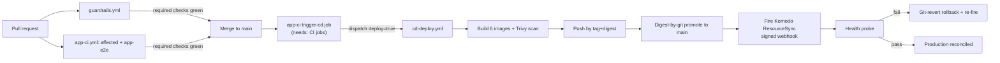

# CI/CD pipeline (Forgejo Actions)

CI/CD is config-as-code under `.forgejo/workflows/`, running on a self-hosted Forgejo Actions runner —
not `.github/workflows/`, which is a push-mirror that runs no Actions. Three behavior-named workflows
carry distinct responsibilities:

- **`guardrails.yml`** — cheap, keyless gates that run on every push/PR: resource-naming, inline-secret
  and whole-tree secret scanning, Komodo-sync topology scrubbing, port-collision checking, the OKF
  conformance gate over this wiki bundle itself, and keyless agent quality gates (golden-pair replay,
  no model key).
- **`app-ci.yml`** — Nx-affected lint/build/unit for changed projects, plus (path-gated) the heavy
  `app-e2e` job: provisioned auth+mcm stacks, containerized [Agent Gateway](/openwiki/projects/agent-gateway.md)
  and [MCP servers](/openwiki/projects/mcp-servers.md), full web Playwright E2E, a release APK build,
  and Maestro mobile agent flows.
- **`cd-deploy.yml`** — build six images via their Nx targets → Trivy scan (blocks on Critical) → push
  by tag+digest → **digest-by-git promotion** (write the immutable digest into tracked, host-free
  `.env.deploy` files, commit to `main`) → fire the signed Komodo ResourceSync webhook → post-deploy
  health probe → git-revert rollback on failure.

## Gotchas

- **A version bump that misses a second pin is a silent no-op, not a partial fix.** Renovate raised
  `package.json`'s `nx` to a patched release and left `nx.json`'s `installation.version` behind, so
  the **Nx wrapper** — which is what `pnpm nx` and all of CI actually execute — kept running the
  vulnerable version. The PR looked like a security update and delivered nothing. Any tool with a
  bootstrap/wrapper pin held separately from its package pin has this shape; move every pin in one
  change. `scripts/check-toolchain-consistency.mjs` fails the `naming` job on the mismatch, and
  `renovate.json`'s `customManagers` entry now makes Renovate propose both files together so the
  half-bump is never offered.
- **Pin the version of every tool CI downloads at run time.** `npx --yes renovate` (always-latest)
  meant a Renovate major could land in CI unannounced — and Renovate v41 renamed `customManagers`'
  `fileMatch` to `managerFilePatterns`, a change that does not fail loudly: a config with the stale
  key silently manages *nothing*. That is the dangerous shape, because the repo keeps behaving as if
  the automation is running. Now pinned to a major (`renovate@44`), matching how the scanners are
  treated (`sast-scan.mjs` pins `SEMGREP_PIN`). Raising a major is deliberate: read the breaking
  changes, then re-run `npx --yes --package renovate@<new> -- renovate-config-validator` before
  merging.
- **A major-only pin says nothing about the RUNTIME, and that gap has fired.** The pin above reasons
  entirely about *config semantics* — what a new major might change about how `renovate.json` is
  read. A minor or patch **inside** the pinned major can still raise `engines`, and 44.14.12 moved
  `engines.node` to `^24.11.0` while staying comfortably inside `renovate@44`. The job had no
  `setup-node` — the only workflow here without one — so it inherited the runner container's
  `v22.23.2`, logged `npm warn EBADENGINE` and then `ERROR: Unsupported node environment`, and exited
  1 on **every** run for four days before anyone read the nightly red. Pin the runtime explicitly
  next to the tool, and treat a major bump as **two** reviews: the config changes, and the new
  major's `engines` against that pin.
- **A comment asserting a schedule relationship is not a check, and this one was false for four
  weeks.** `renovate.yml`'s nightly cron carried "matches the renovate.json schedule window". It did
  not: `0 3 * * *` is 03:00 UTC, while the config permitted branch creation only during `* 3 * * 5`
  in `America/New_York` — 07:00–07:59 UTC on Friday. 03:00 UTC is 23:00 **Thursday** in New York, so
  the sets never intersected and the bot was never awake inside its own window. **It looked healthy
  the whole time**, because `vulnerabilityAlerts` inherits an empty schedule from its preset, so
  security PRs bypassed the window and kept landing while every routine update silently deferred —
  ten groups had accumulated under "Awaiting Schedule" by the time it was found. Two consequences
  worth carrying: cron here is **UTC-only and does not observe DST**, so a one-hour local window
  catches only half the year (widen it, as `infra-image-scan.yml` already does); and the durable fix
  is the arithmetic as a test — `scripts/__tests__/renovate-workflow.guard.test.mjs` converts both
  files to UTC and fails if they stop intersecting under either offset.
- **Renovate DOES manage `pnpm-workspace.yaml`, and half-bumps its security overrides by
  construction.** A widely-repeated claim in this repo's own backlog said it extracts *zero*
  dependencies from that file. Measured on run 1704 (2026-08-13): the built-in **npm** manager
  extracts **12**, including every keyed override floor, with pending updates for five of them. What
  it cannot do is the half that matters — it parses `fast-uri@<3.1.5` as an opaque **depName** and
  `>=3.1.5 <4` as the version, so it rewrites the value and leaves the vulnerable-range key stale,
  and Renovate has no mechanism for rewriting a depName. Adding a custom manager does **not** fix
  this: the file is already managed, so a second manager double-manages it. The guard is the answer
  instead — `scripts/check-override-consistency.mjs` fails a mismatched pair by name on the pull
  request, so a half-remediation cannot merge even though it still looks correct.
- **`app-ci` runs on every PR with no path filter, by design — but the heavy `app-e2e` job is still
  path-gated.** A dorny/paths-filter `changes` job scopes `app-e2e` to paths that affect app runtime
  behavior; a docs/config-only PR still gets an `app-ci` status (satisfying branch protection) but
  skips the ~23-minute E2E suite. This exists because branch protection requires the `app-ci*` glob,
  and a path-filtered trigger left non-app PRs with *no* status at all — an unmergeable PR requiring
  an admin override, hit repeatedly before the filter was removed from the PR trigger.
- **A LOCKFILE PR is no longer in that skipped class, and the two filters used to disagree about it.**
  `pnpm-lock.yaml` sat in the `push:` paths filter — *"a lockfile bump changes transitive deps"* — and
  was absent from the `changes` job's `app` filter that gates `app-e2e` on a **pull request**. So the
  risk was acknowledged on merge and denied on review: `app-e2e` reported `skipped` on both PR #185
  and PR #187, and PR #185's only evidence that its two raised floors did not break the app was a
  *local* run someone remembered to do. That is the one tier that can catch a bad floor — these are
  JS-toolchain transitives, so breakage surfaces at **build** time and `nx test` passes straight over
  it. Both pnpm files are now in both filters (feature 058, item #186), and the accepted cost is the
  web+integration half only: `mobile` deliberately does not select them, so a dependency PR does not
  pay for the ~35-minute emulator half. `Cargo.lock` still differs on purpose — `mc-service-checks`
  compiles the crate on every PR, so a bad Cargo floor already reds a tier that runs.
- **A filter entry that is in `mobile` but not in `app` can never fire.** `mobile` gates only *steps
  inside* `app-e2e`, and `app-e2e` itself runs only when `app` matched — so a path in the subset but
  not the superset sets `mobile=true`, `app=false`, and the whole job skips. `mobile`'s own comment
  claimed it was "a STRICT SUBSET of `app`" while `scripts/ci-mobile-agent-flows.sh` and
  `scripts/maestro-run.sh` broke it, meaning a change to the Maestro runner ran **no mobile flow at
  all** while reading as covered. Found by writing the invariant as a test rather than trusting the
  comment asserting it; both are now in `app` too.
- **Scheduled lockfile maintenance needs its own window, and the obvious way to enable it is silently
  inert.** `lockFileMaintenance`'s option default already carries `schedule: ["before 4am on monday"]`,
  and that child value beats the inherited top-level `schedule` — verified against `renovate@44.29.3`'s
  own config resolver. Monday 04:00–08:00 UTC (EDT) / 05:00–09:00 (EST) intersects neither
  `0 3 * * *` nor `0 7 * * 5` under either offset, so enabling it without repeating the window yields
  a setting that is **on and can never fire**, reporting nothing — the same never-intersecting-schedules
  fault that deferred every routine update for four weeks. The repeated `schedule` key is therefore
  load-bearing, not redundant, and `renovate-workflow.guard.test.mjs` fails if it is removed.
- **`cd-deploy` is `workflow_dispatch`-only — it has no `push:` trigger and no polling gate.**
  Production deploys are event-driven: `app-ci`'s `trigger-cd` job `needs:` its own CI jobs and
  dispatches `cd-deploy(deploy=true)` once green on `main`. This replaced an earlier design where a
  separate `ci-gate` job polled commit statuses with an 80-minute wall clock and could time out while
  `app-e2e` sat queued on the single capacity-1 runner — ordering is now a dependency edge, not a poll.
- **A skipped required check settles to `success`; a cancelled run reports its contexts as `failure`
  even though nothing was actually broken.** Treating a cancelled/superseded run as a real failure (or
  the reverse) has caused real merge confusion; `node scripts/ci-status.mjs` is the self-serve tool
  that derives the correct interpretation — reach for it instead of reading raw check statuses.
- **Agent and MCP images are rebuilt from the checkout on every CI run, never reused from cache** — a
  cached stale image previously let an `agents/**` or `mcp-servers/**` change go untested against its
  own code.
- **The digest is promoted by committing it to git, not by posting it to Komodo.** Komodo's webhook is
  a git-style redeploy that re-clones the branch and cannot consume a posted digest, and Komodo UI
  Stack env vars aren't reliably injected on webhook deploys — so CI writes the bare digest into
  tracked `.env.deploy` files and pushes to protected `main` using a whitelisted-user token
  (`secrets.CD_PUSH_TOKEN`); the default `GITHUB_TOKEN`-equivalent is not push-whitelisted and is
  declined by the pre-receive hook.
- **There is no rollback endpoint — rollback is git-revert the promotion commit, then re-fire the
  webhook.** A failed post-deploy health probe drives this automatically.
- **The integration test tier is what actually gates CI, not just unit tests** — see
  [Testing tiers](/openwiki/invariants/testing-tiers.md) for why that gate was added and what it
  closed. CI's own gate scripts (naming, secrets, topology, port-collision, and this OKF conformance
  gate itself) have their own unit tests under `scripts/__tests__/`, run by the `naming` job — a gate
  script that regresses silently is the same failure class this pipeline exists to prevent elsewhere.

See [Infrastructure-as-code stacks](/openwiki/projects/infrastructure-stacks.md) for what `cd-deploy`
actually deploys to and the dependency order Komodo reconciles in, and CLAUDE.md's "Commands" →
"CI/CD lives on the homelab forge" section plus
[CI self-serve diagnostics](/openwiki/runbooks/ci-diagnostics.md) for the full operator loop
(driving a PR to green, merging, and verifying a deploy).
