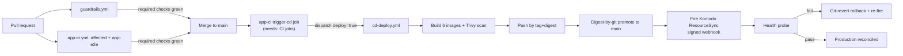

# CI/CD pipeline (Forgejo Actions)

CI/CD is config-as-code under `.forgejo/workflows/`, running on a self-hosted Forgejo Actions runner —
not `.github/workflows/`, which is a push-mirror that runs no Actions. Three behavior-named workflows
carry distinct responsibilities:

- **`guardrails.yml`** — cheap, keyless gates that run on every push/PR: resource-naming, inline-secret
  and whole-tree secret scanning, Komodo-sync topology scrubbing, port-collision checking, the OKF
  conformance gate over this wiki bundle itself, and keyless agent quality gates (golden-pair replay,
  no model key).
- **`app-ci.yml`** — Nx-affected lint/build/unit for changed projects, plus (path-gated) the heavy
  `app-e2e` job: provisioned auth+mcm stacks, containerized [Agent Gateway](/openwiki/projects/agent-gateway.md)
  and [MCP servers](/openwiki/projects/mcp-servers.md), full web Playwright E2E, a release APK build,
  and Maestro mobile agent flows.
- **`cd-deploy.yml`** — build six images via their Nx targets → Trivy scan (blocks on Critical) → push
  by tag+digest → **digest-by-git promotion** (write the immutable digest into tracked, host-free
  `.env.deploy` files, commit to `main`) → fire the signed Komodo ResourceSync webhook → post-deploy
  health probe → git-revert rollback on failure.

## Gotchas

- **`app-ci` runs on every PR with no path filter, by design — but the heavy `app-e2e` job is still
  path-gated.** A dorny/paths-filter `changes` job scopes `app-e2e` to paths that affect app runtime
  behavior; a docs/config/lockfile-only PR still gets an `app-ci` status (satisfying branch protection)
  but skips the ~23-minute E2E suite. This exists because branch protection requires the `app-ci*`
  glob, and a path-filtered trigger left non-app PRs with *no* status at all — an unmergeable PR
  requiring an admin override, hit repeatedly before the filter was removed from the PR trigger.
- **`cd-deploy` is `workflow_dispatch`-only — it has no `push:` trigger and no polling gate.**
  Production deploys are event-driven: `app-ci`'s `trigger-cd` job `needs:` its own CI jobs and
  dispatches `cd-deploy(deploy=true)` once green on `main`. This replaced an earlier design where a
  separate `ci-gate` job polled commit statuses with an 80-minute wall clock and could time out while
  `app-e2e` sat queued on the single capacity-1 runner — ordering is now a dependency edge, not a poll.
- **A skipped required check settles to `success`; a cancelled run reports its contexts as `failure`
  even though nothing was actually broken.** Treating a cancelled/superseded run as a real failure (or
  the reverse) has caused real merge confusion; `node scripts/ci-status.mjs` is the self-serve tool
  that derives the correct interpretation — reach for it instead of reading raw check statuses.
- **Agent and MCP images are rebuilt from the checkout on every CI run, never reused from cache** — a
  cached stale image previously let an `agents/**` or `mcp-servers/**` change go untested against its
  own code.
- **The digest is promoted by committing it to git, not by posting it to Komodo.** Komodo's webhook is
  a git-style redeploy that re-clones the branch and cannot consume a posted digest, and Komodo UI
  Stack env vars aren't reliably injected on webhook deploys — so CI writes the bare digest into
  tracked `.env.deploy` files and pushes to protected `main` using a whitelisted-user token
  (`secrets.CD_PUSH_TOKEN`); the default `GITHUB_TOKEN`-equivalent is not push-whitelisted and is
  declined by the pre-receive hook.
- **There is no rollback endpoint — rollback is git-revert the promotion commit, then re-fire the
  webhook.** A failed post-deploy health probe drives this automatically.
- **The integration test tier is what actually gates CI, not just unit tests** — see
  [Testing tiers](/openwiki/invariants/testing-tiers.md) for why that gate was added and what it
  closed. CI's own gate scripts (naming, secrets, topology, port-collision, and this OKF conformance
  gate itself) have their own unit tests under `scripts/__tests__/`, run by the `naming` job — a gate
  script that regresses silently is the same failure class this pipeline exists to prevent elsewhere.

See [Infrastructure-as-code stacks](/openwiki/projects/infrastructure-stacks.md) for what `cd-deploy`
actually deploys to and the dependency order Komodo reconciles in, and CLAUDE.md's "Commands" →
"CI/CD lives on the homelab forge" section plus
[CI self-serve diagnostics](/openwiki/runbooks/ci-diagnostics.md) for the full operator loop
(driving a PR to green, merging, and verifying a deploy).
