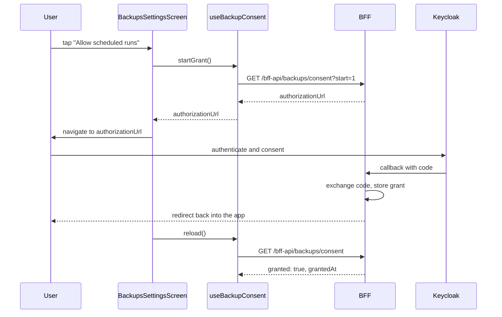

# Expo/React Native universal app

`frontend/mcm-app` is a single Expo Router (Expo SDK 56, React Native 0.85) codebase targeting web
and Android from one source tree. `app.json` sets Metro's web output to `"server"`, not a static
export, because the same process also hosts the [BFF](./bff.md) via file-based
`+api.ts` routes. Client-side code lives in `src/screens/`, `src/components/`, `src/hooks/`,
`src/config/`, `src/utils/`, `src/types/`; routes (both UI screens and API handlers) live under
`src/app/`. Routes stay thin by convention — a route file reports its own screen label (see below)
and renders a screen component, never the other way round.

The [design system](./design-system.md) is Tamagui-based (`@mcm/design-system`), dark-first by default (theme choice is
persisted client-side only — no backend involvement), with a compliance test suite enforcing
design-token usage rules and tracked "sanctioned deviations." All client-side network calls go
through `src/utils/api-client.ts` (an Axios instance with a 401 silent-refresh-and-retry
interceptor), which never attaches an `Authorization` header — it relies on the browser/RN cookie
jar and `withCredentials: true` to carry the BFF's session cookies (see
[Auth chain](../invariants/auth-chain.md)). Login itself uses OAuth2 + PKCE against Keycloak
directly from the client before handing the resulting code to the BFF.

**`api-client.ts` moved out of `src/bff-server/` (feature 077 / backlog item #566) — do not put it
back.** It used to live under `src/bff-server/`, a name that described what it talks to rather than
where it runs; since it runs in the browser/RN runtime carrying the caller's own cookies, that
misfiling was not cosmetic — it is how a component once imported `backup-run-summary` and shipped
70 KB of `luxon` into the web bundle. `src/bff-server/**` now means server-only without exception,
and `scripts/check-no-server-imports.mjs` enforces that a client module never reaches into it.

Directory-vs-file routing choices under `src/app/` are load-bearing in more than one place (the
`collections/[collectionId]/` collection route and the `settings/` route group both rely on a
directory route so nested/child routes inherit params or a shared layout) — see
[Directory-based collection routing in Expo Router](../gotchas/expo-router-collection-routing.md)
for the canonical rule and rationale; it is not restated here.

## The settings destination

`src/app/(app)/settings/` is a route group with its own `_layout.tsx` that renders a shared
`SettingsNav` sub-navigation (`src/components/settings/settings-nav.tsx`) above whichever area is
routed via an Expo Router `Slot` (not a nested `Stack` — the areas are a tab row with no push/pop
history of their own). `SettingsNav` composes the design system's vertical `NavList` rather than a
horizontal `Tabs` row — that shape was measured on a 320px device and found to put the Admin entry
off-screen behind an unindicated scroll (backlog item #240), and `Tabs` drew active/hover selection
as two visually disagreeing states. Selecting an area calls `router.replace`, not
`router.navigate`/`push`: on this Expo Router version `navigate` pushes a sibling area onto the
stack instead of swapping it, which left two mounted copies of a screen (a strict-mode/testID
collision on web) after a few area switches.

Each area is a thin route (`index.tsx`, `assistant.tsx`, `backups.tsx`, `account.tsx`, `admin.tsx`)
that reports its own `current_screen` label to the BFF/agent gateway via `useReportUiState` and
renders a screen component from `src/screens/settings/`. The area registry
(`SETTINGS_AREAS` in `settings-nav.tsx`) is the single source of truth for the row order and
labels:

- **Profile** (`profile-settings-screen.tsx`) — the landing area, `current_screen: settings`.
- **Movie Assistant** (`assistant-settings-screen.tsx`) — per-user agent provider/API-key config,
  backed by the BFF's own agent-config store (see [BFF](./bff.md)).
- **Backups** (`backups-settings-screen.tsx`) — the client side of feature 073 / backlog item
  #236: configuring per-user backup destinations, creating/editing backup jobs and their
  schedules, viewing run history and stored versions, and managing the standing consent that lets
  a scheduled run act unattended. It is composed from `src/components/backups/` (`destination-form.tsx`,
  `destination-list.tsx`, `job-form.tsx`, `schedule-editor.tsx`, `run-history.tsx`,
  `version-list.tsx`) and the `src/hooks/use-backup-destinations.ts`, `use-backup-jobs.ts`,
  `use-backup-consent.ts` hooks, all of which call the BFF's `bff-api/backups/*` routes through the
  same cookie-authenticated `api-client.ts` as everything else — no destination secret is ever
  held by the client beyond the moment it is submitted (an edit form always starts with an empty
  secret field; omitting the field on an update preserves the stored secret server-side). Granting
  the standing consent is a round trip through the identity provider, not a local toggle: `useBackupConsent().startGrant()`
  only asks the BFF for an authorization URL, the caller navigates the user there, Keycloak returns
  them to a BFF-owned callback, and the BFF is what actually records the grant — the client only
  ever polls the resulting status. `revoke()` mirrors this asymmetry: if the identity provider
  refuses the revocation the BFF answers 502 and *keeps* the permission, and the hook surfaces an
  error rather than optimistically clearing it, because telling the user "done" here would be a
  lie. See [BFF](./bff.md) for the server-side scheduling/storage half of this feature; the backup
  procedure itself is not restated here.
- **Account** (`account-settings-screen.tsx`, feature 076) — currently a single destructive
  action, account deletion, driven by `use-account-deletion.ts`. It sits last among the
  non-admin rows by design: an area whose only purpose is an irreversible action does not belong
  beside the ones a user visits routinely. Every user may delete their own account, including an
  admin who is not the last one — there is no `adminOnly` flag on this row. Deletion always
  requires a *fresh* re-authentication at Keycloak (`prompt=login`, `max_age=0`, so an existing SSO
  session cannot be silently reused) before the BFF will act, but the two platforms get there
  differently: on web the BFF builds the authorization request, holds the PKCE verifier
  server-side, and receives the callback itself, so the browser only ever sees a URL to navigate
  to; on native, the BFF cannot redirect a native app, so the device runs the
  `expo-auth-session` flow itself, mints its own PKCE verifier, and posts the resulting code back
  to the BFF to complete. Both paths use a deletion-specific callback/deep link, distinct from the
  login one, and neither mechanism deletes anything client-side — the deletion happens server-side
  only after the BFF validates the returned proof.
- **Admin** (`admin.tsx`) — visible in the nav only for an `mc-admin` user, but that filtering is
  presentation only: the route itself carries its own `ProtectedRoute requiredRole="mc-admin"`
  guard, because a hidden nav entry is not access control.

Adding a settings area is meant to be one registry row in `settings-nav.tsx` plus a route and a
screen — no other area's code should need to change.

The standing-backup-consent grant is a client-initiated, identity-provider-mediated round trip: the client only ever requests a URL and later polls status, never records the grant itself.

## Gotchas

- **`import.meta.url` crashes the exported server bundle in production only.** Metro rewrites
  `import.meta.url` to `globalThis.__ExpoImportMetaRegistry.url`, which the Metro dev server
  populates but the exported `@expo/server` runtime used in Docker does not; `frontend/mcm-app/server.js`
  pre-seeds the registry as the workaround. Full mechanism, the affected agent-transport path, and
  why removing the seeding reintroduces a silent hang: [Expo Router server export and
  agent-transport traps](../gotchas/expo-router-and-transport-traps.md) (not restated here).
- **Tamagui has migrated to v2, with the optimizing compiler plugin now enabled — this reverses
  the older v1-only pin.** `mcm-app` and `@mcm/design-system` both now depend on `tamagui`
  `^2.3.0` (post design-system feature 016/017), and `babel.config.js` installs
  `@tamagui/babel-plugin` for every non-test build. The plugin flattens/optimizes design-system
  components and lets Metro tree-shake the `@mcm/design-system` barrel — importing one component
  no longer drags the whole library into the web bundle, which is what used to OOM-crash Metro's
  dev bundler before the plugin was adopted. The plugin is explicitly excluded under
  `NODE_ENV=test` so the Jest unit suite still renders Tamagui components at runtime, unchanged.
  If you see stale guidance elsewhere claiming Tamagui is pinned to v1 with no compiler plugin
  installed, that no longer reflects this codebase — check `package.json` and
  `babel.config.js` before trusting it.
- **Web E2E must run against a prebuilt BFF container, and a stale image lies to you.** Metro's dev
  web bundler OOMs building the app plus Tamagui locally, so web E2E always runs against the
  containerized BFF, not the dev server. That container serves a prebuilt bundle — if you change
  source and don't rebuild the image, the E2E suite silently tests old code and reports green.
  Always rebuild after a source change before trusting a web E2E result. See [E2E
  testing](../runbooks/e2e-testing.md) for the three BFF-fronting modes this trap sits in.
- **`pnpm nx e2e mcm-app` does not work inside the devcontainer.** Chromium cannot be installed there
  (the Playwright CDN and apt are outside the egress allowlist). Run Playwright via the
  `mcr.microsoft.com/playwright` image with `--network host` instead — and keep its version tag
  matched to the `@playwright/test` lockfile version (see [E2E testing](../runbooks/e2e-testing.md)
  for the toolchain-consistency gate that now enforces this).
- **Password-manager autofill is deliberately suppressed almost everywhere.** Use
  `NoAutoFillInput` (`src/components/no-autofill-input.tsx`, used across the collection/movie
  forms, search bar, and assistant config) instead of plain `TextInput` for form fields, except the
  registration page (`register-form.tsx`), which uses a plain `TextInput` on purpose because
  autofill is wanted there.
- **Every `data-testid`-based web E2E selector depends on React Native Web's `testID` →
  `data-testid` rewrite matching Playwright's configured `testIdAttribute`.** See [Playwright
  testID mapping](../gotchas/playwright-testid-mapping.md) for the mechanism and why a mismatch
  breaks the whole web E2E suite at once, not just one spec — not restated here.

See [BFF](./bff.md) for the server-side half of this codebase, [Auth chain](../invariants/auth-chain.md)
for the full login-to-request-validation sequence, and
`frontend/mcm-app/README.md` for the design-system compliance rules and the full web-E2E procedure.
