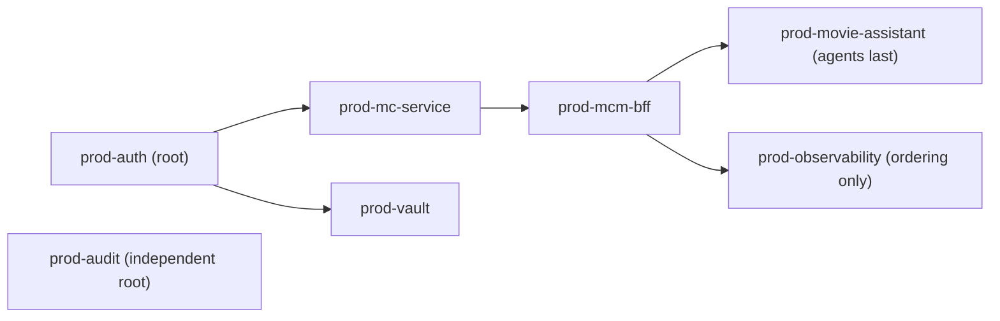

# Infrastructure-as-code stacks (local Compose + production Komodo)

`infrastructure-as-code/` is where every environment's runtime topology is defined as config, not
provisioned by hand. It has two distinct halves that share the same service definitions but serve
different purposes.

## Local/dev Compose stacks

`infrastructure-as-code/docker/stacks/*.compose.yaml` are four independently operable named stacks,
each its own Compose project and each a thin `include:`-only aggregator over that stack's per-service
compose files:

- **`auth`** — Keycloak + its Postgres + Mailpit, plus `vault-service` behind the `vault` profile.
- **`mcm`** — the test infra that starts by default (`mc-service-store-mongo` + its rs-init,
  `mcm-bff-cache-redis`, `mcm-bff-store-mongo`), plus [mc-service](./mc-service.md) behind `app`, the
  [BFF](./bff.md) behind `bff-nonsecure` / `bff-secure`, and the agent layer behind `agents` /
  `agents-metro`.
- **`audit`** — the append-only OpenSearch audit sink, behind the `audit` profile.
- **`observability`** — LangFuse + otel-lgtm + OPA + Unleash, every service behind the `observability`
  profile.

The single root `compose.yaml` aggregator is retired to a pointer (feature 020); there is no longer one
project bundling everything behind profiles. Lifecycle goes through the Nx targets in
`infrastructure-as-code/project.json` — `up-auth`, `up-mcm`, `up-mcm-agents`, `up-audit`,
`up-observability`, `up-all`, and their `down-*` counterparts — which wrap the `docker compose -p
<stack>` invocation and that stack's `.env` file, rather than raw `docker compose` by convention.
`up-all` runs auth then mcm, serially, in that order. The agent layer has two distinct bring-up paths:
`up-mcm-agents` (the heavy in-stack `--profile agents` variant) and `up-agents-prod`
(`scripts/agent-stack.mjs`, the light containerized production-node stack used for local agent E2E).

Every credential in every stack is a fail-fast `${VAR:?…}` interpolation reference. The values live in
gitignored per-stack `<stack>.env` files minted from the committed `<stack>.env.example` templates by
`node scripts/gen-dev-secrets.mjs`; the stack's `include` uses the long syntax with an `env_file:` pin
so that file is the interpolation source for the included component files (feature 021). Full template
table, generation kinds, rotation and fail-fast behaviour:
[stacks README](../../infrastructure-as-code/docker/stacks/README.md).

Since feature 039 the per-service `profiles:` assignments live **in each included component file**, not
re-declared in the stack aggregator. That removes the include-override merge (`services.<x> conflicts
with imported resource`) that only newer Docker Compose accepted, so the stack parses on any conformant
Compose.

## Production stacks (Komodo ResourceSync)

`infrastructure-as-code/komodo/stacks.toml` holds seven `[[stack]]` blocks that a Komodo ResourceSync
diff-applies: the four core application stacks — `prod-auth`, `prod-mc-service`, `prod-mcm-bff`,
`prod-movie-assistant` — plus three support stacks added when feature 025 landed the production Control
Tower: `prod-audit`, `prod-observability`, `prod-vault`.

Deploy order is declared by `after`, and `deploy = true` + `after = [...]` makes the sync *deploy* as
well as apply, in that dependency order:

The `after` deploy order declared in `stacks.toml` — the core chain, plus the support stacks attached
to it.

The reasons that carry weight: `prod-mc-service` waits on `prod-auth` because mc-service fetches
Keycloak's JWKS; `prod-movie-assistant` comes last because `spreadsheet-mcp` needs `prod-mcm-bff`'s
`mcm-bff-network` and Redis; `prod-vault` hangs off `prod-auth` because it is logically in the auth
tier while living in its own block (its `file_paths` are `run_directory`-relative and the Vault compose
sits under `docker/vault/`); and `prod-observability`'s edge is ordering only, keeping a clean graph
rather than expressing a hard dependency. `prod-audit` is a root — independent, highest value, simplest.
Every production deploy after the one-time Komodo bootstrap is `git push` → signed webhook → reconcile;
[CI/CD pipeline](./ci-cd-pipeline.md) describes what fires that webhook.

## How one production stack is wired

Each `[stack.config]` block names the Komodo Periphery `server`, a `linked_repo` + `branch`, a
`run_directory` and `file_paths` pointing at that component's `compose.prod.yaml`, an
`env_file_path = ".env.prod"` (gitignored) into which Komodo writes the interpolated `environment`, and
an `environment = """…"""` block whose values are masked Variable tokens `[[NAME]]`, resolved at deploy
time. Nothing host-shaped or secret-shaped is committed: the git host lives in a separately
bootstrapped Komodo `Repo` resource referenced by name, and the domain, tailnet admin address and
registry host are Variables.

Image digests are not in the TOML either. A tracked, host-free `.env.deploy` beside each component's
prod compose carries the bare `<SVC>_DIGEST` value per service and is passed as
`additional_env_files` — last, so the digest interpolates from git while `REGISTRY_HOST` and the
secrets interpolate from `.env.prod`. The compose assembles the pull reference as
`${REGISTRY_HOST}/jumbleknot/<svc>@${<SVC>_DIGEST}`.

## Gotchas

- **No cross-project `depends_on` between the local stacks — bring `auth` up before `mcm`'s `app`
  profile manually.** Compose has no cross-project `depends_on`; this was a deliberate removal
  (feature 020), not an oversight. The failure is *not* a crash or a hang: [mc-service](./mc-service.md)
  binds and serves immediately, running OIDC discovery in a background task, so with Keycloak
  unreachable `/health` answers while **every protected request is rejected with 401** — a
  working-looking backend that refuses every login. Pinned by
  `unauthenticated_401_is_returned_even_when_keycloak_is_unreachable` in
  `backend/mc-service/tests/integration/health_test.rs`.
- **A profile is not isolation from interpolation, so a "profile-gated" service can still break the
  whole stack.** Compose interpolates every service in an included file at *parse* time, regardless of
  which profiles are selected: a `${REGISTRY_HOST:?}` in a profile-gated service made `up` for the
  entire `mcm` stack fail, including CI's app-e2e bring-up, which sets no `REGISTRY_HOST` and wants none
  of those services. That is why the backup destinations live in a **separate** compose file brought up
  explicitly rather than as another `mcm` profile.
- **Adding a `${VAR:?…}` to a prod compose silently changes that stack's required inputs, and the only
  place they are declared is `stacks.toml`.** Komodo writes each stack's `environment` block into its
  `env_file_path`, so a variable absent there is absent at `docker compose config` time and the `:?`
  guard fires — only on a real deploy. `scripts/__tests__/komodo-stack-env.guard.test.mjs` makes the
  coupling mechanical: every required variable in a stack's prod compose files must be supplied by that
  stack's `environment` block or its `additional_env_files`. (This is exactly how `prod-observability`
  broke once `REGISTRY_HOST` reached a fourth consumer.)
- **The committed `stacks.toml` never carries a real host, domain, or IP.** The git-provider host lives
  in the bootstrapped Komodo `Repo` resource referenced by name (`linked_repo = "mcm-repo"`); the
  production domain, tailnet admin address, and registry host are Komodo *Variables*, interpolated at
  deploy time — the committed TOML carries only variable references, not values.
  `scripts/check-komodo-sync.mjs` scans `infrastructure-as-code/komodo/**/*.toml` specifically for a
  `*.ts.net` host, a Tailscale CGNAT address, or a hardcoded URL authority that is not a `[[var]]`
  (comments included, since a real host in a comment is still a leak); a tree-wide
  `scripts/check-topology-scrub.mjs` catches a real tailnet host anywhere else in git. See
  [Secrets management](../invariants/secrets-management.md) for the full no-clear-text-secret posture
  this stack config lives under.
- **Image digests are not in `stacks.toml`, and editing one by hand defeats the promotion mechanism.**
  The tracked `.env.deploy` files are written by [the CI/CD pipeline](./ci-cd-pipeline.md)'s
  digest-by-git promotion step; the compose assembles the pull reference from a Komodo-injected
  registry-host variable plus that digest.
- **All four core live production stacks were adopted in place, not created fresh.** The ResourceSync
  reconciles against already-running containers with matching names — a rename or restructuring here is
  a config *diff* against a live system, not a from-scratch stand-up; preview the diff before applying.
  See [Phase 15 operator checklist](../runbooks/phase-15-operator-checklist.md) for the manual
  consolidation that got the stacks to this ResourceSync-managed state.
- **Every prod admin/UI port lives in the reserved range `19000–19099`, and moving one requires updating
  its own self-referencing URL variable too.** `scripts/check-prod-ci-port-collision.mjs` compares the
  fixed host ports of every `compose.prod.yaml` against every other tracked compose file and fails on an
  overlap, because the prod and CI daemons share one host's port space and a collision crash-loops the
  losing side. The gate scans only the compose `ports:` key, not secondary URL references — see
  [Published-port reservation](../invariants/published-port-reservation.md) for the collision this
  convention exists to prevent and the secondary-reference trap.
- **Every long-running prod service must declare `restart: always`.** `restart: unless-stopped` does
  not bring a container back after a reboot on this host (a graceful-shutdown drain unit stops
  containers cleanly, and `unless-stopped` declines to restart an already-stopped container), and a
  missing `restart:` defaults to `no`. `scripts/check-prod-restart-policy.mjs` forbids both on
  `infrastructure-as-code/docker/**/compose.prod.yaml`, exempting only genuine one-shot init/seed
  containers (`*-init`, `*-seed`, `*-rs-init`, `createbucket`), where `always` would restart-loop.
  Background: [Prod reboot resilience](../runbooks/prod-reboot-resilience.md).
- **HashiCorp Vault is deployed as part of the `auth` stack's `vault` profile and as the production
  `prod-vault` stack, but is deliberately dormant in production** — uninitialized and sealed, with no
  root token in env, and a healthcheck override so Komodo reads an intentionally sealed server as
  healthy. See [Secrets management](../invariants/secrets-management.md) for why, and don't treat its
  presence in the stack definitions as evidence it's the active secrets backend.

See [Homelab server setup](../runbooks/server-setup.md) for how the underlying host and its two
segregated rootless Docker daemons were provisioned, [Prod control tower](../runbooks/prod-control-tower.md)
for the three support stacks, and `docs/MCM-Architecture.md`'s "Docker Infrastructure" section for the
full per-stack service/profile table and local bring-up commands.
