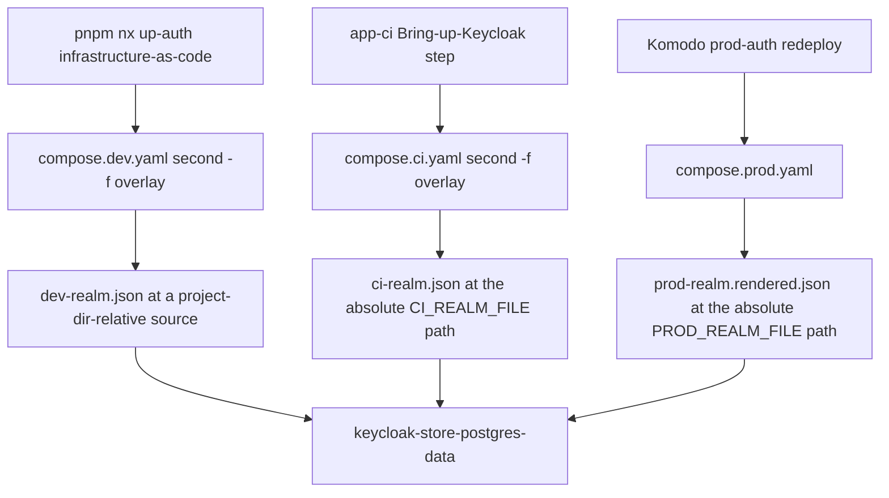
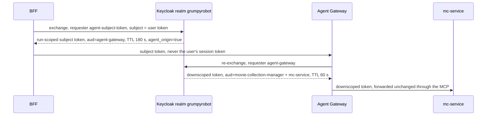

# Keycloak (Identity and Access Management)

Keycloak is the identity provider for the entire MCM platform. It runs as `keycloak-service` in the
`auth` Compose project — alongside its own Postgres (`keycloak-store-postgres`) and a Mailpit SMTP
stand-in in dev — and is deployed under the Komodo `prod-auth` stack in production, whose `after = []`
puts it at the root of the deploy order (every other prod stack waits on it). It is the only authority
for user identities, OAuth2 token issuance, and the RFC 8693 token exchange the agent layer depends on.

**Realm:** `grumpyrobot`, stable across every environment and deliberately not the organization name.
The user-facing login client is `movie-collection-manager`, and its **client** roles `mc-user` and
`mc-admin` are the platform's RBAC unit. Because they are client roles, a code path reads them from
`resource_access.<client>.roles` — a *realm*-role assignment of the same name is a no-op, and a user
carrying only that authenticates and then fails with `login_role_denied`. The same legacy naming shows
up one level up: the realm's built-in default role is still `default-roles-jumbleknot`, so a
`default-roles-*` name that does not match the realm is expected, not drift.

## The service head

The `keycloak-service` block in `infrastructure-as-code/docker/keycloak/compose.yaml` is small and
carries four facts worth reading directly, because none of them is visible in a realm file:

- **The image is pinned by tag *and* digest** — `quay.io/keycloak/keycloak:26.8.0@sha256:…`, the
  identical pin in `compose.prod.yaml`. A version bump has to move both files, and the digest is the
  unit the image-scan allowlist is keyed to.
- **`depends_on: keycloak-store-postgres: condition: service_healthy`.** Keycloak is not started until
  its own Postgres answers `pg_isready -U keycloak -d keycloak`, so a Keycloak that is up but cannot
  reach its database is a Postgres problem, not a Keycloak one.
- **The command differs by environment.** The base, dev and CI files run `command: start-dev`; only
  `compose.prod.yaml` runs `start` (production mode) plus `--import-realm` declared in its own file.
- **Prod runs `restart: always` on both Keycloak and its Postgres** (feature 030), not the base file's
  `unless-stopped`. The host's shutdown drain stops every container to `Exited (0)`, and
  `unless-stopped` then declines to bring a stopped container back when the daemon returns — so on this
  host `always` is what actually makes a reboot hands-off.

The service exposes the app port as host `8099` → container `8080` (dev and CI, loopback-bound);
containers on the shared Docker network reach it via `keycloak-service:8080`. Feature 020 unified the
service key and `container_name` to `keycloak-service` — the old bare `keycloak` name no longer
resolves. In production the *admin* console is published on a different, reserved port (see the
gotchas).

See [Authentication and authorization chain](../invariants/auth-chain.md) for how every downstream
component enforces the tokens Keycloak issues,
[Infrastructure-as-code stacks](./infrastructure-stacks.md) for how `auth` fits into the overall stack
topology and start-order rules, and
[Service account vs admin credentials](../gotchas/keycloak-service-account.md) for how the BFF calls
Keycloak's Admin API.

## Three realm variants, three import paths

| File | Used by | `accessTokenLifespan` |
|------|---------|-----------------------|
| `dev-realm.json` | Local dev (`compose.dev.yaml` overlay, `--import-realm`) | 5400 s |
| `ci-realm.json` | CI `app-ci.yml` bring-up (`compose.ci.yaml` overlay) | 5400 s |
| `prod-realm.json` | Production (`compose.prod.yaml`, rendered via `sed`) | 300 s |

All three are mounted at the target path `grumpyrobot-realm.json`, never their committed filename:
Keycloak's directory import requires each file be named `<realmName>-realm.json` or it aborts with a
name/realm mismatch. The committed source names stay as they are, and the file is mounted read-only.



Each environment imports the `grumpyrobot` realm into the same Postgres volume through its own overlay.

Three details in that picture are load-bearing:

- **The dev and CI overlays add `--import-realm` on top of a base they do not modify.** The shared
  `keycloak/compose.yaml` base is untouched by both overlays, so the CI path stayed provably unchanged
  when dev seeding was added (prod declares `--import-realm` in its own file rather than as an overlay).
- **A relative volume source resolves against the *project* directory, not the overlay file's
  directory.** The dev overlay therefore uses `../keycloak/dev-realm.json` (relative to
  `docker/stacks/`), while CI passes an absolute `${CI_REALM_FILE}` and prod an absolute
  `${PROD_REALM_FILE}`. A bare `./ci-realm.json` silently pointed at a non-existent path and Docker
  created an empty **directory** there instead of failing.
- **Import is `IGNORE_EXISTING`.** An established volume is untouched, which is what makes the dev
  overlay non-destructive on every `up-auth` — and also what means a realm edit changes nothing until
  the volume is re-imported. Wiping `keycloak-store-postgres-data` re-seeds the realm on the next
  `up-auth` instead of dropping you into an empty Keycloak.

`prod-realm.json` is additionally sanitized before commit: no users, no embedded signing keys (so prod
mints fresh ones), no dev redirect URIs, no real client secrets, `registrationAllowed: false`,
`bruteForceProtected: true`, and a real `passwordPolicy`.

## Why the token lifespans differ

The CI realm uses a 90-minute token lifetime deliberately: Playwright creates a fresh `BrowserContext`
per test, each reloading a `storageState` snapshot taken at global-setup time. With a 300 s token the
snapshot is expired five minutes in, causing every later test to need a refresh — measured at 1.9 s
median against the BFF's per-session limit of 2 refreshes per 30 s, which rejected 35 of 115
attempts. A token that outlives the 75-minute job timeout removes the driver;
`scripts/__tests__/e2e-worker-session.test.mjs` asserts `ci-realm` stays above that bound rather than
trusting a comment.

`dev-realm.json` now matches at 5400 s as well (feature 054), for the same measured reason one
directory over: local full-suite runs past ~5 minutes re-entered the same contention (two 44-minute
attempts, 62 `refresh_rate_limited`, collapsing into `gotoHome: home screen did not render`). What
that costs is local coverage of the refresh path, and the substitute is named rather than implied —
the 2-per-30 s bucket, its 429, and the `refresh_rate_limited` audit event are covered by
`tests/integration/rate-limiter.integration.test.ts`. Production stays at 300 s: no security control
was relaxed anywhere. **A running Keycloak keeps the old value until the realm is re-imported**, so
raising the number in JSON changes nothing for a stack already up. The E2E spec that proves the
refresh recovery chain does not depend on the number either way: `agent-session-refresh.spec.ts`
clears the access cookie explicitly instead of waiting for expiry.

## RFC 8693 token exchange

The realm carries the whole token-exchange wiring: `standard.token.exchange.enabled` on the
`agent-gateway` and `agent-subject-token` confidential clients, per-client
`access.token.lifespan` ceilings (60 s for the gateway's exchanged token, 180 s for the run-scoped
subject token), the audience mappers that make the downscope targets available, and an
`agent_origin=true` hardcoded claim so `mc-service`/OPA can recognise agent-originated tokens.



Two exchanges, two requester clients, and the audience mappers that make each one legal.

The wiring is applied (and re-appliable idempotently) by
`infrastructure-as-code/docker/keycloak/scripts/configure-token-exchange.mjs` against a running Admin
API; the same script is the record of *why* each mapper exists. Two constraints from that record are
easy to trip over:

- **Standard token exchange v2 requires the requester to be within the subject token's audience.** The
  BFF exchanges the user's `movie-collection-manager` token, so that client needs an audience mapper
  adding `agent-subject-token`; without it Keycloak rejects with `access_denied: Client is not within
  the token audience`.
- **The `audience` request parameter can only select an audience the requester can produce.** A missing
  audience mapper on the requester fails with `invalid_request: Requested audience not available`,
  not with a permission error.

Both mappers are additive: every validator in the chain uses contains/intersection audience semantics,
so an extra `aud` entry is ignored by the components that do not need it. The agent-side story is on
[Agent Gateway](./agent-gateway.md) and [Authentication and authorization chain](../invariants/auth-chain.md).

## Realm files are generated, then drifted-guarded

There is no hand-maintained source of truth for the dev realm: it lives in the dev box's Postgres
volume, and `scripts/export-ci-realm.mjs` captures the live topology via the Keycloak Admin API
partial-export and sanitizes it into `ci-realm.json`. Every confidential client's secret is replaced
with a `${ENV_VAR}` placeholder Keycloak resolves from the container env at import, and the script
**asserts** every secret-bearing client is mapped, so a new client cannot silently commit a masked
`**********` secret. `dev-realm.json` is derived from that contract, and
`scripts/check-realm-consistency.mjs` (run in the `guardrails` gate, `--selftest` first) fails if the
two diverge on realm name, app-client set, or `e2e-test-user` presence — it deliberately does **not**
require byte equality, because redirect URIs and token lifespans may legitimately differ.

Both committed realm files seed `e2e-test-user` (`mc-user`) and `e2e-admin-user` (`mc-user` +
`mc-admin`), plus reconstructed `service-account-<clientId>` users carrying the service accounts'
roles — a partial export does not include service-account role mappings, so a naive import would mint
tokens that authorize nothing.

On the dev side, `node scripts/gen-dev-secrets.mjs` mints the realm/client secrets into the gitignored
`stacks/auth.env`, and `node scripts/gen-dev-env.mjs` projects the *same* values into the BFF env
files so realm-secret equals BFF-secret by construction — the invariant CI achieves by feeding both
sides from one set of forge secrets. That projection verifies both credentials against the **running**
realm before writing anything, and exits without writing if the realm refuses them: writing the files
proves only that the values reached disk. The end-to-end proof that a *fresh* volume yields a coherent
seed is `verify/verify-fresh-realm-seed.mjs`, which provisions from scratch and then asserts with a
real ROPC grant as `e2e-test-user` — a check that can only pass if the realm, the user and the client
secrets all agree.

## Gotchas

**Realm JSON takes NO comments — not even a `_comment` key.** Keycloak's import deserializes realm
files into `RealmRepresentation` with unknown fields **rejected**; an extra key does not get silently
ignored. The container goes unhealthy and every dependent job dies at bring-up:

```text
ERROR: Unrecognized field "_comment_accessTokenLifespan" (class org.keycloak.representations.idm.RealmRepresentation)
ERROR: Failed to run import
```

Measured on app-ci run 1611 (feature 052): a one-line explanatory key cost a full CI run.
`python -c "import json"` says the file is valid — JSON syntax is not the constraint, the Keycloak
schema is. A local parse check proves nothing. `scripts/__tests__/keycloak-realm-schema.test.mjs`
fails on any `_`-prefixed key at any depth. **Document realm settings in the README, not in the JSON.**

**To prove a realm edit actually imports, run the importer against the real image before pushing:**
the guard catches `_`-prefixed keys, but only Keycloak can tell you the realm truly deserializes.
Mount the file as `grumpyrobot-realm.json`, supply any non-empty values for the `${VAR}` placeholders
(they resolve from container env at import time), and want `Realm 'grumpyrobot' imported` — the exact
command is in the [keycloak README](../../infrastructure-as-code/docker/keycloak/README.md). Treat a
green run as a schema/deserialisation check, **not** a version-parity check: the README's one-minute
proof pins a Keycloak image a version behind the deployed one (`26.7.0` in the command against the
`26.8.0` compose pin), so a realm can import under the proof image and still meet a stricter schema on
the deployed pin. That is the same class of change that made 26.6+ enforce the realm password policy
against imported credentials.

**The CI runner is persistent, so `app-ci` deletes the realm volume on every run.** `IGNORE_EXISTING`
means a stale realm would *never* pick up a `ci-realm.json` change, and stale Mongo/Redis data breaks
E2E idempotency, so a reset step force-removes the app containers and the stateful volumes
(`keycloak-store-postgres-data` among them) before provisioning — image build caches are preserved, so
the rebuild stays fast. That is also why a realm change reaches CI at all; without the reset it would
silently not.

**Removing a client requires removing ALL its references.** Dropping a client from a realm export
(e.g. the ROPC client `mcm-bff-test`, which appears in dev/CI but not in prod) requires also deleting
its `roles.client[<id>]` entry and any `scopeMappings` — not just the client object. A dangling
reference makes `--import-realm` abort in production mode with `App doesn't exist in role
definitions: <id>` and crash-loops `keycloak-service`. Note that `mcm-bff-test` is no longer
test-only in the "unused" sense: the agent integration suite and the DAST job log in through it, so
its secret must be identical at realm-import and at scan time.

**The CI realm deliberately drops `passwordPolicy`.** Keycloak 26.6+ enforces the realm password
policy against *imported user credentials* (26.5 silently skipped it), so a realm that both carries a
prod-strength policy and seeds a user with a plaintext `${E2E_TEST_PASSWORD}` aborts a fresh import.
Password strength is validated client-side in the suite. `prod-realm.json` keeps its policy — it seeds
no user credential, so its import is unaffected.

**`${BASE_DOMAIN}` in `prod-realm.json` is rendered by hand with `sed`, not `envsubst`.** Use
`sed 's|${BASE_DOMAIN}|<domain>|g'` — `envsubst` would also expand Keycloak's own `${role_*}` /
`${client_*}` i18n placeholders and corrupt the realm. Verified: 32 such placeholders survive the
`sed` render intact. The rendered file is gitignored and pointed to by `PROD_REALM_FILE`; the
committed template keeps the placeholder. (`compose.prod.yaml` and `.env.prod.example` still describe
the restricted-`envsubst` form; the hand-run `sed` is what is actually used, and the two differ in
exactly the way that matters.)

**`keycloak-service` can lose `backend-network` on reboot (prod).** Confirmed on 2026-07-06: after a
reboot the container came back attached only to `edge-network` and `keycloak-network`, missing
`backend-network`, which broke `mc-service`'s JWKS discovery (`dns error … Try again`). Fix: a
Komodo `prod-auth` redeploy (NOT a manual `docker network connect` — that is a one-off that the next
reboot can lose). The compose file already declares `backend-network`; a redeploy recreates the
container with the full declared network set durably. Feature 029 additionally makes the intra-stack
`keycloak-network` compose-managed (was `external: true`) so Keycloak can always reach its Postgres
even if the external nets race on reboot.

**The prod admin console port is 19099, not 8099.** Prod and the CI runner share one host under two
rootless Docker daemons publishing into the same port space. CI publishes its Keycloak on the loopback
port 8099; a `0.0.0.0:8099` prod bind overlapped it and crash-looped `prod-auth` for 6 h on
2026-07-06. Feature 029 moved prod Keycloak's admin binding into the prod-reserved 19000–19099 range,
disjoint from all CI/dev ports. See [Published-port reservation](../invariants/published-port-reservation.md).
The admin console is also served under its own `KC_HOSTNAME_ADMIN` — the tailnet admin address, never
the public host — and the admin bind is `0.0.0.0` by necessity (the rootless daemon starts before
`tailscaled` at boot, so a tailnet-IP bind silently fails), with exposure limited by the host firewall.
Because the console's own session-check iframe still points at `KC_HOSTNAME`, the *public* auth route
must be reachable for the tailnet console to work at all; a console that fails with a third-party-check
timeout is that route missing, not a broken admin login.

**The prod bootstrap admin credential is first-boot-only — and must stay anyway.**
`KC_BOOTSTRAP_ADMIN_USERNAME` / `KC_BOOTSTRAP_ADMIN_PASSWORD` create the initial `admin` user only when
the realm database has no admin. The hardened posture is to log in once, create a named admin with 2FA,
and delete the bootstrap user, after which those values are inert. Keep them configured regardless:
they are fail-fast `${VAR:?}` references, so removing them breaks every redeploy, and a fresh database
deploy needs them to create the first admin at all.

**Pin the issuer, and let the backchannel resolve per-request.** `KC_HOSTNAME` fixes a stable token
issuer regardless of the host a request arrives on, while `KC_HOSTNAME_BACKCHANNEL_DYNAMIC=true` lets
the token/JWKS endpoint URLs resolve from the incoming request. Without the pin, the containerized BFF
performing the refresh-token grant over the internal network gets
`invalid_grant: Invalid token issuer` — the login itself worked, because only the refresh grant
validates a pre-issued issuer.

**Bring `auth` up before the `mcm` `app` profile — and read the failure correctly.** There is no
cross-project `depends_on` (removed in feature 020), so the ordering is manual. The symptom is *not* a
hang: `mc-service` runs OIDC discovery and the JWKS fetch in a background task, binds and serves
immediately, and rejects every protected request with 401 while `/health` still answers. So a
backend that looks up but refuses every login means Keycloak is unreachable, not that the backend
crashed — pinned by `unauthenticated_401_is_returned_even_when_keycloak_is_unreachable` in
`backend/mc-service/tests/integration/health_test.rs`.

**Stale-password recovery wipes the DB volume — but no longer drops you into an empty Keycloak.**
Wiping `keycloak-store-postgres-data` and restarting is still the fix for a
`password authentication failed for user "keycloak"` crash, and since feature 039 the next
`pnpm nx up-auth` re-imports the `grumpyrobot` realm automatically; force-remove the containers that
mount the volume first, or the wipe silently no-ops. See [Local dev](../runbooks/local-dev.md).

**Any confidential Keycloak client whose secret isn't pinned in the realm JSON gets a fresh random
secret on import.** After a new volume import, read the generated client secrets from the Keycloak
admin console and update the matching Komodo Variables before deploying dependent services (the
operator checklist walks this per client). A value that is merely *present* but wrong fails later and
elsewhere: the BFF's RFC 8693 mint 401s with `invalid_client`, the gateway then proceeds without a
subject token, `needs_token` tools short-circuit with "No caller identity", and the failure surfaces
as an agent that answers from TMDB and cannot resolve the user's collection.

**Client redirect URIs are part of the realm, not the app.** `add-container-redirect-uris.mjs` exists
because the containerized BFF (dev `:8082`, prod-style TLS `:8443`) needs its callback and
`login?verified=true` origins allowlisted on `movie-collection-manager`; without them Keycloak rejects
the callback after login. The mobile deep link is the same kind of entry — `prod-realm.json` carries
the custom-scheme callback alongside the public web origin — and its absence breaks on-device login
only after the browser redirect.
