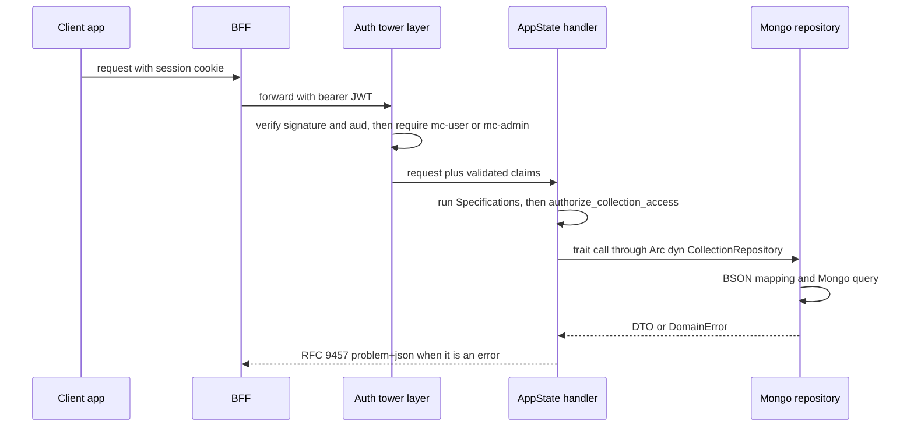

# mc-service (Rust/Axum movie-collection service)

`backend/mc-service` is the sole authority for collection and movie domain logic. The
[BFF](./bff.md) proxies every client request to it — the client never calls it directly — forwarding
the caller's JWT as a bearer token; the agent path arrives the same way through
[MCP servers](./mcp-servers.md)' `movie-mcp`, carrying a downscoped `aud=mc-service` token. It
persists to its own dedicated MongoDB instance (`mc_db`) and validates JWTs locally against a
Keycloak JWKS fetched in the background at startup (see
[Auth chain](../invariants/auth-chain.md)).

The crate is built both as a binary (`src/main.rs`) and as the library `mc_service` (`src/lib.rs`),
which re-exports `adapters`, `api`, `application`, `config` and `domain` publicly precisely so the
integration tests under `tests/integration/` can reach internal types.

## Startup and wiring

`main()` runs a fixed sequence. Every step up to the bind fails fast; the last one deliberately does
not:

1. A structured JSON `tracing` subscriber (`EnvFilter`, defaulting to `mc_service=info`).
2. `Config::from_env()` — loads `.env.local` then `.env` via `dotenvy`, then requires `MC_DB_URL`,
   `KEYCLOAK_URL`, `KEYCLOAK_REALM`, `KEYCLOAK_CLIENT_ID` and a parseable `MC_SERVICE_PORT`. Any
   missing or invalid value aborts startup.
3. `adapters::mongodb::client::connect(&config.db_url)` — parses the database name out of the URL
   path (defaulting to `mc_db`) and runs an inline `ping`, so an unreachable Mongo aborts startup.
4. `adapters::mongodb::indexes::create_indexes(&db)` — idempotent, explicitly named indexes for both
   collections, a `titleSort` backfill for pre-feature documents, and best-effort drops of two
   superseded indexes (`movie_text_search`, `sort_title_year`).
5. `check_orphaned_movies(&db)` — a read-only `$lookup` aggregate that only logs a warning if movies
   point at a missing collection (remnants of a pre-transaction partial delete).
6. `api::router::build(db, &config)` then `axum::serve` on `0.0.0.0:{MC_SERVICE_PORT}`. Router build
   constructs the Keycloak auth instance but does **not** wait for its JWKS discovery — see the gotcha
   below.

`router::build_with_auth_handle()` is the same wiring but also returns the `KeycloakAuthInstance`;
integration tests use it to await Keycloak readiness before the first request.

## Route surface

Two sub-routers, and the split is the security boundary:

| Router | Routes | Guard |
|---|---|---|
| public | `GET /health`, `GET /metrics` | none (liveness probe and Prometheus scrape) |
| protected, nested at `/api/v1` | `/collections` (GET, POST), `/collections/{id}` (GET, PATCH, DELETE), `/collections/{id}/movies` (GET, POST), `/collections/{id}/movies/filter-options`, `/collections/{id}/movies/count`, `/collections/{id}/movies/{movieId}` (GET, PUT, DELETE), `/movie-metadata` | `KeycloakAuthLayer<Role>` + `require_app_role` |

`/{id}/movies/filter-options` and `/{id}/movies/count` are registered **before**
`/{id}/movies/{movieId}` deliberately — in the reversed order the literal segments are shadowed by
the parameterised route. `AppState` holds one pre-constructed handler per operation and is injected
as `State<Arc<AppState>>`; dispatch is a plain method call on that struct, so there is no mediator
crate in the request path (`docs/MCM-Architecture.md`'s "via `medi-rs`" phrasing describes the
intent, not the shipped wiring).

Two routes deserve a note because they break the pattern of the rest:

- `/api/v1/movie-metadata` sits *inside* `protected` (so it inherits auth + role enforcement) but is
  **not** collection-scoped and carries no user data, so no DAC check applies. It publishes the
  option values the domain accepts, so agents ask the service instead of keeping their own copy —
  and because it leaks nothing, a process-wide TTL cache of the response is safe.
- The global logging middleware wraps *both* sub-routers: it puts `request_id` / `method` / `path` on
  a `request` span, emits a `request completed` event carrying numeric `status` and `duration_ms`,
  and additionally warns on 401/403 as audit events. See
  [logging and audit](../invariants/logging-and-audit.md).

`AppState` carries one handler more than the route table suggests: `set_default_collection` has no
route of its own. It is dispatched from the collections **PATCH** handler when the body sets
`isDefault: true`, and only after the ordinary update succeeds — so a PATCH rejected for a duplicate
name returns before the default is touched rather than leaving the default silently switched.

A request's path through the service:

*How a `/api/v1` request reaches MongoDB, and where authorization and validation sit on the way.*

Four Clean Architecture layers, outer-to-inner import rule enforced (`domain` never imports from
`application`, `adapters`, or `api`):

| Layer | Path | Responsibility |
|---|---|---|
| Domain | `src/domain/` | Entities (`collection.rs`, `movie.rs`), `domain/specifications/`, `DomainError` |
| Application | `src/application/` | Commands (`application/commands/`), queries (`application/queries/`), repository trait ports (`application/ports/`), DTOs, DAC helper (`access_control.rs`) |
| Adapters (infrastructure) | `src/adapters/mongodb/` | MongoDB repository implementations, BSON↔domain DAOs, index setup |
| API (presentation) | `src/api/` | Axum route handlers, middleware (auth, logging, error), router assembly, `AppState` |

**CQRS**: one file per command (`create_collection.rs`, `delete_movie.rs`, …) and per query
(`list_movies.rs`, `get_filter_options.rs`, …) under `application/commands/` and
`application/queries/`. Each file defines its own command/query struct plus a handler. Handlers
depend only on repository *traits* (`Arc<dyn CollectionRepository>`), never the concrete Mongo
adapter, which is what makes them mockable in unit tests with `mockall`.

**Specification pattern**: `domain/specifications/spec.rs` defines a generic `Specification<T>`
trait with `AndSpec`/`OrSpec`/`NotSpec` combinators; concrete rules (`collection_name.rs`,
`rip_quality.rs`, `owned_media.rs`, …) are invoked from command handlers before the repository is
touched — business validation is checked in the application layer, not the database. Index-level
collation uniqueness covers the race the specifications cannot; see
[MongoDB indexes and uniqueness](../gotchas/mongodb-indexes-and-uniqueness.md).

**DAC lives in the application layer too.** Every movie command and query first calls the shared
`authorize_collection_access` helper, which loads the parent collection by id, checks the role
hierarchy `owner ⊇ contributor ⊇ viewer`, and reports both "collection missing" and "caller not
authorized" as `CollectionNotFound` (404) so the API never leaks whether a collection exists. The
ACL is seeded only with `{ userId: ownerId, role: "owner" }` at creation — the seam is exercised and
tested, but the UI/endpoints to grant or revoke a non-owner role do not exist yet. The helper returns
the loaded collection, and callers reuse it: movie writes stamp `movie.ownerId` with the collection's
owner rather than the caller's subject.

**Read paths: movies are keyset-paginated, collections are not.** `GET /collections/{id}/movies`
takes an opaque base64 cursor and a 50-document batch, and the sibling `count` endpoint deliberately
drops the cursor and the sort (count is order-independent) while sharing every other filter, so the
two stay parity-consistent — that parity is the thing to preserve when adding a filter. The decoding,
sort-field remapping and filter-parity traps are their own page:
[Keyset pagination](../gotchas/keyset-pagination.md). `GET /collections` is a flat
`find({ ownerId })` returning every collection for the caller, with no cursor at all; the
`owner_id_list` index exists but the query does not page through it.

## Packaging and operations

`backend/mc-service/project.json` is the Nx surface: `test` (delegating to `test:unit` +
`test:integration`), `lint`, `build`, `serve`, `deploy` and `docker-down`.

- **Image.** A two-stage Alpine/musl `Dockerfile`: the build stage installs `musl-dev perl make` and
  builds the release binary (with a dependency-cache layer keyed on `Cargo.toml`/`Cargo.lock`), the
  runtime stage installs only `ca-certificates tzdata`, runs as the non-root user `mcservice`, and
  `EXPOSE`s 3001. The vendored-OpenSSL trick that makes static musl linking work is in
  [mc-service musl-conditional vendored OpenSSL](../gotchas/mc-service-musl-openssl.md).
- **Runtime config** is exactly the five env vars `Config::from_env()` requires — `MC_DB_URL`,
  `KEYCLOAK_URL`, `KEYCLOAK_REALM`, `KEYCLOAK_CLIENT_ID`, `MC_SERVICE_PORT` — supplied by
  `infrastructure-as-code/docker/mc-service/compose.yaml` for the dev/`app` profile. Dev Mongo comes
  up as a single-member replica set (`--replSet rs0`) plus a one-shot `rs-init` sidecar, and
  mc-service connects with `directConnection=true` to bypass member discovery. The production stack
  (`compose.prod.yaml`) is a separate file: internal-only on its own network, no published ports,
  `--keyFile`-enabled Mongo, and it carries its own mongod `command`, so the dev WiredTiger tuning
  below never reaches production.
- See [local dev](../runbooks/local-dev.md) for the stack/profile bring-up sequence.

## Gotchas

- **Auth is a tower layer, not a per-handler check.** `KeycloakAuthLayer<Role>` sits on the
  `protected` sub-router, so a new `/api/v1/` route is automatically protected without writing any
  auth code in the handler body. Per-handler `Extension<KeycloakToken<Role>>` extractors exist only
  to *read* already-validated claims — they must never be the primary guard. `axum-keycloak-auth` by
  itself only checks signature and audience; the OR-logic `mc-user` OR `mc-admin` role check is a
  separate `require_app_role` middleware applied inside the layer (its builder's `required_roles` is
  AND-logic and cannot express it). The pattern repeats at the BFF and the client — see
  [Role enforcement is a layer](../gotchas/role-enforcement-is-a-layer.md).
- **JWKS is fetched at startup in the background — a dead Keycloak is a *silent* failure, not a
  startup failure.** `KeycloakAuthInstance::new` spawns OIDC discovery and the JWKS fetch; router
  build and `axum::serve` proceed regardless, so mc-service starts and `/health` answers even with
  Keycloak unreachable. JWT validation is entirely local once the fetch succeeds (no per-request
  Keycloak round trip), but if discovery never succeeds every protected request is rejected 401 — a
  working-looking backend that refuses every login, not a crash or a hang. Always bring the auth stack
  up before the `app` profile. In tests this is subtle: a *failed* discovery still flips the instance
  to "ready" (`version()` increments on `Err` too), so the shared test harness gates on
  `wait_until_operational()` — success, not merely a completed attempt — or the whole auth-negative
  suite would pass green against a dead Keycloak. That gate is itself pinned by
  `health_test.rs::unauthenticated_401_is_returned_even_when_keycloak_is_unreachable` and
  `readiness_gate_reports_not_operational_for_unreachable_keycloak`, which exist to stop it being
  "simplified" away. `MC_DB_URL` unreachable *is* a hard startup failure — that `ping` is inline in
  `main()`.
- **Cascade delete needs a replica-set-enabled MongoDB.** One line of consequence: a bare
  `docker run mongo` cannot serve the multi-document transaction, and can even initialize the
  replica set with an internal-only hostname that host-side tests then can't resolve. Details in
  [Cascade delete and replica set](../gotchas/cascade-delete-and-replica-set.md).
- **Vendored OpenSSL must stay musl-conditional.** The Alpine/musl Docker build needs a statically
  linked OpenSSL, which is why `Cargo.toml` carries a
  `[target.'cfg(target_env = "musl")'.dependencies]` block; moving it into the unconditional
  `[dependencies]` silently breaks `cargo test` on Windows. See
  [mc-service musl-conditional vendored OpenSSL](../gotchas/mc-service-musl-openssl.md).
- **Errors are RFC 9457 `application/problem+json`, never a stack trace,** and `type` is a
  non-resolvable `.example` URI while `detail` is a fixed per-variant message. See
  [RFC 9457 problem details](../gotchas/rfc-9457-problem-details.md).
- **~29% unit-test coverage is intentional, not a gap.** Clean Architecture pushes the MongoDB
  adapter and Axum API layers behind integration tests, so unit-only coverage is low by construction;
  the enforced ≥70% line floor is measured over **unit + integration together** with `cargo tarpaulin
  --ignore-tests --out Lcov`, and `cargo-tarpaulin` is a dev dependency rather than a global install.
  Don't read the unit-only number as a regression — see
  [Final validation checklist](../invariants/feature-validation-checklist.md).
- **"index creation failed: I/O error: unexpected end of file" means the container died — not bad data.** The dev MongoDB container runs with no memory swap on the host. During a parallel integration run the WiredTiger cache is not the culprit: with it capped, the heap still grew because the integration harness minted a fresh database per test and dropped each one, while MongoDB raises WiredTiger's sweeper thresholds (`closeIdleTime=600 s`, `closeMinimum=2000`) — sensible for stable namespaces, wrong for a workload that churns thousands of namespaces per minute. Nothing was ever eligible for sweeping, so open data-handle counts reached 65,844 for 2 live collections, the heap climbed until the OS killed mongod mid-run, and every subsequent test saw connection errors and server-selection timeouts. The symptom string is identical to the earlier nofile crash-loop (`ulimits` fixed that one, this one is memory). Fix applied in `infrastructure-as-code/docker/mc-service/compose.yaml`: `--wiredTigerCacheSizeGB 1` caps the cache, and `--setParameter wiredTigerFileHandleCloseIdleTime=30 --setParameter wiredTigerFileHandleCloseMinimum=250` restores WiredTiger's own defaults. These flags are startup-only (`setParameter` at runtime is refused). Dev-only: `compose.prod.yaml` carries its own `command` and is untouched.
- **The churn that fed that crash was removed at the harness, not only at mongod.** The integration
  helper no longer mints `mc_test_<uuid>` per call: `common::test_db()` leases a bounded pool slot
  (`mc_test_s<slot>`, ≤64 slots tracked in the `mc_test_pool.leases` collection), **resets on acquire**
  rather than on release, and `cleanup_db` is now a deliberate no-op. Two details are load-bearing.
  Cleaning on acquire is the inversion — a panicking test never reaches its own cleanup, so a
  release-side guarantee cannot hold, while the next tenant of the slot always wipes before it starts.
  And a slot is held for the **duration of a test**, returned through a thread-local destructor, not
  owned by a thread identity: libtest spawns a *new thread per test*, so keying slots by `ThreadId`
  would have reproduced one-slot-per-test churn (measured: 41 tests produced 39 slots). If every slot
  is held by a LIVE process the pool degrades to the old unique name rather than sharing a database.
  A lease whose holder pid has exited is reclaimable immediately — the three integration binaries run
  in sequence, so without that the slot space would be exhausted within a single run — with the 600 s
  staleness window as backstop for a holder that cannot be judged. `pool_test.rs` exists to pin the
  properties a passing suite cannot show. If you make `cleanup_db` drop or wipe again, expect the
  churn to come straight back.
- **`nx test mc-service` and `nx test:integration mc-service` must run the integration binaries the same way — and they now do.** Before 2026-09-16 the developer-facing `nx test` invoked cargo at default parallelism while the CI gate (`test:integration`) always ran through `mc-service-integration-guard.mjs` at `--test-threads=1`. The two tiers disagreed about the one setting that changes the result: a test failing ~2 runs in 3 locally was green in CI for months. The reconciliation: `nx test mc-service` now delegates via `dependsOn` to `test:unit` and `test:integration` rather than running cargo itself, so `--test-threads=1` is decided in exactly one place (`cargoArgs.push('--', '--test-threads=1', ...)` in the guard — a second copy anywhere else is a second thing to drift). Do NOT flip to parallel without fixing the underlying contention first — measured 2 failures in 29 runs at default parallelism from a clean MongoDB after item #462 was resolved, always in `movies::large_collection_test` (an index-creation failure or a `MovieNotFound` read-your-own-writes miss); serial over the same period was 180/180.
- **The guard is also the tier's no-false-green gate, and Rust has no "skip" primitive.** A missing Mongo or Keycloak already *fails* a test (`.expect()`/`.unwrap()` in the body), so skips are not the concern; the two false-green vectors are an undocumented `#[ignore]` silently disabling a test, and a wholesale-disabled suite executing zero tests yet exiting 0. The guard forbids a **bare** `#[ignore]` anywhere under `tests/integration/` (a documented `#[ignore = "reason"]` is allowed — ~24 full-stack HTTP tests are legitimately ignored), and requires every binary declared as a `[[test]]` target to emit a `test result:` line with at least one executed test. Do not replace those with a blanket `--tests` invocation: the guard runs the integration binaries *explicitly* so the parsed result lines stay integration-only, since the crate's inline unit tests belong to `test:unit`.
- **The fast Rust gate compiles the tests, not just the library.** `nx lint mc-service` runs clippy
  with `--all-targets -- -D warnings`, and the flag must stay *before* the bare `--`; without it the
  fast `mc-service-checks` job checks lib + bins only, and since `test:unit` runs `cargo test --lib`
  nothing in that job compiles `backend/mc-service/tests/**`. That is exactly how a PR went green
  while all three integration binaries failed to compile.
- **`/metrics` survives repeated router construction.** `router::build()` installs a global
  Prometheus recorder and falls back to an isolated recorder if one is already installed — which
  happens when integration tests build the router many times in one process — so the endpoint still
  returns valid Prometheus text rather than panicking.

See [Auth chain](../invariants/auth-chain.md) for how mc-service fits into the end-to-end
authorization sequence, [data model](../architecture/data-model.md) for the domain entities, and
`docs/MCM-Architecture.md` (dedicated "mc-service Architecture" section) for the full layer/CQRS
diagrammed description and the MongoDB collection/index tables.
