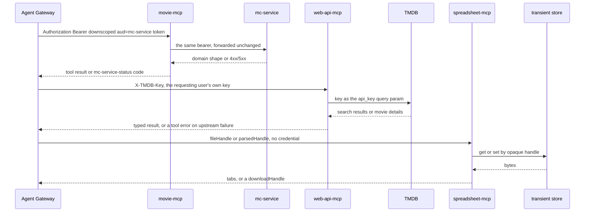

# The three scoped MCP servers

`mcp-servers/movie-mcp`, `mcp-servers/web-api-mcp`, and `mcp-servers/spreadsheet-mcp` are stateless,
streamable-HTTP MCP servers built on the MCP Python SDK 2.x (`MCPServer`, `mcp>=2,<3`) that the
[Agent Gateway](./agent-gateway.md) calls as tools. Each server is scoped to exactly one capability
and one trust boundary, on purpose — the design goal is that a compromised or buggy server can only do
the one narrow thing it was built for, never pivot into domain data it was not given a route to. The
scoping is expressed in three independent dimensions — the tools it registers, the identity it
carries, and the network it can reach — and all three move together.

| Server | Capability it exposes | Identity it carries | Network reach |
|---|---|---|---|
| **movie-mcp** | Thin proxy over [mc-service](./mc-service.md)'s REST API — no domain logic of its own, forwards mc-service's shapes and errors verbatim | The caller's own downscoped `aud=mc-service` JWT, forwarded out-of-band as `Authorization: Bearer` (see [Auth chain](../invariants/auth-chain.md)) | `backend-network` only; must reach mc-service by service DNS; never published to clients |
| **web-api-mcp** | Outbound TMDB metadata enrichment (title search, movie details) for the curator flow | No user JWT. Authenticates to TMDB with the **requesting user's own v3 key**, forwarded per request as `X-TMDB-Key`; there is no shared or operator key | `movie-assistant-mcp-network` (the isolated MCP network) — deliberately **not** `backend-network`; egress to TMDB only |
| **spreadsheet-mcp** | File processing only: parses an uploaded CSV/`.xlsx` into structured tabs, builds an export `.xlsx`, and stashes/fetches a parsed-import context | Token-free — it never receives a JWT (`needs_token=False` at the gateway) | `backend-network` (so the gateway reaches it) + `mcm-bff-network` (so it can reach the transient store); no backend domain call. The standalone `agent-stack.mjs` deployment substitutes `movie-assistant-mcp-network` and attaches the Redis network at runtime |

Each server carries a *different* credential channel (or none), and the gateway attaches them
independently: a movie-mcp call carries no TMDB key and a web-api-mcp call carries no bearer token.

## What each server is allowed to touch

The rule behind the scoping is that a server's identity model follows from what it actually needs to
reach, not from a uniform pattern:

- **movie-mcp** reaches exactly one upstream — mc-service — and therefore needs exactly one thing
  mc-service cannot do without: the caller's identity. Its handlers read the per-call token from a
  request-scoped context variable and fail closed (`PermissionError`) when it is absent, so a
  misconfigured or probing call can never become an unauthenticated mc-service call.
- **web-api-mcp** reaches no internal service at all. It is outbound-only, so it needs no user
  *identity* — but it does need a TMDB *credential*, and that credential is per-user, so it arrives as
  the `X-TMDB-Key` request header and nowhere else.
- **spreadsheet-mcp** reaches no backend service and needs no credential. Its only external resource
  is the transient blob store, which it reads and writes by opaque handle.

Nothing outside the gateway is expected to call these servers: containerized calls are addressed to
Docker service names (`movie-assistant-mcp-movie:8000` and siblings), which is precisely why the
transport configuration below is load-bearing.

## Transport posture shared by all three

All three are built the same way in `src/server.py`:

- `streamable_http_app(stateless_http=True, json_response=True, …)` — each tool call is an independent
  request, so a per-call credential cannot leak into a later request through session state.
- `transport_security=TransportSecuritySettings(enable_dns_rebinding_protection=False)`. The MCP SDK
  auto-enables DNS-rebinding protection for a localhost host, and its `allowed_hosts` list then
  421-rejects a request whose `Host` header is a Docker service name — breaking every containerized
  gateway→MCP call, not just some. The setting is a `streamable_http_app()` parameter on SDK 2.x (it
  was an `MCPServer()` constructor kwarg on 1.x), so `build_app()` passes it explicitly; a bare
  `streamable_http_app()` silently re-enables the protection.
- The SDK's `host` parameter is deliberately **not** passed. It is not a bind address — the bind stays
  `*_MCP_HOST` / `*_MCP_PORT` (defaults `0.0.0.0` / `8000`) at the uvicorn entrypoint — and it is only
  the trigger for the DNS-rebinding auto-enable branch, which an explicit `transport_security`
  already skips.
- Each server's `build_app()` calls `configure_otel()`, and each `tool_span` wraps a tool body in a
  span named `tool.<name>` with `record_exception=False, set_status_on_exception=False`. Spans carry
  the tool name only — never arguments, headers, handles, or credentials. See
  [OTel span exception leak](../gotchas/otel-span-exception-leak.md).
- Every `@mcp.tool()` function declares a precise return annotation (`dict[str, Any]`,
  `list[dict[str, Any]]`). This is not style: on SDK 2.x a bare `dict` annotation yields
  `structured_content: None`, so the assistant silently receives text only with no error logged. The
  annotation also fixes the payload *shape*: a mapping declared `dict[str, Any]` arrives in
  `structured_content` unwrapped, while a sequence declared `list[dict[str, Any]]` is wrapped under a
  single `result` key — which the gateway's result mapping and both server suites unwrap explicitly.
- Both properties are held by one guard test, `scripts/__tests__/mcp-tool-annotations.guard.test.mjs`,
  which AST-parses each server's `src/server.py`: it fails an imprecise annotation and fails a
  `streamable_http_app()` call missing any of `transport_security`, `stateless_http`, `json_response`.
  The parser is structural rather than regex because a regex over `@mcp.tool()` + `def` was measured
  matching only 7 of 9 movie-mcp tools, and because a middleware-wrapped app is exactly the case that
  slipped through the 1.x→2.x migration (see the gotchas).
- The images build from the repository root as context (`docker build -f mcp-servers/<server>/Dockerfile .`),
  on a digest-pinned `python:3.14-slim` base, sync the committed lockfile with `uv sync --frozen --no-dev`,
  and run as the non-root `app` user via `python -m src.server`. All three entries bind
  `0.0.0.0` from their own `*_MCP_HOST` / `*_MCP_PORT` env vars and write nothing to disk.

## movie-mcp — the identity-carrying proxy

movie-mcp registers nine tools. Reads are `list_collections`, `get_collection`, `list_movies` (keyset
pagination), `count_movies` (server-side count), and `get_movie_metadata` (the option values
mc-service accepts for a movie — the organizer derives its media-format and rip-quality toggles from
this rather than holding a copy of domain data; that response is not collection-scoped and carries no
user data, so it is safe for the gateway to cache process-wide). Writes are `create_collection`,
`add_movie`, `update_movie` (full-replacement) and `delete_movie`; each carries an `idempotencyKey`,
forwarded as a standard `Idempotency-Key` header that mc-service ignores today — at-most-once comes
from mc-service's own uniqueness constraints, and the header keeps the contract forward-compatible.
Writes execute only on the agent's approved-resume path.

The wrappers add no domain logic: mc-service's response shapes pass through verbatim. The four
**write** wrappers additionally catch `httpx.HTTPStatusError` and re-raise it as a
`McServiceToolError` carrying a stable `mc-service-status:<code>` sentinel (with a fixed
input-validation `detail` appended for 400/422 only), which is how the gateway classifies a 409
duplicate as `skipped_duplicate` instead of a failure. The **read** tools deliberately do not — the
status error propagates raw, so the sentinel should not be expected on a read failure. That sentinel
only survives because `McServiceToolError` subclasses the SDK's `ToolError`: on 2.x a deliberately
raised tool exception keeps its message while anything else is treated as a crash and its text is
withheld from the model.

Identity capture is a pure-ASGI middleware, deliberately not Starlette's `BaseHTTPMiddleware` — the
latter runs the app in a separate task, which breaks `ContextVar` propagation. The middleware binds
`Authorization: Bearer …` into a request-scoped variable, resets it after the request, and never logs
or persists it. The gateway never sends the user's session token here; it sends the per-call
re-exchange result, so mc-service's existing RBAC and DAC are enforced unchanged.

## web-api-mcp — outbound-only under the user's own key

web-api-mcp registers exactly two tools. `search_title` returns a typed `matchConfidence`
(`none` | `exact` | `ambiguous`) plus result references, and `get_movie_details` returns an enriched
candidate shaped for the mc-service add payload (year derived from `release_date`, poster URL built
from the TMDB image CDN base, language resolved to the original language's English name rather than
the raw ISO code). The two labels are derived, not asserted: zero results is `none`, exactly one is
`exact`, more than one is `ambiguous`. The curator fetches details only on an `exact` match and
offers options on `ambiguous`. TMDB failures surface as MCP tool errors rather than exceptions.

The credential path is the distinctive part. The per-request `X-TMDB-Key` header is the **sole** source
of the TMDB key — there is no shared env/Vault fallback by design — and a call arriving without one
raises a clear configuration error rather than issuing an unauthenticated request that would surface as
a confusing "couldn't find it". A second pure-ASGI middleware binds the header into a request-local
variable and resets it afterwards. The production compose confirms the posture from the other side: it
sets **no** TMDB key for this container at all.

Because TMDB v3 authenticates with an `api_key` **query parameter**, the secret is embedded in every
request URL, so anything that stringifies that URL into a log leaks the user's key. `build_app()`
therefore raises `httpx`/`httpcore` to `WARNING` (dropping the per-request `HTTP Request: GET <url>`
line) and attaches a redacting filter to the root logger and its handlers. This is the one place in the
three servers that configures logging at all — and it exists to *suppress* credential-bearing output,
not to add application logging.

`get_movie_details` appends `release_dates` to the request it already makes and returns the film's real
US certification: only US blocks are read, the **first non-empty** certification wins (TMDB routinely
publishes an empty entry ahead of a real one — one measured film leads with seven), and the value is
accepted only if it is in `{G, PG, PG-13, R, NC-17, NR, Unrated}`, the same vocabulary mc-service
accepts. Anything else — an unrecognised value, an all-empty list, no US block — yields `null`, never
`"NR"`, which is a positive claim that the film was rated not-rated. The extraction never raises: a
missing or malformed block must not fail an otherwise valid add. There is no rename from `PG-13` to
`PG13`: mc-service's wire form is hyphenated (`UsaRating` carries `#[serde(rename = "PG-13")]`) and
renaming would trade a wrong rating for a failed add.

## spreadsheet-mcp — token-free file processing

spreadsheet-mcp registers four tools: `parse_spreadsheet(fileHandle, filename?, sampleSize?)` (pure
structural extraction of tabs, with eligibility as the only semantic judgement — a tab is importable
iff it carries Title, Year, and Content Type headers, where Content Type accepts the aliases
`content type`, `video type`, and `type`, all case-insensitive), `build_workbook(tabs,
multiValueDelimiter?)` (one multi-tab `.xlsx` stored for download), and `stash_parsed` /
`fetch_parsed`, which let a guided import checkpoint a small opaque handle instead of re-serializing
the whole parsed dataset into LangGraph state on every clarification turn.

The parser treats all input as untrusted in the constitution's file-processing sense: it detects the
format from the filename extension and falls back to sniffing (an `.xlsx` is a ZIP container), reads
workbooks with `read_only=True, data_only=True` so no external entity is resolved, and raises
`SpreadsheetParseError` on empty, unreadable, or unsupported input **with no partial result**. Cell
values are coerced to their raw display strings (dates to ISO, integral floats to int), and a
fully-blank row is dropped. `filename` only disambiguates CSV from `.xlsx` and names the single
implicit CSV tab — it is never trusted for logic.

All four tools are called from **pure code** by the import/export nodes, never chosen by the planner,
and always by opaque handle rather than by path or content. The gateway's per-agent allowlist reflects
that: `import_collection` may call `parse_spreadsheet`, `stash_parsed` and `fetch_parsed`;
`export_collection` may call `build_workbook`; neither holds any other spreadsheet tool.

The transient store the server talks to is the only state anywhere in this trio, and its handle
semantics differ per namespace:

| Namespace | Written by | Read semantics |
|---|---|---|
| `import:file:<handle>` | the BFF's upload route | **single-use** — the key is deleted after a successful read, so an upload handle cannot be replayed |
| `export:file:<handle>` + `export:name:<handle>` | `build_workbook` | 15-minute TTL; enough for the user to click download, which the BFF streams |
| `import:parsed:<handle>` | `stash_parsed` | 60-minute TTL, **refreshed on every read** (and not consumed) so a multi-turn import never expires mid-session |

The parser and builder are a matched pair around one hardening rule: `builder` escapes a cell whose text
begins with `=`, `+`, `-`, `@`, tab, or CR by prefixing an apostrophe, and `parser` strips exactly that
guard, so an export→import round trip is symmetric while a legitimate leading apostrophe is preserved.
Sheet names are made Excel-safe and de-duplicated at the builder. The store client is a lazily created
process-shared instance — building a fresh client (and connection pool) per tool call leaks pools and
sockets over the long-lived server.

## Lifecycle, operations and tests

The servers hold no durable state: each tool call is one request/response, handles carry all transient
state, and nothing is persisted beyond the store's TTLs. That is also why the images must be rebuilt
after any source change — see the gotchas.

- **Nx targets** exist per server: `pnpm nx test <server>` (unit), `pnpm nx test:integration <server>`,
  `pnpm nx lint <server>` (ruff + mypy strict), `pnpm nx build <server>` (Docker build tagged
  `<server>:latest`), `pnpm nx lock <server>`.
- **Compose**: each server has its own compose file under `infrastructure-as-code/docker/<server>/`
  with `profiles: [agents]` and no published host port; the `mcm` stack `include`s all three, and the
  production agent stack pins each image by digest. `scripts/agent-stack.mjs` builds all three images
  plus the gateway and publishes loopback-only host ports (8765 web-api, 8766 movie, 8767 spreadsheet)
  purely so host-side callers such as `nx test:integration movie-assistant` can reach the containerized
  servers; inside the stack the gateway reaches them by Docker DNS. That script is the one deployment
  where spreadsheet-mcp sits on `movie-assistant-mcp-network` and is attached to the BFF's Redis
  network at runtime (`docker network connect`) rather than declaring both in its compose file.
- **Gateway wiring**: the gateway is the only thing that joins `movie-assistant-mcp-network` on the
  backend's behalf — it carries both networks so web-api-mcp can be reached without being granted
  backend access. `MOVIE_MCP_URL`, `WEB_API_MCP_URL` and `SPREADSHEET_MCP_URL` each point at a
  container's `/mcp` endpoint. See [Agent Gateway](./agent-gateway.md) for what happens when one is
  unset — that degrade behavior belongs there.
- **Tests**: each server ships a `tests/unit` suite (no live dependency — the middleware, key
  resolution, store TTL semantics, and TMDB response-shape branches are asserted against fakes) and a
  `tests/integration` suite that runs against real infrastructure and never mocks the dependency under
  test. The unit tier is where the branches no real input exhibits can be covered (stubbing the HTTP
  transport is permitted there and only there); the integration tier is the only check that the live
  upstream still returns the shape at all, and neither replaces the other. All three integration suites
  now run in `app-ci` in one step, with `MCM_REQUIRE_LIVE_STACK=1` escalating an unexpected skip to a
  failure — without that flag a skipped suite reports green, which is how two spreadsheet-mcp tests sat
  broken and unexecuted for weeks. movie-mcp's suite additionally asserts the structured-content
  contract across the MCP boundary (a mapping tool unwrapped, a sequence tool wrapped under `result`,
  and a write tool's status sentinel surviving the boundary), and web-api-mcp's is the only
  merge-blocking check of the certification extraction against TMDB's real response shape.
- **Tool contracts** are pinned per server under `specs/012-multi-agent-mvp/contracts/`
  (`movie-mcp-tools.md`, `web-api-mcp-tools.md`), `specs/014-spreadsheet-import-export/contracts/`
  (`spreadsheet-mcp-tools.md`), `specs/059-assistant-add-fidelity/contracts/` (the certification
  extraction rules), and `specs/068-mcp-2x-migration/contracts/mcp-tool-result.md` (the result-payload,
  return-annotation, credential-independence and transport invariants carried across the SDK 1.x→2.x
  boundary).

## Gotchas

- **The identity model is per-server, not uniform.** movie-mcp requires a live per-call user token;
  web-api-mcp and spreadsheet-mcp are deliberately identity-free (one carries a per-user API key
  instead, the other nothing at all). Don't assume a shared auth pattern when adding a fourth server —
  decide identity scope from what the server actually touches.
- **DNS-rebinding protection breaks containerized calls unless explicitly disabled.** All three servers
  (not just two) pass `TransportSecuritySettings(enable_dns_rebinding_protection=False)` to
  `streamable_http_app()`. Omitting it on a new server silently breaks every containerized agent flow,
  and because the SDK's API moved between 1.x and 2.x, a bare `streamable_http_app()` re-enables it
  without any visible change. This is not hypothetical: web-api-mcp wraps its app in
  `TmdbKeyMiddleware(...)` — a third wrapper the migration's edit did not match — so it kept a bare
  `streamable_http_app()` while the other two were converted, and nothing in the unit or integration
  tiers caught it (they drive the server in-memory, never through the HTTP app). It surfaced only in
  CI as `gateway -> web-api-mcp returned 421`. `scripts/__tests__/mcp-tool-annotations.guard.test.mjs`
  now asserts all three kwargs on every server, including the middleware-wrapped call shape.
- **Adding application logging reopens the token-leak surface.** None of the three servers logs request
  payloads, tool arguments, or credentials: movie-mcp's captured JWT must never reach a log line, and
  web-api-mcp's only logging code exists to redact and silence credential-bearing output. The SC-004
  token-leak scan is an AST pass over `agents/movie-assistant/src`, `mcp-servers/movie-mcp/src` and
  `mcp-servers/web-api-mcp/src` that fails on any `logging`/`print` call emitting a token-named
  variable; spreadsheet-mcp is not in the scan roots because it carries no user credential, not because
  it is exempt from the rule.
- **Adding a tool means updating the annotation guard's tool count.** `mcp-tool-annotations.guard.test.mjs`
  asserts the three servers together expose exactly **15** `@mcp.tool()` functions (9 movie, 4
  spreadsheet, 2 web-api) — deliberately, so that a refactor moving tools out of `src/server.py` cannot
  make the loop pass vacuously. Adding or removing a tool, or splitting a server, fails that assertion
  until the number is updated; that is the guard working, not a flake.
- **spreadsheet-mcp must never accept a raw path or a JWT.** Uploads and downloads are referenced only
  by an opaque, short-TTL handle, never by LLM-chosen content or a filesystem path. Widening its tool
  signatures "for convenience" collapses the scoping this server exists to enforce, and the handle —
  not the file — is the capability.
- **Rebuild the affected image after any server-source change.** A stale container runs old code and
  looks indistinguishable from a correctly-degraded tool-free graph on the gateway side; the agent
  stack rebuilds the gateway and all three MCP images by default for exactly this reason.
- **A skipped integration suite is not a passing one.** The MCP integration suites skip cleanly when
  their backing service is absent (right for a credential-less checkout, wrong for CI); in CI
  `MCM_REQUIRE_LIVE_STACK=1` turns an unexpected skip into a failure, and the rule is to add a
  legitimate skip deliberately rather than deselect a red test.

See [Agent Gateway](./agent-gateway.md) for how tool calls are dispatched to these servers (the
allowlist → rate-limit → identity → call → guardrail choke point), `docs/MCM-Architecture.md`'s "MCP
Servers" section for where they sit in the container diagram, and each server's own README
(`mcp-servers/movie-mcp/README.md`, `mcp-servers/web-api-mcp/README.md`,
`mcp-servers/spreadsheet-mcp/README.md`) for the full tool signatures and environment reference.
