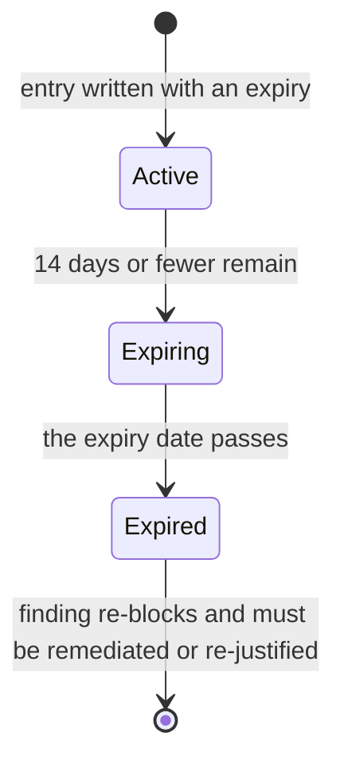

# SAST & SCA static security scanning

Keyless, config-as-code security scanning that runs on every PR. Four scanners cover the full
first-party surface at rest — no SaaS account, no CI secret. All findings funnel into one
normalized report; one `sast` gate in [CI/CD pipeline](./ci-cd-pipeline.md)
(`guardrails.yml`) decides pass or fail.

| Kind | Scanner | Surface |
|---|---|---|
| SAST | **Semgrep** (OSS) | TS/JS tree (BFF + frontend) + Python agent layer |
| SCA | **cargo audit** | Rust deps (`Cargo.lock`) |
| SCA | **pnpm audit** | JS deps (`pnpm-lock.yaml`) |
| SCA | **pip-audit** | Python deps — **all four** surfaces: `agents/movie-assistant`, `mcp-servers/{movie-mcp,spreadsheet-mcp,web-api-mcp}` |

Rust *code* is outside Semgrep's scope — clippy (`pnpm nx lint mc-service`) owns Rust patterns;
cargo-audit covers only Rust *deps*. Config tree: `security/sast/`; full operator procedures in
`docs/runbooks/sast-scanning.md`.

## Normalized severity scale

All four scanners' native severities map onto one **Critical / High / Medium / Low** scale via
[`severity-map.yaml`](../../security/sast/severity-map.yaml), applied by the orchestrator
(`scripts/sast-scan.mjs`), never by the gate. The gate consumes only the already-normalized value,
so changing the mapping never touches gate code. An unmapped native value is a **hard error** —
there is no silent default. cargo/pip advisories with no CVSS score map to `High`
(`unscoredAdvisory`); cargo informational warnings map to `Low`.

## Blocking rule

```
blocking = severity ∈ {High, Critical}
           AND (kind == sast OR scope == runtime)
```

A High/Critical advisory in a **dev/build-only** dep is a non-blocking warning. Dependency scope
is computed per ecosystem (`cargo tree --edges no-dev`, `pnpm audit --prod`, `uv export --no-dev`).
Medium/Low findings are always warnings. SCA **always runs full** regardless of what changed —
a freshly-published advisory can hit an unchanged dep (FR-013), so a path-filter would miss it.

## Allowlist

Blocking findings not yet fixed are triaged into `security/sast/allowlist.yaml`. The match key is
`scanner` equal **AND** `id` equal **AND** `locationPattern` matching the finding's location.
Required fields:

```yaml
- scanner: "pnpm-audit"
  id: "GHSA-example"
  locationPattern: "package@version"   # regex; FORWARD slashes; scope narrowly
  justification: "non-empty rationale"
  addedBy: "engineer-handle"
  # expiry: "YYYY-MM-DD"              # optional; sets a 14-day warning window
```

A blank `justification`/`addedBy` or an invalid `locationPattern` regex is a **gate error** (exit
2), not a silent pass. Suppression is **gate-only**: an allowlisted finding leaves the failure set
but stays visible in `findings.json` and the reports, printed as `allowlisted by …`. Full allowlist
field rules and baseline-seeding steps (`--emit-allowlist`): `security/sast/README.md`.

## Expiry and the 14-day warning window

Allowlist entries with an `expiry` date pass through three states:

| State | What the gate does |
|---|---|
| **Active** — more than 14 days out | Suppresses silently. |
| **Expiring soon** — 14 days or fewer out (inclusive) | Still suppresses; listed under `EXPIRING SOON`. |
| **Expired** — date has passed | Stops suppressing; finding re-blocks with an explanation. |



Both window boundaries are inclusive: exactly 14 days out is already *expiring*, and an entry
suppresses through the whole of its final day. Classification is computed on **UTC date
boundaries** from a `today` passed in by the caller, so a runner's timezone or a DST transition
cannot move an entry between `expiring` and `expired`.

The window length is defined **once** in `scripts/allowlist-expiry.mjs`
(`WARNING_WINDOW_DAYS = 14`) and imported by both gates. A dedicated `--check-expiring` mode runs
**weekly** (Friday) in the `infra-image-scan` workflow and fails on any expiring, expired, or
unmatched entry. This mode is **never** run on pull requests.

## The `sast` job and the two commands that matter

`guardrails.yml`'s `sast` job is keyless (no `${{ secrets }}`), has **no `paths:` filter**, and runs
on every push/PR. In order: install uv + Rust/cargo-audit + `pnpm install`, `uv sync` each of the
four Python surfaces, `check-sast-findings.mjs --selftest`, `sast-scan.mjs --test-rules`,
`sast-scan.mjs` (`--scope changed` on PRs, `--scope full` on push), `check-sast-findings.mjs` (the
gate), then upload the `sast-report` artifact always. Reports land in `security/sast/reports/`
(gitignored): `findings.json` is the gate input; `findings.sarif`, `summary.txt` and
`<scanner>-native.json` are for triage.

## Gotchas

- **`pnpm why <pkg> --prod` without `-r` reports the wrong scope.** Without `-r` the command runs at
  the repo root only and prints nothing for a dep that is runtime-reachable via a sub-package (e.g.
  `mcm-app > @copilotkit/runtime > … > fast-uri`). That empty output is **not** "dev-only" — it is
  the wrong scope. The gate itself uses `pnpm audit --prod` across the whole workspace; when in
  doubt, trust the digest's tag (`[pnpm-audit] runtime` vs `[pnpm-audit/dev]`). This exact mistake
  wrongly accused the gate of a bug on 2026-07-21; the gate was right.

- **`semgrep.dev` is now in the egress allowlist — but adding it to the canonical list is only HALF
  the change (item #222, 2026-08-22).** Semgrep resolves the five `p/*` community packs in
  `security/sast/semgrep.yaml` from its public registry at scan time. That host was unallowlisted
  from day one, so Semgrep failed closed and left `security/sast/reports/findings.json` **empty**;
  `check-sast-findings.mjs` then exited 0 — a green that proved nothing. It was added to
  `.devcontainer/egress-allowlist.json`, but egress is enforced in **two layers**, and only one
  re-reads the committed file by itself: the in-VM iptables half re-applies from `init-firewall.sh`,
  while the **host-side sandbox policy is scoped per sandbox** and does not pick up a new destination
  until an operator re-applies it (`sbx policy allow network semgrep.dev --sandbox mcm` on the
  Windows host — see `docs/runbooks/devcontainer-sandbox.md` § 4). The committed entry does not tell
  you which world you are in. One command does:
  ```bash
  curl -sS -o /dev/null -w '%{http_code}\n' https://semgrep.dev/   # DNS failure / 000 => still vacuous
  node scripts/sast-scan.mjs --scope full --only semgrep            # exit >=2 => registry unreachable
  ```
  A Semgrep result you did not sanity-check this way is the same green either way, which is the
  whole trap. (`api.osv.dev`, pip-audit's feed, has its own entry and its own item #394 for exactly
  this reason.)

- **…but SCA still works inside the devcontainer — `--only` gets you the half that matters.**
  `pnpm-audit`, `cargo-audit`, and `pip-audit` resolve from sources the egress allowlist already
  permits. Use `node scripts/sast-scan.mjs --scope full --only pnpm-audit` to verify a floor
  remediation before pushing. Measured on feature 057: a full-scope run left a 0-finding report the
  gate passed vacuously, while `--only pnpm-audit` proved the advisory was genuinely suppressed
  (then gone). **Check the finding COUNT, not just the exit code** — a 0-finding report and a
  0-blocking-finding report both print green.

- **pip-audit audits the INSTALLED venv, not a requirements file — and audits all four Python
  surfaces.** Since feature 068 pip-audit runs against `agents/movie-assistant`, `mcp-servers/movie-mcp`,
  `mcp-servers/spreadsheet-mcp`, and `mcp-servers/web-api-mcp` — each with its **own** dep graph and
  runtime classification. `uv sync` all four before a local run; an unsynced surface **fails** the
  scan, it is never silently skipped. CI provisions all four venvs. `pip-audit -r <requirements>` resolves
  an ephemeral venv (hangs >11 min, chokes on yanked versions) — do not use that form.

- **pip-audit findings are project-qualified; allowlist `locationPattern`s should be surface-anchored.**
  Since feature 068 each finding's location names its surface: `mcp-servers/web-api-mcp:click@8.5.0`,
  not `click@8.5.0`. An allowlist entry should normally be anchored:
  `^mcp-servers/web-api-mcp:click@.*`. Two static checks enforce this at scan time, before any findings
  are compared: (1) `assertKnownPythonSurfaces` fails the scan if a Python project directory carrying a
  `uv.lock` is not registered in `PYTHON_SURFACES` (`scripts/sast-scan.mjs`) — adding a project without
  registering it produces a hard error, not a silent omission; (2) `assertPipAuditAllowlistShape` fails
  the scan if an anchored `locationPattern` (leading `^`) names a surface that does not exist in
  `PYTHON_SURFACES` — a dead anchor can never match and would silently suppress a real regression once
  one was written. Drop the leading `^` only when you deliberately mean the suppression to span every
  Python surface. **Adding a new Python project?** Register it in `PYTHON_SURFACES` and add a `uv sync`
  step to the `sast` CI job.

- **Unmatched allowlist entries are reported but do not move the exit code.** An entry that matches
  nothing this run is listed under `UNMATCHED ENTRIES`. The trap: pip-audit switched from CVE ids to
  PYSEC aliases; entries keyed on the old CVE ids silently matched nothing rather than expiring. The
  `--check-expiring` weekly run catches this, but the entry's own expiry date did not advance the
  warning — read `UNMATCHED ENTRIES` whenever an advisory you thought was accepted re-blocks.
  Unmatched detection only runs for scanners that produced at least one finding, so a skipped,
  failed or clean scanner never flags its whole entry set — and entry identity for this check is a
  positional key (`<index>:<scanner>:<id>`), not the advisory id, because one id can appear in
  several entries.

- **The `--check-expiring` step runs `always() && github.event_name == 'schedule'`, and its SAST half
  must tolerate an ABSENT report.** `--check-expiring` runs inside `infra-image-scan`, which never
  produces `security/sast/reports/findings.json`. `check-sast-findings.mjs` announces the ENOENT on
  stdout and synthesises `{ findings: [], reportAbsent: true }`; a report that *exists* but is
  unparseable is still exit 2, and a report missing `generatedAtScope` is still a hard error. This
  was not cosmetic: that absent-report object used to throw inside the gate-scope asymmetry check,
  and `bash -e` then skipped the infra-image expiry check on the next line — **both expiry tiers were
  silently dead from 2026-09-12**, reported only as `expiry_step=failure` (item #484's `always()` is
  what let the step run and expose it). The check is report-only, so it can never mask a red gate or
  turn one green.

- **Before raising a floor, check whether the lockfile is the lever, not the override.** Since
  feature 058 the gate prints an `OVERRIDE LEVERS` advisory section for any finding whose package
  already carries an override in `pnpm-workspace.yaml`. Example output:
  ```
  OVERRIDE LEVERS (advisory — does not affect this gate's result)
    Already permitted by an existing override — REFRESH THE LOCKFILE:
      • hono 4.12.29 — the override `>=4.12.25` ALREADY PERMITS 4.12.34; the lockfile is what pins
        4.12.29. The override needs no edit — refresh the lockfile: `pnpm update hono --lockfile-only`.
  ```
  **This distinction cost ten days of red once already.** `fast-uri`'s override `>=3.1.4 <4` already
  permitted the published fix 3.1.5; the lockfile pinned 3.1.4. The fix predated the advisory by three
  days. A four-week allowlist acceptance was written for something `pnpm update fast-uri --lockfile-only`
  would have cleared. `nanoid` repeated it eight days later. If the section says *refresh the lockfile*,
  editing the override is wasted work — the range is already correct. The section is advisory only and
  never changes the gate's exit code; it also prints for non-blocking findings, so a cheap fix can be
  made before severity promotes it into a blocker. Most of these are now cleared weekly by Renovate's
  `lockFileMaintenance` (see below) without anyone reading an advisory.
  The lever logic itself lives in `scripts/override-lever.mjs` (pure, no I/O, no clock): it
  deliberately returns nothing rather than guessing when the override map or a version cannot be
  read, because an aid that cannot read its input must not obstruct the gate it prints beside.

  **Two gotchas about Renovate `lockFileMaintenance` (feature 058, 2026-08-13):**
  - Its `schedule` key in `renovate.json` looks like a duplicate of the top-level schedule and
    **is not** — the option carries its own default (`before 4am on monday`) that beats the inherited
    value, and that window intersects neither cron under either DST offset. Delete the key as redundant
    and the refresh is enabled but can never fire, silently. `renovate-workflow.guard.test.mjs` fails
    if the key goes missing.
  - These refresh PRs now run `app-e2e`: a bad transitive floor is a **build-time** break that
    `nx test` passes straight over, so the E2E tier is the only one that catches it.

  What remains manual is the case the bot cannot propose: a floor that must rise past its own ceiling.
  Renovate essentially never raises the lower bound of a keyed override — and when it rewrites one it
  half-bumps — so the `check-override-consistency.mjs` guard is the answer.

- **An override floor has TWO halves and both must move.** Entries in `pnpm-workspace.yaml`'s
  `overrides:` map are keyed-range-on-range: `fast-uri@<3.1.5: '>=3.1.5 <4'`. Raise the value and
  leave the key stale, and the override reads as remediated but no longer excludes the vulnerable
  span. **Renovate produces exactly this mismatch by construction** — its built-in npm manager
  parses the key as an opaque dep name and cannot rewrite it. `scripts/check-override-consistency.mjs`
  runs on pull requests and fails a mismatched pair by name, so a half-remediation cannot merge
  even though it appears correct. Adding a custom Renovate manager does not fix this (the file is
  already managed; a second manager double-manages it) — the guard is the answer.

- **Remediate, do not re-date.** Deleting or extending an `expiry` converts a time-box into a
  permanent suppression. The legitimate exception — no published fix exists — requires the evidence
  written into the `justification`. Check npm/crates/PyPI before assuming: on feature 057 both
  "needs an acceptance" advisories turned out to have published fixes.

- **`p/secrets` stays off.** `secret-scan.mjs` is the sole owner of credential detection (FR-006).
  Do not double-gate with Semgrep's `p/secrets` ruleset. It is absent from
  `security/sast/semgrep.yaml` by design, and Semgrep runs with `--metrics=off
  --disable-version-check` so telemetry stays off by configuration rather than by network policy.

- **A red gate labelled `TRANSPORT/SERVICE ERROR` is a scanner outage, not a finding — re-run it.**
  Three of the four scanners reach a third party over the network: `pip-audit` queries **osv.dev**,
  `cargo-audit` fetches the **RustSec advisory DB**, and `pnpm audit` queries the **npm registry**
  advisory endpoint. Any of them can fail for a reason unrelated to this repository. Since item #449
  `sast-scan.mjs` classifies failures against a narrow `TRANSIENT_SIGNATURES` list (socket errors,
  HTTP 429/50x, DNS failures, git fetch failures) and re-attempts **3 times with exponential backoff
  (2 s, 4 s)** before issuing a verdict. What you see when it fires:
  ```
  [sast-scan] [pip-audit] transient transport/service failure on attempt 1/3 — retrying in 2000ms.
              This is NOT a security finding. Cause: …
  ```
  and when all attempts are exhausted:
  ```
  [pip-audit] TRANSPORT/SERVICE ERROR — … Failed all 3 attempt(s) over 6.0s …
              Failing closed: a scanner that could not run must never report clean.
  ```
  Three properties are deliberate and must not be simplified away:
  - **Fail-closed is preserved.** After retries are exhausted the job still fails. Item #449 was
    about not failing on the first blip, never about tolerating a scanner that cannot run.
  - **The classification is deliberately narrow, and every signature is anchored.** A finding's own
    title often contains "error", "timeout" or even "Service Unavailable"; only signatures that can
    only originate below the scanner's own logic are listed. The HTTP-status forms require the
    **status code** next to the phrase (item #495) and `Read timed out` requires its terminating
    period (item #499) precisely because the bare forms match advisory titles. An unrecognised
    failure is treated as real and fails immediately — so a genuine red is not delayed by three
    identical tracebacks. `scripts/__tests__/sast-scan-retry.guard.test.mjs` pins both directions.
  - **The mechanism is shared, not copied.** Since item #495 the classifier and retry driver live in
    `scripts/lib/scanner-retry.mjs`, used by both `sast-scan.mjs` and `infra-image-scan.mjs` (Trivy's
    vulnerability-DB fetch). The hard part is the signature list, and a signature learned from one
    scanner's outage is the one the other needs next. That module also owns `readTail`, because
    truncating a scanner's output from the head hides the HTTP status that names the remedy.

  See `docs/runbooks/sast-scanning.md` § "When the gate goes red and NO finding was involved" for
  the full measured incident (run 3328, 2026-09-13) that produced this.

- **No caching yet.** `actions/cache` is not mirrored on the self-hosted runner, so cargo-audit is
  compiled fresh each CI run (~2–3 min). A monthly-keyed cache of `~/.cargo/bin/cargo-audit` and
  `~/.cargo/advisory-db` is a future optimization. `cargo-audit` is installed `--locked --version`
  pinned, because `--locked` alone locks its dependencies, not the tool that decides whether a Rust
  advisory blocks a merge.

- **Paths in `locationPattern` must use forward slashes.** Allowlist entries are matched against
  paths normalized to forward slashes so they are portable across the Windows dev host and the Linux
  CI runner. A pattern written with backslashes matches nothing on the runner and passes silently on
  the Windows side — the gate accepts it, but the finding re-blocks in CI.

- **A rule that has gone BLIND produces the same gate output as a remediated one — read `RULES THAT
  COULD NOT RUN`, not just the finding count.** A Semgrep rule that could not execute is recorded in
  `errors[]`, never in `results[]`, so it contributes zero findings. Its allowlist entry lands in
  `UNMATCHED ENTRIES` with wording that implies the code is clean. Measured on `main` 2026-09-06:
  `gha-curl-pipe-shell` (from `p/owasp-top-ten`) re-parses a step's `run:` block as Bash via
  `metavariable-pattern` — but nearly every run-step here is wrapped in the ci-log-step heredoc
  (feature 042), which that sub-parser cannot read. Result: **36 errors, 0 findings**, while six
  `curl … | sh` lines sat in the workflows unexamined.

  `sast-scan.mjs` groups Semgrep's `errors[]` by rule into `scanners[].blindedRules`, and the gate
  prints a `RULES THAT COULD NOT RUN` section listing each blinded rule with its error and file
  counts; any `UNMATCHED` entry whose rule appears there is annotated `↳ this rule could not run`.
  This is advisory and never moves the exit code — these rules error on every run, and a
  gate that goes red on a standing condition stops being read. Attribution has to read the error
  **message** as well as the structured `rule_id`: tail-pinned semgrep 1.169.0 populates `rule_id`
  on an internal matching error but not on a `PartialParsing` one, where the rule name appears only
  in prose — 36 errors versus 3 on the run that prompted the fix. The replacement coverage is
  `mcm-ci-curl-pipe-shell` (item #224, `security/sast/rules/mcm-ci-curl-pipe-shell.yaml`), a
  text-level rule using `pattern-regex` / `pattern-not-regex` — no sub-parser, so the heredoc is
  irrelevant to it. `scripts/__tests__/ci-curl-pipe-shell-rule.guard.test.mjs` fails if anyone
  "improves" it back into a `metavariable-pattern` form.

- **Accepted `curl | sh` installers are named in the rule, not in `allowlist.yaml`.** An allowlist
  entry keys on `path:line`: accepting the six existing lines there is either line-pinned (every edit
  above them re-blocks an unrelated PR) or file-wildcarded (a NEW `curl | sh` in an already-listed
  workflow is suppressed unexamined). The accepted hosts live in `mcm-ci-curl-pipe-shell`'s
  `pattern-not-regex` instead; adding an installer means editing that list with a comment explaining
  why. Currently accepted: `sh.rustup.rs`, `astral.sh/uv/<VERSION>/install.sh` (version-pinned path
  only — the unversioned form is deliberately excluded), and `get.maestro.mobile.dev` (no versioned
  endpoint exists; the pin is enforced by `renovate-workflow.guard.test.mjs` instead).

- **On a pull request, only the CHANGED targets are scanned — a rule cannot fire on a file that was
  never handed to Semgrep.** `--scope changed` builds an explicit target list from
  `git diff --name-only` against the PR base, filtered by `isScanTarget()`; the
  `security/sast/.semgrepignore` exclusions are re-applied by hand because an explicit target
  bypasses Semgrep's `--exclude`. A rule's own `paths:` cannot widen what a PR is gated on.

- **Workflow YAML was not a scan target on pull requests until item #224.** Before that, workflow
  YAML was absent from that list, so a `curl … | sh` added to a workflow on a PR
  was gated on nothing and first appeared on the post-merge full scan. Both
  `.forgejo/workflows/*.y[a]ml` and `.github/workflows/*.y[a]ml` are now included. The scope was
  widened deliberately — not every `.yml` tree-wide, which would drag compose files, Komodo syncs,
  and the security config tree into a scan against packs written for TS/JS/Python code.

- **Dockerfiles were the same defect a second time, and the response is now a standing blocking
  guard rather than a third comment.** `--scope changed` matches code extensions and the two workflow
  trees; a Dockerfile has **no extension**, so PR #422's new Dockerfile was handed to nothing, its
  `guardrails / sast` was a real passing run, and the post-merge full scan reddened `main` on
  `dockerfile.security.missing-user-entrypoint` until an accepted-risk entry landed (item #426).
  `DOCKERFILE_PATH_RE` now admits Dockerfile spellings (`Dockerfile`, `Dockerfile.prod`,
  `toolchain.Dockerfile`) without substring-matching `.dockerignore` or prose.

  Because that class of bug is invisible from a green gate, the gate itself now reports it:
  `GATE-SCOPE ASYMMETRY (blocking on push, invisible on a pull request)` lists blocking SAST findings
  whose paths are not scan targets, and — unlike every other diagnostic section — **it moves the exit
  code** (its own blocking path, separate from the ordinary "this code is wrong" failure). Four
  properties matter:
  - It counts **suppressed** findings too, not just un-allowlisted ones. The minio Dockerfile case was
    an accepted risk with an allowlist entry, so the gate was green and the asymmetry was invisible
    *because* everything looked fine.
  - It runs only on a `--scope full` report; `generatedAtScope` is therefore **required**, and a
    report missing or carrying an unknown value is a hard `GateError` rather than a silent skip.
  - SCA findings are excluded — the three audit scanners ignore `--scope` entirely and always run over
    the whole lockfile set, so they cannot be scope-asymmetric.
  - The remedy it prints is to widen the changed-scope filter (`CODE_EXT_RE` / `WORKFLOW_PATH_RE` /
    `DOCKERFILE_PATH_RE` in `scripts/sast-scan.mjs`), **not** to add an allowlist entry — an allowlist
    entry is exactly what concealed item #426 for a merge cycle.

  The whole PR-visible surface was then enumerated once, by testing every full-scan finding's path
  against `isScanTarget`. After Dockerfiles were added, **zero blocking findings sit on a file class a
  pull request cannot see**. Two classes remain deliberately invisible and are recorded rather than
  closed: `.json` (e.g. `renovate.json`) and non-workflow `.yaml` (e.g. `pnpm-workspace.yaml`), which
  between them carry 22 findings that are *all* Medium and so report-only on a push too. That residual
  is a **snapshot of today's rule set** — if a pack update promotes one of those rules to ERROR, the
  gap reopens silently and the enumeration method must be re-run.

- **`--test-rules` enforces fixtures; without it they were decoration for months.** The four original
  custom rules shipped with `semgrep --test` fixtures, but `--test-rules` appeared in no workflow, no
  Nx target, and no script until item #224 — so the `ruleid:`/`ok:` annotations had been decoration
  in the tier that decides whether a High blocks a merge. `sast-scan.mjs --test-rules` now runs ahead
  of the scan in the CI `sast` job. It also fails on a rule with **no** fixture — `semgrep --test`
  skips unfixtured rules silently and still prints `N/N ✓` (measured: `4/4 ✓` with five rule files
  present), which is the same false assurance as a blinded rule. A code rule's fixture shares its stem
  as `<rule>.ts` / `<rule>.py`; a YAML rule's fixture must be named `<rule>.test.yml`, because a bare
  `<rule>.yaml` would be loaded as a second rule by `--config security/sast/rules/`. The Semgrep pin
  lives only in `sast-scan.mjs` (Renovate tracks it there), so the workflow step carries no second
  copy to drift.

See [CI/CD pipeline](./ci-cd-pipeline.md) for how the `sast` job sits in the
`guardrails.yml` workflow, `security/sast/README.md` for the full config reference and custom
MCM rule definitions, and `docs/runbooks/sast-scanning.md` for the triage playbook when `main` goes
red on an advisory you never touched.
