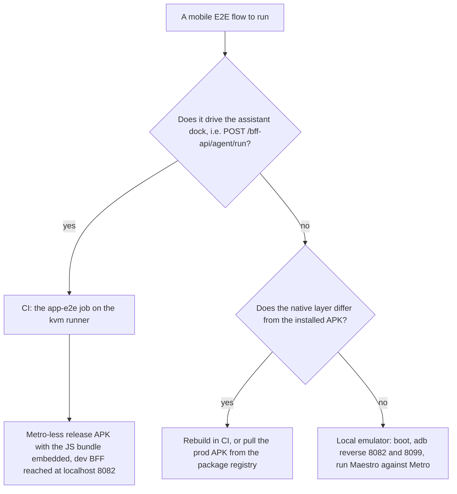

# Android emulator & APK builds (mobile E2E)

Mobile E2E has a hard split by flow type. **Agent flows** (anything driving the assistant dock →
`/bff-api/agent/run`; the `agent-*.yaml` / `assistant-*.yaml` files) must run in CI, in the
**`app-e2e` job of [`.forgejo/workflows/app-ci.yml`](../../.forgejo/workflows/app-ci.yml)** — the job
ported from the GitHub-era `android-e2e.yml`, a filename that no longer exists in this repository.
`app-e2e` builds a **Metro-less, standalone embedded-bundle APK** (`APK_VARIANT=release`,
`APK_ABI=x86_64`), runs it on a KVM emulator on the `kvm` runner, and drives the flows per-file through
`scripts/ci-mobile-agent-flows.sh`. The reason for the split is not the emulator: the local Windows
path runs agent flows against the **Metro dev server**, which OOM-crashes after only a handful of agent
`/run` calls and then shows a black screen / `status 0` "RN networking issue" that reads as an app bug.
**Non-agent flows** (login, CRUD, sort, browse) run fine on the local emulator. The retained Docker
Desktop dev container also runs the emulator natively via Linux KVM — see
[Containerized dev environment](./devcontainer.md).

The flow-type decision, and the build decision that follows from it.

CI's APK is standalone: the JS bundle is embedded and `EXPO_PUBLIC_BFF_NATIVE_URL=http://localhost:8082`
plus `EXPO_PUBLIC_KEYCLOAK_NATIVE_URL=http://localhost:8099` are inlined at build time, so the app
talks to the containerized dev BFF and gateway and **never to Metro**. The emulator step runs on an
API-34 `google_apis_playstore` `x86_64` image — the Play Store image is load-bearing, not cosmetic:
it ships Chrome, whose Custom Tabs service hands Keycloak's `mcm-app://` redirect back to the OS. The
AOSP image has only a WebView shell, which drops that redirect and leaves login unable to complete.
The emulator job `adb reverse`s 8082 and 8099, then runs gating → enable-anthropic → the agent flows →
disable, followed last and specially by the non-agent `admin-settings-access` flow.

- **When the mobile half runs:** every push to `main` and every `workflow_dispatch`; on a
  `pull_request` only when the diff touches the job's `mobile` filter (`frontend/**`, `agents/**`,
  `mcp-servers/**`, `backend/**`, `packages/**`, the workflow itself, or the two Maestro scripts
  `scripts/ci-mobile-agent-flows.sh` / `scripts/maestro-run.sh`) or the PR carries the `mobile-e2e`
  label. Otherwise the PR still gets the web E2E and integration tiers from the same job and skips the
  ~35-minute emulator half. That filter must stay a strict subset of the job's `app` filter — a path in
  `mobile` but not in `app` can never fire.
- **The build guards its own bundle.** Before the emulator starts, `app-e2e` asserts that
  `localhost:8082` appears inside `assets/index.android.bundle` of the produced APK. The string is not a
  source literal anywhere, so its presence proves the `EXPO_PUBLIC_*` env was re-inlined in *this*
  build; a stale Metro transform cache on a persistent runner otherwise silently bakes an older URL and
  the failure surfaces much later, at login. The build therefore disables the Gradle daemon
  (`GRADLE_OPTS=-Dorg.gradle.daemon=false`), because a reused daemon keeps the env it started with.
- **A missing KVM capability fails the job; it never skips the mobile suite.** The job verifies
  `/dev/kvm` is present in the job container before the emulator step and exits 1 with an `::error::`
  naming the fix if it is not. The rationale is the same one that makes the bundle guard worth having:
  a silently skipped mobile half is indistinguishable from a passing one. `/dev/kvm` comes from the
  runner config's `container.options: --device /dev/kvm` (plus the `ci` user's membership in the `kvm`
  group), **not** from a udev rule — the GitHub-host-VM approach does not apply inside a container.

## Gotchas

- **Agent flows still prefer CI even inside the dev container.** The decision rule is unchanged
  regardless of where the emulator runs; only the *transport* to reach the OOM-prone Metro server
  differs (tunnel vs. `10.0.2.2`).
- **`10.0.2.2` works fine for TCP on this machine — the old claim that QEMU networking is broken was
  wrong (corrected 2026-08-23).** An older note wasted a session; it was refuted with a negative control
  (a port with no listener returns `rc=1` while a real port returns `rc=0`), because "nothing answered"
  alone never distinguishes a broken gateway from an empty port. The real split is **by service, not by
  transport**: **Metro must be reached at `10.0.2.2:8081`** — an RN 0.85 debug build resolves its
  dev-server address to the QEMU gateway by default and does not consult `adb reverse tcp:8081` for
  that fetch (proved by reading the app's own sockets). (`scripts/maestro-e2e.mjs` takes the other
  route: after every `pm clear` it writes the app's `debug_http_host` pref as `localhost:8081`, which
  *does* go through the reverse tunnel. Either way Metro must be listening on host port 8081.)
  **Keycloak and the BFF still require `adb reverse`**, because `KC_HOSTNAME=http://localhost:8099` pins
  Keycloak's issuer and session cookies to `localhost`; reaching the same server at `10.0.2.2:8099`
  loses them mid-flow with `error="cookie_not_found"`. Re-run `adb reverse tcp:8082 tcp:8082` and
  `adb reverse tcp:8099 tcp:8099` after every emulator restart.
- **A stale port-8081 holder hangs the app on the splash screen with no error at all.** The handshake
  succeeds and no response ever comes — no redbox, no log line. A stale VS Code dev-container forward is
  the common culprit; check the *owner*, not reachability:
  `Get-NetTCPConnection -LocalPort 8081 -State Listen | ForEach-Object { (Get-Process -Id $_.OwningProcess).ProcessName }`.
- **`EXPO_PUBLIC_*` values need `--reset-cache`, and the only trustworthy check is the served bundle.**
  Metro's transform cache does not key on inlined `EXPO_PUBLIC_*` values, so without a reset you keep
  serving the old URLs. Verify by grepping what Metro actually emits rather than assuming:
  `curl -sS "http://localhost:8081/.expo/.virtual-metro-entry.bundle?platform=android&dev=true" -o /tmp/b.js`
  then expect one `localhost:8082` hit and zero `10.0.2.2:8082` hits.
- **If you need the production APK (public BFF/Keycloak hosts baked in), don't rebuild — pull it from
  the generic package registry.** `cd-deploy`'s `prod-apk` job publishes every release APK as
  `mcm-app-android:<expo.version>-<sha7>` with a `sha256` sidecar, fetchable by URL with a
  `read:package` token. The `upload-artifact` copy also exists on the run page, but this forge exposes
  no artifact API, so only a human clicking through the UI can retrieve that one. The shelf is
  **count-based** — the newest five versions, pruned at publish time and roughly 109 MB each — so pin
  anything that must outlive that window as `<version>-keep`. Recipe:
  [Homelab server setup §6.7](./server-setup.md).
- **Before rebuilding the APK, check whether the installed APK is already native-compatible with HEAD.**
  A pure JS/Metro change (including a new pure-JS dependency with no native module) never needs a
  rebuild — diff `frontend/mcm-app/package.json`, `frontend/mcm-app/android/` and
  `frontend/mcm-app/app.json` against the commit the APK was built from; an empty diff means
  download-and-install, skipping a ~20-minute build. But note that **Maestro launches the installed APK
  via `am start` and never rebuilds it**: after any real native change (Expo SDK / RN bump, new native
  module, `expo prebuild`) the old native binary runs against the new JS bundle and **crashes at
  startup**, not at test time. `expo prebuild --clean` alone neither builds nor installs.
- **CI is the recommended APK build path, not the local Windows build.** A Linux CI runner has no
  Windows path-length wall, and both Forgejo builds use `APK_VARIANT=release` (JS embedded) — there is
  no CI debug/Metro-attached APK. In `app-e2e` the disk-free step is required, not cosmetic, and it has
  **two halves**: `docker image prune -af` and, added 2026-10-03, `docker builder prune -f
  --reserved-space 50GB`. `image prune` never touches the build cache, which had reached **375 GB
  (355 GB reclaimable) of a shared 914 GB disk** on the ci daemon; `--reserved-space` keeps the most
  recent 50 GB so warm layers still hit and rebuilds stay fast. Without the reclamation the native build
  exhausts runner disk and dies mid-compile with no clean error. The `|| true` on both lines is
  deliberate — a prune that finds nothing must not fail the step — but it is **not a licence to be
  wrong**: `--reserved-space` was checked against the **docker 27.5.1** CLI these jobs install,
  precisely so a bad flag could not become a silent no-op.
- **Windows hits a hard `CMAKE_OBJECT_PATH_MAX` (250-char) wall building RN ≥0.85 native modules.** The
  real cause is CMake replicating the full absolute source path under the object directory; this repo's
  path plus the deep pnpm layout (`node_modules/.pnpm/<pkg>@<ver>_<hash>/node_modules/<pkg>/…`)
  overflows the cap (worst measured: 381 chars). `LongPathsEnabled` does NOT fix this — the limit is
  internal to CMake, not Windows. `scripts/build-apk-short-path.ps1` automates the short-root junction +
  `node-linker=hoisted` recipe and **always reverts** it afterwards (hoisted breaks Metro/jest module
  resolution); it is a slow, fragile fallback, and the complete recipe plus its rejected alternatives
  are in the runbook.
- **The dev container can emulate but cannot build the APK.** The SDK and an `android-34`
  `google_apis` `x86_64` system image are baked into the toolchain image, and the privileged DinD
  container exposes the host `/dev/kvm`, so a headless emulator boots with hardware acceleration. The
  Gradle wrapper distribution is baked too, but Gradle still resolves the Android/Maven plugin graph
  from the open internet at build time, which the container's default-deny egress firewall blocks —
  pre-seeding that graph is impractical, so a release APK comes from CI or a build container with its
  own egress. Agent flows here still prefer CI.
- **Two emulator-state traps that look like app bugs.**
  - **A second MCM build steals the OAuth redirect.** `frontend/mcm-app/app.json` sets
    `"scheme": "mcm-app"`, so *every* installed build claims `mcm-app://native-auth-callback`
    regardless of bundle id. With a pre-rebrand build still installed alongside the current one, Android
    shows an "Open with" chooser mid-login that Maestro cannot answer and the flow times out. Check with
    `adb shell pm list packages -3`; resolve by uninstalling the stale build. CI never sees this — its
    emulator is fresh.
  - **A live Chrome SSO session breaks the *next* login.** If Keycloak has already authenticated the
    browser, the helper still types credentials into the form and Keycloak rejects the submission with
    `error="already_logged_in"`, redirecting back with **no `code`**. `scripts/ci-mobile-agent-flows.sh`
    handles this: it runs `adb shell pm clear com.android.chrome` and re-skips Chrome's first-run
    experience before `admin-settings-access`, which logs in as a *different* seeded user than the agent
    flows. That reset also re-establishes the FRE, so it is repeated on each retry.

For the BFF-container modes an agent/non-agent flow runs against once launched, see
[E2E testing](./e2e-testing.md); for how the `app-e2e` job fits the rest of the pipeline, see
[CI/CD pipeline](../projects/ci-cd-pipeline.md). The full session-startup ritual, the exact CI
trigger/watch commands, the flow-by-flow CI list and retry policy, and the complete Windows build-wall
workaround recipe live in the authoritative runbook, `docs/runbooks/android-emulator.md`.
