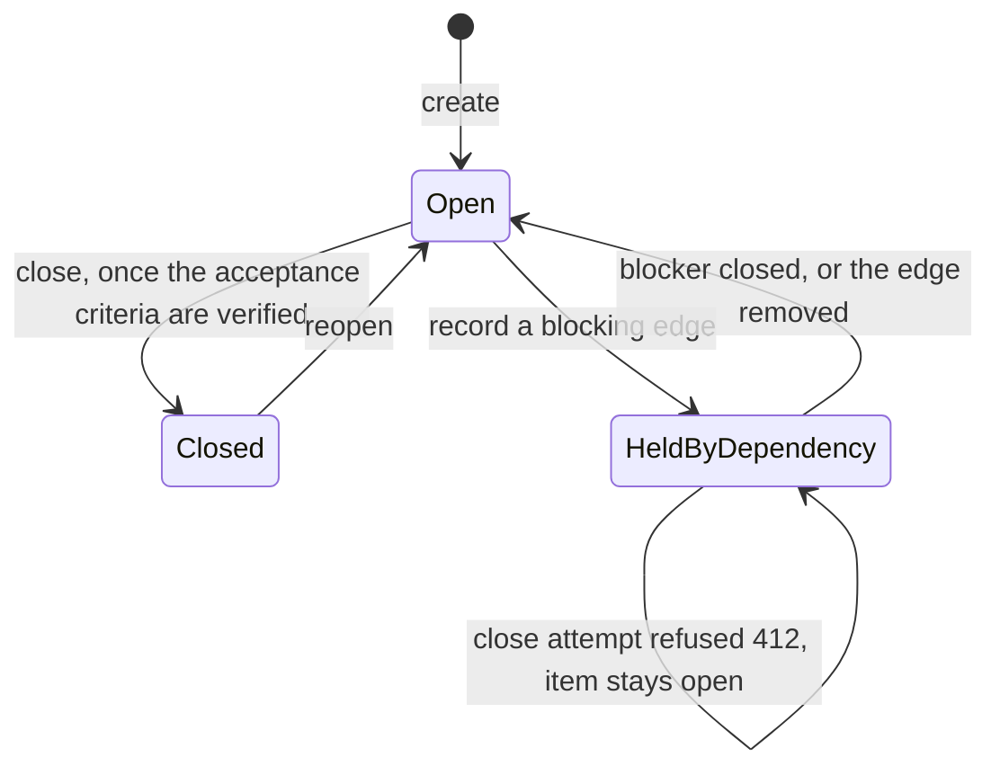
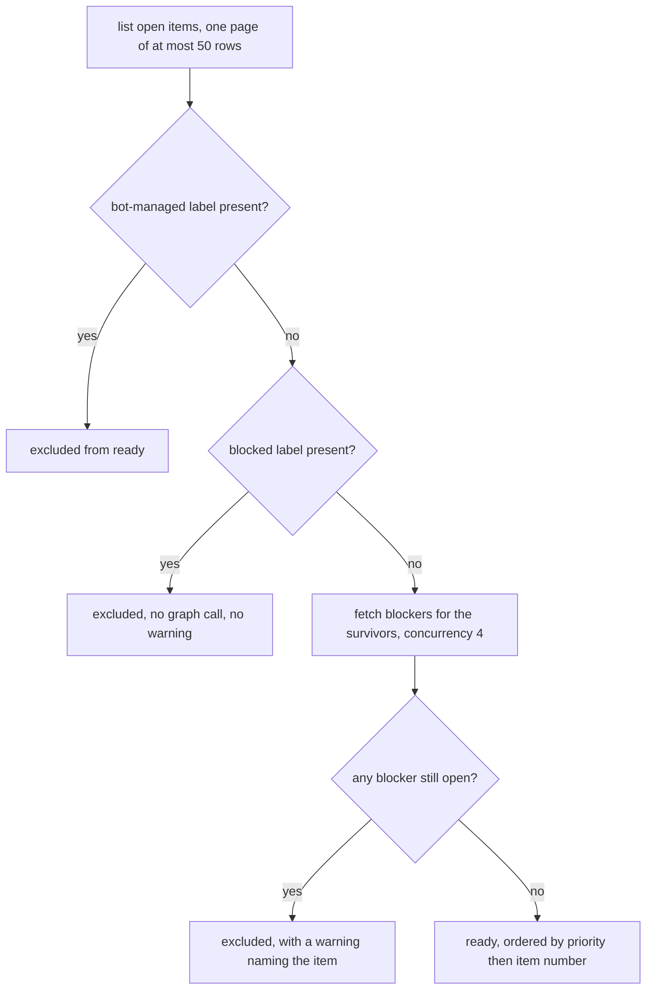

# The agent-driven backlog (Forgejo Issues)

The backlog is the repository's own Forgejo issue tracker. The operator works it in the web UI; the
coding assistant works it with `scripts/backlog.mjs` from inside the dev container. There is no second
source of truth — `tasks.md` stays the *in-feature* decomposition, the tracker is the *cross-feature*
backlog, and a backlog item is an **input** to `/speckit-specify` rather than a replacement for it. That
is not a mandatory gateway: small `type/chore` and small `type/bug` items may be implemented directly
where the SDD gate permits, and only anything larger is marked `status/needs-spec` and sent through the
full spec → plan → tasks lifecycle.

No backlog operation produces a commit, branch, pull request or CI run: issue changes are HTTP calls, so
a one-line backlog edit costs nothing. Ten labels (`type/*`, `priority/*`, `status/*`) carry the
machine-readable state; milestones map to feature directories (`NNN-slug`); an unmilestoned item is the
free backlog, which is the normal case.

## The item lifecycle, and the one transition that traps

Open, blocked and closed backlog state, and the closure rule the forge enforces server-side. Closing is
not its own verb — it is a state change on `update`, and the tooling's interface is the exit code rather
than the wording of the refusal.

## How `ready` decides

Ready-work selection: the label is a pre-filter that wins when it is present, and the dependency graph is
consulted only for the items that survive it.

## Gotchas

- **The write credential's reach is account-wide by decision, so the CLIENT-SIDE guard is the bound.**
  `MCM_FORGE_ISSUE_TOKEN` carries `write:issue` + `read:repository` and is deliberately not restricted to
  this repository. Every write therefore asserts that its target owner/repo matches the origin remote and
  refuses otherwise — checked once against any `--repo` value and again at the request boundary, so a
  mis-built path cannot slip through. Comparing the derived slug against itself would be a tautology that
  protects nothing; the guard only means something against a target that came from elsewhere.
- **Reads prefer the write credential, on purpose.** The write token is used for reads whenever it is
  present, and the read-only fallback exists only for its absence — falling back on every read would keep
  the tool working while the write credential is broken, hiding the breakage until the first write. With
  it absent or whitespace-only, reads still succeed, every write exits 3 naming the variable, the remedy
  and the read-only consequence, and the container still starts. The two tokens stay separate so widening
  one cannot silently upgrade the diagnostics path to write capability: see
  [CI self-serve diagnostics](./ci-diagnostics.md).
- **`permissions` in the repository payload is NOT a scope check.** It reports what the owning *account*
  may do with the repository, not what the token may do — an item-write-only token on an admin account
  reports `admin: true` and still cannot push a commit. No endpoint the token can reach reports its own
  scopes (`/user` → 403, no `read:user`), so the scope split is proven behaviourally: the write sequence
  succeeds under the write token and the same four write verbs return 403 under `MCM_FORGE_TOKEN`. That
  negative half is the only check that the read-only diagnostics token has not been widened.
- **An unknown label name in a filter is silently ignored and returns the UNFILTERED set** — a typo reads
  as "matched everything". The tooling resolves every label and milestone name against the repository
  first and refuses an unknown one locally. With a real label the filter is correct and fails closed, and
  multiple label values are AND, not OR (measured 2026-08-08).
- **`q` fails closed while `labels` fails open**, and that inconsistency is what makes a label typo easy
  to **trust wrongly**: in the same measured run `q=zzz-nonexistent` returned 0 rows because `q` *is* honoured
  server-side, while `labels=no-such-label` returned the whole repository. Resolving the name locally,
  rather than re-filtering after the fetch, is the only form that surfaces the typo instead of masking it.
- **Pull requests are issues internally**, so a listing without `type=issues` returns them too — 143 rows
  where 1 was correct on this repository. Numbers also share ONE sequence, which is why prose says
  "item #N" and why merge-time `closes #N` auto-closing is deliberately not used: a mistyped number could
  close an unrelated item.
- **A page caps at 50 rows** (default 30), and totals come from `x-total-count`, never from the row count.
- **`ready` answers from at most one page of open items, and says so when it did.** Without that notice the
  genuinely highest-priority item could lie outside the window — and "what should I work on next" is
  exactly the question where a silently partial answer is worse than no answer.
- **`list` defaults to `--state open`**, so an item that "vanished" from a listing is usually the default
  filter rather than a deletion.
- **Closing a blocked item fails with 412** `cannot close this issue because it still has open
  dependencies`, and the tooling surfaces that distinctly from other failures. **The dependency endpoint
  needs `{owner, repo, index}`** — a bare `{index}` answers 404 `IsErrRepoNotExist`, naming the repository
  rather than the missing fields. A dependency cycle is refused before the call, because every item in one
  becomes permanently uncloseable.
- **A blocking edge is directed, and both directions are readable.** `dep N --blocked-by M` and
  `dep M --blocks N` record the same edge from either end, and `show` prints `blocked by` and `blocks`
  separately — so "what is waiting on this item" is answerable without walking the graph by hand.
- **`status/blocked` is a hint in principle, but a PRESENT label wins in `ready`.** The graph is fetched
  only for the items that survive the label pre-filter, so for a labelled item it is never consulted and
  the label alone decides: a **stale** `status/blocked` label silently hides an item and prints **no
  warning at all**. The graph decides only for unlabelled items, and that is the single case the tool
  warns about — an unlabelled item with an open blocker. When an item unexpectedly vanishes from `ready`,
  look for a leftover label with `list --label status/blocked`. The label is never silently corrected,
  because a label quietly diverging from the graph is how the state forks.
- **`status/needs-spec` is the bridge into the SDD lifecycle.** It means the item is too large to implement
  directly and needs `specs/NNN-*/` spec → plan → tasks first; applying the label *is* the instruction, not
  a prelude to starting to code. See [spec-driven development](../process/spec-driven-development.md).
- **The task fan-out is the one caller that writes many items in a session.** `/speckit-taskstoissues`
  files one item per task, encodes the task ordering as blocking edges, and needs `setup-milestone` first —
  but it is optional by design, because `tasks.md` remains the authoritative in-feature decomposition and a
  70-task feature becomes 70 items in a shared tracker. The primary flow runs the other way: items feed
  `/speckit-specify`.
- **A milestone must exist before it can be used**, which is why `setup-milestone NNN-slug` is what makes
  `create --milestone` usable at all — an unknown milestone name is refused locally, for the same reason a
  label is. No milestone is not an error; it is the free backlog, and the normal case.
- **The issue form only takes effect from the default branch**, so on a feature branch `validate-form`
  reports that no issue form is in effect — expected, not broken.
- **`validate-form` decides from the ENUMERATED templates, not from the validator.**
  `issue_config/validate` answers `{"valid": true}` on a repository with zero forms — it validates the issue
  *config*, not the YAML — so treating it as a form parser would have reported a healthy form on a
  repository that has none, the same fail-open shape as the label filter. The real assertion is that
  `issue_templates` enumerates the form, printed with the ids of the fields that actually collect input, so
  a silently dropped section is visible too.
- **The item form fixes four sections** — context, acceptance criteria, affected components,
  discovered-during — plus type and priority dropdowns, so an operator-filed item and an assistant-filed
  item are structurally identical and neither has to guess at the other's intent.
- **Projects boards have no API in this build**, so board columns are invisible to the assistant. Labels
  are the shared truth; treating the board as authoritative silently forks the state.
- **Item #29 is Renovate's Dependency Dashboard** and carries `status/bot-managed` — never edited, closed
  or swept, because Renovate rewrites its body on its own schedule. Bulk operations generally need an
  explicit operator instruction: item history lives in the forge's database, not in git, so there is no
  `git revert` for a mass close.
- **No command accepts a set of item numbers.** One item per invocation, by design, so a mass edit is a
  deliberate sequence rather than one flag away — the procedural half of "no bulk operations without an
  explicit instruction".
- **Bodies and comments come from a file or stdin only, never argv.** There is deliberately no
  `--body "text"` flag, because argv is visible in shell history and in a process listing. An empty body is
  refused — an item with no context is not a backlog item — and anything over the 64 KB cap is refused
  rather than truncated.
- **A concurrent edit is reported, not overwritten.** If the item's timestamp moved on the forge between the
  read and the write, the divergence is printed with both values and the write is aborted, so the
  operator's newer intent is never discarded. The check is skipped when this invocation has already written
  labels itself, because its own write moves the timestamp.
- **A duplicate is refused rather than filed twice.** `create` reports an existing open item whose title
  matches after trimming, lowercasing and whitespace collapsing. That is exact-after-normalisation, not
  fuzzy: a reworded duplicate still gets through, which is what the guidance to look before filing covers.
- **The API base is derived from the git remote, and the port is the trap.** Only
  `git remote get-url origin` carries scheme, host and the port the API is served on; a base built from the
  registry hostname alone fails as a transport error that reads exactly like a blocked firewall. That is
  why unreachable-forge (exit 5) is kept distinct from an authorization refusal (exit 4), so nobody hunts a
  credential problem that is really a missing port.
- **Distillation omits what it did not fetch rather than defaulting it to empty.** A listing-shaped item
  carries no `blockedBy`/`blocks`/`comments` keys at all, because an empty array would read as "no
  blockers" when the truth is "nobody asked"; the API's own comment count is surfaced instead, and that is
  true without a second call. Every emitted string is redacted and control-character-stripped, so the forge
  host renders as `<forge>` and a hostile issue title cannot inject terminal escapes.
- **Exit codes are the interface**: 0 ok · 1 unexpected · 2 usage/validation · 3 missing credential ·
  4 authorization · 5 transport. A caller branches without parsing prose, and both the blocked-close
  refusal and an unknown label name arrive as 2.
- **Not an Nx target**, unlike the gate scripts — an Nx invocation costs ~60 s in this workspace against
  ~0.09 s direct. See [Nx as the universal task runner](../invariants/nx-task-runner.md). Its unit
  tests still run under Nx via `preflight`, and in CI's guardrails `naming` job as
  `node --test scripts/__tests__/*.test.mjs`: that job runs in a container with no forge access and no
  token, so those tests must stay deterministic, offline and token-free, driving exported pure functions
  or injected fetch/env doubles. The live-forge verification is a one-off manual exercise in the feature's
  quickstart, not a unit test.

## Where the how lives

`--help` is the full flag reference, exit codes and measured quirks in one screen — deliberately kept out
of the agent skill so the skill stays inside its token budget. Provisioning, the credential table, the
label taxonomy and the diagnosis table are in
[docs/runbooks/backlog.md](../../docs/runbooks/backlog.md). The decision rules for *when* to file, close
or label are in [.claude/skills/forgejo-issues/SKILL.md](../../.claude/skills/forgejo-issues/SKILL.md).
The bot owning item #29 has its own operating page: [Renovate dependency bot](./renovate.md).
