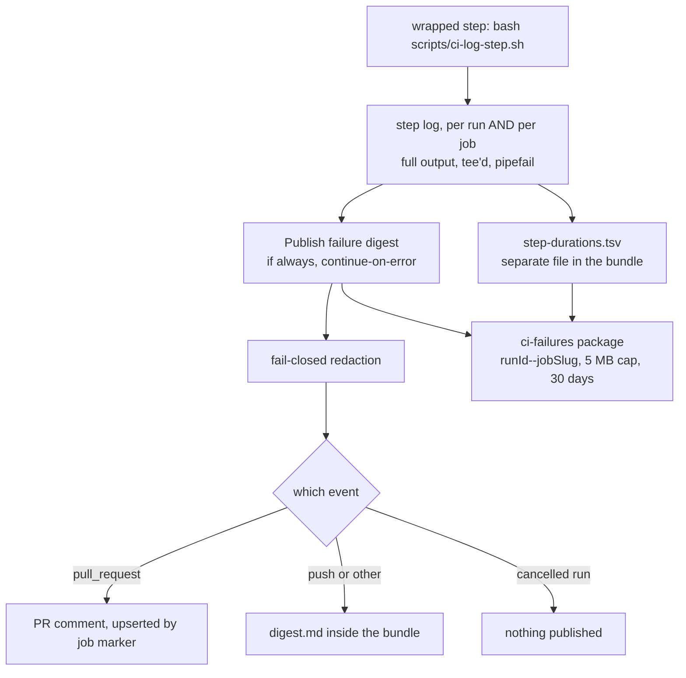

# CI evidence pipeline (producing the evidence)

The forge's API serves **no log, artifact or per-run-jobs endpoint**, so this machinery inverts the
usual direction: each job **pushes** a small, redacted, distilled digest into a channel the API can
already read, and pushes the full evidence into the generic package registry as a bundle. Everything
here exists so that `scripts/ci-status.mjs` — or a human with a terminal — can answer "why did this
fail" without pasting a log out of the web UI. It began as feature 042 and has been extended by nearly
every feature that instrumented a job.

This is the **producing** half. Reading CI — `ci-status` subcommands, exit codes, the states the API
misreports, tokens, opening and verifying a PR — is [ci-diagnostics.md](ci-diagnostics.md); start there
when you are diagnosing a run, and come here when you are adding a job, wrapping a step, or asking why
a piece of evidence is or is not in a bundle. The operator procedures and the full arithmetic live in
[the runbook this summarizes](../../docs/runbooks/ci-evidence-pipeline.md).



What produces what: a wrapped step writes a log, the in-job digest step reads it and publishes through
one of three channels, and the bundle carries the full evidence.

## The digest

One `if: always()` + `continue-on-error: true` step per job — `Publish failure digest`, running
`scripts/ci-failure-digest.mjs`. Measured 2026-10-10: **22 such steps across the ten
`.forgejo/workflows/*.yml` files**, one per job in every workflow that has jobs. (The runbook and
`check-ci-digest-coverage.mjs`'s header still say "16 jobs in 6 workflows" — that was the count when the
machinery was built, and the rule has been enforced on every job added since. The count grows; the rule
does not.)

| Event | Channel | Identity |
|---|---|---|
| `pull_request` | PR comment, **upserted** | `<!-- ci-digest:job=<job> -->` |
| `push` / other | **inside the bundle** as `digest.md` | derived: `{runId}--{jobSlug}` |
| **cancelled run** | **nothing published** | suppressed by design |

- **There is no commit status on the normal path.** `POST /repos/…/statuses/{sha}` returns **403** for
  `CI_DIGEST_TOKEN` — it needs `write:repository`, which is most of the privilege that made the
  deploy PAT unacceptable across every job. Measured 2026-07-20. Since the status only ever *named* the
  bundle and the reader already knows the run and job, the reader derives `{runId}--{jobSlug}` itself.
- **Use `run.id`, not `index_in_repo`.** They differ (986 vs 985 on the run that proved it), and only
  `run.id` matches the `GITHUB_RUN_ID` the bundle was keyed with.
- **Upsert is keyed by job**: one job failing three times leaves **one** comment, edited twice. Two
  different jobs leave two comments.
- **Excerpts are tail-biased and capped** at 200 lines / 32 KB per source (bytes, not UTF-16 units), and
  the digest itself shows at most three sources — the bundle carries all of them. Failures surface at
  the *end*; a head-biased excerpt shows the boot banner. Truncation is always stated.
- **A cancelled run publishes nothing.** Its contexts read as `failure`, so without the suppression a
  single rapid re-push would upsert a failure comment for every cancelled job. The newer run publishes
  the truth.
- **Degradation is stated, not silent.** Container jobs have no Docker CLI, and only `app-ci / app-e2e`
  writes `~/mcm-ci-last-failure/` today, so "no container health" is normal — it appears under
  **Not collected** rather than as an empty section.
- **When `CI_DIGEST_TOKEN` is empty the digest degrades rather than failing**: it falls back to the
  run-provisioned token, posts a `ci-digest/<job>` commit status carrying the failing step and a short
  excerpt, and marks itself `degraded: true`. With both credentials absent it prints the digest inline
  and exits 0 — a broken digest must never mask, replace or delay the real job result.

### Redaction is fail-closed

A PR comment is a **far more visible surface than a run log**, so this is the feature's primary leak
control (`scripts/ci-digest-redact.mjs`). Everything published is redacted first, then **verified**: the
`secret-scan` detection rules are re-run over the redacted output, and any surviving match **drops that
excerpt entirely**. Losing a log excerpt is acceptable; leaking a credential into a PR comment is not.
The forge host is matched by *shape*, never embedded as a literal, so the redactor cannot leak the host
it protects — and the host's address range is rewritten for the same reason, because CI logs carry
resolved addresses constantly.

Two properties are easy to get wrong and both are load-bearing. The rewrite patterns must be **global**:
`secret-scan`'s regexes are detectors and carry no `/g`, so a naive `.replace()` rewrites the first
occurrence and publishes every one after it. And the fail-closed pass is deliberately high-signal —
prefix-anchored provider tokens, PEM blocks — because dropping every log would defeat the feature; a
novel secret shape in an uncovered form remains the residual risk. Redaction was **broadened after
measuring what the newly wrapped steps actually emit**: wrapping more steps widened what CI captures,
and two shapes of twelve probed (URL userinfo, and a credential passed as a command-line flag) passed
through unredacted and were not caught by the backstop either.

## The evidence bundle

The digest is deliberately small. For a failure its excerpt cannot explain, the reader fetches the
bundle (`ci-status … --full`); the how is the [sibling page's](ci-diagnostics.md) business.

- Stored in the generic package registry as `ci-failures` / **`{runId}--{jobSlug}`** — **per run *and*
  job**, so two jobs failing in one run keep separate bundles instead of overwriting each other.
- **5 MB cap**, sized for **agent context**, not link time. (It was ≈40 s to retrieve while the tailnet
  was throttled; post-fix that is under a second, so context is the only binding constraint.)
  Overflow trims the **largest source first**, keeps the tail, and records the truncation — a bundle
  never misrepresents itself as complete.
- **30-day retention**, pruned opportunistically at publish time; there is no scheduled pipeline for it,
  so if failures stop entirely, expired bundles linger until the next failure publishes.
- `--full` writes the bundle to the scratchpad **and prints the path, not the contents**.
- The **digest is embedded in the bundle it describes**, and the manifest is planned *before* the digest
  is rendered — the only ordering in which the digest can honestly name a source the cap dropped.
- **Publish happens before upload**, so the bundle can record whether publication actually reached its
  channel (`meta.publish = {published, channel, reason}`). The bundle is readable over the API and the
  job log is not; without that field a failed publish is visible only to a human in the web UI, which is
  how one diagnosis stayed unproven across two smoke runs. If the *upload* itself fails, the job-log line
  is the only surviving signal — which is why both exist.

### It packs `container-logs/` recursively, and names what it cannot carry (item #241)

The packer originally read `~/mcm-ci-last-failure` with one flat `readdirSync` filtered to `*.log`,
`_ps.txt` and `*.health.json`, so a **directory** matched nothing and was dropped without a word.
Feature 062's device diagnostics land in exactly such a directory, so the Maestro view hierarchy, the
failure screenshots and the emulator logcat never reached the bundle — while the digest printed
`maestro debug output — not present`, which reads as *the capture did not happen*. Measured on run
**2049**: the runner held the whole tree; the retrieved bundle held 69 files, none of them from it, and
diagnosing it needed an out-of-band SSH to the CI host — the step this bundle exists to remove.

- **Nested files are admitted by format** (`.log .txt .json .ya?ml .md .xml .html`), because Maestro
  writes the hierarchy and command list as JSON, not `.log`. The **flat** rules are unchanged on
  purpose: widening them would collect every `*.health.json` twice.
- **Screenshots travel base64** as `{path, base64}` manifest entries (3 files / 1 MB each / 2 MB total,
  `❌`-marked captures first) and are **never trimmed** — half a PNG is a corrupt file, not a smaller
  screenshot, so a binary that will not fit is dropped whole.
- **Ranking beats the cap.** Max-min fairness alone loses a 300 KB screenshot to a 20 MB mongo log the
  moment the screenshot exceeds an equal share, so step output, `_ps.txt` and the device evidence are
  allocated first out of a **priority reserve of half the cap**, itself **fair-shared**. Bulk device
  dumps are demoted *below* ordinary container logs **by size (over 512 KB)**, not by basename. Both
  rules come from run **3434** (2026-09-15), a deliberately red mobile run on which the earlier design
  — measured only on a fixture — dropped the view hierarchy and the failure screenshot while carrying a
  multi-megabyte logcat dump: demotion by exact basename missed the name Maestro actually writes, and a
  first-come-first-served reserve repeated the very starvation defect max-min fairness had just fixed
  for the pool below it.
- **Every absence is stated**, in the digest and not only in the manifest: sources the cap dropped whole,
  captures over the per-file or budget ceilings, files in an unsupported format, and — reader-side —
  entries past the reader's own ceiling. The device-capture line is **three-way**: carried / captured on
  the runner but not folded into `container-logs` / genuinely not present.

The generalizable lesson: the walk, the naming of drops and the three-way message were all correct on
the real run. What the fixture could not test was the *interaction* between real file sizes and the
allocation order — a fixture whose ordering does not reproduce the ordering that caused the bug tests
nothing.

### `logs/mc-service.log` is ordered by completion, not by start (item #568)

**mc-service logs its domain event at the END of the handler**, in the same emit as the response, so a
slow request's `collection_created` appears in the file *after* everything that happened during it. The
line order is completion order; the interesting order is almost always **start** order, and the only
thing that recovers it is the `duration_ms` on the `request completed` line.

This is not a footnote. Item #568 was filed on a confident, fully-reasoned cross-worker race hypothesis
built by reading four adjacent lines in file order, and its proposed fix was a substantial redesign of
the E2E fixtures. Subtracting the durations showed the opposite: the "later" write had started *earlier*,
the collection was already visible when the assertion read it, and the DELETE was the test's own
teardown firing after the assertion had already failed. There was no concurrent actor and nothing to
isolate. Extract the window as a table rather than reading raw lines — the token payload drowns the
fields that matter.

Two fields settle "who did this" without inference:

- **`authorized_party` separates the actors** even though every E2E worker acts as the same subject:
  `movie-collection-manager` is the browser/BFF session (a test or its teardown); `agent-gateway` with
  `mc-service` in the audience is the agent's downscoped write token.
- **`preferred_username` names the WORKER** (`e2e_w3_…` is worker 3), which is what distinguishes a
  test's own teardown from another worker's — reliable since feature 054 US4 (item #169) made setup mint
  one identity per worker.

And one scoping rule ends most cross-worker theories outright, so reach for it first: **mc-service scopes
collections by `owner_id = token.subject`**, so one worker cannot list, read or delete another worker's
collection at all. A foreign delete is not a race to be narrowed, it is impossible. Two lines carrying
different `subject` values cannot be acting on the same collection, whatever their timestamps say — and
sequential-looking ObjectIds prove nothing, since ids differing by one only mean concurrent creations in
the same second.

## Per-step durations, and the generated ceiling table (item #338)

`app-e2e` runs every wrapped step under a per-step ceiling so a **hang fails the STEP** and the digest
still publishes, instead of killing the JOB and destroying the evidence. That mechanism works; its
*value* did not. The original job-wide 2700 s was calibrated against an `app-e2e` **job** duration
misread as a `web-e2e` **step** duration, leaving it roughly 5x looser than the evidence supported —
and it could not be corrected, because **nothing recorded how long a step takes**: the digest publishes
only on failure, and this forge exposes no job logs.

- **The sample.** `ci-log-step.sh` writes one row per wrapped step per *invocation* into
  `_step-durations.tsv` (`step · seconds · exit · ceiling`) on **every** run, success or failure — a
  distribution built only from failures describes the failures, not the step. The digest uploads it as
  **`step-durations.tsv`, a separate file in the bundle's version**, not inside the bundle archive:
  reading 25 full bundles to extract 25 tiny tables is a calibration nobody performs twice.
- **A killed step is CENSORED, not observed**, and is excluded from every percentile — it is reported in
  its own `cens` column. A step killed at its ceiling lasted exactly the ceiling, so folding it in makes
  each ceiling a function of the previous one: a ratchet that tightens on every kill until the ceiling
  fails runs that would have passed. An ordinary *failure* is not censored — a step that failed an
  assertion at 300 s really did take 300 s.
- **The sample is what the retention window holds.** Bundles expire after 30 days and every bundle
  published before item #338 carries no durations file at all; those versions are skipped silently, so
  `runs sampled` is the honest count and is not the number requested.
- **Coverage is asymmetric by design.** `app-e2e` publishes on every run, green (counts bundle) and red
  (digest bundle). Every other job publishes only on failure, because making durations a counts source
  would turn ~1 package version per run into ~20.

`scripts/ci-step-ceilings.tsv` replaces the single job-wide value with **one ceiling per step**, each
row carrying the sample it came from. It is **generated, never hand-edited**. The rule is
`max(observed) x 3`, rounded up to a whole minute, floored at **300 s**, and applied only to a step with
at least **10 observed (non-killed) samples**:

- **`max`, not p95** — p95 of 40 runs discards the two slowest observations, and those are exactly the
  runs a ceiling must not fail.
- **x3 is the largest retry bound any wrapped step has**, not a taste call: the mobile flow script runs
  each flow under `max=3` and Playwright is `retries: 1`. A sample's maximum already contains whatever
  retries fired in it; multiplying by the bound covers the run where they all do.
- **The 300 s floor exists because `timeout 0` means NO LIMIT.** Twenty steps run in under a second;
  `0 x 3 = 0` would delete the guard by its own arithmetic, and a 2 s step bounded at 6 s would red on
  ordinary contention.

**`CI_STEP_TIMEOUT_SECONDS` survives as the BACKSTOP, not the ceiling** — it bounds a wrapped step with
no calibrated row, so a table miss can never fall through to unbounded and restore the hang-kills-the-job
defect. It stays at 2700 s because an uncalibrated step's legitimate duration is by definition unknown,
and the asymmetry still holds: a fast **false** red costs a ~35-40 min re-run on this capacity-1 runner;
a slow **true** failure costs only the difference between that bound and the job's ceiling. The table's
commented `ON THE BACKSTOP` block currently lists three steps — `app-e2e-collect-container-logs` (n=2),
plus `app-e2e-build-images` and `app-e2e-bring-up-backup-destinations`, which feature 073 split out and
which have no observations yet.

The wrapper resolves the row with a **whole-name match on field 1** (`web-e2e` and `web-e2e-model` differ
only by a suffix, and six steps share an `app-e2e-install` prefix, so a substring match would hand one
step another's bound), skips comment rows (a `# web-e2e` parsed as a ceiling of 0 would mean `timeout 0`
— the guard removed by its own data file), locates the table relative to *itself* rather than `$PWD`, and
falls through to the backstop on an unreadable table rather than failing the step.

Three guards in `scripts/__tests__/ci-log-step.test.mjs` keep this honest: **#338k** re-checks the
below-the-job-ceiling arithmetic for *every* row, **#338m** fails a row whose basis does not state its
sample, and **#338n** fails if a wrapped `app-e2e` step is neither calibrated nor recorded as
deliberately on the backstop.

### Recalibrating, and the three traps

The triggers are a step killed at its ceiling for legitimate work, `#338n` failing the build, a step made
materially slower on purpose, or the runner itself changing (capacity or hardware moves every figure at
once, so the whole table is stale, not one row of it). A ceiling nobody is complaining about does not
need refreshing just because time passed. The procedure — read the distribution first, regenerate with
`durations --propose`, review the **diff** rather than the file, verify with the tests before committing
— is in [the runbook](../../docs/runbooks/ci-evidence-pipeline.md).

- **NEVER hand-edit a ceiling.** The guards check that a basis is *present* and that the value clears the
  job ceiling; **neither checks that a ceiling matches its own basis.** Measured: a row stating a 280 s
  maximum beside a hand-typed 60 s ceiling passes all 37 guards. That is item #338's original defect — a
  figure whose stated justification describes a different measurement — reproduced inside the file built
  to prevent it. The file says `GENERATED, do not hand-edit` in its own header for this reason.
- **A step that keeps timing out gets LOOSER, not tighter.** Kills are censored, so a step killed often
  *loses observations* and can fall under the `n >= 10` floor; it then drops off the table onto the 2700 s
  backstop, recorded as a commented row (measured shape: 9 observed + 31 killed). That is the anti-ratchet
  working as designed — you cannot calibrate a step from its own kills — but it looks like the row went
  missing rather than like it was deliberately retired.
- **`--runs 40` is an upper bound, not a promise.** Once the table is older than the retention window,
  the runs its basis names no longer exist: the figures remain correct, but they stop being checkable.
  Regenerating is the only way back to a basis a reader can verify.

## `cd-deploy` is a special case

`cd-deploy` is `workflow_dispatch`-only, so it **posts no commit status**. `ci-status status --sha` and
`ci-status failure --sha` therefore show only the `guardrails` / `app-ci` contexts and report "no failed
jobs" for a cd-deploy failure — they enumerate commit-status jobs, and cd-deploy has none.

- **Find its per-job state** via `GET /actions/tasks` (filter `name` = `build-deploy` / `prod-apk`).
  `prod-apk` is non-blocking — nothing `needs` it, so a flaky APK build never blocks the deploy.
- **Read its failure digest** by fetching the bundle **directly by run + job**, not via a commit status,
  with the read-scoped package token. Every build/scan/promote/webhook/probe/rollback step is now wrapped
  with `ci-log-step.sh`, so the digest names the failing step and shows its output — before that it fell
  back to stale app-e2e evidence.
- **Trivy `build-deploy` blocks on a FIXABLE Critical**, and a recurring class of those is **not an app
  dependency**: `node-tar` is bundled by both npm and corepack's pnpm inside the `node:*-alpine` base of
  the BFF image. `pnpm why <pkg> --prod -r` printing nothing is the tell that it is a base-image or
  package-manager bundle. The fix is a real elimination — remove the unused managers from the BFF runner
  stage, which invokes neither — not a Trivy suppression; verify a Docker-image fix locally with a Trivy
  image scan gated on fixable Criticals.
- **Direct dispatch is the escape hatch.** `app-ci`'s `trigger-cd` blocks on a *failed* `app-e2e`, so a
  flake stops the auto-deploy; dispatching `cd-deploy.yml` with `deploy: true` bypasses the gate. Since
  item #230 the gate also declines for two *correct* reasons — the commit is no longer the tip of `main`,
  or nothing deployable changed since the last deploy — so **read the `cd-dispatch / trigger-cd` status
  before concluding a deploy was lost**, and dispatch directly only when it genuinely was. A successful
  deploy pins the new image digests in the tracked deploy env files with a `[skip ci]` promotion commit.

## Hardening (untrusted-PR threat model)

CI logs and bundle contents are attacker-influenceable (a PR author controls what runs in CI), the digest
is published to a more visible surface, and it is read on a developer's machine. Added 2026-07-21 after a
security review:

- **`--full` refuses a decompression bomb** — the reader caps gunzip output and the download; the 5 MB
  *writer* cap is not trusted.
- **Reader output strips terminal control characters** — a log line or a spoofed PR comment cannot inject
  ANSI/OSC escapes (cursor rewrite, clipboard, hyperlink spoof) into your terminal.
- **Digest authenticity is not assumed** — any PR commenter can type the `<!-- ci-digest:job=X -->`
  marker. The reader treats a marker as a digest only at the **start** of a comment and surfaces the
  **comment author** so an unexpected one is visible. Marker presence is not proof.
- **Injection defences in the published digest** — excerpts use a dynamically-sized code fence, so a
  printed fence cannot break out into live markdown, and embedded `ci-digest` markers are defanged so a
  log echoing another job's marker cannot hijack that job's comment.
- **Redaction is broadened**, as described above; the fail-closed pass also withholds excerpts containing
  provider-token prefixes, and health and bundle-meta fields run through it too.
- **`CI_DIGEST_TOKEN` is reachable by PR CI** (standard secrets-on-PR exposure), mitigated by its narrow
  scope — issue and package writes, never `write:repository` or push-to-main. Requiring review approval
  before secrets-bearing PR jobs run is the standing consideration.

## Coverage is enforced, at three levels

The digest is one step per job, so it decays the moment a job or workflow is added without it.
`scripts/check-ci-digest-coverage.mjs` — a `guardrails / naming` gate — fails CI if any job lacks a
guarded digest step, turning silent erosion into a red build with the job named. It also requires the step
to wire `CI_DIGEST_JOB_STATUS`, because a dropped env var would otherwise make the job publish nothing on
a real failure.

- **Job level.** Opt out only with `# ci-digest-exempt: <why this job cannot meaningfully publish a
  digest>`, inside the job block. A blank reason is rejected. So adding a CI job forces a choice: give it
  a digest step, or write down why it does not need one.
- **Step level.** "At least one wrapped step per job" was not enough: before feature 051, **85 of 136
  `run:` steps** produced no capture, and `guardrails / naming` had 16 `run:` steps with 2 wrapped —
  **neither of them a gate** — so a naming-gate failure published the logs of two unrelated steps. Every
  `run:` step must now be wrapped or carry its own justified `# ci-log-step-exempt:` marker.
- **Command level (item #177 variant 4).** Coverage was still decided by a substring test against the
  whole block, so a multi-line `run:` block passed if the wrapper appeared anywhere in it and every
  command above that line ran unwrapped — **no log, and no `_failed-step` marker either**, so the digest
  named nothing. Measured 2026-08-29: three live steps had a failure path outside their wrapper and the
  gate reported all three clean — `cd-deploy / prod-apk` (`exit 1` on a domain guard),
  `devcontainer-image / build-publish` (`: "${REGISTRY:?…}"`), and `wiki-maintain / maintain` (`exit 2`
  on a malformed dispatch input). Same class as the step-level defect, exactly one level further down:
  1 of N **commands**.

The two markers are **not interchangeable**: `ci-digest-exempt` is job-scoped (this job publishes no
digest), `ci-log-step-exempt` is step-scoped (nothing worth capturing), each with its own blank-reason
check. A step-level `ci-digest-exempt` must not satisfy the capture rule, and a job-level
`ci-log-step-exempt` must not silently cover every later step in the job.

### The gate checks PRESENCE, not REACHABILITY

This is a stated limitation, not an oversight, and it is written down because a known limit beats a
general check nobody trusts. The gate reads YAML and shell **as text**: it can answer "is this command
inside the wrapper?" — it cannot answer "**can the wrapper actually run where this step runs?**". Four
ways the wrapping has been present and non-functional have shipped, none of them found by the presence
rule:

| Variant | Why the wrapping was inert |
|---|---|
| `working-directory:` on the step | the wrapper is repo-root-relative, so bash exits 127 before it runs — no log **and** no marker |
| Command begins with an env-var assignment | that is shell syntax, not argv; the wrapper tries to execute the assignment |
| The job's `Checkout` is conditional | the script is not on disk on the branch where checkout is skipped |
| A command runs outside the wrapper in the same block | the wrapper runs fine; it is simply not what executes the failing command |

The first three are shape-specific regression cases against the real workflows, not a general property —
a fifth environmental variant would ship the same way. The fourth is a general rule but still a
**heuristic**: it reads shell line by line rather than parsing it, so a command hidden inside a
single-line `case … esac`, or behind an `&&` on a control-flow line, is not seen. Treat all of it as a
floor, and **when a job dies in seconds with no digest content, suspect the wrapper's preconditions
before suspecting the code**.

## Step logs are read IN-JOB — they do not need to survive teardown

A diagnosis that reached a PRD and nearly cost a redesign got this wrong, so the wrong story is kept next
to the right one.

**The tempting wrong story.** `ci-log-step.sh` writes to `$HOME/mcm-ci-step-logs/`, which for a
container-executor job lives inside the container and is destroyed at teardown. So — the reasoning went —
containerized jobs must be undiagnosable, and the fix is to relocate the logs somewhere the host can read
them.

**What is actually true.** The digest is **not a host-side reader**. `Publish failure digest` is a step
*inside the same job*, and in the container executor every step of a job runs in the **same container**.
The digest therefore reads the step logs from the same `$HOME`, before teardown, and pushes the evidence
out over the forge API. Nothing in that path requires the files to outlive the container. It reproduces
end to end in a temp `HOME` with a synthetic run id — but note the **probe trap**: an env assignment
written *after* `node` on the command line is argv, so the script reads it back as undefined, prints
nothing, and looks like it disproved the point.

**The measurement that misled.** "`~/mcm-ci-step-logs/` on the runner contains captures only from the
host-executor jobs" is **true, and irrelevant**. Host-executor jobs leave their logs lying on the host;
container jobs consume theirs in-job and take them with them. The absence of container-job leftovers is
evidence about **leftovers**, not about **diagnosability**. Reading it as the latter is the whole mistake.

### Instrumenting a step

```yaml
# one command
run: bash scripts/ci-log-step.sh <log-name> <command> [args...]

# a body that needs a shell — the heredoc form needs no escaping, so quotes, expressions and shell
# constructs pass through byte-for-byte
run: |
  bash scripts/ci-log-step.sh <log-name> bash -e /dev/stdin <<'CI_LOG_STEP'
  : "${SOME_VAR:?set it}"
  <command>
  CI_LOG_STEP
```

- **Use `bash -e`**, matching the runner default, *not* `-euo pipefail`: adding `-u` and `pipefail` to a
  block that never had them can turn a green step red on an unset variable or a SIGPIPE. Use no `-e` at
  all when the block reads `$?` and dispatches on it.
- **`pipefail` inside the wrapper is load-bearing, not hygiene.** `cmd | tee` returns **tee's** exit
  status, so without it a FAILING step reports SUCCESS and CI goes silently green — strictly worse than
  missing logs. `scripts/__tests__/ci-log-step.test.mjs` pins it; removing it fails the test.
- Exit codes, `::error::` workflow commands and the `_failed-step` marker all propagate through the
  wrapper — verified by execution, not inspection. Only the **first** failing wrapped step is recorded,
  which is the one that broke the build; a timeout is recorded with its own reason so it does not read
  like an assertion failure.
- **Choose a short, descriptive log name.** It becomes the digest excerpt's `source`, the first thing a
  reader sees — not a slugified copy of a 90-character step title.
- **"It is only a setup step" is not a legitimate exemption.** A lockfile mismatch on `pnpm install` and
  a mirror failure on `apt-get install` are recurring failure modes whose one-line cause is exactly what
  this machinery exists to surface. The legitimate exemptions are steps that run **before checkout** (the
  script is not on disk yet), the **digest step itself** (wrapping the reporter in what it reports on is
  circular), and **`uses:`-only steps** (no command to capture).

### Two costs of instrumenting a HOST-executor job, accepted deliberately

Container-job captures die with the container. Host-executor captures (`app-e2e`, `dast`,
`cd-deploy / build-deploy`, `devcontainer-image`) land in `$HOME/mcm-ci-step-logs/<run-id>/<job>/` on the
**persistent** runner and stay there:

- **They are unredacted.** Redaction happens at *publication* time in the digest, not at capture time —
  the wrapper does no redaction at all. Raw output sits on the runner for up to 7 days (a best-effort
  prune inside the wrapper). These jobs handle real credentials.
- **Disk.** The wrapper writes the **full** output; the 200-line / 32 KB caps apply only to the digest
  *excerpt*. `app-e2e` already runs a free-disk-space step, so this adds to pressure that job is already
  managing.

Both were weighed and accepted for the diagnostic value — `app-e2e` is the longest and most
failure-prone job in the repository, and its stack bring-up and teardown failures were previously
invisible. If runner disk becomes a problem, the lever is the wrapper's retention window, not
un-instrumenting the steps.

### The step-log directory is scoped by run AND by job

`$HOME/mcm-ci-step-logs/<run-id>/<job>/`. `app-e2e` and `dast` are two jobs of one run on the same
self-hosted runner and share `$HOME`, so a run-scoped directory gave them one `_failed-step` file and one
pool of step logs between them: whichever failed first wrote the marker and the other published it as its
own. Measured on run **#1683** — the `app-e2e` digest reported a step belonging to the **dast** job (item
#180). There is deliberately **no run-scoped fallback**: one would keep reading the sibling's marker on
exactly the overlapping runs the scoping is for. Writer (`ci-log-step.sh`) and reader (`stepLogDir` in
`ci-failure-digest.mjs`) derive the path independently and must move together; the tests pin both halves.

## A gate's verdict must not depend on the checkout

**The invariant**: a gate parses repository text, so its answer must be a property of the *commit* —
never of the contributor's `core.autocrlf`, working tree, or operating system. Two gates violated that at
the same time, in **opposite directions**, and one stayed hidden for months because the direction it
failed in was silence.

- **`check-ci-digest-coverage.mjs` failed CLOSED.** On a CRLF checkout it reported three correctly-exempt
  jobs as uncovered — `app-ci / changes`, `app-ci / trigger-cd` and `infra-image-scan / changes`. It
  reproduced on Windows and never on Linux, so it was written up as an unexplained local/CI divergence
  and briefly recorded as *resolved* on the strength of a green Linux run. The cause is an asymmetry:
  splitting on `'\n'` leaves a trailing `\r`, which the job-header pattern swallows via `\s*` but which
  the exemption-marker pattern cannot match, because `.` refuses `\r` and a non-multiline `$` demands
  end-of-input. The parser saw the jobs and not their exemptions, and nothing about the output looked
  wrong.
- **`check-openwiki-okf.mjs` failed OPEN.** Its drift check parsed an *untrimmed* timestamp; on CRLF the
  value ends `…Z\r`, parses to `NaN`, and the guard concluded "no usable timestamp" — so the staleness
  comparison silently never ran and the gate printed `✅ conformant`. **A gate reporting green while not
  checking is the worse of the two failures**, and it is much harder to notice: a false red gets
  investigated, a false green gets merged.

The two rules that follow:

1. **Split on `/\r?\n/`, never `'\n'`** — and fix it *at the split*, not by bolting `\r?` or the `m` flag
   onto whichever pattern happens to be broken today. The next pattern added to the file would inherit
   the trap.
2. **Normalize a value where it is READ, once — not at each use.** A second `.trim()` at the call site
   fixes one validator and leaves the asymmetry in place for the next one.

**`.gitattributes` is a second layer, not a substitute.** It declares `eol=lf` for the file types whose
*content* is read and split by code — shell scripts, workflow YAML, markdown, and (after a later Windows
measurement found the same defect in a guard that reads TypeScript source) the JS/TS family. That stops
the condition being produced, but it governs **future checkouts only**, so an existing Windows clone must
be re-normalized once by hand. And prove a fix by feeding the parser directly: build the LF string,
derive the CRLF variant from it, and assert both reach the same verdict — asserting the LF side finds
something *first*, or a regression to "finds nothing either way" passes as a fix. Both cases are red on
Linux against the unfixed code; no Windows host is needed.

**And name the platform.** Both of these were misread because a result measured on one operating system
was reported as a general one. A pass claim that does not say where it was observed is not yet a pass
claim.

## Maintenance notes

- **All these scripts are zero-dependency**, `node:` built-ins only. `guardrails` runs them with nothing
  installed — before any `pnpm install` — so the workflow parsers are line-oriented and hand-rolled, and
  a test needing a non-root dependency breaks the gate that runs it.
- **`scripts/__tests__/*.test.mjs` runs in CI** (`guardrails / naming`), so new tests are gated
  automatically, but they must be deterministic, offline and token-free. `--selftest` is a thin smoke
  check, not a duplicate of the suite; the test files are authoritative.
- **Do not "tidy" the fragmented string literals in the tests.** Fixtures assemble planted credentials
  and tailnet-shaped hosts from fragments at runtime, because `secret-scan` and the topology scrubber scan
  the whole tree and cannot distinguish a test fixture from a real leak. Collapsing them into single
  strings fails the gates — this happened three times while building this feature.
- **The digest is size-capped for the comment channel.** A PR comment has a ~64 KB limit and a full
  `app-e2e` digest measured 90 KB; the markdown is trimmed with a note while the bundle keeps every log as
  a separate file — nothing is lost, only relocated.
- **The digest is also echoed to the job log** inside a `::group::`, so a human can read it in the browser
  even when publication fails entirely.
- **A passing job that is not `app-e2e` publishes nothing** (`digest-outcome=not-needed`). When a green
  job's measurement must survive, the pattern is to export it to `$GITHUB_OUTPUT` and add a recorder step
  that posts it as a commit status: `always()` so a failed run still leaves the record,
  `continue-on-error` so the curl cannot become a second gate, the state always `success` with the finding
  in the description, and a context name that matches **no** required glob — verified against the live
  branch-protection list, not by reasoning about separators.
- **On a red `app-e2e`, read the `Run health` row FIRST** (item #173). Roughly one run in seven
  *collapses*: every agent/dock spec fails at once, `flaky=0`, and the gateway receives about a quarter of
  its usual turns because the client stops *sending* them. `verdict=collapsed` means the failures say
  nothing about your diff and a re-run is warranted — the one case where the re-run reflex is right.
  `indeterminate` is normal on a pull request (gate tier only, feature 056) and is published with its
  reason rather than guessed at. A collapsed run always **fails**, so a run that produced no digest was
  not a collapse.

## Related

- [CI self-serve diagnostics](ci-diagnostics.md) — the reading half: `ci-status` commands, exit codes,
  the states the API misreports, the evidence-bundle log-ordering trap as the reader sees it.
- [CI/CD pipeline](../projects/ci-cd-pipeline.md) — the workflows, jobs and deploy path this
  instrumentation is attached to.
- [Testing tiers](../invariants/testing-tiers.md) — which suites gate a merge and therefore which
  failures this machinery has to explain.
- [E2E testing](e2e-testing.md), [DAST scanning](dast-scanning.md),
  [SAST & SCA scanning](sast-scanning.md), [Infra-image CVE scanning](infra-image-scanning.md) — the jobs
  whose steps are wrapped, and the failure classes they emit.
- [OpenWiki bundle maintenance](../process/wiki-maintenance.md) — the scheduled job whose dispatch
  inputs are one of the wrapped blocks.
