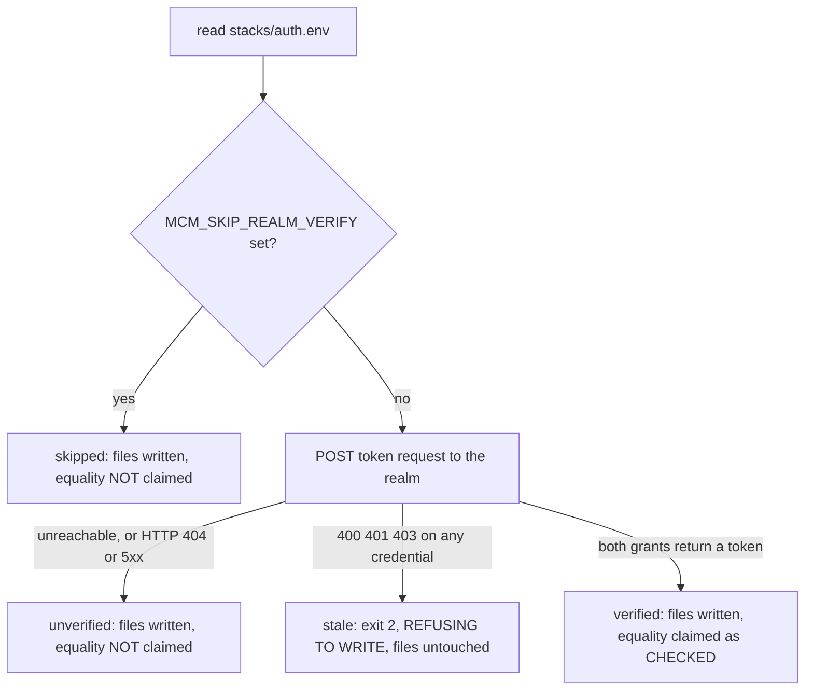

# Local dev infrastructure & environment variables

All dev/test infrastructure is split into four **independently operable named Compose stacks** —
`auth`, `mcm`, `audit`, `observability` — under `infrastructure-as-code/docker/stacks/`. Each is
its own Compose project defined by a thin `include:`-only aggregator that pulls in only that stack's
per-service files; the single root `compose.yaml` aggregator is retired to a pointer. Stacks share
pre-created `external: true` networks for cross-stack traffic. Lifecycle goes through Nx targets
(`up-auth` / `up-mcm` / `up-audit` / `up-observability` / `up-all` / `up-mcm-agents`, and the
`down-*` counterparts) rather than bare `docker compose` invocations — see
[Nx as the task runner](../invariants/nx-task-runner.md),
[Infrastructure stacks](../projects/infrastructure-stacks.md) and
[Published-port reservation](../invariants/published-port-reservation.md).

Every credential in every stack is externalized to a `${VAR:?…}` interpolation reference — no
clear-text secret lives in a tracked Compose file (see
[Secrets management](../invariants/secrets-management.md)). Two one-time generator scripts mint the
per-machine stack credentials and seed the dev Keycloak realm before any stack is first brought up.
The full stack/profile tables, the exact generator behaviour and the realm-reseed recovery procedure
live in `docs/runbooks/local-dev.md`; this page is the distilled summary. Provision the host toolchain
first ([dev environment setup](./dev-environment-setup.md)), or use the pre-provisioned
[containerized dev environment](./devcontainer.md).

## One-time bootstrap (per machine)

1. Pre-create the external networks and persistent volumes (`docker network create …`, `docker
   volume create …` for the mc-service Mongo store, the Keycloak Postgres store, the two BFF stores,
   the agent Postgres store and the audit OpenSearch volumes).
2. `node scripts/gen-dev-secrets.mjs` — mints one gitignored `infrastructure-as-code/docker/stacks/<stack>.env`
   per stack from the committed `<stack>.env.example` templates. Idempotent; `--force` rotates and
   `--stack=<name>` scopes. A template that has gained a key since the file was written is seeded
   **into** the existing file rather than skipped, so one new variable never forces a rotation of
   every other value.
3. `node scripts/gen-dev-env.mjs` — seeds the dev realm on a fresh Keycloak volume (via the
   `keycloak/compose.dev.yaml` overlay's `--import-realm`) and projects the realm's client secrets out
   of `auth.env` into the BFF env files, so **realm-secret == BFF-secret by construction** — a login
   works on first boot with no manual import. The projection is verified against the running realm
   before anything is written (below).
4. `pnpm nx up-auth infrastructure-as-code` (Keycloak), then `pnpm nx up-mcm infrastructure-as-code`.

`<stack>.env` is gitignored; `<stack>.env.example` is tracked. A CI gate
(`scripts/check-no-inline-secrets.mjs`, run in the guardrails workflow) fails the build if a literal
credential is re-inlined into a tracked Compose file.

## Gotchas

- **`mc-service:test` going red on a byte-identical Rust tree means `backend/mc-service/.env.local`
  is absent (item #227 — now fixed).** `gen-dev-env.mjs` writes that file on every run: the
  `KEYCLOAK_*` / `E2E_*` lines are re-synced from `stacks/auth.env`, while `MC_DB_URL`,
  `MC_SERVICE_PORT` and `RUST_LOG` are seeded once and left alone so a tuned config survives a
  re-run. Without it the Rust integration tier panics with `Missing("MC_DB_URL")` — **16 of 41 cases
  fail on configuration, not code**, and nothing distinguished that from a real failure. Four
  `E2E_*` variables (for the authenticated `http_authz_test::*` cases that mint a real ROPC token)
  were the second half of the same defect and had been wrongly attributed to "needing a replica-set
  MongoDB". After the fix: **41 passed / 0 failed**. The generator names the one `.env.local` it
  deliberately does NOT create (`agents/movie-assistant/`, which carries the operator's own Anthropic
  credential) so the omission is explicit rather than silent.
- **Bring `auth` up before the `mcm` `app` profile.** mc-service fetches the Keycloak JWKS endpoint on
  startup to cache the JWT-validation key, and there is no cross-project `depends_on` — Docker Compose
  has none, so the ordering is manual. `--profile app` without Keycloak already running just hangs.
- **A password-on-first-init credential (Postgres / OpenSearch / MinIO) is baked into its data volume
  on first boot and ignores later env changes.** Rotating one for real requires regenerating the
  `.env` (`--force`) *and* recreating the service against a fresh volume — otherwise the container
  keeps the volume's original password and auth fails, with nothing pointing at the cause.
- **`docker compose down --volumes` only wipes transient volumes.** Every persistent data volume is
  declared `external: true` with an explicit name in its own service compose file (so the stack's
  `include:` merge does not prefix it with the project name) and therefore survives. Wiping real data
  means removing the external volumes by hand after `down`.
- **Each stack is its own Compose project, so `down` on one no longer tears down the others.** The
  old single-project footgun is gone; treat each stack's lifecycle target as independent.
- **`--profile` flags must precede `up`/`down`** with Docker Compose v2 — a flag placed after the
  subcommand is silently ignored.
- **The `--profile agents` gateway (heavy, Postgres-checkpointer variant) needs its Keycloak client
  secret fetched live from a running Keycloak** — there is no committed source for it. Without it the
  gateway starts but every tool call fails closed (chat works; add/query/organize don't).
  `pnpm nx up-mcm-agents infrastructure-as-code` wraps this fetch-and-inject step; it is distinct from
  `scripts/agent-stack.mjs`, the light E2E variant that runs the agent stack with an in-memory
  checkpointer.
- **A credential skip means a missing (or stale) file, not an unrunnable box.** Before concluding an
  environment cannot run the integration suite, name the missing input and run
  `node scripts/gen-dev-env.mjs`. See the two sections below.
- **An absent `frontend/mcm-app/.env.e2e.local` is not auto-created, and the generator says so
  loudly.** Its sync set is only the credential half, so a created file would be half-written; the
  web E2E also needs the hand-maintained fixture keys. Absence means the web E2E logs in as nobody.

## A credential skip is a missing file, not an unrunnable box (feature 048)

**Symptom.** An integration suite reports skips — or, under `MCM_REQUIRE_LIVE_STACK=1`, a wall of
errors — whose reason mentions credentials: `missing credential(s): KEYCLOAK_SERVICE_CLIENT_SECRET`,
or the older wording `ROPC / service-account creds not set — needs the live stack`.

**The wrong conclusion, and why it is tempting.** On 2026-08-07 this produced 38 errors and the
conclusion *"this leg cannot be run in this dev container; CI is where it gets proven."* Every
individual signal supported it — the stack was up, the tests were untouched, the message said "needs
the live stack". It was still wrong. The cause was **one absent gitignored file**, and one command
fixed it: the suite went from 13 passed / 38 errors to **51 passed, 0 failed**.

**The mechanism.** `scripts/gen-dev-env.mjs` writes five env files — `frontend/mcm-app/.env.docker`,
`frontend/mcm-app/.env.local`, `frontend/mcm-app/.env.e2e.local`, `mcp-servers/web-api-mcp/.env.local`
and `backend/mc-service/.env.local`. `frontend/mcm-app/.env.local` is *surgically synced* so a
developer's own Metro keys survive — and, before feature 048, `syncEnvFile` returned early when that
file did not exist. So the three realm client secrets landed in `.env.docker` but never in
`.env.local`, which is the file `kc_admin.cfg()` actually reads. The generator then advised copying
`.env.example`, **which does not exist in this repository**, sending the reader after a missing file
rather than at the real cause.

**Detect → resolve.**

| Check | Command | Meaning |
|---|---|---|
| 1. Does the file exist? | `ls -la frontend/mcm-app/.env.local` | Absent ⇒ this is your problem |
| 2. Does it carry the secret? | `cut -d= -f1 frontend/mcm-app/.env.local` | `KEYCLOAK_SERVICE_CLIENT_SECRET` must appear |
| 3. Fix | `node scripts/gen-dev-env.mjs` | Now **creates** the file when absent and reports `CREATED .env.local (was absent)` |
| 4. If step 3 errors | `node scripts/gen-dev-secrets.mjs` then re-run step 3 | `stacks/auth.env` had not been minted yet |
| 5. Confirm | `MCM_REQUIRE_LIVE_STACK=1 pnpm nx test:integration movie-assistant -- -m "not golden"` | Expect **0 failed** |

Never print a secret's value to check it — compare **key names** (`cut -d= -f1`) only.

**The general rule this is an instance of.** Before concluding *"this cannot run in this
environment"*, identify the specific missing input and check whether a generator, a `.env` file or a
documented command supplies it. "Cannot run here" retires a whole test tier on the strength of one
unread error message, and it is indistinguishable from a genuine environment limit until someone
checks. In this repo the credential skips now name the variable, the file they are read from, and the
command that fixes them — **if you meet one that does not, that message is itself the bug.**

**Which absences are still legitimate.** `--profile observability` (LangFuse, Vault, otel-lgtm,
Unleash), `--profile audit` (OpenSearch) and OPA are not brought up by `app-e2e` either; those skips
are expected and allow-listed. A healthy local run of the agent integration suite is **51 passed,
11 skipped, 0 failed**.

## A projected credential can be STALE, not merely absent (item #395)

**Symptom.** The same credential wording as above — a 401 on the ROPC token request, or
`ROPC token request failed (401): {"error":"unauthorized_client"}` — but
`frontend/mcm-app/.env.e2e.local` **exists** and carries a plausible 64-char secret, and
`node scripts/gen-dev-env.mjs` reports success. Measured 2026-09-08: a movie-MCP integration suite
skipped every test (20 **errors** under `MCM_REQUIRE_LIVE_STACK=1`) while every file was in place.

**Why the section above does not apply.** Its heuristic — *"a credential-driven skip is almost always
a missing FILE"* — sends you looking for something absent. Here nothing is absent. Before item #395,
`gen-dev-env.mjs` projected the secrets out of `stacks/auth.env` and never asked the realm, so a realm
re-seeded from a different `auth.env`, or a client secret regenerated in the admin console, was
invisible — and the run's own success line asserted the opposite.

**Detect.** `gen-dev-env.mjs` now asks the realm for a token with each projected credential —
`client_credentials` for `mcm-bff-service`, ROPC for `mcm-bff-test` — **before it writes anything**,
and reports one of four outcomes. Read the outcome, not the fact that it ran:

How `gen-dev-env.mjs` decides to write, refuse, or decline to claim the realm equality.

| Ending | Meaning | Files | Exit |
|---|---|---|---|
| `VERIFIED against the realm at …` | both grants returned a token; the equality is **checked**, not asserted | written | 0 |
| `NOT verified: … ECONNREFUSED` (or HTTP 404/5xx) | the realm is not up or not seeded — nothing is claimed either way | written | 0 |
| `NOT verified (MCM_SKIP_REALM_VERIFY is set)` | you turned the check off; unset it | written | 0 |
| `REFUSING TO WRITE: the realm … rejects credential(s)` | **this section** — the refused credential is named, and so are the ones that passed | **untouched** | **2** |

**The ordering is the fix, not a detail.** Measured on the operator's box 2026-09-09: `auth.env`'s
`E2E_ROPC_CLIENT_SECRET` was the **stale** side, while a hand-corrected `.env.e2e.local` held the value
the realm actually accepts (`mcm-bff-service` passed in the same run — the drift was one client, not
all of them). A generator that wrote first and checked afterwards would have destroyed the only
working credential on the machine before announcing the problem. Nothing is written unless every
checkable credential authenticates.

**Resolve — measure the drift before choosing the remedy.** `stacks/auth.env` is the source of truth
(it is what seeds the realm), so the fix belongs at the **realm**, never by copying the realm's secret
back into an env file: that repairs the suite in front of you and leaves `realm-secret == BFF-secret`
broken for every other client. But *how much* of the realm to fix depends on how much actually
drifted, and that is easy to over-read. **Measured 2026-09-09 on this repository: five of six client
secrets matched `auth.env` and only `mcm-bff-test` had been regenerated** — "the realm was seeded from
a different `auth.env`" was the wrong reading, and a full re-seed would have destroyed the whole
Keycloak database to correct one field.

`docs/runbooks/local-dev.md` holds the copy-paste client-audit snippet (one ✓/✗ per client, printing
no secret values) and the per-case procedure:

- **A few clients drifted** → PUT those clients' `secret` to `auth.env`'s value through the admin API,
  re-run the audit (expect all ✓), then immediately re-run `node scripts/gen-dev-env.mjs` — the moment
  the realm secret changes, a hand-patched `.env.e2e.local` becomes the stale side.
- **Most or all drifted** → the realm really was seeded from a different `auth.env`; re-seed it by
  force-removing the Keycloak containers, recreating `keycloak-store-postgres-data`, re-running both
  generators, `pnpm nx up-auth infrastructure-as-code`, and re-running `gen-dev-env.mjs` until it ends
  `VERIFIED against the realm`.

`MCM_SKIP_REALM_VERIFY=1` bypasses the check and projects anyway, knowing the files will carry
credentials the realm refuses. It is the escape hatch for an unusual realm, **not a fix** — and the
run says so in its own output rather than quietly reverting to the old unconditional claim.

**Confirm.** `MCM_REQUIRE_LIVE_STACK=1 pnpm nx test:integration movie-mcp` — expect **0 skipped on
credentials**. A skip here still reads as a pass without that flag; that is what turned this into 20
silent skips for as long as it lasted.

See [testing tiers](../invariants/testing-tiers.md) for how these local suites relate to the gating
tiers, [Keycloak](../projects/keycloak.md) for the realm and its clients, and
[mc-service](../projects/mc-service.md) for what the Rust integration tier needs. Full stack/profile
tables, the env-var reference, the generator scripts' exact behaviour and the realm-reseed recovery
procedure: `docs/runbooks/local-dev.md`.
