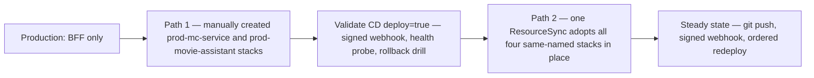

# Phase 15 operator checklist (bring the full app live)

A one-time operator checklist — Komodo, Keycloak-admin and prod-shell actions an agent cannot drive —
that took production from BFF-only to the full app: `mc-service` and the agent gateway deployed as two
new Komodo stacks, the agent chain's token exchange proven end to end, the CD `deploy=true` webhook leg
validated with a rollback drill, and the eventual consolidation from manually created stacks into one
config-as-code Komodo ResourceSync.

**Phase 15 is complete, and this is a historical working log, not a live checklist.** Its `[ ]` items
and "Remaining" notes describe the state at the time of writing; for current state read the
[server-setup runbook](./server-setup.md), the [CI/CD pipeline page](../projects/ci-cd-pipeline.md),
[prod reboot resilience](./prod-reboot-resilience.md) and [prod control tower](./prod-control-tower.md).
Reach for the owner document only for the history of *why* the production topology looks the way it
does — not for a procedure to run today.

It sits in this wiki because it is a live operator record relocated out of `docs/proposals/`, not
pre-specification ideation: the proposal tree is excluded from the bundle precisely so superseded ideas
do not dilute retrieval, and the runbook was moved out of it to keep that exclusion clean. See the
[proposal → spec → plan → tasks → implementation lifecycle](../process/spec-driven-development.md).

The historical arc the checklist records: two sequential paths, not an either/or choice.

## What the procedure achieved

- **The two missing production stacks were stood up manually and then adopted.** `prod-mc-service`
  (the movie store plus its replica-set Mongo, on a private network only that service reaches) and
  `prod-movie-assistant` (the gateway, its checkpointer Postgres and the three scoped MCP servers) were
  created as manual Komodo Stacks mirroring the then-live BFF, proving the app with the smallest blast
  radius. The `prod-app → prod-mcm-bff` rename was later done by hand so that all four stacks already
  carried the canonical names `stacks.toml` declares — which is why the first ResourceSync *adopts* them
  in place rather than creating anything from scratch.
- **The agent chain was proven end to end.** With the BFF's subject-token client secret and the
  gateway's own client secret in place, a full flow — subject token → RFC 8693 token exchange →
  `movie-mcp` → `mc-service` — searched the user's collection and added a movie, replacing the
  TMDB-only fallback that had hidden the broken exchange. Where each hop sits is in the
  [auth chain](../invariants/auth-chain.md).
- **The one unexercised CD leg is now exercised.** A `deploy=true` dispatch walked promote → signed
  Komodo webhook → post-deploy health probe → rollback drill. The probe expects the *realm-qualified*
  OIDC issuer (a bare auth host never matches a healthy realm) plus a 200 from the app; rollback has no
  endpoint to call, so it git-reverts the digest promotion commit and re-fires the webhook to redeploy
  the prior digest. Full mechanism: [CI/CD pipeline](../projects/ci-cd-pipeline.md).
- **Config-as-code consolidation replaced per-stack webhooks.** One ResourceSync webhook now reconciles
  and redeploys every affected stack in `after` order — `prod-auth` → `prod-mc-service` →
  `prod-mcm-bff` → `prod-movie-assistant` (agents last, because `spreadsheet-mcp` needs the BFF's
  network and Redis) — and this is the deploy model every production change uses today, including the
  support stacks added afterwards. See
  [infrastructure-as-code stacks](../projects/infrastructure-stacks.md).
- **Token hygiene and branch protection were finished here**: the registry push/pull token split, the
  `main` required status checks, the 022 branch merge, and the final smoke against the merged `main`.

## Superseded detail

Where this log states that the prod-mc-service (and BFF) Mongo is unauthenticated with no credential,
that is no longer true: feature 026 has since enabled SCRAM on both stores, and
`infrastructure-as-code/komodo/stacks.toml` now supplies `MONGO_MC_APP_PASSWORD` plus
`MONGO_MC_KEYFILE` (the replica-set keyfile) to `prod-mc-service` and `MONGO_BFF_APP_PASSWORD` to
`prod-mcm-bff`. The checklist's secret map and its "no credential" step A note are historical — the
current cutover and recovery procedures are in [production data-tier authentication](./prod-data-tier-auth.md).

## Gotchas

- **A Keycloak client secret is regenerated on every realm import unless pinned in the realm JSON.**
  The Komodo Variable feeding a confidential client's secret must be copied from the post-import
  Keycloak console, not assumed to match whatever value was set before import — a mismatch fails the
  token exchange with an auth error that looks like a missing-configuration problem, not a wrong-secret
  problem, which is why it recurred at two separate points in this chain (the BFF's subject-token
  exchange and the gateway's own re-exchange) rather than being caught once. See the
  [auth chain](../invariants/auth-chain.md) for where each of these exchanges sits.
- **A single manually-attached webhook only redeploys the stack it's attached to.** Because one CD run
  promotes new image digests to all built-image stacks at once, a webhook scoped to only one stack
  leaves the others running stale images with silent drift between the promoted digest and the running
  container — the fix that closes this gap is consolidating onto one ResourceSync webhook that
  redeploys every affected stack in dependency order, not adding more per-stack webhooks.
- **Renaming a live stack in place must preserve its external volumes and networks.** The stack rename
  performed here removed only the old containers, never the `external: true` volumes/networks backing
  them, specifically so already-stored per-user data survived the rename — deleting those resources
  instead of the containers would have been a data-loss mistake.
- **A validated web login bug does not imply the mobile login is fine, or vice versa** — this checklist
  hit one login defect that only manifested on web (a build-time environment variable that never made
  it into the browser bundle) alongside a second, independent defect in the realm's redirect-URI
  configuration; treat a working mobile flow as no evidence about web, and fix both root causes
  separately.
- **A short-lived elevated-privilege token used for one-time validation must be revoked immediately
  after use** — this checklist explicitly calls out revoking such a token as its own checklist item, not
  an implied cleanup step.

Full step-by-step Komodo actions, exact stack configuration values, the two independent login-bug root
causes, and the final deploy-order/secrets-map reference: `docs/runbooks/Phase-15-Operator-Checklist.md`.
