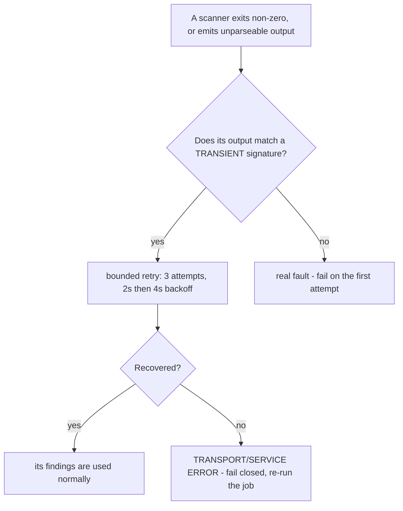

# SAST & SCA static scanning

Four scanners — Semgrep (TS/JS + Python source), cargo audit (Rust deps), pnpm audit (JS deps), and
pip-audit (Python deps) — feed one normalized findings report and one blocking `sast` CI job. It
complements [DAST scanning](./dast-scanning.md): DAST exercises the running app,
this scans source and the dependency graph at rest. It is also disjoint from
[infra-image scanning](./infra-image-scanning.md), which scans pulled third-party
container images rather than first-party code or first-party dependency graphs. For how the pieces fit
together architecturally, see [SAST & SCA static security scanning](../projects/sast.md).

## Gotchas

- **pip-audit audits the INSTALLED venv, not a requirements file — and now audits all four Python
  surfaces.** Since feature 068 pip-audit runs against `agents/movie-assistant`, `mcp-servers/movie-mcp`,
  `mcp-servers/spreadsheet-mcp`, and `mcp-servers/web-api-mcp` — each with its **own** dep graph and
  runtime classification. `uv sync` all four before a local run; an unsynced surface **fails** the
  scan, it is never silently skipped. CI provisions all four venvs. `pip-audit -r <requirements>` resolves
  an ephemeral venv (hangs >11 min, chokes on yanked versions) — do not use that form.
- **pip-audit findings are project-qualified; allowlist `locationPattern`s should be surface-anchored.**
  Since feature 068 each finding's location names its surface: `mcp-servers/web-api-mcp:click@8.5.0`,
  not `click@8.5.0`. An allowlist entry should normally be anchored:
  `^mcp-servers/web-api-mcp:click@.*`. Two static checks enforce this at scan time, before any findings
  are compared: (1) `assertKnownPythonSurfaces` fails the scan if a Python project directory carrying a
  `uv.lock` is not registered in `PYTHON_SURFACES` (`scripts/sast-scan.mjs`) — adding a project without
  registering it produces a hard error, not a silent omission; (2) `assertPipAuditAllowlistShape` fails
  the scan if an anchored `locationPattern` (leading `^`) names a surface that does not exist in
  `PYTHON_SURFACES` — a dead anchor can never match, so it suppresses nothing: a real finding would
  still block, and the failure exists so nobody believes a suppression is in force when it is not. Drop the leading `^` only when you deliberately mean the suppression to span every
  Python surface. **Adding a new Python project?** Register it in `PYTHON_SURFACES` and add a `uv sync`
  step to the `sast` CI job.
- **Keyless and fail-closed.** All advisory data (Semgrep registry, RustSec, npm advisories, OSV) is
  fetched anonymously at scan time; if any fetch fails, that scanner fails the job rather than
  reporting a false clean. No secret is ever required — see
  [Secrets management](../invariants/secrets-management.md) for the broader no-clear-text-secrets
  posture this fits into.
- **The SCA half runs full on every push, unconditionally** — a newly published advisory can hit an
  unchanged dependency, so it is never path-gated. This means `main` can legitimately go red on a
  dependency nobody touched; that is the gate working, not a defect, and it recurs.
- **Only runtime-scope SCA blocks the gate.** A dependency's blocking status depends on whether it is
  reachable from a runtime path across the whole workspace, not just the root package — checking scope
  by hand requires a recursive, workspace-spanning query, not a root-only one; getting this wrong has
  previously produced a false "gate bug" report.
- **`pnpm why <pkg> --prod` without `-r` reports the wrong scope.** Without `-r` the command runs at
  the repo root only and prints nothing for a dep that is runtime-reachable via a sub-package (e.g.
  `mcm-app > @copilotkit/runtime > … > fast-uri`). That empty output is **not** "dev-only" — it is
  the wrong scope. The gate itself uses `pnpm audit --prod` across the whole workspace; when in
  doubt, trust the digest's tag (`[pnpm-audit] runtime` vs `[pnpm-audit/dev]`). This exact mistake
  wrongly accused the gate of a bug on 2026-07-21; the gate was right.
- **A fixable High must be bumped, never allowlisted.** The allowlist is for findings with no fix
  yet; suppression is gate-only and the finding stays visible in the report regardless.
- **`p/secrets` is deliberately OFF.** `secret-scan.mjs` owns credential detection, so enabling it here
  would double-gate and split the allowlist across two owners.
- **Rust source itself is out of Semgrep's scope** — clippy covers Rust source patterns and
  cargo-audit covers only Rust dependencies, so the mc-service Rust surface relies on clippy + review
  for the patterns Semgrep enforces elsewhere.
- **`semgrep.dev` is now in the egress allowlist — but adding it to the canonical list is only
  HALF the change (item #222, 2026-08-22).** Semgrep resolves the five `p/*` community packs in
  `security/sast/semgrep.yaml` from its public registry at scan time. That host was unallowlisted
  from day one, so Semgrep failed closed and left `security/sast/reports/findings.json` **empty**;
  `check-sast-findings.mjs` then exited 0 — a green that proved nothing. It was added to
  `.devcontainer/egress-allowlist.json`, but egress is enforced in **two layers**, and only one
  re-reads the committed file by itself: the in-VM iptables half re-applies from `init-firewall.sh`,
  while the **host-side sandbox policy is scoped per sandbox** and does not pick up a new destination
  until an operator re-applies it (`sbx policy allow network semgrep.dev --sandbox mcm` on the
  Windows host — see
  [devcontainer-sandbox.md](../../docs/runbooks/devcontainer-sandbox.md#4-egress-allowlist)). The
  committed entry does not tell you which world you are in. One command does:
  ```bash
  curl -sS -o /dev/null -w '%{http_code}\n' https://semgrep.dev/   # DNS failure / 000 => still vacuous
  node scripts/sast-scan.mjs --scope full --only semgrep            # exit 1 + "[semgrep] scan failed … rules/registry may be unreachable" => unreachable (exit 2 is bad arguments only)
  ```
  A Semgrep result you did not sanity-check this way is the same green either way — which is the
  whole trap. **To test an allowlist entry locally when Semgrep is unreachable, hand the gate a
  synthetic `findings.json`** carrying the exact `scanner`/`id`/location triples you expect, plus a
  **negative control** (a finding the entry must NOT suppress). Otherwise push and let CI answer.
- **…but "the tier cannot run here" is the wrong conclusion — `--only` gets you the SCA half.**
  The vacuous pass above is a fact about **Semgrep**, not about the gate. Only Semgrep needs
  `semgrep.dev`; `pnpm-audit`, `cargo-audit` and `pip-audit` resolve their advisory data from sources
  the egress allowlist already permits. So the whole SCA half runs to completion locally:
  ```bash
  node scripts/sast-scan.mjs --scope full --only pnpm-audit   # 55 findings, 2 blocking — a real report
  node scripts/check-sast-findings.mjs
  ```
  This matters because every dependency-floor remediation is an SCA finding, and those are exactly
  the changes you want to verify before pushing. Measured on feature 057: the full-scope run
  fail-closed on Semgrep and left a 0-finding report the gate passed vacuously, while
  `--only pnpm-audit` proved both target advisories were genuinely suppressed beforehand and genuinely
  gone afterwards. **Check the finding COUNT, not the exit code** — a report with 0 findings and a
  report with no blocking findings print the same green.
- **An override floor has TWO halves and both must move.** Entries in `pnpm-workspace.yaml`'s
  `overrides:` map are a range keyed on a range — `fast-uri@<3.1.5: '>=3.1.5 <4'` — where the key
  names the vulnerable span excluded and the value the patched floor forced. Raise the value alone
  and you get an override that reads as remediated while no longer excluding the version its own key
  names. `scripts/check-override-consistency.mjs` enforces `key's exclusive upper bound == value's
  inclusive lower bound` on every pull request, scoped to keys carrying an `@<range>` suffix (the
  plain pins `react-dom`, `postcss`, `@expo/dom-webview` have no key half and are out of scope).
  Renovate produces exactly this mismatch when it proposes a floor raise, so expect bot PRs against
  this map to need their key half fixed by hand.
- **Unmatched allowlist entries are reported but do not block.** An entry that matches nothing this
  run is listed under `UNMATCHED ENTRIES`. The trap: pip-audit switched from CVE ids to PYSEC
  aliases; entries keyed on the old CVE ids silently matched nothing rather than expiring — an entry
  keyed on an exact advisory id does not expire, it just quietly stops suppressing. Detection is
  deliberately suppressed for any scanner that produced **no** findings in the run, so a skipped,
  failed or genuinely clean scanner never flags its whole entry set as stale. Read `UNMATCHED ENTRIES`
  whenever an advisory you thought was accepted re-blocks.
- **Expiry has a 14-day warning window before it blocks.** Allowlist entries with an `expiry` date
  surface `EXPIRING SOON` warnings for the 14 days before the date, then re-block when expired; both
  window boundaries are inclusive. The window length is defined once in `scripts/allowlist-expiry.mjs`
  (`WARNING_WINDOW_DAYS = 14`) and imported by both gates. A dedicated `--check-expiring` mode runs
  **weekly** (Friday) in the `infra-image-scan` workflow and fails on any expiring or expired entry;
  this mode is never run on pull requests. **For the SAST allowlist it cannot fail on an unmatched
  entry** — that job produces no SAST report, so unmatched detection is skipped there, and an entry
  that quietly matches nothing (the CVE→PYSEC trap above) is visible *only* in the report-only output
  of a normal gate run. Read it there. Two properties of that weekly step are load-bearing: a missing
  report is **announced** rather than assumed clean (a report that exists but will not parse is still
  exit 2 on both paths), and the report-absent path must not throw — when it did, the step aborted
  and `bash -e` skipped the infra-image expiry check on the next line, so **both** expiry tiers were
  dead from 2026-09-12 until the 2026-09-25 weekly sweep's own output exposed it.
- **Remediate, do not re-date.** Deleting or extending an `expiry` is how a time-box becomes
  permanent. The legitimate exception — no published fix exists — requires the evidence written into
  the justification; a time-boxed acceptance can also be discharged by a route its own justification
  did not anticipate (the `image-size` pair was cleared when the dependency left the tree entirely,
  not by the fix its entry predicted). Check npm before assuming: on feature 057 both "needs an
  acceptance" advisories turned out to have published fixes.
- **Before raising a floor, check whether the lockfile is the lever, not the override.** Since
  feature 058 the gate prints an `OVERRIDE LEVERS` advisory section for any finding whose package
  already carries an override in `pnpm-workspace.yaml`. Example output:
  ```
  OVERRIDE LEVERS (advisory — does not affect this gate's result)
    Already permitted by an existing override — REFRESH THE LOCKFILE:
      • hono 4.12.29 — the override `>=4.12.25` ALREADY PERMITS 4.12.34; the lockfile is what pins
        4.12.29. The override needs no edit — refresh the lockfile: `pnpm update hono --lockfile-only`.
  ```
  **This distinction cost ten days of red once already.** `fast-uri`'s override `>=3.1.4 <4` already
  permitted the published fix 3.1.5; the lockfile pinned 3.1.4. The fix predated the advisory by three
  days. A four-week allowlist acceptance was written for something `pnpm update fast-uri --lockfile-only`
  would have cleared. `nanoid` repeated it eight days later. If the section says *refresh the lockfile*,
  editing the override is wasted work — the range is already correct. The advice is computed per
  *resolution*, not per package, so a second resolution the override does not govern gets no advice
  rather than wrong advice. The section is advisory only and never changes the gate's exit code; it
  also prints for non-blocking findings, so a cheap fix can be made before severity promotes it into a
  blocker. Most of these are now cleared weekly by Renovate's `lockFileMaintenance` (see
  [Renovate](./renovate.md)) without anyone reading an advisory.

  **Two gotchas about Renovate `lockFileMaintenance` (feature 058, 2026-08-13):**
  - Its `schedule` key in `renovate.json` looks like a duplicate of the top-level schedule and
    **is not** — the option carries its own default (`before 4am on monday`) that beats the inherited
    value, and that window intersects neither cron under either DST offset. Delete the key as redundant
    and the refresh is enabled but can never fire, silently. `renovate-workflow.guard.test.mjs` fails
    if the key goes missing.
  - These refresh PRs now run `app-e2e`: a bad transitive floor is a **build-time** break that
    `nx test` passes straight over, so the E2E tier is the only one that catches it.

  What remains manual is the case the bot cannot propose: a floor that must rise past its own ceiling.
  Renovate essentially never raises the lower bound of a keyed override — and when it rewrites one it
  half-bumps — so the `check-override-consistency.mjs` guard is the answer.

- **Paths in `locationPattern` must use forward slashes.** Allowlist entries are matched against
  paths normalized to forward slashes so they are portable across the Windows dev host and the Linux
  CI runner. A pattern written with backslashes matches nothing on the runner and passes silently on
  the Windows side — the gate accepts it, but the finding re-blocks in CI.
- **A rule that has gone BLIND produces the same output as a remediated one — check the error count,
  not the finding count.** A Semgrep rule it could not RUN is reported in the native output's
  `errors[]`, never in `results[]`, so it contributes zero findings and its allowlist entry lands in
  `UNMATCHED ENTRIES` reading as "remediated already". Measured on `main` 2026-09-06:
  `gha-curl-pipe-shell` (from `p/owasp-top-ten`) re-parses a step's `run:` block as Bash, cannot read
  the ci-log-step heredoc that wraps nearly every run-step here, and produced **36 errors and 0
  findings** while six `curl … | sh` lines sat in the workflows. The gate now names this itself:
  `RULES THAT COULD NOT RUN` lists each rule with its error and file counts, and any `UNMATCHED`
  entry it explains is annotated `↳ this rule could not run`. Both are advisory and never move the
  exit code — these rules error on every run, and a gate that goes red on a standing condition stops
  being read. **The attribution itself needed care:** the pinned Semgrep populates the structured
  `rule_id` on an `Internal matching error` but not on a `PartialParsing` one, where the rule name
  appears only in the message prose. That run carried 36 errors out of 39, and keying on the field
  alone attributed **3** of them — an order of magnitude of understatement, and a rule that saw
  nothing at all reading as a rounding error. Coverage for the pattern is restored by the text-level
  custom rule `mcm-ci-curl-pipe-shell`; its accepted, pinned installer URLs live in the rule, not the
  allowlist.
- **On a pull request, only the CHANGED targets are scanned — a rule cannot fire on a file that was
  never handed to Semgrep.** `--scope changed` (the PR path) builds an explicit target list, so the
  extension filter in `isScanTarget()`, not the rule's own `paths:`, decides what a PR is gated on.
  Workflow YAML was absent from that list until item #224, which meant a `curl … | sh` added to a
  workflow was gated on nothing and first appeared on the post-merge full scan. Both workflow trees
  are now included; everything else non-code stays out deliberately.
- **The same gap opened a second time through Dockerfiles — and the gate now refuses to let it happen
  a third time.** A `Dockerfile` has **no extension**, so it matched neither the code-extension nor
  the workflow filter. Observed, not reasoned: PR #422 added
  `infrastructure-as-code/docker/minio/Dockerfile`, its `guardrails / sast` was a real 3m30s run that
  **passed**, and the post-merge full scan on `main` then failed on
  `dockerfile.security.missing-user-entrypoint` — staying red until a follow-up landed the
  accepted-risk entry. A genuinely unwanted finding would have merged just as silently. Dockerfiles
  are now in the filter (item #426), and the whole surface was **enumerated once** rather than waiting
  for a third instance: on a full-scope report, a blocking SAST finding whose file `isScanTarget()`
  rejects now fails the gate with its own section and its own exit path,
  `GATE-SCOPE ASYMMETRY`. Three properties make that guard real rather than decorative: it counts
  **suppressed** findings too (an un-allowlisted one already fails loudly — the minio case was
  *allowlisted*, so the gate was green and the asymmetry invisible); it excludes SCA (audits ignore
  `--scope` entirely, so a lockfile finding cannot be scope-asymmetric) and changed-scope reports
  (every file there was by definition a target); and a report with no usable `generatedAtScope` is a
  **hard error**, because a missing field must not be able to switch off the guard the way a missing
  file class switched off the thing it guards. The remedy it names is to widen the changed-scope
  filter — **an allowlist entry does not fix this**, it is what concealed the Dockerfile case for a
  merge cycle. The residual is a snapshot and is named: a pack update that raised a Medium rule on the
  two still-invisible classes (`renovate.json`, `pnpm-workspace.yaml`) to ERROR would reopen the gap
  silently, so re-run the enumeration when the pack set changes.
- **`node scripts/sast-scan.mjs --test-rules` proves the custom rules before you trust a scan.** It
  runs `semgrep --test` over `security/sast/rules/` and fails if any rule lacks a fixture — that
  second check matters because `semgrep --test` SKIPS an unfixtured rule and still prints `N/N ✓`
  (measured: `4/4 ✓ All tests passed` with five rule files present). The Semgrep pin lives only in
  `sast-scan.mjs`, so the workflow step carries no second copy to drift.
- **A red `sast` gate whose output says `TRANSPORT/SERVICE ERROR` is an outage — re-run it (item #449).**
  Three scanners reach a third party on the required gate's critical path: `pip-audit` queries
  **osv.dev**, `cargo-audit` fetches the **RustSec advisory DB**, and `pnpm audit` queries the **npm
  registry**. Measured 2026-09-13 on run 3328: `guardrails / sast` went red on a pip-audit
  `ServiceError` from osv.dev while the scan had otherwise completed clean (`findings=16 blocking=0`).
  osv.dev recovered 200 minutes later. Since item #449, `sast-scan.mjs` classifies these as transport
  or service failures and **retries 3 times with exponential backoff (2 s, 4 s)** before giving a
  verdict — the job log will say `transient transport/service failure on attempt N/3 — retrying`.
  Two properties preserved: (1) **fail-closed** — after retries are exhausted the gate still fails;
  (2) **classification is narrow** — a real fault (unsynced venv, unparseable lockfile) fails on the
  first attempt without burning the backoff budget. `scripts/__tests__/sast-scan-retry.guard.test.mjs`
  pins both directions. Distinguishing a service outage from a genuine finding is the whole point:
  the output explicitly states "This is NOT a security finding."
- **The retry classifier is shared, and its HTTP signatures require the status CODE — not just the
  phrase.** The mechanism lives in `scripts/lib/scanner-retry.mjs`, **shared with
  `infra-image-scan.mjs` since item #495** (Trivy's vulnerability-DB fetch needed the same thing). It
  was extracted rather than copied on purpose: the hard part is the signature list, and a signature
  learned from one scanner's outage is exactly the one the other needs next. Both narrowings were
  measured, and both are the same defect: a bare `Service Unavailable` / `Bad Gateway` / `Too Many
  Requests` matched the advisory *title* `net/http: HTTP/2 server does not limit Service Unavailable
  responses`, and a bare `Read timed out` matched ordinary English in an OpenSSL advisory title — so a
  genuine finding would have been retried three times and then reported anyway, slower, with a retry
  line misdescribing it as a blip. The classifier is handed `stderr + stdout`, so finding titles
  really do reach it on the cargo-audit and pip-audit paths.

## Outage or finding? — the retry decision



The decision that separates a red gate meaning "re-run it" from one meaning "read the findings". The
other two ways this scan goes green while proving nothing — an empty `findings.json` from a registry
that could not be reached, and a rule that could not RUN — are invisible unless you read the finding
count and the error count instead of the exit code.

Full scanner matrix, local invocation, the CI gate steps, the triage/allowlist workflow, and the
step-by-step "gate went red on an untouched dep" playbook:
[docs/runbooks/sast-scanning.md](../../docs/runbooks/sast-scanning.md). Field rules for allowlist
entries and the full expiry semantics:
[security/sast/README.md](../../security/sast/README.md).
