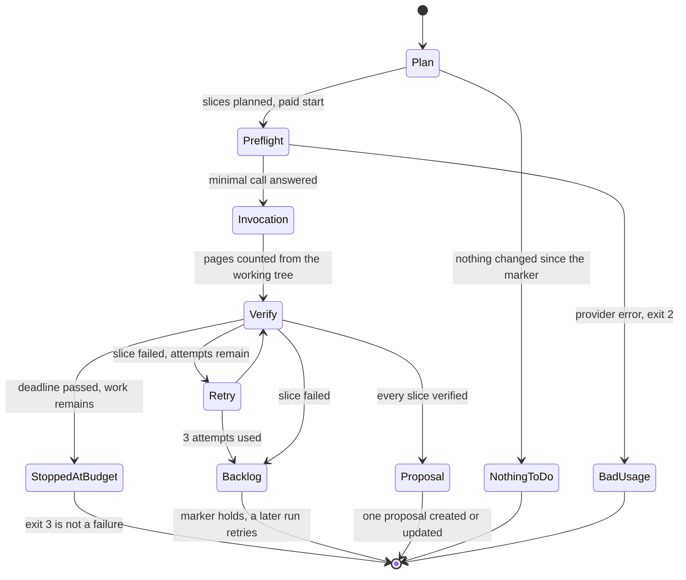
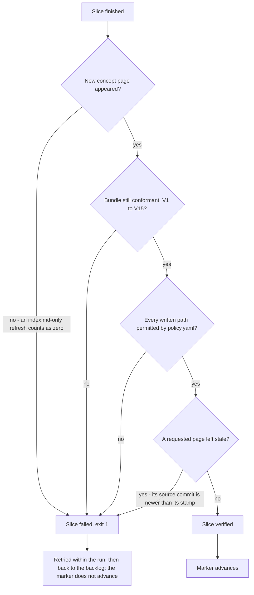

# OpenWiki knowledge-bundle maintenance

**Feature 044** (with the cost/provider work of feature 078). `pnpm nx wiki-plan infrastructure-as-code`
decomposes the documentation changes since the last recorded run into **slices** — at most 8 pages,
exactly one bundle area each — offline and free, so there is never a reason to skip it before spending
on `pnpm nx wiki-maintain infrastructure-as-code` (paid, needs the selected provider's key). The run
record lives at `openwiki/.maintenance-state.json`, committed because runners are ephemeral; it is
distinct from the tool's own `openwiki/.last-update.json`. See
[OpenWiki bundle generation and maintenance](../process/wiki-maintenance.md) for the underlying
`wiki-update`/`okf-lint` Nx targets this machinery drives, and
[Nx as the task runner](../invariants/nx-task-runner.md) for why the bare `openwiki` CLI must never be
invoked directly.

Useful overrides go through Nx's `--args` (appended to the command line): `--args='--since <ref>'`
ignores the marker and plans over a range you choose (diagnostics and one-off sweeps);
`--args='--max-slices 1'` attempts one slice and stops; `--args=--dry-run` prints the exact command per
slice and invokes nothing, persisting nothing; `--args=--json` is machine-readable. The runbook at
`../../docs/runbooks/wiki-maintenance.md` carries the full CLI contract.

## The shape of a run



The states a maintenance run moves through: planning is free, the preflight is the first act that costs
anything, and only the retry path can return a slice to the committed backlog.

## The provider is configuration (feature 078)

Which model writes the bundle is not code: `scripts/wiki-provider.mjs` is the single table, resolved in
**one pure place** from `MCM_WIKI_PROVIDER`.

| `MCM_WIKI_PROVIDER` | Model | Key (first non-empty; mapped at the point of use) |
|---|---|---|
| `anthropic` — the **local** default (unset) | `claude-sonnet-5` | `ANTHROPIC_API_KEY`, `MCM_ANTHROPIC_API_KEY` |
| `fireworks` — the **CI** default (the workflow sets it, at page concurrency 4) | `accounts/fireworks/models/deepseek-v4p1-flash` | `FIREWORKS_API_KEY`, `MCM_FIREWORKS_API_KEY` |

The chosen credential is mapped to the name the generator reads **only** in the generator's own
environment, and every other provider's key is removed from it. Two more knobs are validated before any
paid call:

- `MCM_WIKI_PAGE_CONCURRENCY` (1–8, default 1) — openwiki ≥ 0.6.0 writes that many pages in parallel.
- `MCM_WIKI_SERVICE_TIER=priority` (Fireworks only) — +25% price; measured on this workload it bought
  **no** speed, so it is not the default.

**A malformed value exits 2 — it is never read as a default**, because a mis-typed selector that fell
back would bill the wrong vendor with no signal. An empty value is unset (how an Actions repository
variable that was never set arrives). In CI these are repository **variables**, so switching provider is
a settings change, not a commit; the keys are the secrets `ANTHROPIC_API_WIKI_MAINTAIN` and
`FIREWORKS_API_WIKI_MAINTAIN`.

**Why the Nx target names no provider.** Nx builds a target's child env as
`{ ...process.env, ...targetEnv }`, so a provider in the target's `env` would silently overwrite the
job's choice — the job could set a provider and the generator would never see it. The target therefore
runs `scripts/wiki-generate.mjs`, which resolves the table, hands the generator only the selected
provider's key, and passes `WIKI_RUN_MESSAGE` as one argv element with no shell. See
[Model-provider environment scoping](../invariants/model-provider-scoping.md) for the analogous
env-scoping rule on the agent side.

**Preflight.** Before the first paid slice, `wiki-maintain --execute` makes one minimal call to the
selected model (`node scripts/wiki-generate.mjs --preflight` by hand). A failure exits **2** with the
record untouched and names the provider's error type — a withdrawn model id, a revoked key or a blocked
egress host costs one token, not a slice.

## What the exit codes mean

| Code | Meaning | Is something wrong? |
|---|---|---|
| `0` | Plan produced, or every attempted slice verified, or nothing to do | No |
| `1` | A slice **failed verification** — no page written, the bundle became non-conformant, or a write landed where policy forbids it | **Yes** |
| `2` | Bad usage, unreadable run record, a missing credential, a malformed `MCM_WIKI_*` value, or a failed preflight | **Yes** |
| `3` | Stopped at the run budget with work outstanding | **No** — the remainder is in the backlog |

**Exit 3 is not a failure.** A run that correctly stopped at its budget must not be reported as broken:
re-run it and it continues where it left off.

### How a slice is verified



Verification never consults the generator's own exit status; it looks only at what landed in the working
tree and at the bundle's gates. The four ways a slice can fail, and what each one means, are enumerated
in the gotchas below. The two stamp-reading checks this flow shares with `okf-lint` — the stale-page
cause here and the gate's V12 drift warning — both go through `scripts/openwiki-stamp.mjs`, so they
resolve the same page to the same date.

## The budget — one invocation per run

**One 8-page generator invocation per run, in a 60-minute job** (feature 078, research R9 — operator
decision, 2026-09-28). At execution, consecutive same-kind slices of *different* areas are packed into
one generator invocation of up to `MAX_PAGES_PER_INVOCATION` pages, because every invocation pays a
fixed planning pass — ~$0.33 on Sonnet, 83% of a one-page run — and a run touching three areas used to
plan three times. The **slice** stays the unit of the backlog: a failure carries forward only the areas
whose pages did not land. The constants live in `scripts/wiki-maintain.mjs` and the guard test *derives*
the workflow's `timeout-minutes` from them, so changing one without the other fails offline:

| | Value | Why |
|---|---|---|
| Page budget | 8 | one invocation's worth (`MAX_PAGES_PER_INVOCATION`) |
| Time budget | **4 min** | a deadline for **starting** work — an invocation or retry under way is never interrupted |
| Worst-case invocation | 30 min | 8 pages at page concurrency 4 is two waves of workers, measured ≤ 23 min |
| Job timeout | 60 min | 15-min debounce (it sleeps **inside** the job) + setup + 4 + 30 + publishing ≈ 55, plus margin |

So a run does one invocation and stops — a second starts only if the first finished inside 4 minutes,
and a retry only after a fast failure; everything else carries forward in the backlog. Declared
effective ceiling: **≤16 pages / ~34 min of generation**. The page count comes from **files that
actually appeared in the working tree**, not from what the generator says it wrote. **Neither budget is
a monetary bound** — the wall-clock budget bounds runner occupancy.

## What a run cost (feature 078)

OpenWiki reports no usage itself, so `scripts/wiki-usage-tap.mjs` is loaded into the generator process
and records per-call **counts** (never content). Each invocation's counts are priced from
`scripts/wiki-provider-prices.json` — a dated table; update `asOf` with every change — and the run total
lands in the job log and in `lastRunUsage` in `openwiki/.maintenance-state.json`:

```text
[wiki-maintain] usage runbooks/: 47 call(s), 183838 uncached / 2801438 cached / 43117 output tokens, ~$0.0883 (fireworks, prices 2026-09-27)
[wiki-maintain] run usage: ~$0.0883 over 47 call(s) in 1 invocation(s), fireworks, prices 2026-09-27
```

It is an **estimate** (it reconciled with the Fireworks bill to the cent on the 078 research probes).
`not captured` means the tap produced nothing — it is never written as $0. A line saying `PARTIAL total`
means some invocations were not captured. `failedCalls` counts non-200 responses: rate limiting under
page concurrency shows up there first.

## Gotchas

- **A filename is not a specification.** The run message carries a one-line subject per page — without
  one, the generator spends its whole budget working out what a page should say; measured across the
  feature-044 relocation, that single change was the difference between 0 pages in 643s and 3 pages in
  367s. The planner asks for at most 8 pages when *refreshing* existing concepts but only 3 when
  *creating* new ones, and never mixes the two kinds in one slice. **The creation cap of 3 is
  unverified**: it was calibrated while every turn was silently capped at 4096 output tokens (the
  `claude-sonnet-5` bug); that cap is now fixed, and the limit may be needlessly conservative — treat
  it as a starting point, not a measured finding, and raise it against measurement if you need to.
- **The backlog is committed, so it outlives the policy that produced it — and is re-validated against
  the current policy on every plan.** A slice that can never succeed (e.g. one targeting a page
  `policy.yaml` no longer covers) is dropped and reported as `carried-forward page(s) dropped` rather
  than silently starving the queue behind it. A failed slice no longer blocks the next one either; the
  run stops only after **two consecutive** failures.
- **A slice is retried up to 3 times within one run before returning to the backlog**, and the attempt
  count is always reported. A retry can never forgive what an earlier attempt did: the working tree is
  snapshotted once, before the first attempt, so a forbidden write on attempt 1 still fails the slice
  even if attempt 2 behaves. Note: the ~50% "miss" rate measured during feature-044 was not genuine
  non-determinism — it was a fixed bug (the model id then pinned was absent from
  `@langchain/anthropic`'s table, so every turn was silently capped at 4096 output tokens and truncated
  before it could open a tool call). OpenWiki 0.5.2 fixed the cause upstream — an explicit `maxTokens`
  now beats the vendor table — and `wiki-update` additionally sets `OPENWIKI_MAX_OUTPUT_TOKENS=16384`
  itself rather than trusting either layer to keep holding. The pinned model is now **`claude-sonnet-5`**
  (moved from `claude-sonnet-4-6` in feature 075, a cost-only swap — see the model-pin gotcha below).
  **If zero-page runs return, measure the wire — check `stop_reason` and `output_tokens` on a
  pass-through proxy — not the retry count.**
- **The model pin has made a round trip, and both moves were deliberate.** Feature 043 pinned
  `claude-sonnet-5`; the 2026-08-01 fix moved it to `claude-sonnet-4-6` (an id the vendor table *did*
  match, the only way to escape the 4096 fallback before an explicit cap existed); feature 075
  (2026-09-21) moved it back. A reference to `claude-sonnet-4-6` in an older document or commit is that
  middle period, not a conflicting pin. The move back was **cost-only**: same vendor, same credential,
  same workflow, same Deep Agents caching middleware, only the id changed. Sonnet 5 lists at $2/$10 per
  MTok against Sonnet 4.6's $3/$15, with cache reads at $0.20/MTok against $0.30. Generation is the
  largest line on the model bill (~53% of a measured $74.89 over the 30 days to 2026-09-20) and already
  ~92% cache reads, so the *cached-read* rate — not the list input price — was the number that decided
  it: roughly −33%, from ≈$1.72 to ≈$1.15 per run-day. **OpenWiki sends no `temperature` parameter,
  which is why this bump was safe where the agent gateway's equivalent bump was not** — Sonnet 5 and
  Opus 5 reject `temperature` with a 400, and the gateway sent it unconditionally. A model id is only a
  drop-in for the parameters the caller actually sends; if OpenWiki ever starts sending sampling
  parameters, re-check this before bumping the pin again.
- **Read the guard's SKIP COUNT, not just the exit code.**
  `scripts/__tests__/wiki-maintain.guard.test.mjs` asserts, for the pinned generation model, that the
  explicit cap is set and at or above the 16384-token minimum a page-writing turn needs, that
  OpenWiki's own `resolveAnthropicMaxOutputTokens` still matches the pinned id, and that the id would
  not resolve to `@langchain/anthropic`'s 4096-token fallback if the explicit cap were removed. Two of
  its four cap-related tests **skip** when OpenWiki is absent from `/usr/local/lib/node_modules` — and
  now also when the installed version is not the pinned one — so a skip can misleadingly read as a
  pass. Point `OPENWIKI_ROOT` at a side install of the pinned version (`npm install -g --prefix <dir>
  openwiki@<v> mermaid jsdom`) to make them run; the `claude-sonnet-5` bump was verified at 20 passed /
  0 failed / 0 skipped. The wiki-maintain CI job runs this guard after installing the generator and
  before any paid work, and **fails the step on a skip**, reading node's `# skipped 0` summary line.
- **The managed `<!-- OPENWIKI:START -->…<!-- OPENWIKI:END -->` block is rewritten on every run, so the
  committed block must already be what the pinned generator writes.** OpenWiki rewrites that block in
  `AGENTS.md` and `CLAUDE.md` on every run, and 0.6.0 changed the `AGENTS.md` text (four lines about its
  retrieval tools). `openwiki/policy.yaml` permits only `actor: agent` to write `AGENTS.md`, so on 0.6.0
  **every slice** would have failed verification (`AGENTS.md — the run may not write here`), been
  retried, and returned to the backlog with the marker never advancing — run after run, at full cost.
  The fix is that the committed block *is* the pinned generator's text (an agent-authored edit, which
  the policy allows), which makes the rewrite byte-identical and therefore not a write at all.
  `scripts/__tests__/wiki-maintain.guard.test.mjs` now rebuilds both blocks from the installed
  generator's own source and compares them byte-for-byte, so the next version bump that changes the text
  fails **offline** instead of failing every paid run in CI: update the block in the same change as the
  pin. The pinned-version checks skip wherever the pinned generator is not installed, which is why the
  wiki-maintain job — the one place it *is* installed — runs this guard before any paid call and fails
  the step on a skip.
- **A slice fails when any of four things is true, and the generator's own exit status is not one of
  them:** no concept page appeared (an `index.md`-only refresh counts as zero pages — this is exactly
  what produced feature 043's false-green run: 12 minutes of paid work, one `index.md`, exit 0, reported
  as success), the bundle stopped being conformant (`check-openwiki-okf.mjs`, rules V1–V15), a written
  path was not permitted by `openwiki/policy.yaml`, or a **requested page was left stale** (item #587):
  a requested page that already exists, was not rewritten, and cites a `resource` whose last **commit**
  is newer than the page's stamp is named in the failure one page at a time, so a multi-page slice no
  longer passes because *some* of its pages were written. That stamp is the **newest** of
  `generated.at`, `verified.at` and `timestamp` — an older verification never drags a newer generation
  backwards — and the rule lives in exactly one place, `scripts/openwiki-stamp.mjs`, imported by both
  the OKF gate's V12 drift check and the `sourceNewerThanStamp` check here, so the two cannot disagree
  about which date a page carries. Only a page whose bytes did not change at all can fail this way; a
  page whose source has not moved since its stamp may still honestly write nothing — that is the
  `✅ … nothing needed changing` line, not a failure. A page with no usable stamp, an external
  `resource`, or an untracked source is unknowable and keeps that honest no-change outcome too. The
  comparison is against the cited source's last git **commit** date, never its mtime, because a fresh
  checkout stamps every file's mtime with the checkout time and an mtime read would mark every concept
  stale. The failed slice returns to the backlog and **the marker does not advance**.
- **Remediation is always the brief, never an allowlist.** If a page trips the conformance gate, a leak
  scan, or the governance gate, fix `openwiki/INSTRUCTIONS.md` and re-run — the gates have no skip flag
  by design, because an allowlisted leak stays leaked.
- **CI waits ~15 minutes (concurrency + `cancel-in-progress` + an initial sleep) so one run covers a
  burst of merges, but never defers past 6 hours** — that ceiling is derived from git commit dates
  because the waiting run gets cancelled and any in-memory timer dies with it; git state survives
  cancellation, run state does not. `workflow_dispatch` bypasses the wait entirely, and the run does not
  trigger itself (`[skip ci]` marker commit, or a bundle-only change). A failure publishes a feature-042
  failure digest like every other job and never gates a merge — see
  [CI self-serve diagnostics](ci-diagnostics.md).
- **The proposal is one long-lived branch (`openwiki-maintenance`), at most one open pull request, ever,
  and never auto-merged.** Closing it without merging returns its work to the backlog and rolls the
  marker back.
- **If the run record and the forge disagree about an open proposal, the forge wins.** The record's
  `proposal` pointer is a cache, not the source of truth — a run created a proposal, its marker commit
  lost a push race against `main`, and the pointer never landed. The next run then tried to open a
  second proposal and died on `forge POST /pulls → 409`. A run now asks the forge which proposal is
  open for the branch before creating one, adopts it if found, and treats a 409 as "someone beat me to
  it — adopt and update" rather than a fatal error, so a run that lost its record self-heals instead of
  staying permanently stuck (the one-proposal invariant survived only because the forge refused).
- **A protected passage may only live on a concept with no `resource`.** Freezing a derived summary
  against the document it summarizes would fail every legitimate refresh. To change such a passage,
  update its text and its fingerprint in the same change:
  `node scripts/check-openwiki-governance.mjs --fingerprint openwiki/<area>/<page>.md "<heading text>"`.
  See `openwiki/protected.yaml` and the routing rule in
  [where a new learning goes](../process/wiki-maintenance.md).
- **The generator writes site-root-absolute body links (`](/openwiki/…)`) — those are dead on this
  forge.** A leading `/` resolves against the site root, so the forge reads `openwiki` as a username
  and 404s. Measured via `POST /api/v1/markup` (the one endpoint that takes `Context`, `BranchPath`,
  and `FilePath`, rendering a link exactly as the file view does). 204 links across 61 of the
  bundle's 77 files were broken this way while `okf-lint` passed, because V6 verified only the
  `resource` front-matter field, not body links. Three layers now hold the line: `INSTRUCTIONS.md`
  §6 states the convention; `verifySlice` normalises whatever the slice wrote before the gate reads
  it; and `okf-lint` rules **V14** (site-root-absolute) and **V15** (does not resolve from its own
  file's directory) fail the build for anything else. For a bundle-wide sweep (e.g. after restoring
  from elsewhere): `node scripts/wiki-maintain.mjs --normalize-links` (offline, no credential; add
  `--dry-run` to preview). Code fences and code spans are exempt.
- **The OKF v0.2 provenance migration flips the bundle gradually — both stamp shapes coexist until
  every page has been regenerated.** OpenWiki 0.5.x replaces the flat `timestamp:` scalar with a
  structured `generated: {by, at}` event. `finalizeGeneratedProvenance` stamps `generated` on every
  page whose body changed in the run and removes that page's `timestamp` field in the same pass; a
  page whose body did not change keeps its prior stamp untouched. Reading only `timestamp` therefore
  would not have failed loudly: it would have made V12 cover one fewer page each time a page was
  rewritten, until drift detection checked nothing while the gate still printed `✅ conformant`. The
  gate now resolves the stamp through one shared helper, `scripts/openwiki-stamp.mjs`, which takes the
  **newest** of `generated.at`, `verified.at` and `timestamp` (operator decision 2026-09-28) — newest,
  because each field is an event and OpenWiki can add one without touching the others. It re-verifies
  a page's Grounded Claims against its sources and writes `verified` while leaving the body, and so
  `generated` and `timestamp`, untouched; measured on
  `openwiki/decisions/adr-0001-prod-secrets-management.md`, verified at 17:17Z against a source that
  changed at 16:17Z, which V12 went on reporting as stale while it read only the other two. An older
  verification never drags a newer generation backwards. The helper is imported by **both** readers —
  V12 in `check-openwiki-okf.mjs` and the #587 stale check in `scripts/wiki-maintain.mjs` — precisely
  so they cannot drift apart, and the comment at `check-openwiki-okf.mjs` L128–L162 now delegates to it
  rather than restating the rule. `verified` is written as a **list** of `{by, at}` events, and **V5
  now validates every entry of that list** (until 2026-09-28 a path reader that did not descend arrays
  meant no real `verified.at` had ever been validated). However, a concept that cites a `resource` but
  carries no usable stamp at all is silently excluded from drift coverage — the gate counts and prints
  those pages as a warning, never a failure. **If that count climbs, drift coverage is falling;
  investigate the generator's provenance pass, not the pages** — a silent fall in V12 coverage is
  exactly how the gate could go on printing green while checking less.
- **V12 drift is reported, never planned.** It is warn-only — it never touches the exit code — and it
  is deliberately not an input to `planSlices` in `scripts/wiki-maintain.mjs`, which decomposes only
  the paths changed since the run-record marker plus the carried-forward backlog. The reason: one edit
  to a widely cited file would otherwise fan drift out across every concept citing it and never clear.
  The consequence is that a concept whose source changed after the marker passed it is **not
  re-planned automatically** — clearing it takes a hand-seeded sweep (`--since <ref>`, or pages placed
  in the run record's `backlog`). Known ways a concept falls behind, each tracked: **#526** (the general
  gap — nothing re-plans a concept once the marker has passed its source change); **#587 (fixed)** — a
  refresh slice that wrote nothing for one of its requested pages used to verify as `noChange` and
  advance the marker past the change (measured on `openwiki/runbooks/renovate.md`, 2026-09-26), and
  `verifySlice` now fails the slice for such a page when its source is newer than its stamp (cause 4
  above), so the page returns to the backlog and the marker holds; and **#525** — the drift-driven
  sweep that would clear the current V12 list, blocked on #587 and on canonical sources being corrected
  first (#588). Read a V12 line with its stamp in mind: several pages still carry a legacy date-only
  stamp, so a source commit made later **the same day** reads as drift even when the page was generated
  from it.
- **Mermaid and jsdom are optional peer dependencies — missing them causes diagram fences to be
  silently rewritten to plain text fences while the run exits 0.** From OpenWiki 0.5.0, Mermaid
  diagrams are embedded by default and every fence is validated after a run. Without `mermaid` and
  `jsdom` installed alongside the generator, OpenWiki falls back to a weaker built-in check; any
  diagram that fails that check is rewritten in place as a plain `text` fence with a comment — the run
  still exits 0, every gate still passes, and the diagram is silently downgraded. Both packages are
  therefore installed in `.devcontainer/toolchain.Dockerfile` **and** in
  `.forgejo/workflows/wiki-maintain.yml`. A guard in
  `scripts/__tests__/wiki-maintain.guard.test.mjs` asserts that the two lists match: if only one
  environment has the parser, they disagree about what a valid diagram is, and the environment that
  writes the bundle decides.
- **Claims sidecars (`openwiki/.claims/`) hold the evidence behind a page, one JSON file per page,
  mirroring the page's path** (e.g. `openwiki/.claims/runbooks/backups.json` for
  `openwiki/runbooks/backups.md`). A sidecar carries `schemaVersion`, a `pageVersion` hash, a
  `verification: {by, at}` event, and a `claims` array; each claim has a stable `id`, a `statement`,
  and one or more `evidence` entries (`repo://<path>`, optionally `#Lx-Ly`, plus a resolver-computed
  version hash of that source). On a later refresh a claim is marked `stale` when its evidence's
  version no longer matches, or `unresolved` when the evidence cannot be resolved, and the generator
  must confirm, revise, or retract it — the rules a page like this one is itself following.
  `openwiki/policy.yaml` has no dedicated rule for `.claims/`; the sidecars are permitted only by the
  `openwiki/**` catch-all (`regenerate`, `actor: generator`). `okf-lint` does not read the sidecars —
  its contact with Claims is the page's `verified.at` events, which OpenWiki writes as a **list**: V5
  validates the ISO-8601 shape of every entry, via `stampValues` in `scripts/openwiki-stamp.mjs`, and
  V12 counts the newest `verified.at` as a candidate stamp. The operator decided on 2026-09-27 that
  Claims are required and valuable (item #513); any further gates or lifecycle rules beyond the
  generator's own confirm/revise/retract cycle are still being decided under that item.

Full plan/execute CLI flags, the CI workflow's proposal-adoption logic, the debounce arithmetic, and
the self-test/lint/governance verification commands (`node scripts/wiki-maintain.mjs --selftest`,
`pnpm nx okf-lint infrastructure-as-code`, `pnpm nx okf-governance infrastructure-as-code`):
`../../docs/runbooks/wiki-maintenance.md`. The pull-request and CI surface around a proposal is covered
by the [CI/CD pipeline](../projects/ci-cd-pipeline.md), the
[feature-validation checklist](../invariants/feature-validation-checklist.md), and the
[devcontainer sandbox](devcontainer-sandbox.md) /
[host toolchain setup](dev-environment-setup.md) pages.
