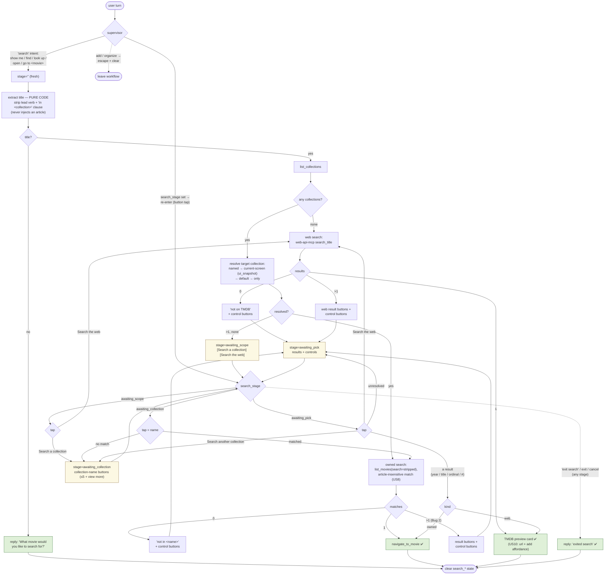

# US7 — Unified Search Workflow State Machine

The assistant search workflow (`agents/movie-assistant/src/nodes/search.py`) is a **pure-code
multi-turn state machine**. The supervisor's `search` intent is the only LLM/model decision; once
inside the node, every resolution, disambiguation, and pick is deterministic code (so it carries no
golden-cassette surface). Button taps post canonical text that re-enters the node and advances the
stage (mirrors the T069 add state machine).

## State field (`GraphState`)

| Field | Values | Meaning |
|---|---|---|
| `search_stage` | `''` \| `awaiting_scope` \| `awaiting_collection` \| `awaiting_pick` | where in the flow |
| `search_scope` | a collection id \| `web` \| `''` | what the current results are from |
| `search_query` | the movie title | carried across button-tap turns |
| `search_results` | `[{title, year, …, kind: owned\|web}]` | candidates awaiting a pick |

All four are cleared on a **terminal** turn (navigate / web card / exit / no-title). Nothing here
is a credential (SC-004).

## Flow

## Compact stage reference

| Stage | On entry shows | A tap of… | goes to |
|---|---|---|---|
| `''` (fresh) | — (resolves + runs a search) | — | owned / web / scope / ask |
| `awaiting_scope` | `Search a collection` · `Search the web` | "Search the web" | web search |
| | | "Search a collection" | `awaiting_collection` |
| `awaiting_collection` | collection-name buttons (≤5 + view more) | a collection name | owned search there |
| `awaiting_pick` | result buttons + controls | a result (year/title/ordinal/#) | navigate (owned) / card (web) |
| | | "Search another collection" | `awaiting_collection` |
| | | "Search the web" | web search |
| | | "Exit search" | exit (clear) |

## Invariants

- **Bug 1 fix** — collection resolution is *named → current-screen → default → only*; never sums
  across collections.
- **Bug 2 fix** — `>1` owned/web matches always **disambiguate** (buttons); only a single
  unambiguous match auto-navigates / auto-cards.
- **Bug 3 fix** — title extraction is pure code → never injects an article; matching is
  article-insensitive (`text_match.titles_match`, US8).
- **Pure-code picks** — `resolve_option` (year → title → ordinal → index) resolves a tap against
  `search_results`; no model call, so no golden re-record.
- **Reachable by construction** — reads return only the user's OWN collections/movies (downscoped
  token), so an emitted `navigate_to_movie` target is always one the user could reach (DAC parity).
- **Terminals clear state** — navigate, web card, exit, and no-title all reset `search_*` so a
  finished search never leaks into the next turn.
